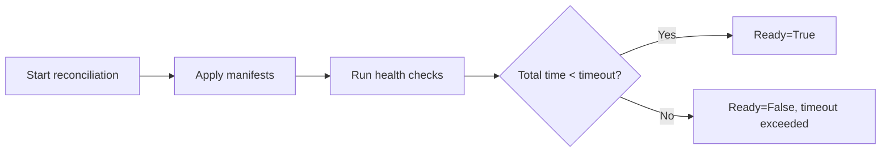

# How to Configure Kustomization Timeout in Flux

Author: [nawazdhandala](https://github.com/nawazdhandala)

Tags: Flux CD, GitOps, Kubernetes, Kustomize, Timeout, Reconciliation

Description: Learn how to configure the spec.timeout field in a Flux Kustomization to control how long Flux waits for apply and health check operations to complete.

---

## Introduction

The `spec.timeout` field in a Flux Kustomization controls how long the Kustomize controller waits for the apply operation and any subsequent health checks to complete before marking the reconciliation as failed. Setting the right timeout is critical: too short and legitimate deployments may be flagged as failures; too long and you delay detection of real problems. This guide covers how to configure timeouts, choose appropriate values, and handle timeout-related failures.

## How Timeout Works

The timeout governs two phases of the reconciliation:

1. **Apply phase**: The time it takes to apply all manifests to the cluster
2. **Health check phase**: The time it takes for monitored resources to become healthy

The timeout is a total budget for both phases combined. If either phase exceeds the timeout, the Kustomization is marked as not ready.



## Setting the Timeout

The `spec.timeout` field accepts a duration string using Go's duration format. Common examples include `1m` (one minute), `5m` (five minutes), and `30s` (thirty seconds).

```yaml
# kustomization-timeout.yaml - Set a 5-minute timeout
apiVersion: kustomize.toolkit.fluxcd.io/v1
kind: Kustomization
metadata:
  name: my-app
  namespace: flux-system
spec:
  interval: 10m
  sourceRef:
    kind: GitRepository
    name: my-repo
  path: ./deploy
  prune: true
  # Total time allowed for apply + health checks
  timeout: 5m
  wait: true
```

## Choosing the Right Timeout Value

The right timeout depends on several factors:

### Fast Applications

For simple applications with small container images that start quickly, a short timeout is appropriate.

```yaml
# fast-app-kustomization.yaml - Short timeout for a lightweight app
apiVersion: kustomize.toolkit.fluxcd.io/v1
kind: Kustomization
metadata:
  name: nginx-static
  namespace: flux-system
spec:
  interval: 10m
  sourceRef:
    kind: GitRepository
    name: my-repo
  path: ./apps/nginx
  prune: true
  # Nginx starts in seconds, 2 minutes is generous
  timeout: 2m
  healthChecks:
    - apiVersion: apps/v1
      kind: Deployment
      name: nginx
      namespace: default
```

### Slow-Starting Applications

Applications that pull large images, run database migrations, or have complex initialization sequences need longer timeouts.

```yaml
# slow-app-kustomization.yaml - Longer timeout for a complex app
apiVersion: kustomize.toolkit.fluxcd.io/v1
kind: Kustomization
metadata:
  name: ml-pipeline
  namespace: flux-system
spec:
  interval: 15m
  sourceRef:
    kind: GitRepository
    name: my-repo
  path: ./apps/ml-pipeline
  prune: true
  # ML apps may pull large images and take time to initialize
  timeout: 15m
  healthChecks:
    - apiVersion: apps/v1
      kind: Deployment
      name: ml-pipeline
      namespace: ml
```

### Infrastructure Components

Infrastructure components like databases, message queues, and monitoring stacks often need generous timeouts because they have complex startup procedures.

```yaml
# infrastructure-kustomization.yaml - Generous timeout for infrastructure
apiVersion: kustomize.toolkit.fluxcd.io/v1
kind: Kustomization
metadata:
  name: infrastructure
  namespace: flux-system
spec:
  interval: 10m
  sourceRef:
    kind: GitRepository
    name: my-repo
  path: ./infrastructure
  prune: true
  # Infrastructure components may take a while to stabilize
  timeout: 10m
  healthChecks:
    - apiVersion: apps/v1
      kind: StatefulSet
      name: postgresql
      namespace: database
    - apiVersion: apps/v1
      kind: StatefulSet
      name: redis
      namespace: cache
    - apiVersion: apps/v1
      kind: Deployment
      name: prometheus
      namespace: monitoring
```

## Timeout and Retry Interval

The `spec.retryInterval` field works alongside `spec.timeout`. When a reconciliation fails (including timeout failures), Flux will retry after the retry interval.

```yaml
# kustomization-retry.yaml - Configure timeout with retry behavior
apiVersion: kustomize.toolkit.fluxcd.io/v1
kind: Kustomization
metadata:
  name: my-app
  namespace: flux-system
spec:
  interval: 10m
  # Retry failed reconciliations every 2 minutes
  retryInterval: 2m
  # Allow 5 minutes per attempt
  timeout: 5m
  sourceRef:
    kind: GitRepository
    name: my-repo
  path: ./deploy
  prune: true
  wait: true
```

With this configuration, if a reconciliation times out after 5 minutes, Flux will retry 2 minutes later rather than waiting the full 10-minute interval.

## Debugging Timeout Failures

When a Kustomization times out, you need to determine which phase caused the timeout: the apply phase or the health check phase.

```bash
# Check the Kustomization status for timeout details
kubectl describe kustomization my-app -n flux-system

# Look for events related to the timeout
kubectl get events -n flux-system --field-selector reason=ReconciliationFailed

# Check if the resources are being applied correctly
kubectl get all -n default -l kustomize.toolkit.fluxcd.io/name=my-app

# Check pods for slow startup or crash loops
kubectl get pods -n default --watch
```

Common causes of timeout failures include:

- **Image pull delays**: Large images or slow registries cause pods to take longer to start
- **Resource constraints**: Insufficient CPU or memory causes pods to be pending
- **Readiness probe failures**: Misconfigured readiness probes prevent pods from becoming ready
- **Dependency issues**: Resources waiting for external dependencies that are not available

## Default Timeout Behavior

If you do not specify a `spec.timeout`, the Kustomize controller uses a default timeout. However, it is a best practice to always set an explicit timeout so that the behavior is predictable and documented in your configuration.

```yaml
# explicit-timeout.yaml - Always set an explicit timeout
apiVersion: kustomize.toolkit.fluxcd.io/v1
kind: Kustomization
metadata:
  name: my-app
  namespace: flux-system
spec:
  interval: 10m
  sourceRef:
    kind: GitRepository
    name: my-repo
  path: ./deploy
  prune: true
  # Be explicit about the timeout
  timeout: 5m
```

## Best Practices

1. **Always set an explicit timeout** rather than relying on defaults. This makes your configuration self-documenting.
2. **Start with generous timeouts** and tighten them once you know how long your application takes to deploy and become healthy.
3. **Use retryInterval** alongside timeout so that transient failures (such as a slow image pull) are retried promptly.
4. **Monitor timeout failures** as they may indicate infrastructure problems such as insufficient resources or network issues.
5. **Set different timeouts for different environments**: development environments can use shorter timeouts for faster feedback, while production environments may need longer timeouts for safety.

## Conclusion

The `spec.timeout` field gives you control over how long Flux waits for your resources to be applied and become healthy. By setting appropriate timeouts for each Kustomization, you balance the need for fast failure detection with the reality that some applications need time to start. Combine timeouts with health checks and retry intervals for a robust deployment pipeline that handles both fast and slow applications gracefully.
