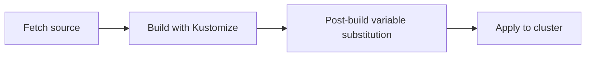

# How to Configure Kustomization Variable Substitution in Flux

Author: [nawazdhandala](https://github.com/nawazdhandala)

Tags: Flux CD, GitOps, Kubernetes, Kustomize, Variable Substitution, Post-Build

Description: Learn how to use spec.postBuild.substitute in Flux Kustomizations to replace variables in your manifests with environment-specific values.

---

## Introduction

Flux CD supports variable substitution in Kustomization resources through the `spec.postBuild.substitute` field. This feature lets you define variables inline and have them replaced in your manifests after Kustomize builds them but before they are applied to the cluster. This is particularly useful for injecting environment-specific values like cluster names, regions, or application versions without duplicating manifests. This guide explains how to configure and use variable substitution effectively.

## How Variable Substitution Works

Variable substitution happens in the post-build phase. After Kustomize renders the final manifests, Flux scans them for variable references in the format `${VAR_NAME}` and replaces them with the values defined in `spec.postBuild.substitute`.



Variables must follow the pattern `${VAR_NAME}`. The variable name can contain uppercase letters, lowercase letters, digits, and underscores.

## Basic Variable Substitution

Define variables directly in the Kustomization resource using `spec.postBuild.substitute`.

```yaml
# kustomization-vars.yaml - Inline variable substitution
apiVersion: kustomize.toolkit.fluxcd.io/v1
kind: Kustomization
metadata:
  name: my-app
  namespace: flux-system
spec:
  interval: 10m
  sourceRef:
    kind: GitRepository
    name: my-repo
  path: ./deploy
  prune: true
  postBuild:
    substitute:
      # Define variables as key-value pairs
      CLUSTER_NAME: production-east
      ENVIRONMENT: production
      REGION: us-east-1
      APP_VERSION: "2.5.0"
```

In your manifests, reference these variables using the `${VAR_NAME}` syntax.

```yaml
# deploy/deployment.yaml - Manifest with variable references
apiVersion: apps/v1
kind: Deployment
metadata:
  name: my-app
  namespace: default
  labels:
    cluster: ${CLUSTER_NAME}
    environment: ${ENVIRONMENT}
spec:
  replicas: 2
  selector:
    matchLabels:
      app: my-app
  template:
    metadata:
      labels:
        app: my-app
        region: ${REGION}
    spec:
      containers:
        - name: app
          # Use variable for the image tag
          image: myregistry.io/my-app:${APP_VERSION}
```

After post-build substitution, the manifest applied to the cluster will have all `${...}` references replaced with the actual values.

## Environment-Specific Configurations

A common use case is having the same manifests deployed to multiple environments with different variable values.

```yaml
# staging-kustomization.yaml - Staging environment variables
apiVersion: kustomize.toolkit.fluxcd.io/v1
kind: Kustomization
metadata:
  name: my-app-staging
  namespace: flux-system
spec:
  interval: 5m
  sourceRef:
    kind: GitRepository
    name: my-repo
  path: ./deploy
  prune: true
  postBuild:
    substitute:
      ENVIRONMENT: staging
      REPLICAS: "2"
      LOG_LEVEL: debug
      DATABASE_HOST: db.staging.internal
---
# production-kustomization.yaml - Production environment variables
apiVersion: kustomize.toolkit.fluxcd.io/v1
kind: Kustomization
metadata:
  name: my-app-production
  namespace: flux-system
spec:
  interval: 10m
  sourceRef:
    kind: GitRepository
    name: my-repo
  path: ./deploy
  prune: true
  postBuild:
    substitute:
      ENVIRONMENT: production
      REPLICAS: "5"
      LOG_LEVEL: warn
      DATABASE_HOST: db.production.internal
```

Both Kustomizations point to the same `path` but inject different values. The manifests can use these variables:

```yaml
# deploy/deployment.yaml - Shared manifest using variables
apiVersion: apps/v1
kind: Deployment
metadata:
  name: my-app
  labels:
    env: ${ENVIRONMENT}
spec:
  replicas: ${REPLICAS}
  selector:
    matchLabels:
      app: my-app
  template:
    metadata:
      labels:
        app: my-app
    spec:
      containers:
        - name: app
          image: myregistry.io/my-app:latest
          env:
            - name: LOG_LEVEL
              value: ${LOG_LEVEL}
            - name: DATABASE_HOST
              value: ${DATABASE_HOST}
```

## Variable Substitution with Default Values

You can specify default values for variables using the `${VAR_NAME:=default}` syntax in your manifests. If the variable is not defined in `spec.postBuild.substitute`, the default value is used.

```yaml
# deploy/configmap.yaml - Variables with defaults
apiVersion: v1
kind: ConfigMap
metadata:
  name: app-config
  namespace: default
data:
  # If LOG_LEVEL is not defined, default to "info"
  log_level: ${LOG_LEVEL:=info}
  # If MAX_CONNECTIONS is not defined, default to "100"
  max_connections: ${MAX_CONNECTIONS:=100}
  # If CACHE_TTL is not defined, default to "300"
  cache_ttl: ${CACHE_TTL:=300}
```

## Important Rules for Variable Values

All variable values in `spec.postBuild.substitute` must be strings. Numeric values should be quoted.

```yaml
# Correct: all values are strings
postBuild:
  substitute:
    REPLICAS: "3"        # Quoted number
    ENABLED: "true"      # Quoted boolean
    APP_NAME: my-app     # String (no quotes needed for plain strings)
    PORT: "8080"         # Quoted number
```

## Verifying Variable Substitution

You can preview the result of variable substitution before it is applied to the cluster.

```bash
# Build the Kustomization locally to see substituted output
flux build kustomization my-app

# Check the Kustomization status for substitution errors
kubectl describe kustomization my-app -n flux-system
```

If a variable is referenced in a manifest but not defined in `spec.postBuild.substitute` (and has no default value), the variable reference `${VAR_NAME}` will remain as-is in the applied manifest. This can cause unexpected behavior, so always verify your substitutions.

## Best Practices

1. **Use uppercase variable names** with underscores for consistency and to distinguish them from YAML content.
2. **Always quote numeric values** in `spec.postBuild.substitute` since all values must be strings.
3. **Define defaults in manifests** using `${VAR:=default}` so that missing variables do not cause broken deployments.
4. **Keep the number of variables manageable**. If you have many variables, consider using `substituteFrom` with ConfigMaps and Secrets (covered in a separate guide).
5. **Test substitution locally** with `flux build kustomization` before pushing changes.

## Conclusion

Variable substitution in Flux Kustomizations is a powerful way to reuse the same manifests across different environments without duplication. By defining variables in `spec.postBuild.substitute` and referencing them with `${VAR_NAME}` in your manifests, you keep your Git repository DRY while supporting environment-specific configuration. For more complex scenarios involving many variables or sensitive data, the `substituteFrom` feature (covered in a related post) provides additional flexibility.
