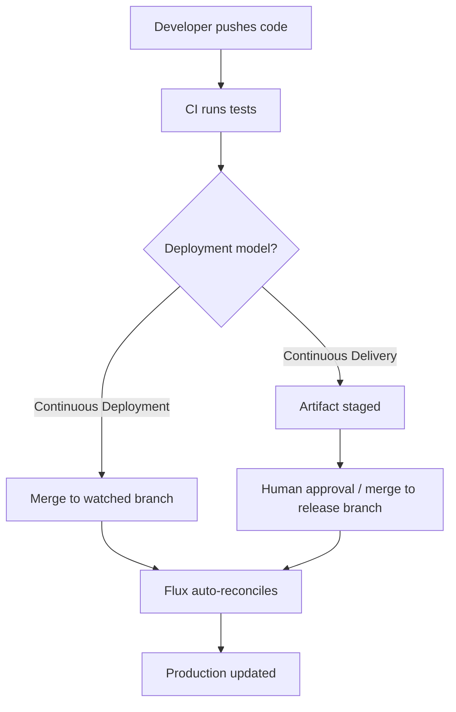

# How Continuous Delivery Differs from Continuous Deployment in Flux CD

Author: [nawazdhandala](https://github.com/nawazdhandala)

Tags: Flux CD, GitOps, Kubernetes, Continuous Delivery, Continuous Deployment, CI/CD

Description: A detailed comparison of continuous delivery and continuous deployment paradigms within the Flux CD ecosystem, clarifying when and how to use each approach.

---

The terms continuous delivery and continuous deployment are often used interchangeably, but they represent fundamentally different philosophies in software release management. When working with Flux CD, the distinction becomes especially important because Flux supports both models through different configuration patterns. Understanding the difference helps you design pipelines that match your organization's risk tolerance and regulatory requirements.

## Defining the Two Approaches

Continuous delivery means that every change that passes automated testing is ready to be deployed to production, but a human must approve the final release. The artifact sits in a staging area, fully validated, waiting for someone to press the button.

Continuous deployment removes that final gate entirely. Every change that passes the automated pipeline goes straight to production without human intervention. There is no pause, no approval step.

In traditional CI/CD tooling, this distinction is usually enforced at the pipeline level. In Flux CD, it manifests through how you configure your Kustomization and HelmRelease resources, and whether you introduce manual gates via Git-based approval workflows.

## How Flux CD Enables Continuous Deployment

By default, Flux CD operates as a continuous deployment engine. When you configure a GitRepository source and a Kustomization that points to it, Flux automatically applies any changes that land on the target branch.

Here is a standard Flux setup that implements continuous deployment.

```yaml
# GitRepository source polling the main branch every minute
apiVersion: source.toolkit.fluxcd.io/v1
kind: GitRepository
metadata:
  name: app-repo
  namespace: flux-system
spec:
  interval: 1m
  url: https://github.com/myorg/app-manifests
  ref:
    branch: main
---
# Kustomization that automatically applies changes from the source
apiVersion: kustomize.toolkit.fluxcd.io/v1
kind: Kustomization
metadata:
  name: app
  namespace: flux-system
spec:
  interval: 5m
  path: ./deploy/production
  prune: true
  sourceRef:
    kind: GitRepository
    name: app-repo
  targetNamespace: production
```

In this configuration, the moment a commit lands on the `main` branch, Flux detects the change within the polling interval, reconciles the desired state, and applies it to the cluster. No human is in the loop. This is continuous deployment.

## How Flux CD Enables Continuous Delivery

Continuous delivery with Flux requires introducing a gate between "change is ready" and "change is deployed." There are several patterns to achieve this.

### Pattern 1: Branch-Based Gating

The most common approach is to use a staging branch that Flux watches, while production changes require a pull request and manual merge.

```yaml
# Flux watches a 'release' branch, not 'main'
apiVersion: source.toolkit.fluxcd.io/v1
kind: GitRepository
metadata:
  name: app-repo
  namespace: flux-system
spec:
  interval: 1m
  url: https://github.com/myorg/app-manifests
  ref:
    branch: release
```

In this model, developers push to `main`, automated tests run, and a pull request is created targeting the `release` branch. A human reviews and merges that PR, which triggers Flux to deploy. The human approval step is the merge action itself.

### Pattern 2: Tag-Based Gating

Another approach uses Git tags as release gates. Flux watches for semver tags rather than branch changes.

```yaml
# Flux deploys only when a new semver tag is pushed
apiVersion: source.toolkit.fluxcd.io/v1
kind: GitRepository
metadata:
  name: app-repo
  namespace: flux-system
spec:
  interval: 1m
  url: https://github.com/myorg/app-manifests
  ref:
    semver: ">=1.0.0"
```

A human (or an approval workflow) creates the tag, which acts as the explicit release signal. Flux picks up the latest matching tag and deploys it.

### Pattern 3: Suspend and Resume

Flux allows you to suspend reconciliation on any resource. This can serve as a manual gate.

```bash
# Suspend automatic reconciliation
flux suspend kustomization app

# When ready to deploy, resume it
flux resume kustomization app
```

This is the most direct form of gating but requires operational discipline. It is useful for maintenance windows or regulatory holds.

## The Decision Flow

The following diagram illustrates how changes flow through each model.



## Comparing the Two Models in Practice

| Aspect | Continuous Deployment | Continuous Delivery |
|--------|----------------------|---------------------|
| Human gate | None | Required before production |
| Flux branch strategy | Single branch (e.g., main) | Multi-branch (e.g., main + release) |
| Risk profile | Higher - relies entirely on test quality | Lower - human review adds a safety net |
| Deployment speed | Fastest possible | Slightly slower due to approval step |
| Rollback mechanism | Git revert triggers auto-deploy | Git revert or refuse to merge |
| Compliance fit | Startups, low-regulation | Finance, healthcare, regulated industries |

## Hybrid Approaches

Many teams use a hybrid model. Non-production environments run continuous deployment so that staging clusters always reflect the latest code. Production environments use continuous delivery with branch-based or tag-based gating.

Here is an example of a multi-environment setup.

```yaml
# Staging: continuous deployment from main
apiVersion: kustomize.toolkit.fluxcd.io/v1
kind: Kustomization
metadata:
  name: app-staging
  namespace: flux-system
spec:
  interval: 5m
  path: ./deploy/staging
  prune: true
  sourceRef:
    kind: GitRepository
    name: app-repo-main  # watches main branch
  targetNamespace: staging
---
# Production: continuous delivery from release branch
apiVersion: kustomize.toolkit.fluxcd.io/v1
kind: Kustomization
metadata:
  name: app-production
  namespace: flux-system
spec:
  interval: 5m
  path: ./deploy/production
  prune: true
  sourceRef:
    kind: GitRepository
    name: app-repo-release  # watches release branch
  targetNamespace: production
```

## Automation Image Updates and the Delivery Boundary

Flux's image automation controllers can automatically update image tags in Git when new container images are pushed to a registry. This is powerful but blurs the line between delivery and deployment.

If image automation writes directly to the branch that Flux watches for production, you have continuous deployment of image updates. If image automation writes to a branch that requires a PR and human merge before reaching the production branch, you retain continuous delivery semantics.

The key configuration is the `push` section of the ImageUpdateAutomation resource, specifically which branch it targets and whether that branch requires a pull request to merge into the production branch.

## Choosing the Right Model

Start by asking these questions:

1. Does your industry require audit trails with human sign-off before production changes? If yes, use continuous delivery.
2. Is your test suite comprehensive enough that you trust fully automated releases? If yes, continuous deployment is viable.
3. Do you need different models for different environments? Use the hybrid approach.

Flux CD does not force you into one model. Its GitOps foundation means the approval mechanism lives in Git, not in a CI/CD dashboard. This makes the choice between delivery and deployment a matter of Git workflow design rather than tool configuration.

## Conclusion

Continuous delivery and continuous deployment are both first-class patterns in Flux CD. The difference comes down to whether a human gate exists between "change is validated" and "change is live." Flux's branch-based, tag-based, and suspend/resume mechanisms give you the flexibility to implement either model or a hybrid of both. The right choice depends on your team's risk tolerance, regulatory environment, and confidence in automated testing.
