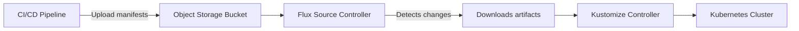

# How to Create a Bucket Source in Flux CD

Author: [nawazdhandala](https://github.com/nawazdhandala)

Tags: Flux CD, GitOps, Kubernetes, Bucket, Object Storage

Description: Learn how to create and configure a Bucket source in Flux CD to pull Kubernetes manifests from cloud object storage services.

---

## Introduction

Flux CD supports object storage buckets as a source for Kubernetes manifests alongside Git and OCI repositories. The Bucket source allows Flux to pull manifests from cloud object storage services like AWS S3, Google Cloud Storage, Azure Blob Storage, and any S3-compatible service. This is useful when your deployment artifacts are produced by CI/CD pipelines that store outputs in object storage, or when you want to decouple your manifest delivery from Git.

This guide covers the fundamentals of creating and configuring a Bucket source in Flux CD.

## Prerequisites

- Flux CD v2.0 or later installed on your cluster
- `kubectl` access to the cluster running Flux
- An object storage bucket containing your Kubernetes manifests
- Credentials to access the bucket

## How Bucket Sources Work

The Flux source-controller periodically checks the bucket for changes by computing a checksum of the bucket contents. When a change is detected, it downloads the updated files and makes them available to Kustomization or HelmRelease resources.



## Supported Providers

The Bucket resource supports the following provider types through the `provider` field:

| Provider | Value | Service |
|----------|-------|---------|
| Generic S3 | `generic` | MinIO, DigitalOcean Spaces, any S3-compatible |
| AWS | `aws` | Amazon S3 |
| Azure | `azure` | Azure Blob Storage |
| GCP | `gcp` | Google Cloud Storage |

## Creating a Basic Bucket Source

Here is a minimal Bucket source configuration using the generic provider with static credentials.

First, create a secret with your bucket credentials.

```bash
# Create a secret with S3-compatible credentials
kubectl create secret generic bucket-creds \
  --namespace flux-system \
  --from-literal=accesskey=YOUR_ACCESS_KEY \
  --from-literal=secretkey=YOUR_SECRET_KEY
```

Then create the Bucket resource.

```yaml
# flux-system/bucket-source.yaml
apiVersion: source.toolkit.fluxcd.io/v1
kind: Bucket
metadata:
  name: my-app
  namespace: flux-system
spec:
  interval: 5m
  # The provider type -- generic, aws, azure, or gcp
  provider: generic
  # The bucket name in your object storage
  bucketName: my-app-manifests
  # The endpoint of the object storage service
  endpoint: s3.amazonaws.com
  # The region of the bucket
  region: us-east-1
  # Reference to the credentials secret
  secretRef:
    name: bucket-creds
```

Apply the Bucket resource.

```bash
# Apply the Bucket source
kubectl apply -f bucket-source.yaml

# Verify the Bucket source is ready
flux get sources bucket -n flux-system
```

## Configuring the Bucket Path

By default, Flux downloads all files from the bucket root. You can use the `prefix` field to limit which files are downloaded, filtering by key prefix.

```yaml
# flux-system/bucket-source-prefix.yaml
apiVersion: source.toolkit.fluxcd.io/v1
kind: Bucket
metadata:
  name: my-app-staging
  namespace: flux-system
spec:
  interval: 5m
  provider: generic
  bucketName: deployment-artifacts
  endpoint: s3.amazonaws.com
  region: us-east-1
  # Only download files under the staging/my-app/ prefix
  prefix: staging/my-app/
  secretRef:
    name: bucket-creds
```

## Ignoring Files

You can exclude files from the bucket download using the `.sourceignore` file or the `ignore` field. This works similarly to `.gitignore`.

```yaml
# flux-system/bucket-source-ignore.yaml
apiVersion: source.toolkit.fluxcd.io/v1
kind: Bucket
metadata:
  name: my-app
  namespace: flux-system
spec:
  interval: 5m
  provider: generic
  bucketName: my-app-manifests
  endpoint: s3.amazonaws.com
  region: us-east-1
  secretRef:
    name: bucket-creds
  # Ignore specific file patterns
  ignore: |
    # Ignore markdown files
    *.md
    # Ignore test directories
    tests/
    # Ignore hidden files
    .*
```

## Connecting a Kustomization to the Bucket Source

After creating the Bucket source, create a Kustomization that references it.

```yaml
# flux-system/my-app-kustomization.yaml
apiVersion: kustomize.toolkit.fluxcd.io/v1
kind: Kustomization
metadata:
  name: my-app
  namespace: flux-system
spec:
  interval: 10m
  targetNamespace: my-app
  sourceRef:
    kind: Bucket
    name: my-app
  path: ./
  prune: true
  wait: true
  timeout: 5m
```

## Using HTTPS with Custom Certificates

If your object storage endpoint uses a self-signed certificate, provide the CA certificate.

```bash
# Create a TLS secret with the CA certificate
kubectl create secret generic bucket-tls \
  --namespace flux-system \
  --from-file=ca.crt=/path/to/ca.crt
```

```yaml
# flux-system/bucket-source-tls.yaml
apiVersion: source.toolkit.fluxcd.io/v1
kind: Bucket
metadata:
  name: my-app
  namespace: flux-system
spec:
  interval: 5m
  provider: generic
  bucketName: my-app-manifests
  endpoint: minio.internal.example.com
  # Disable SSL if needed for development
  # insecure: true
  secretRef:
    name: bucket-creds
  certSecretRef:
    name: bucket-tls
```

## Disabling TLS (Insecure Mode)

For development environments where the object storage runs over HTTP, set `insecure: true`.

```yaml
# flux-system/bucket-source-insecure.yaml
apiVersion: source.toolkit.fluxcd.io/v1
kind: Bucket
metadata:
  name: my-app-dev
  namespace: flux-system
spec:
  interval: 1m
  provider: generic
  bucketName: dev-manifests
  endpoint: minio.dev.local:9000
  # Allow HTTP connections -- development only
  insecure: true
  secretRef:
    name: bucket-creds
```

## Monitoring Bucket Source Status

Check the status of your Bucket sources to ensure they are healthy.

```bash
# List all Bucket sources
flux get sources bucket -A

# Describe a specific Bucket for detailed status
kubectl describe bucket my-app -n flux-system

# Check source-controller logs for errors
kubectl logs -n flux-system deployment/source-controller | grep -i bucket
```

A healthy Bucket source will show "Ready" status with an artifact revision based on the content checksum.

## Suspending and Resuming

You can suspend reconciliation of a Bucket source without deleting it.

```bash
# Suspend the Bucket source
flux suspend source bucket my-app -n flux-system

# Resume the Bucket source
flux resume source bucket my-app -n flux-system

# Trigger an immediate reconciliation
flux reconcile source bucket my-app -n flux-system
```

## Best Practices

1. **Use a dedicated bucket for Flux.** Avoid mixing Flux manifests with other data in the same bucket to reduce noise and improve security.

2. **Set appropriate intervals.** Use longer intervals (5-10 minutes) for production and shorter intervals (1-2 minutes) for development.

3. **Use prefixes for multi-environment setups.** Store manifests for different environments under different prefixes in the same bucket.

4. **Secure your credentials.** Use cloud provider IAM roles (IRSA for AWS, Workload Identity for GCP) instead of static credentials where possible.

5. **Monitor source health.** Set up alerts for Bucket source failures to catch connectivity or permission issues early.

## Conclusion

The Bucket source in Flux CD provides a flexible way to pull Kubernetes manifests from object storage services. Whether you use AWS S3, Google Cloud Storage, Azure Blob Storage, or an S3-compatible service like MinIO, the Bucket resource integrates seamlessly with Flux's reconciliation model. By configuring the provider, credentials, and path prefixes, you can build a robust GitOps pipeline that sources its truth from object storage.
