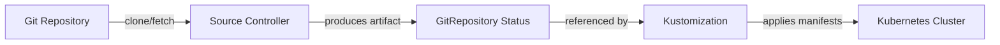

# How to Create a GitRepository Source in Flux CD

Author: [nawazdhandala](https://github.com/nawazdhandala)

Tags: Flux CD, GitOps, Kubernetes, Source Controller, GitRepository

Description: Learn how to create and configure a GitRepository source in Flux CD to enable GitOps-driven deployments from your Git repositories.

---

## Introduction

The GitRepository custom resource is one of the foundational building blocks in Flux CD. It tells the Flux Source Controller where to find your Git repository and how often to check it for changes. Once a GitRepository source is defined, other Flux components like Kustomizations and HelmReleases can reference it to pull manifests and deploy them to your cluster.

In this guide, you will learn how to create a basic GitRepository source, understand its key fields, verify that the source is working, and troubleshoot common issues.

## Prerequisites

Before you begin, make sure you have:

- A Kubernetes cluster running version 1.26 or later
- Flux CD installed on your cluster (you can bootstrap with `flux bootstrap`)
- `kubectl` configured to communicate with your cluster
- The `flux` CLI installed locally

You can verify your Flux installation is healthy with the following command.

```bash
# Check that all Flux components are running
flux check
```

## Understanding the GitRepository CRD

The GitRepository resource belongs to the `source.toolkit.fluxcd.io/v1` API group. It defines the URL of a Git repository, the branch or tag to track, the reconciliation interval, and optional authentication credentials.

When the Source Controller reconciles a GitRepository, it clones the repository, packages the contents into a tarball artifact, and makes that artifact available for downstream consumers like Kustomization resources.

## Creating a Basic GitRepository

The simplest GitRepository resource points to a public repository and tracks a specific branch. Here is a minimal example that tracks the `main` branch of a public GitHub repository.

```yaml
# gitrepository.yaml - A basic GitRepository source pointing to a public repo
apiVersion: source.toolkit.fluxcd.io/v1
kind: GitRepository
metadata:
  name: my-app
  namespace: flux-system
spec:
  # How often Flux checks for new commits
  interval: 5m
  # The Git repository URL
  url: https://github.com/my-org/my-app
  ref:
    # The branch to track
    branch: main
```

Apply this manifest to your cluster.

```bash
# Apply the GitRepository manifest
kubectl apply -f gitrepository.yaml
```

## Verifying the GitRepository

After applying the manifest, you should verify that the Source Controller has successfully cloned the repository and produced an artifact.

```bash
# Check the status of the GitRepository resource
flux get sources git my-app -n flux-system
```

You should see output similar to this.

```bash
# Expected output showing a successful reconciliation
# NAME    REVISION            SUSPENDED  READY  MESSAGE
# my-app  main@sha1:abc1234   False      True   stored artifact for revision 'main@sha1:abc1234'
```

You can also use kubectl to inspect the full status of the resource.

```bash
# Get detailed status including conditions and artifact information
kubectl describe gitrepository my-app -n flux-system
```

## Key Fields in the GitRepository Spec

Here is a more complete example that demonstrates several important fields available in the GitRepository spec.

```yaml
# gitrepository-full.yaml - A GitRepository with commonly used fields
apiVersion: source.toolkit.fluxcd.io/v1
kind: GitRepository
metadata:
  name: my-app
  namespace: flux-system
spec:
  # Reconciliation interval - how often to check for new commits
  interval: 10m
  # Timeout for Git operations like clone and fetch
  timeout: 60s
  # The Git repository URL (HTTPS or SSH)
  url: https://github.com/my-org/my-app
  ref:
    # Track the main branch
    branch: main
  # Reference a Kubernetes Secret for authentication (if needed)
  # secretRef:
  #   name: my-app-git-auth
  # Ignore specific files or directories (uses .gitignore syntax)
  ignore: |
    # Exclude all markdown files
    /*.md
    # Exclude the CI directory
    /ci/
```

Let us walk through each important field:

- **spec.interval**: Controls how frequently the Source Controller checks the repository for new commits. Common values range from `1m` for fast feedback to `30m` for stable environments.
- **spec.timeout**: Sets the maximum duration for Git operations. The default is 60 seconds. Increase this if you have a large repository.
- **spec.url**: The clone URL of the repository. Supports both HTTPS (`https://`) and SSH (`ssh://`) protocols.
- **spec.ref**: Specifies which Git reference to track. You can set `branch`, `tag`, `commit`, or `semver`. If omitted, Flux defaults to the `main` branch.
- **spec.secretRef**: References a Kubernetes Secret containing credentials for private repositories.
- **spec.ignore**: A multi-line string following `.gitignore` syntax to exclude files from the artifact.

## Connecting a Kustomization to the GitRepository

A GitRepository on its own does not deploy anything. You need a Kustomization resource that references it. Here is an example showing how the two resources work together.

```yaml
# kustomization.yaml - A Flux Kustomization that deploys from the GitRepository
apiVersion: kustomize.toolkit.fluxcd.io/v1
kind: Kustomization
metadata:
  name: my-app
  namespace: flux-system
spec:
  # Interval for applying changes
  interval: 10m
  # Reference the GitRepository source
  sourceRef:
    kind: GitRepository
    name: my-app
  # Path within the repository to deploy
  path: ./deploy/production
  # Prune resources that are removed from Git
  prune: true
  # Wait for resources to become ready
  wait: true
  # Timeout for the apply operation
  timeout: 5m
```

## Reconciliation Flow

The following diagram illustrates how a GitRepository source feeds into the deployment pipeline.



## Forcing a Reconciliation

If you do not want to wait for the next interval, you can manually trigger a reconciliation.

```bash
# Force the Source Controller to reconcile the GitRepository immediately
flux reconcile source git my-app -n flux-system
```

## Suspending and Resuming

You can temporarily pause reconciliation without deleting the resource. This is useful during maintenance windows or when debugging.

```bash
# Suspend reconciliation
flux suspend source git my-app -n flux-system

# Resume reconciliation
flux resume source git my-app -n flux-system
```

## Troubleshooting

If the GitRepository is not becoming ready, check the following:

1. **Events**: Run `kubectl events -n flux-system --for gitrepository/my-app` to see recent events.
2. **Source Controller logs**: Run `kubectl logs -n flux-system deployment/source-controller` to inspect controller logs.
3. **Network access**: Ensure the cluster can reach the Git repository URL. For private clusters, you may need to configure egress rules.
4. **Authentication**: If the repository is private, verify that the referenced Secret exists and contains valid credentials.

## Cleanup

To remove the GitRepository source from your cluster, delete the resource.

```bash
# Delete the GitRepository resource
kubectl delete gitrepository my-app -n flux-system
```

## Conclusion

The GitRepository resource is the starting point for any Flux CD GitOps workflow. By defining a GitRepository source, you tell Flux where your desired state lives and how often to check for updates. From there, Kustomizations and HelmReleases consume the artifact to keep your cluster in sync with Git. In subsequent guides, we will explore authentication methods, tag tracking, semver filtering, and other advanced GitRepository configurations.
