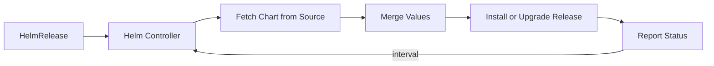

# How to Create a HelmRelease in Flux CD

Author: [nawazdhandala](https://github.com/nawazdhandala)

Tags: Flux CD, GitOps, Kubernetes, Helm, HelmRelease, Continuous Delivery

Description: Learn how to create a HelmRelease resource in Flux CD to automate Helm chart deployments using GitOps principles.

---

## Introduction

A HelmRelease is a custom resource in Flux CD that declaratively manages Helm chart installations on your Kubernetes cluster. Instead of running `helm install` or `helm upgrade` manually, you define a HelmRelease manifest and Flux's Helm Controller takes care of the rest. This is the foundation of Helm-based GitOps with Flux CD.

In this guide, you will learn how to create a HelmRelease from scratch, understand its key fields, and deploy it to your cluster.

## Prerequisites

Before creating a HelmRelease, ensure you have the following in place:

- A Kubernetes cluster with Flux CD installed (including the Helm Controller)
- A HelmRepository or GitRepository source already configured
- `kubectl` and the `flux` CLI installed locally

## Understanding the HelmRelease Resource

The HelmRelease resource uses the API version `helm.toolkit.fluxcd.io/v2`. At a minimum, it requires a chart reference pointing to a source and the chart name. Flux's Helm Controller watches for HelmRelease objects and reconciles them at regular intervals, ensuring your cluster state matches the desired state in Git.

## Step 1: Define a HelmRepository Source

Before you can reference a chart, you need a HelmRepository source. Here is an example that adds the Bitnami Helm repository.

```yaml
# helmrepository.yaml - Defines the Helm repository source for Flux
apiVersion: source.toolkit.fluxcd.io/v1
kind: HelmRepository
metadata:
  name: bitnami
  namespace: flux-system
spec:
  interval: 1h
  url: https://charts.bitnami.com/bitnami
```

Apply this to your cluster.

```bash
# Apply the HelmRepository resource
kubectl apply -f helmrepository.yaml
```

## Step 2: Create a Basic HelmRelease

Now create a HelmRelease that references the Bitnami repository and deploys the nginx chart.

```yaml
# helmrelease.yaml - Basic HelmRelease for nginx
apiVersion: helm.toolkit.fluxcd.io/v2
kind: HelmRelease
metadata:
  name: nginx
  namespace: default
spec:
  # How often Flux checks for drift and reconciles
  interval: 10m
  chart:
    spec:
      # The name of the chart in the repository
      chart: nginx
      # The version constraint for the chart
      version: ">=15.0.0"
      # Reference to the HelmRepository source
      sourceRef:
        kind: HelmRepository
        name: bitnami
        namespace: flux-system
  # Custom values to pass to the Helm chart
  values:
    replicaCount: 2
    service:
      type: ClusterIP
```

Apply this manifest to your cluster.

```bash
# Apply the HelmRelease resource
kubectl apply -f helmrelease.yaml
```

## Step 3: Verify the HelmRelease

After applying the HelmRelease, check its status to confirm Flux has successfully reconciled it.

```bash
# Check the status of the HelmRelease
flux get helmreleases -n default

# Get detailed information about the HelmRelease
kubectl describe helmrelease nginx -n default
```

You should see the HelmRelease in a `Ready` state with a message indicating the Helm chart has been installed successfully.

## Step 4: Check the Deployed Resources

Verify that the Helm chart resources are running on your cluster.

```bash
# List pods created by the nginx HelmRelease
kubectl get pods -n default -l app.kubernetes.io/name=nginx

# List services created by the nginx HelmRelease
kubectl get svc -n default -l app.kubernetes.io/name=nginx
```

## Anatomy of a HelmRelease

Here is a more complete HelmRelease that demonstrates additional fields.

```yaml
# helmrelease-full.yaml - A more complete HelmRelease example
apiVersion: helm.toolkit.fluxcd.io/v2
kind: HelmRelease
metadata:
  name: my-app
  namespace: default
spec:
  interval: 10m
  timeout: 5m
  chart:
    spec:
      chart: my-app
      version: "1.2.x"
      sourceRef:
        kind: HelmRepository
        name: my-repo
        namespace: flux-system
  # Install-specific configuration
  install:
    remediation:
      retries: 3
  # Upgrade-specific configuration
  upgrade:
    remediation:
      retries: 3
  # Values to pass to the chart
  values:
    image:
      repository: my-registry/my-app
      tag: "1.2.0"
    resources:
      requests:
        cpu: 100m
        memory: 128Mi
      limits:
        cpu: 500m
        memory: 256Mi
```

The key fields of a HelmRelease include:

- **spec.interval**: How often Flux reconciles the release
- **spec.timeout**: Maximum time allowed for Helm operations
- **spec.chart.spec.chart**: The chart name in the repository
- **spec.chart.spec.version**: The version constraint
- **spec.chart.spec.sourceRef**: Points to a HelmRepository, GitRepository, or Bucket
- **spec.values**: Inline Helm values
- **spec.install**: Configuration for the install action
- **spec.upgrade**: Configuration for the upgrade action

## Using the Flux CLI

You can also create a HelmRelease using the Flux CLI.

```bash
# Create a HelmRelease using the Flux CLI
flux create helmrelease nginx \
  --source=HelmRepository/bitnami \
  --chart=nginx \
  --chart-version=">=15.0.0" \
  --values=values.yaml \
  --namespace=default \
  --interval=10m \
  --export > helmrelease.yaml
```

The `--export` flag outputs the YAML to a file so you can commit it to your Git repository.

## Reconciliation Flow

The following diagram illustrates how Flux reconciles a HelmRelease.



## Troubleshooting

If your HelmRelease is not reconciling, check the following.

```bash
# View Helm Controller logs for errors
kubectl logs -n flux-system deploy/helm-controller

# Check events on the HelmRelease
kubectl events --for helmrelease/nginx -n default

# Force an immediate reconciliation
flux reconcile helmrelease nginx -n default
```

## Conclusion

Creating a HelmRelease in Flux CD is straightforward. Define your chart reference, set your values, and let Flux handle the rest. This approach keeps your Helm deployments declarative, version-controlled, and automatically reconciled, which is the core benefit of GitOps. From here, you can explore advanced features like valuesFrom for external configuration, dependencies between releases, and custom install and upgrade strategies.
