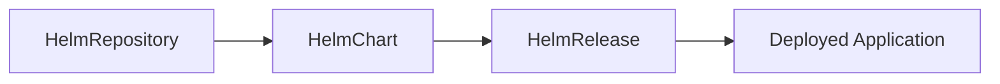

# How to Create a HelmRepository Source in Flux CD

Author: [nawazdhandala](https://github.com/nawazdhandala)

Tags: Flux CD, GitOps, Kubernetes, Helm, HelmRepository, Source Controller

Description: Learn how to create and configure a HelmRepository source in Flux CD to manage Helm chart repositories declaratively using GitOps principles.

---

## Introduction

Flux CD uses a source controller to manage the origins of Kubernetes manifests and Helm charts. The HelmRepository custom resource defines a reference to an external Helm chart repository, allowing Flux to pull charts and reconcile them against your cluster. By declaring a HelmRepository source, you bring your Helm chart management into the GitOps workflow, ensuring that all configuration is version-controlled and auditable.

This guide walks you through creating a HelmRepository source in Flux CD, covering the resource specification, key fields, verification, and common patterns.

## Prerequisites

Before you begin, make sure you have:

- A running Kubernetes cluster (v1.26 or later recommended)
- Flux CD installed on the cluster (v2.x)
- kubectl configured to access the cluster
- A Helm chart repository URL (public or private)

You can verify Flux is installed by running the following command.

```bash
# Check that Flux components are running
flux check
```

## Understanding the HelmRepository Resource

The HelmRepository custom resource belongs to the `source.toolkit.fluxcd.io/v1` API group. It tells the Flux source controller where to find Helm charts, how often to check for updates, and optionally how to authenticate.

Key fields in the HelmRepository spec include:

- **spec.url** -- The URL of the Helm chart repository index
- **spec.interval** -- How often Flux should check the repository for updates
- **spec.timeout** -- Maximum time allowed for fetching the repository index
- **spec.provider** -- Cloud provider for authentication (generic, aws, azure, gcp)

## Creating a Basic HelmRepository

The simplest HelmRepository points to a public Helm repository. Here is an example that adds the Bitnami charts repository.

```yaml
# helmrepository-bitnami.yaml
# Defines a HelmRepository source pointing to the Bitnami public chart repository
apiVersion: source.toolkit.fluxcd.io/v1
kind: HelmRepository
metadata:
  name: bitnami
  namespace: flux-system
spec:
  # The URL of the Helm chart repository
  url: https://charts.bitnami.com/bitnami
  # Flux will re-fetch the repository index every 30 minutes
  interval: 30m
```

Apply this manifest to your cluster.

```bash
# Apply the HelmRepository resource to the cluster
kubectl apply -f helmrepository-bitnami.yaml
```

## Verifying the HelmRepository

After applying the resource, verify that Flux has successfully fetched the repository index.

```bash
# Check the status of the HelmRepository
kubectl get helmrepository -n flux-system bitnami
```

You should see output similar to this.

```
NAME      URL                                       AGE   READY   STATUS
bitnami   https://charts.bitnami.com/bitnami        30s   True    stored artifact: revision 'sha256:abc123...'
```

For more detailed status information, use the following command.

```bash
# Get detailed status including conditions and last fetched revision
kubectl describe helmrepository -n flux-system bitnami
```

You can also use the Flux CLI to inspect the source.

```bash
# Use the Flux CLI to get source details
flux get sources helm bitnami
```

## Configuring the Reconciliation Interval

The `spec.interval` field controls how frequently Flux checks the Helm repository for new chart versions. Choose an interval that balances freshness with API rate limits.

```yaml
# helmrepository-frequent.yaml
# A HelmRepository with a shorter reconciliation interval for fast-moving charts
apiVersion: source.toolkit.fluxcd.io/v1
kind: HelmRepository
metadata:
  name: prometheus-community
  namespace: flux-system
spec:
  url: https://prometheus-community.github.io/helm-charts
  # Check for new chart versions every 10 minutes
  interval: 10m
  # Allow up to 2 minutes for fetching the repository index
  timeout: 2m
```

## Adding Multiple HelmRepositories

In most production setups, you will reference charts from multiple repositories. You can define several HelmRepository resources side by side.

```yaml
# helmrepositories.yaml
# Multiple HelmRepository sources for different chart providers
apiVersion: source.toolkit.fluxcd.io/v1
kind: HelmRepository
metadata:
  name: ingress-nginx
  namespace: flux-system
spec:
  url: https://kubernetes.github.io/ingress-nginx
  interval: 1h
---
apiVersion: source.toolkit.fluxcd.io/v1
kind: HelmRepository
metadata:
  name: jetstack
  namespace: flux-system
spec:
  url: https://charts.jetstack.io
  interval: 1h
---
apiVersion: source.toolkit.fluxcd.io/v1
kind: HelmRepository
metadata:
  name: grafana
  namespace: flux-system
spec:
  url: https://grafana.github.io/helm-charts
  interval: 30m
```

## Suspending a HelmRepository

If you need to temporarily stop Flux from reconciling a repository (for example, during maintenance), you can suspend it.

```bash
# Suspend reconciliation for the bitnami HelmRepository
flux suspend source helm bitnami

# Resume reconciliation when ready
flux resume source helm bitnami
```

You can also set `spec.suspend: true` in the manifest.

```yaml
# Suspend a HelmRepository declaratively
apiVersion: source.toolkit.fluxcd.io/v1
kind: HelmRepository
metadata:
  name: bitnami
  namespace: flux-system
spec:
  url: https://charts.bitnami.com/bitnami
  interval: 30m
  # Temporarily stop reconciliation
  suspend: true
```

## Triggering a Manual Reconciliation

To force Flux to fetch the repository index immediately without waiting for the next interval, use the reconcile command.

```bash
# Force an immediate reconciliation of the HelmRepository
flux reconcile source helm bitnami
```

## How HelmRepository Fits into the Flux Pipeline

The HelmRepository is the first step in a chain of Flux resources for Helm-based deployments.



1. **HelmRepository** -- Defines where to find charts
2. **HelmChart** -- Specifies which chart and version to pull from the repository
3. **HelmRelease** -- Configures how to install or upgrade the chart on the cluster

## Cleanup

To remove a HelmRepository from your cluster, delete the resource.

```bash
# Delete the HelmRepository
kubectl delete helmrepository -n flux-system bitnami
```

## Summary

Creating a HelmRepository source in Flux CD is the foundation for managing Helm charts through GitOps. By declaring your chart repositories as Kubernetes resources, you gain version control, auditability, and automated reconciliation. Start by defining a simple HelmRepository with a URL and interval, then build on it with authentication and OCI support as your needs grow.
