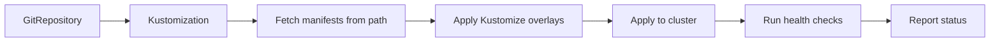

# How to Create a Kustomization Resource in Flux CD

Author: [nawazdhandala](https://github.com/nawazdhandala)

Tags: Flux CD, GitOps, Kubernetes, Kustomize, Kustomization, Continuous Delivery

Description: Learn how to create and configure a Kustomization resource in Flux CD to manage Kubernetes deployments using the GitOps approach.

---

## Introduction

The Kustomization resource is one of the most important custom resources in Flux CD. It tells the Kustomize controller what manifests to apply from a source (such as a GitRepository or an OCIRepository), how to reconcile them, and how to handle lifecycle events. In this guide, you will learn how to create a Kustomization resource from scratch and understand each of its core fields.

The Kustomization resource uses the API version `kustomize.toolkit.fluxcd.io/v1` and is managed by the Kustomize controller, which is one of the core components installed with Flux CD.

## Prerequisites

Before you begin, make sure you have the following in place:

- A Kubernetes cluster with Flux CD installed
- A GitRepository or OCIRepository source already configured
- `kubectl` configured to access your cluster
- The Flux CLI installed (optional but helpful)

You can verify that Flux is installed by running:

```bash
# Check that all Flux components are running
flux check
```

## Understanding the Kustomization Resource

A Kustomization resource defines a pipeline for applying Kubernetes manifests from a source. It watches a source (like a GitRepository), pulls manifests from a specified path, optionally applies Kustomize overlays, and reconciles the desired state with the cluster.

Here is how the reconciliation flow works:



## Creating a Basic Kustomization Resource

The simplest Kustomization resource references a source and a path within that source. Here is a minimal example.

```yaml
# kustomization.yaml - A basic Flux Kustomization resource
apiVersion: kustomize.toolkit.fluxcd.io/v1
kind: Kustomization
metadata:
  name: my-app
  namespace: flux-system
spec:
  # Interval at which to reconcile the Kustomization
  interval: 10m
  # Reference to the source (GitRepository, OCIRepository, or Bucket)
  sourceRef:
    kind: GitRepository
    name: my-repo
  # Path to the directory containing manifests within the source
  path: ./deploy/manifests
  # Whether to garbage collect resources that are removed from the source
  prune: true
```

Apply this resource to your cluster:

```bash
# Apply the Kustomization resource to the cluster
kubectl apply -f kustomization.yaml
```

## Key Fields Explained

### spec.interval

The `interval` field specifies how often Flux should check for changes and reconcile. A common value is `10m` (ten minutes), but you can set it shorter for development environments or longer for stable production workloads.

### spec.sourceRef

The `sourceRef` field points to the source that contains your Kubernetes manifests. The source must already exist in the cluster. Supported source kinds include `GitRepository`, `OCIRepository`, and `Bucket`.

### spec.path

The `path` field defines which directory inside the source repository contains the manifests to apply. It is relative to the root of the repository.

### spec.prune

When `prune` is set to `true`, Flux will garbage collect resources that were previously applied but are no longer present in the source. This keeps your cluster in sync with your Git repository.

## A More Complete Example

Here is a Kustomization resource that uses several additional fields for a production-grade setup.

```yaml
# production-kustomization.yaml - A comprehensive Flux Kustomization resource
apiVersion: kustomize.toolkit.fluxcd.io/v1
kind: Kustomization
metadata:
  name: production-app
  namespace: flux-system
spec:
  interval: 5m
  # Retry interval when reconciliation fails
  retryInterval: 2m
  # Timeout for apply and health check operations
  timeout: 3m
  sourceRef:
    kind: GitRepository
    name: production-repo
  path: ./clusters/production
  prune: true
  # Wait for resources to become healthy after apply
  wait: true
  # Force apply resources even if they have immutable field changes
  force: false
  # Target namespace for all resources without an explicit namespace
  targetNamespace: production
  # Health checks to run after applying
  healthChecks:
    - apiVersion: apps/v1
      kind: Deployment
      name: frontend
      namespace: production
    - apiVersion: apps/v1
      kind: Deployment
      name: backend
      namespace: production
```

## Creating a Kustomization with the Flux CLI

You can also create a Kustomization resource using the Flux CLI, which generates the YAML for you.

```bash
# Create a Kustomization using the Flux CLI
flux create kustomization my-app \
  --source=GitRepository/my-repo \
  --path="./deploy/manifests" \
  --prune=true \
  --interval=10m \
  --export > kustomization.yaml
```

The `--export` flag outputs the YAML to a file instead of applying it directly. This is useful when you want to commit the resource definition to your Git repository as part of your GitOps workflow.

## Verifying the Kustomization

After creating the Kustomization resource, you can verify its status.

```bash
# Check the status of all Kustomizations
flux get kustomizations

# Get detailed information about a specific Kustomization
kubectl describe kustomization my-app -n flux-system

# Force an immediate reconciliation
flux reconcile kustomization my-app
```

A healthy Kustomization will show `Ready` as `True` in its status conditions. If reconciliation fails, the status message will contain details about the error.

## Organizing Kustomizations

In a real-world setup, you typically have multiple Kustomization resources organized in a hierarchy. A common pattern is to have a root Kustomization that manages other Kustomizations.

```yaml
# root-kustomization.yaml - A root Kustomization that manages infrastructure
apiVersion: kustomize.toolkit.fluxcd.io/v1
kind: Kustomization
metadata:
  name: infrastructure
  namespace: flux-system
spec:
  interval: 10m
  sourceRef:
    kind: GitRepository
    name: flux-system
  path: ./infrastructure
  prune: true
---
# app-kustomization.yaml - An app Kustomization that depends on infrastructure
apiVersion: kustomize.toolkit.fluxcd.io/v1
kind: Kustomization
metadata:
  name: apps
  namespace: flux-system
spec:
  interval: 10m
  sourceRef:
    kind: GitRepository
    name: flux-system
  path: ./apps
  prune: true
  # Wait for infrastructure to be ready before applying apps
  dependsOn:
    - name: infrastructure
```

## Conclusion

The Kustomization resource is the cornerstone of Flux CD's GitOps workflow. It bridges the gap between your source repository and the Kubernetes cluster, ensuring that your desired state is continuously reconciled. Start with a basic configuration using `interval`, `sourceRef`, `path`, and `prune`, then progressively add fields like `healthChecks`, `timeout`, `dependsOn`, and `targetNamespace` as your deployment requirements grow. In subsequent posts, we will explore each of these fields in detail.
