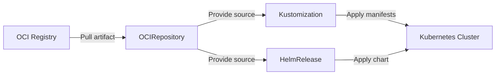

# How to Create an OCIRepository Source in Flux CD

Author: [nawazdhandala](https://github.com/nawazdhandala)

Tags: Flux CD, GitOps, Kubernetes, OCI, OCIRepository, Helm, Container Registry

Description: Learn how to create and configure an OCIRepository source in Flux CD to pull Kubernetes manifests and configurations stored as OCI artifacts in container registries.

---

## Introduction

Flux CD supports OCI (Open Container Initiative) artifacts as a source for Kubernetes manifests, Helm charts, and Kustomize overlays. The `OCIRepository` custom resource allows Flux to pull artifacts from any OCI-compliant container registry, such as Docker Hub, GitHub Container Registry (GHCR), AWS ECR, Azure ACR, and Google Artifact Registry.

This guide walks you through creating an OCIRepository source from scratch, covering the resource specification, key fields, reconciliation behavior, and practical examples.

## Prerequisites

Before you begin, ensure you have:

- A Kubernetes cluster with Flux CD installed (v0.35 or later)
- The `flux` CLI installed
- Access to an OCI-compliant container registry with at least one pushed artifact
- `kubectl` configured to communicate with your cluster

You can verify your Flux installation with the following command.

```bash
# Check that Flux components are running
flux check
```

## Understanding the OCIRepository Resource

The `OCIRepository` resource belongs to the `source.toolkit.fluxcd.io/v1beta2` API group. It tells the Flux source-controller where to find OCI artifacts, how to authenticate, and how often to check for updates.

Here is a diagram showing how OCIRepository fits into the Flux reconciliation pipeline.



## Creating a Basic OCIRepository

The simplest OCIRepository definition requires a URL pointing to your OCI artifact and an interval for reconciliation.

```yaml
# ocirepository-basic.yaml
# A minimal OCIRepository that pulls an artifact every 5 minutes
apiVersion: source.toolkit.fluxcd.io/v1beta2
kind: OCIRepository
metadata:
  name: my-app
  namespace: flux-system
spec:
  # The interval at which Flux checks for new artifact versions
  interval: 5m
  # The OCI artifact URL (must use the oci:// scheme)
  url: oci://ghcr.io/my-org/my-app-manifests
  ref:
    # Pull the latest tagged version using semver
    tag: latest
```

Apply this resource to your cluster.

```bash
# Apply the OCIRepository manifest to the cluster
kubectl apply -f ocirepository-basic.yaml
```

Verify that the source was created and is ready.

```bash
# Check the status of the OCIRepository
flux get sources oci
```

You should see output indicating that the artifact was fetched successfully, along with the digest and revision.

## Specifying a Reference

The `spec.ref` field controls which version of the artifact Flux pulls. You can specify a tag, a semver range, or a specific digest.

```yaml
# ocirepository-semver.yaml
# OCIRepository that tracks a semantic version range
apiVersion: source.toolkit.fluxcd.io/v1beta2
kind: OCIRepository
metadata:
  name: my-app-semver
  namespace: flux-system
spec:
  interval: 10m
  url: oci://ghcr.io/my-org/my-app-manifests
  ref:
    # Use semver to automatically pick the latest matching version
    semver: ">=1.0.0 <2.0.0"
```

```yaml
# ocirepository-digest.yaml
# OCIRepository pinned to an exact digest for reproducibility
apiVersion: source.toolkit.fluxcd.io/v1beta2
kind: OCIRepository
metadata:
  name: my-app-pinned
  namespace: flux-system
spec:
  interval: 10m
  url: oci://ghcr.io/my-org/my-app-manifests
  ref:
    # Pin to a specific digest for immutable deployments
    digest: sha256:a1b2c3d4e5f6a1b2c3d4e5f6a1b2c3d4e5f6a1b2c3d4e5f6a1b2c3d4e5f6a1b2
```

Using `semver` is recommended for production environments because it lets Flux automatically pick up patch and minor updates while preventing unexpected major version changes.

## Consuming the OCIRepository with a Kustomization

Once the OCIRepository is created, you reference it in a Flux `Kustomization` resource to apply the manifests to your cluster.

```yaml
# kustomization.yaml
# Flux Kustomization that consumes manifests from the OCIRepository
apiVersion: kustomize.toolkit.fluxcd.io/v1
kind: Kustomization
metadata:
  name: my-app
  namespace: flux-system
spec:
  interval: 10m
  # Reference the OCIRepository as the source
  sourceRef:
    kind: OCIRepository
    name: my-app
  # Path within the artifact to apply (use ./ for root)
  path: ./
  prune: true
  targetNamespace: default
```

## Suspending and Resuming Reconciliation

You can temporarily stop Flux from reconciling an OCIRepository without deleting it.

```bash
# Suspend reconciliation for the OCIRepository
flux suspend source oci my-app

# Resume reconciliation
flux resume source oci my-app
```

## Triggering a Manual Reconciliation

If you need to force Flux to pull the latest artifact immediately rather than waiting for the next interval, use the reconcile command.

```bash
# Force an immediate reconciliation of the OCIRepository
flux reconcile source oci my-app
```

## Adding Ignore Rules

You can configure the OCIRepository to ignore certain files within the artifact using the `spec.ignore` field.

```yaml
# ocirepository-ignore.yaml
# OCIRepository with ignore rules to skip test files
apiVersion: source.toolkit.fluxcd.io/v1beta2
kind: OCIRepository
metadata:
  name: my-app-filtered
  namespace: flux-system
spec:
  interval: 5m
  url: oci://ghcr.io/my-org/my-app-manifests
  ref:
    tag: latest
  # Ignore patterns work like .gitignore
  ignore: |
    # Skip test manifests
    tests/
    # Skip documentation
    *.md
```

## Monitoring OCIRepository Health

Use the following commands to inspect the status and events of your OCIRepository.

```bash
# Get detailed status of all OCI sources
flux get sources oci --all-namespaces

# Describe a specific OCIRepository for detailed event history
kubectl describe ocirepository my-app -n flux-system

# View Flux source-controller logs for debugging
kubectl logs -n flux-system deploy/source-controller | grep "my-app"
```

## Deleting an OCIRepository

To remove an OCIRepository source from your cluster, use the following command.

```bash
# Delete the OCIRepository resource
flux delete source oci my-app
```

This does not delete any resources that were applied from the artifact. To clean up applied resources, delete the associated Kustomization first with `prune: true` enabled.

## Summary

The OCIRepository source in Flux CD provides a robust way to store and distribute Kubernetes manifests using OCI container registries. Key takeaways include:

- Use the `oci://` URL scheme to point to artifacts in any OCI-compliant registry
- Choose between `tag`, `semver`, or `digest` references depending on your update strategy
- Combine OCIRepository with Kustomization or HelmRelease resources to apply manifests to your cluster
- Use `flux get sources oci` and `kubectl describe` to monitor reconciliation status

OCI artifacts offer advantages over Git-based sources in scenarios where you want to decouple your deployment artifacts from source code repositories or leverage existing container registry infrastructure for distribution and access control.
