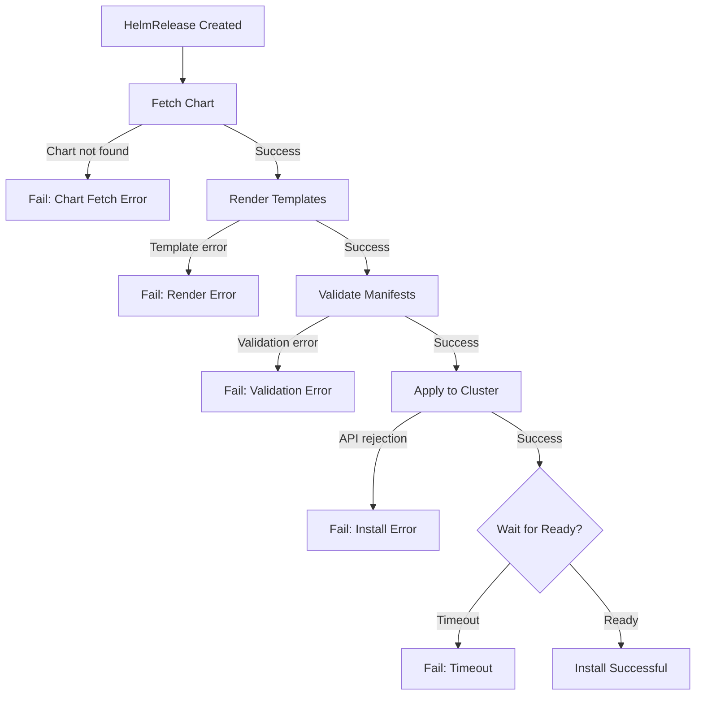

# How to Debug HelmRelease Install Failures in Flux

Author: [nawazdhandala](https://github.com/nawazdhandala)

Tags: Flux CD, GitOps, Kubernetes, Helm, HelmRelease, Debugging, Install Failures, Troubleshooting

Description: A step-by-step guide to diagnosing and resolving HelmRelease install failures in Flux CD, covering common error patterns and debugging techniques.

---

When a HelmRelease fails to install in Flux CD, the release gets stuck in a failed state and your application does not deploy. Install failures can stem from chart issues, values errors, Kubernetes API rejections, resource conflicts, or infrastructure problems. This guide walks through a systematic approach to diagnosing and fixing these failures.

## Understanding Install Failure States

When a HelmRelease install fails, Flux sets the Ready condition to `False` and records the failure reason. The HelmRelease will attempt remediation based on your configuration (retries, rollback) or remain in the failed state until the issue is resolved.



## Step 1: Check the HelmRelease Status

Start by examining the HelmRelease status to understand what went wrong:

```bash
# Get a quick overview of the HelmRelease status
flux get helmrelease my-app -n default

# Get detailed status with conditions
kubectl get helmrelease my-app -n default -o yaml | grep -A 20 "status:"

# View events related to the HelmRelease
kubectl describe helmrelease my-app -n default
```

The status conditions will contain the failure message. Common condition types include:
- `Ready: False` with a reason like `InstallFailed`
- `Released: False` indicating the Helm release was not created

## Step 2: Check the Helm Chart Source

Ensure the chart source is available and has been fetched successfully:

```bash
# Check HelmRepository status
flux get source helm my-repo -n flux-system

# Check if a GitRepository source is ready
flux get source git my-repo -n flux-system

# Check OCIRepository status
flux get source oci my-chart -n flux-system

# Force reconciliation of the source
flux reconcile source helm my-repo -n flux-system
```

If the source is not ready, the HelmRelease cannot fetch the chart and will fail at the very first step.

## Step 3: Examine the Helm Controller Logs

The helm-controller logs contain detailed error messages that may not appear in the HelmRelease status:

```bash
# View helm-controller logs for the specific HelmRelease
kubectl logs -n flux-system deployment/helm-controller | grep "my-app"

# View recent errors
kubectl logs -n flux-system deployment/helm-controller --since=10m | grep -i "error\|fail"

# Follow logs in real-time while triggering a reconciliation
kubectl logs -n flux-system deployment/helm-controller -f &
flux reconcile helmrelease my-app -n default
```

## Step 4: Identify the Specific Error Type

### Template Rendering Errors

If the chart templates fail to render, you will see errors like `template rendering failed` or `execution error`:

```bash
# Look for template errors in the controller logs
kubectl logs -n flux-system deployment/helm-controller | grep "template" | grep "my-app"
```

Common causes:
- Missing required values
- Type mismatches in values
- Chart dependency not met
- Syntax errors in overridden values

To fix, review your `spec.values` and ensure all required values are provided:

```yaml
# Verify your values are correct
apiVersion: helm.toolkit.fluxcd.io/v2
kind: HelmRelease
metadata:
  name: my-app
  namespace: default
spec:
  interval: 10m
  chart:
    spec:
      chart: my-app
      version: "1.x"
      sourceRef:
        kind: HelmRepository
        name: my-repo
        namespace: flux-system
  values:
    # Ensure all required values are present and correctly typed
    replicaCount: 3          # Must be an integer, not a string
    image:
      repository: my-app     # Required by the chart
      tag: "1.0.0"           # Required by the chart
```

### Resource Conflict Errors

If a resource already exists in the cluster (from a previous manual install or another release), you will see conflicts:

```bash
# Look for conflict errors
kubectl logs -n flux-system deployment/helm-controller | grep "conflict\|already exists" | grep "my-app"
```

To resolve resource conflicts, you can either delete the conflicting resources or adopt them into the Helm release by adding the appropriate labels and annotations.

### RBAC and Permission Errors

The helm-controller service account may lack permissions to create certain resources:

```bash
# Check for RBAC errors
kubectl logs -n flux-system deployment/helm-controller | grep "forbidden\|unauthorized" | grep "my-app"
```

### Namespace Issues

If the target namespace does not exist, the install will fail:

```yaml
# Enable namespace creation during install
apiVersion: helm.toolkit.fluxcd.io/v2
kind: HelmRelease
metadata:
  name: my-app
  namespace: new-namespace
spec:
  interval: 10m
  chart:
    spec:
      chart: my-app
      sourceRef:
        kind: HelmRepository
        name: my-repo
        namespace: flux-system
  install:
    # Automatically create the target namespace if it does not exist
    createNamespace: true
```

## Step 5: Force Reconciliation

After fixing the issue, force a reconciliation:

```bash
# Trigger a new reconciliation attempt
flux reconcile helmrelease my-app -n default

# Watch the status
flux get helmrelease my-app -n default --watch
```

## Step 6: Reset a Stuck HelmRelease

If the HelmRelease is stuck and retries are exhausted, you may need to suspend and resume it:

```bash
# Suspend the HelmRelease
flux suspend helmrelease my-app -n default

# Optionally, delete the failed Helm release secret to start fresh
kubectl delete secret -n default -l name=my-app,owner=helm

# Resume the HelmRelease to trigger a fresh install
flux resume helmrelease my-app -n default
```

## Common Install Failure Patterns

| Error Pattern | Cause | Fix |
|---|---|---|
| `chart not found` | Wrong chart name or version | Verify chart name and version in source |
| `template rendering failed` | Missing or invalid values | Review and fix `spec.values` |
| `already exists` | Resource conflict | Delete conflicting resource or adopt it |
| `forbidden` | RBAC issue | Grant permissions to helm-controller SA |
| `namespace not found` | Target namespace missing | Set `install.createNamespace: true` |
| `timed out waiting` | Pods not becoming ready | Check pod events, increase timeout, or use `disableWait` |
| `validation failed` | OpenAPI validation error | Fix the schema issue or use `disableOpenAPIValidation` |

## Configuring Install Remediation

To handle transient failures, configure automatic retries:

```yaml
# HelmRelease with install remediation
apiVersion: helm.toolkit.fluxcd.io/v2
kind: HelmRelease
metadata:
  name: my-app
  namespace: default
spec:
  interval: 10m
  chart:
    spec:
      chart: my-app
      sourceRef:
        kind: HelmRepository
        name: my-repo
        namespace: flux-system
  install:
    timeout: 5m
    remediation:
      # Number of retries before giving up
      retries: 3
```

## Best Practices

1. **Always check the source first.** Many install failures are caused by chart source issues, not the HelmRelease itself.
2. **Read the full error message.** The helm-controller logs contain more detail than the HelmRelease status conditions.
3. **Test values locally.** Use `helm template` with your values file to catch rendering errors before pushing to Git.
4. **Set appropriate timeouts.** The default timeout may be too short for charts that deploy many resources.
5. **Use remediation retries.** Configure retries to handle transient failures automatically.

## Conclusion

Debugging HelmRelease install failures in Flux follows a systematic approach: check the status, verify the source, examine controller logs, identify the error type, and apply the appropriate fix. By understanding the common failure patterns and using the right diagnostic commands, you can quickly resolve install issues and get your deployments running.
