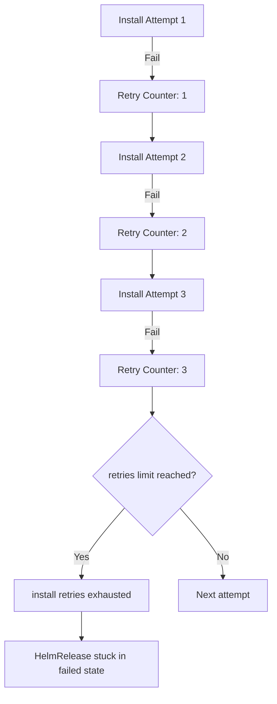

# How to Debug HelmRelease Install Retries Exhausted Error in Flux

Author: [nawazdhandala](https://github.com/nawazdhandala)

Tags: Flux CD, GitOps, Kubernetes, Helm, HelmRelease, Debugging, Retries Exhausted, Install Remediation

Description: Learn how to diagnose and recover from the HelmRelease install retries exhausted error in Flux CD when all remediation attempts have failed.

---

When a HelmRelease in Flux CD fails to install and all configured retry attempts are exhausted, Flux stops trying and reports the error `install retries exhausted`. The HelmRelease enters a terminal failed state and will not attempt further installations until the issue is resolved and the resource is reset. This guide explains what causes this state, how to diagnose the underlying problem, and how to recover.

## What Happens When Retries Are Exhausted

Flux tracks install retries through the `spec.install.remediation.retries` field. Each time an install fails, Flux increments a failure counter. Once the counter reaches the configured limit, Flux stops retrying and sets the following status condition:

- **Type:** `Ready`
- **Status:** `False`
- **Reason:** `InstallFailed`
- **Message:** `install retries exhausted`

At this point, the HelmRelease will not reconcile further until you intervene.



## Step 1: Confirm the Error

Verify that the HelmRelease is in the retries exhausted state:

```bash
# Check the HelmRelease status
flux get helmrelease my-app -n default

# View the detailed conditions
kubectl get helmrelease my-app -n default -o jsonpath='{.status.conditions[?(@.type=="Ready")]}' | jq .

# Expected output includes:
# "reason": "InstallFailed"
# "message": "install retries exhausted"
```

## Step 2: Identify the Root Cause

The retries exhausted error is a symptom, not the cause. You need to find why every install attempt failed.

### Check the Helm Controller Logs

```bash
# View recent logs for the specific HelmRelease
kubectl logs -n flux-system deployment/helm-controller --since=30m | grep "my-app"

# Filter for errors only
kubectl logs -n flux-system deployment/helm-controller --since=30m | grep "my-app" | grep -i "error\|fail"
```

### Check the HelmRelease Events

```bash
# View events which record each failed attempt
kubectl describe helmrelease my-app -n default

# Look at the Events section at the bottom of the output
```

### Common Root Causes

1. **Chart values errors** -- Missing required values, wrong types, or invalid combinations.
2. **Chart not found** -- The chart name, version, or source reference is incorrect.
3. **Resource conflicts** -- Resources from a previous installation still exist in the cluster.
4. **RBAC issues** -- The helm-controller lacks permissions to create certain resources.
5. **Namespace does not exist** -- The target namespace has not been created.
6. **Persistent infrastructure issues** -- The underlying problem is not transient and retries cannot fix it.

## Step 3: Fix the Underlying Issue

Based on the root cause, apply the appropriate fix.

### Fix Values Errors

```yaml
# Corrected HelmRelease with proper values
apiVersion: helm.toolkit.fluxcd.io/v2
kind: HelmRelease
metadata:
  name: my-app
  namespace: default
spec:
  interval: 10m
  chart:
    spec:
      chart: my-app
      version: "1.2.0"
      sourceRef:
        kind: HelmRepository
        name: my-repo
        namespace: flux-system
  install:
    remediation:
      retries: 3
  values:
    # Fix: ensure all required values are present
    database:
      host: "postgres.default.svc.cluster.local"
      port: 5432
      name: "mydb"
```

### Fix Resource Conflicts

```bash
# Find and remove orphaned resources from previous installs
kubectl get all -n default -l app.kubernetes.io/name=my-app

# Delete orphaned resources
kubectl delete deployment my-app -n default
kubectl delete service my-app -n default

# Remove any leftover Helm release secrets
kubectl delete secret -n default -l name=my-app,owner=helm
```

### Fix Namespace Issues

```yaml
# Enable automatic namespace creation
spec:
  install:
    createNamespace: true
    remediation:
      retries: 3
```

## Step 4: Reset the HelmRelease

After fixing the underlying issue, you need to reset the retry counter. There are several ways to do this:

### Method 1: Suspend and Resume

```bash
# Suspend the HelmRelease to stop reconciliation
flux suspend helmrelease my-app -n default

# Clean up any failed Helm release secrets
kubectl delete secret -n default -l name=my-app,owner=helm,status=failed

# Resume the HelmRelease to reset the counter and trigger a fresh install
flux resume helmrelease my-app -n default

# Watch for the new install attempt
flux get helmrelease my-app -n default --watch
```

### Method 2: Force Reconciliation with Annotation

```bash
# Add or update the reconcile annotation to force a fresh reconciliation
kubectl annotate helmrelease my-app -n default \
  reconcile.fluxcd.io/requestedAt="$(date +%s)" --overwrite

# Monitor the result
flux get helmrelease my-app -n default --watch
```

### Method 3: Delete and Recreate

If other methods do not work, delete the HelmRelease and recreate it:

```bash
# Delete the HelmRelease
kubectl delete helmrelease my-app -n default

# Clean up any Helm release secrets
kubectl delete secret -n default -l name=my-app,owner=helm

# Let Flux recreate the HelmRelease from Git
flux reconcile kustomization flux-system -n flux-system
```

## Configuring Retries Properly

Adjust your retry configuration to balance between resilience and fast failure detection:

```yaml
# HelmRelease with balanced retry configuration
apiVersion: helm.toolkit.fluxcd.io/v2
kind: HelmRelease
metadata:
  name: my-app
  namespace: default
spec:
  interval: 10m
  chart:
    spec:
      chart: my-app
      version: "1.x"
      sourceRef:
        kind: HelmRepository
        name: my-repo
        namespace: flux-system
  install:
    # Set a reasonable timeout for each attempt
    timeout: 5m
    remediation:
      # Number of retries (0 means no retries, fail immediately)
      retries: 3
```

Setting `retries: 0` means Flux will not retry at all after the first failure. Setting a higher number like `retries: 5` gives more room for transient issues to resolve.

## Preventing Retries Exhausted Errors

### Validate Before Pushing

Test your chart values locally before committing:

```bash
# Render the chart locally to catch template errors
helm template my-app ./charts/my-app -f values.yaml

# Validate the rendered output against the cluster
helm template my-app ./charts/my-app -f values.yaml | kubectl apply --dry-run=server -f -
```

### Use Alerts to Get Notified Early

Configure Flux alerts to notify you when install failures occur, before retries are exhausted:

```yaml
# Alert provider for Slack notifications
apiVersion: notification.toolkit.fluxcd.io/v1beta3
kind: Provider
metadata:
  name: slack
  namespace: flux-system
spec:
  type: slack
  channel: flux-alerts
  secretRef:
    name: slack-webhook
---
# Alert for HelmRelease failures
apiVersion: notification.toolkit.fluxcd.io/v1beta3
kind: Alert
metadata:
  name: helmrelease-alerts
  namespace: flux-system
spec:
  providerRef:
    name: slack
  eventSeverity: error
  eventSources:
    - kind: HelmRelease
      name: "*"
      namespace: default
```

## Best Practices

1. **Start with a moderate retry count.** 3 retries is a good default. Too many retries delay error detection; too few cause unnecessary failures on transient issues.
2. **Always check the root cause.** The retries exhausted error tells you retries ran out, not what went wrong. Dig into logs and events.
3. **Clean up before resetting.** Remove failed Helm secrets and orphaned resources before resetting the HelmRelease.
4. **Set up alerts.** Get notified on the first failure, not after retries are exhausted.
5. **Use dry-run validation.** Catch errors before they reach the cluster.

## Conclusion

The `install retries exhausted` error in Flux means all configured install attempts have failed and the HelmRelease is stuck. To recover, identify the root cause from controller logs and events, fix the underlying issue, clean up any leftover state, and reset the HelmRelease through suspend/resume or forced reconciliation. Proper retry configuration and early alerting help minimize the impact of install failures.
