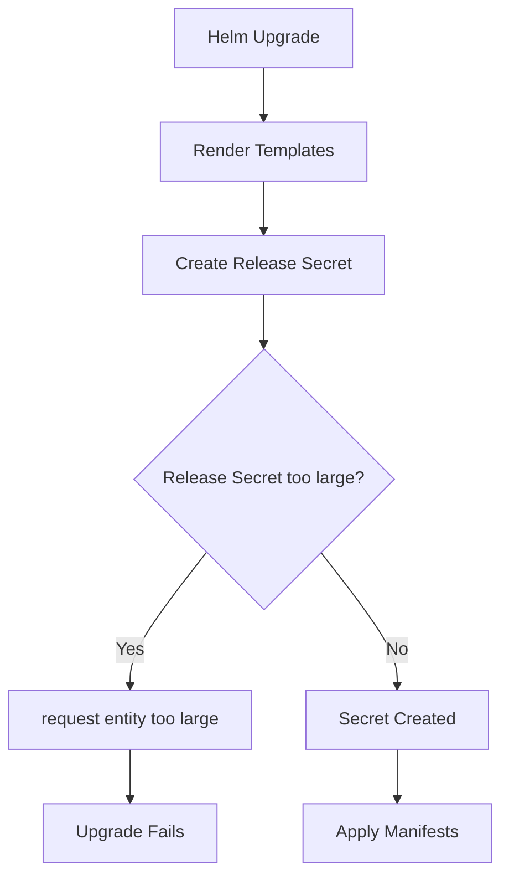

# How to Debug HelmRelease Request Entity Too Large Error in Flux

Author: [nawazdhandala](https://github.com/nawazdhandala)

Tags: Flux CD, GitOps, Kubernetes, Helm, HelmRelease, Debugging, Request Entity Too Large, Release History

Description: Learn how to diagnose and fix the 'request entity too large' error in Flux CD HelmRelease caused by oversized Helm release secrets.

---

The "request entity too large" error is one of the more frustrating HelmRelease failures in Flux CD. It occurs when the Helm release Secret -- which stores release metadata including the rendered manifests for a release version -- becomes too large to store in Kubernetes. The Kubernetes API server request body limit is commonly 3 MiB, and individual Kubernetes Secrets are limited to 1 MiB. This error typically surfaces when deploying charts that produce very large rendered output.

## Understanding the Problem

Helm stores its release state as Kubernetes Secrets (or ConfigMaps, depending on the storage driver). Each release version is stored as a separate Secret containing:

- The rendered manifests (all YAML output from `helm template`)
- The chart metadata
- The values used for the release
- Release metadata (version number, status, timestamps)

This data is gzip-compressed and base64-encoded by Helm before it is stored in the Secret, but for large charts or charts with many resources, a single release Secret can still become too large.


```mermaid
graph TD
    A[Helm Upgrade] --> B[Render Templates]
    B --> C[Create Release Secret]
    C --> D{Release Secret too large?}
    D -->|Yes| E[request entity too large]
    D -->|No| F[Secret Created]
    F --> G[Apply Manifests]
    E --> H[Upgrade Fails]
```

## Step 1: Confirm the Error

Check the HelmRelease status for the specific error:

```bash
# Check the HelmRelease status

flux get helmreleases -n default

# Look for the specific error message
kubectl describe helmrelease my-app -n default | grep -i "too large\|entity"

# Check helm-controller logs
kubectl logs -n flux-system deployment/helm-controller | grep "too large" | grep "my-app"
```

The error message may read `Request entity too large: limit is 3145728` when the Kubernetes API server rejects the request body. If the individual Secret object is over the Kubernetes Secret size limit, you may instead see an error such as `Too long: must have at most 1048576 bytes`.

## Step 2: Assess the Current Release History

Check how many release versions are stored and how large their encoded release data is:

```bash
# List all Helm release secrets for the release
kubectl get secrets -n default -l name=my-app,owner=helm --sort-by='{.metadata.creationTimestamp}'

# Check the encoded release data size for each release secret
kubectl get secrets -n default -l name=my-app,owner=helm -o json | \
  jq -r '.items[] | "\(.metadata.name)\t\(.metadata.creationTimestamp)\t\(.data.release | length) bytes"'

# Get the serialized size of the latest release secret in bytes
LATEST_SECRET=$(kubectl get secrets -n default -l name=my-app,owner=helm \
  --sort-by='{.metadata.creationTimestamp}' -o name | tail -n 1)
kubectl get -n default "$LATEST_SECRET" -o json | wc -c
```

## Step 3: Limit Release History

One preventive measure is to limit the number of historical releases stored by Helm. Each release revision is kept as a separate Secret, and having many revisions increases total cluster storage usage. This does not reduce the size of the new release Secret being written, so it will not fix a release whose current rendered output is too large.

### Set maxHistory on the HelmRelease

```yaml
# HelmRelease with limited release history
apiVersion: helm.toolkit.fluxcd.io/v2
kind: HelmRelease
metadata:
  name: my-app
  namespace: default
spec:
  interval: 10m
  chart:
    spec:
      chart: my-app
      sourceRef:
        kind: HelmRepository
        name: my-repo
        namespace: flux-system
  # Limit the number of Helm release versions stored
  # This controls how many release Secrets are kept
  maxHistory: 3
```

The `maxHistory` field tells Flux to limit how many Helm release revisions are saved for this HelmRelease. If not set, Flux defaults this value to `5`.

### Manually Clean Up Old Release Secrets

If you are already carrying excessive history, manually remove old release Secrets to reduce cluster storage usage:

```bash
# List all release secrets, sorted by creation time
kubectl get secrets -n default -l name=my-app,owner=helm \
  --sort-by='{.metadata.creationTimestamp}' \
  -o custom-columns='NAME:.metadata.name,CREATED:.metadata.creationTimestamp'

# Delete old release secrets, keeping only the most recent
# For example, if you have versions v1 through v20, delete v1 through v17
kubectl delete secret -n default sh.helm.release.v1.my-app.v1
kubectl delete secret -n default sh.helm.release.v1.my-app.v2
kubectl delete secret -n default sh.helm.release.v1.my-app.v3
# Continue deleting old versions...
```

Alternatively, delete all but the latest:

```bash
# Get the latest release Secret name
LATEST_SECRET=$(kubectl get secrets -n default -l name=my-app,owner=helm \
  --sort-by='{.metadata.creationTimestamp}' -o name | tail -n 1)

# Delete all secrets except the latest
kubectl get secrets -n default -l name=my-app,owner=helm -o name | \
  grep -v "^${LATEST_SECRET}$" | \
  xargs kubectl delete -n default
```

## Step 4: Reduce Chart Output Size

If the chart itself produces very large rendered output (approaching 1 MiB for a single release), you need to reduce the chart size.

### Disable Unnecessary Resources

Many charts include optional resources that can be disabled:

```yaml
# Reduce chart output by disabling unused features
apiVersion: helm.toolkit.fluxcd.io/v2
kind: HelmRelease
metadata:
  name: my-app
  namespace: default
spec:
  interval: 10m
  chart:
    spec:
      chart: my-app
      sourceRef:
        kind: HelmRepository
        name: my-repo
        namespace: flux-system
  values:
    # Disable optional components to reduce manifest size
    metrics:
      enabled: false
    networkPolicies:
      enabled: false
    podDisruptionBudget:
      enabled: false
    tests:
      enabled: false
```

### Split Large Charts

If you maintain the chart, consider splitting it into smaller sub-charts:

```yaml
# Deploy components as separate HelmReleases
apiVersion: helm.toolkit.fluxcd.io/v2
kind: HelmRelease
metadata:
  name: my-app-core
  namespace: default
spec:
  interval: 10m
  chart:
    spec:
      chart: my-app-core
      sourceRef:
        kind: HelmRepository
        name: my-repo
        namespace: flux-system
---
apiVersion: helm.toolkit.fluxcd.io/v2
kind: HelmRelease
metadata:
  name: my-app-monitoring
  namespace: default
spec:
  dependsOn:
    - name: my-app-core
  interval: 10m
  chart:
    spec:
      chart: my-app-monitoring
      sourceRef:
        kind: HelmRepository
        name: my-repo
        namespace: flux-system
```

## Step 5: Recover After Cleanup

After reducing the chart size, trigger a fresh reconciliation:

```bash
# Reconcile the HelmRelease
flux reconcile helmrelease my-app -n default --reset

# Watch for successful upgrade
flux get helmreleases -n default --watch
```

## Step 6: Prevent Future Storage Growth

Add the following configuration to HelmReleases where you want a lower release-history limit than Flux's default:

```yaml
# Preventive configuration
apiVersion: helm.toolkit.fluxcd.io/v2
kind: HelmRelease
metadata:
  name: my-app
  namespace: default
spec:
  interval: 10m
  # Keep only 3 release versions
  maxHistory: 3
  chart:
    spec:
      chart: my-app
      sourceRef:
        kind: HelmRepository
        name: my-repo
        namespace: flux-system
  upgrade:
    # Clean up new resources created during a failed upgrade
    cleanupOnFail: true
```

## Monitoring Release Secret Sizes

You can set up a periodic check to monitor release secret sizes:

```bash
# Script to check all Helm release secret sizes across namespaces
kubectl get secrets --all-namespaces -l owner=helm -o json | \
  jq -r '.items[] | "\(.metadata.namespace)/\(.metadata.name)\t\(.data.release | length)"' | \
  sort -t$'\t' -k2 -n -r | \
  head -20
```

## Quick Reference: Recovery Steps

```bash
# 1. Confirm the error
kubectl describe helmrelease my-app -n default | grep "too large"

# 2. Count release secrets
kubectl get secrets -n default -l name=my-app,owner=helm | wc -l

# 3. Reduce the current chart output size if the latest release Secret is too large

# 4. Optionally set maxHistory to keep less history than the Flux default of 5
# maxHistory: 3

# 5. Reset and reconcile the HelmRelease
flux reconcile helmrelease my-app -n default --reset
```

## Best Practices

1. **Use maxHistory deliberately.** Flux defaults to 5 saved revisions; set a lower value such as 3 if you want to keep less release history.
2. **Monitor secret sizes.** Set up alerts for release Secrets approaching Kubernetes size limits.
3. **Split large charts.** If a single chart produces hundreds of resources, consider breaking it into smaller charts.
4. **Clean up regularly.** Include release history cleanup in your operational runbooks.
5. **Disable unused chart features.** Every disabled optional component reduces the rendered output size.

## Conclusion

The "request entity too large" error in Flux is caused by a Helm release Secret becoming too large for Kubernetes to store. The primary fix is reducing the rendered release size by splitting large charts or disabling unused features, and setting `maxHistory` on your HelmRelease controls historical release storage. Regular monitoring of release Secret sizes helps prevent this issue from recurring.
