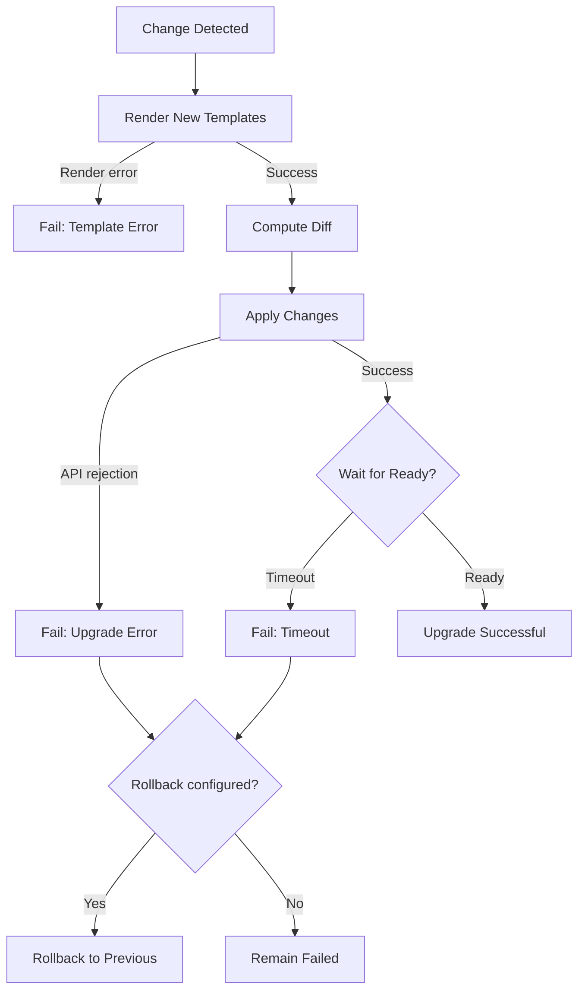

# How to Debug HelmRelease Upgrade Failures in Flux

Author: [nawazdhandala](https://github.com/nawazdhandala)

Tags: Flux CD, GitOps, Kubernetes, Helm, HelmRelease, Debugging, Upgrade Failures, Troubleshooting

Description: A comprehensive guide to diagnosing and resolving HelmRelease upgrade failures in Flux CD, covering rollback strategies and common error patterns.

---

HelmRelease upgrade failures in Flux occur when an existing Helm release cannot be updated to a new version or configuration. Unlike install failures, upgrades have additional complexity because they involve modifying existing resources, handling schema changes, and dealing with Helm's release history. This guide covers systematic debugging techniques for upgrade failures.

## How Upgrades Work in Flux

When Flux detects a change in a HelmRelease (new chart version, changed values, or changed spec), it performs a Helm upgrade. The upgrade process renders the new templates, computes a diff against the previous release, and applies the changes. If the upgrade fails, Flux can optionally roll back to the previous release.



## Step 1: Check the HelmRelease Status

Start by examining the current state of the HelmRelease:

```bash
# Get the HelmRelease status
flux get helmrelease my-app -n default

# View detailed conditions
kubectl get helmrelease my-app -n default -o jsonpath='{.status.conditions}' | jq .

# View events for the HelmRelease
kubectl describe helmrelease my-app -n default
```

Look for conditions with `reason: UpgradeFailed` or `reason: UpgradeStrategyFailed`.

## Step 2: Examine the Helm Controller Logs

The helm-controller logs provide the most detailed error information:

```bash
# Filter logs for the specific HelmRelease
kubectl logs -n flux-system deployment/helm-controller | grep "my-app" | tail -50

# Search for upgrade-specific errors
kubectl logs -n flux-system deployment/helm-controller | grep -E "upgrade|rollback" | grep "my-app"
```

## Step 3: Check the Helm Release History

Flux stores Helm release history as Kubernetes Secrets. Examining the history reveals previous successful versions and failed attempts:

```bash
# List all Helm release secrets for the release
kubectl get secrets -n default -l name=my-app,owner=helm --sort-by='{.metadata.creationTimestamp}'

# View the Helm history
helm history my-app -n default

# Check the status of the latest release
helm status my-app -n default
```

## Step 4: Identify the Specific Error

### Immutable Field Changes

One of the most common upgrade failures is attempting to change immutable fields on existing resources:

```bash
# Look for immutable field errors
kubectl logs -n flux-system deployment/helm-controller | grep "immutable\|cannot be updated" | grep "my-app"
```

Common immutable fields include:
- `spec.selector` on Deployments
- `spec.clusterIP` on Services
- `spec.volumeName` on PersistentVolumeClaims

To resolve, you may need to delete the resource and let the upgrade recreate it, or use the `force` option:

```yaml
# Enable force upgrade to handle immutable field changes
apiVersion: helm.toolkit.fluxcd.io/v2
kind: HelmRelease
metadata:
  name: my-app
  namespace: default
spec:
  interval: 10m
  chart:
    spec:
      chart: my-app
      sourceRef:
        kind: HelmRepository
        name: my-repo
        namespace: flux-system
  upgrade:
    # Force resource updates by deleting and recreating when needed
    force: true
    timeout: 5m
```

**Warning:** Using `force: true` causes downtime because resources are deleted and recreated. Use it carefully.

### Resource Validation Errors

New chart versions may introduce resources with schemas that fail validation:

```bash
# Check for validation errors
kubectl logs -n flux-system deployment/helm-controller | grep "validation\|invalid" | grep "my-app"
```

### Failed Pre-Upgrade Hooks

Helm hooks that run before the upgrade can cause failures:

```bash
# Check for hook-related errors
kubectl logs -n flux-system deployment/helm-controller | grep "hook" | grep "my-app"

# Check hook job status
kubectl get jobs -n default -l helm.sh/hook
```

### Resource Quota and Limits

Upgrades that increase resource requirements may fail if quotas are exceeded:

```bash
# Check for quota errors
kubectl logs -n flux-system deployment/helm-controller | grep "quota\|exceeded" | grep "my-app"

# Check resource quotas in the namespace
kubectl get resourcequota -n default
```

## Step 5: Configure Upgrade Remediation

Set up automatic rollback on upgrade failure:

```yaml
# HelmRelease with upgrade remediation and rollback
apiVersion: helm.toolkit.fluxcd.io/v2
kind: HelmRelease
metadata:
  name: my-app
  namespace: default
spec:
  interval: 10m
  chart:
    spec:
      chart: my-app
      version: "2.x"
      sourceRef:
        kind: HelmRepository
        name: my-repo
        namespace: flux-system
  upgrade:
    timeout: 5m
    # Clean up resources from failed upgrades
    cleanupOnFail: true
    remediation:
      # Number of upgrade retries
      retries: 3
      # Rollback to the last successful release on failure
      remediateLastFailure: true
      # Strategy: rollback or uninstall
      strategy: rollback
```

## Step 6: Manually Recover from a Failed Upgrade

If automatic remediation does not resolve the issue:

```bash
# Suspend the HelmRelease to prevent further reconciliation
flux suspend helmrelease my-app -n default

# Manually roll back the Helm release
helm rollback my-app -n default

# Verify the rollback
helm status my-app -n default

# Fix the HelmRelease configuration in your Git repository
# Then resume the HelmRelease
flux resume helmrelease my-app -n default
```

## Step 7: Reset the Release History

If the Helm release history is corrupted or too large, clean it up:

```bash
# View current history length
helm history my-app -n default | wc -l

# If history is too large, limit it in the HelmRelease
```

Configure history limits in the HelmRelease:

```yaml
# Limit the number of revisions kept in history
apiVersion: helm.toolkit.fluxcd.io/v2
kind: HelmRelease
metadata:
  name: my-app
  namespace: default
spec:
  interval: 10m
  chart:
    spec:
      chart: my-app
      sourceRef:
        kind: HelmRepository
        name: my-repo
        namespace: flux-system
  # Limit the number of history entries
  upgrade:
    cleanupOnFail: true
  # Maximum number of release versions stored as secrets
  historyLimit: 5
```

## Common Upgrade Failure Patterns

| Error Pattern | Cause | Fix |
|---|---|---|
| `cannot patch ... field is immutable` | Immutable field change | Use `force: true` or delete the resource |
| `another operation is in progress` | Concurrent upgrade | Wait or clean up the pending release |
| `has no deployed releases` | Previous install failed | Uninstall and reinstall |
| `pre-upgrade hooks failed` | Hook job failure | Fix the hook or skip hooks |
| `timed out waiting for condition` | Pods not ready after upgrade | Increase timeout or fix readiness probes |
| `UPGRADE FAILED: ... is invalid` | Validation error | Fix the values or disable validation |

## Best Practices

1. **Always configure rollback.** Set `upgrade.remediation.remediateLastFailure: true` to automatically roll back on failure.
2. **Use cleanupOnFail.** Enable `upgrade.cleanupOnFail: true` to remove resources created by a failed upgrade.
3. **Limit release history.** Set `historyLimit` to prevent the release history from growing unbounded.
4. **Test chart upgrades locally.** Use `helm diff upgrade` to preview changes before pushing to Git.
5. **Stage upgrades through environments.** Test in staging before promoting to production.

## Conclusion

Debugging HelmRelease upgrade failures requires examining the HelmRelease status, helm-controller logs, and Helm release history. Common issues include immutable field changes, validation errors, and hook failures. By configuring proper remediation with automatic rollback and cleanup, you can minimize the impact of upgrade failures and recover quickly.
