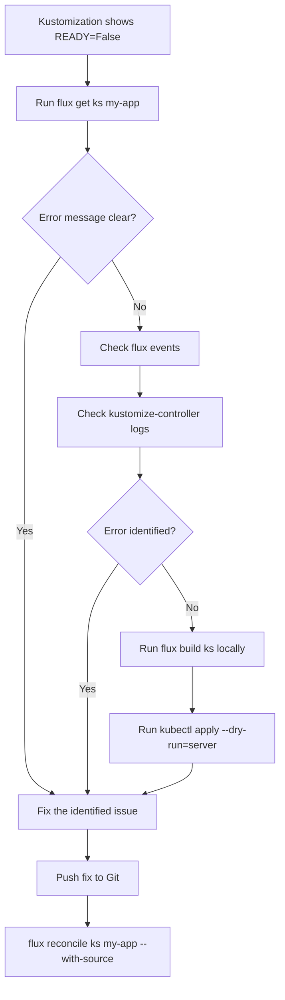

# How to Debug Kustomization Apply Errors in Flux

Author: [nawazdhandala](https://github.com/nawazdhandala)

Tags: Flux CD, GitOps, Kubernetes, Kustomize, Debugging, Troubleshooting, Kustomization

Description: Learn how to identify, diagnose, and resolve Kustomization apply errors in Flux CD using CLI tools and controller logs.

---

## Introduction

When Flux CD applies resources from a Kustomization, various errors can occur -- from malformed YAML and missing dependencies to RBAC issues and resource conflicts. These errors appear as failed reconciliations, and understanding how to debug them is essential for maintaining a healthy GitOps workflow.

This guide covers a systematic approach to diagnosing Kustomization apply errors, using the Flux CLI, kubectl, and controller logs.

## Prerequisites

- A Kubernetes cluster with Flux CD installed
- The `flux` CLI installed and configured
- kubectl access to the cluster

## Step 1: Identify the Error

Start by checking the Kustomization status to see if an error exists.

```bash
# Get the status of all Kustomizations
flux get ks
```

Output when an error is present:

```text
NAME    REVISION        SUSPENDED  READY  MESSAGE
my-app  main@sha1:abc   False      False  kustomize build failed: ...
```

The `READY` column shows `False`, and the `MESSAGE` column provides the first clue about the error.

For more detail, use the describe-style output:

```bash
# Get detailed information about a specific Kustomization
flux get ks my-app --verbose
```

## Step 2: Check Flux Events

Flux events provide a timeline of what happened during reconciliation.

```bash
# View events for the Kustomization
flux events --for Kustomization/my-app
```

This will show events such as:

```text
LAST SEEN  TYPE     REASON           OBJECT                    MESSAGE
2m         Warning  ReconciliationFailed  Kustomization/my-app  apply failed: ...
5m         Normal   ReconciliationSucceeded  Kustomization/my-app  Applied revision: main@sha1:prev
```

## Step 3: Examine the Kustomization Resource Directly

Use kubectl to get the full status with conditions:

```bash
# Get the Kustomization status with full conditions
kubectl get kustomization my-app -n flux-system -o jsonpath='{.status.conditions[*]}' | jq .
```

If `jq` is not available, use the YAML output:

```bash
# View the full Kustomization status in YAML format
kubectl get kustomization my-app -n flux-system -o yaml
```

Look at the `status.conditions` section for detailed error messages:

```yaml
status:
  conditions:
    - lastTransitionTime: "2026-03-05T10:00:00Z"
      message: "apply failed: Service/my-app dry-run failed: admission webhook denied the request"
      reason: ReconciliationFailed
      status: "False"
      type: Ready
```

## Step 4: Check the Kustomize-Controller Logs

The kustomize-controller logs contain the most detailed error information.

```bash
# View recent kustomize-controller logs
kubectl logs -n flux-system deploy/kustomize-controller --tail=200
```

To filter logs for a specific Kustomization:

```bash
# Filter logs for a specific Kustomization
kubectl logs -n flux-system deploy/kustomize-controller --tail=200 | grep "my-app"
```

## Common Apply Errors and Solutions

### Error: Invalid YAML or Kustomize Build Failure

This occurs when the kustomization.yaml file or referenced resources contain syntax errors.

```text
kustomize build failed: accumulating resources: ...
```

To debug, run kustomize build locally:

```bash
# Test kustomize build locally to catch syntax errors
kustomize build ./path/to/kustomization/
```

Or use the Flux CLI to build the Kustomization:

```bash
# Use flux build to test the Kustomization output
flux build ks my-app --path ./path/to/kustomization/
```

### Error: Resource Conflict (Field Manager)

This happens when another controller or manual edit conflicts with Flux-managed fields.

```text
apply failed: Deployment/my-app server-side apply failed: conflict with "kubectl-client-side-apply"
```

Resolution -- force Flux to take ownership by setting `spec.force` to `true`:

```yaml
# kustomization.yaml - Enable force apply to resolve field manager conflicts
apiVersion: kustomize.toolkit.fluxcd.io/v1
kind: Kustomization
metadata:
  name: my-app
  namespace: flux-system
spec:
  interval: 10m
  # Force apply to take ownership of conflicting fields
  force: true
  sourceRef:
    kind: GitRepository
    name: my-repo
  path: ./clusters/production
  prune: true
```

### Error: Namespace Not Found

Resources reference a namespace that does not exist:

```text
apply failed: namespace "my-namespace" not found
```

Ensure the namespace is created before the resources that depend on it. You can use a separate Kustomization with a `dependsOn` relationship:

```yaml
# namespace-kustomization.yaml - Creates namespaces first
apiVersion: kustomize.toolkit.fluxcd.io/v1
kind: Kustomization
metadata:
  name: namespaces
  namespace: flux-system
spec:
  interval: 10m
  sourceRef:
    kind: GitRepository
    name: my-repo
  path: ./namespaces
  prune: true
---
# app-kustomization.yaml - Depends on namespaces being created
apiVersion: kustomize.toolkit.fluxcd.io/v1
kind: Kustomization
metadata:
  name: my-app
  namespace: flux-system
spec:
  interval: 10m
  # Wait for namespaces to be created before applying
  dependsOn:
    - name: namespaces
  sourceRef:
    kind: GitRepository
    name: my-repo
  path: ./apps/my-app
  prune: true
```

### Error: RBAC Permission Denied

The Flux service account lacks permission to create or modify resources:

```text
apply failed: Deployment/my-app create forbidden: ...
```

Check what service account the Kustomization uses and ensure it has the necessary RBAC permissions:

```bash
# Check the service account used by the Kustomization
kubectl get kustomization my-app -n flux-system -o jsonpath='{.spec.serviceAccountName}'

# If using a custom service account, verify its permissions
kubectl auth can-i create deployments --as=system:serviceaccount:flux-system:my-app-sa -n production
```

### Error: Immutable Field Change

Certain Kubernetes fields cannot be changed after creation (for example, a Service `spec.clusterIP` or a Job `spec.template`):

```text
apply failed: Service/my-app is invalid: spec.clusterIP: Invalid value: "": field is immutable
```

Options to resolve this:

```bash
# Option 1: Delete the resource and let Flux recreate it
kubectl delete service my-app -n production

# Then force reconcile to recreate it
flux reconcile ks my-app
```

Or enable `spec.force` in the Kustomization, which deletes and recreates resources that fail to apply due to immutable field changes.

## Step 5: Use Dry Run to Validate Before Applying

Prevent apply errors by testing changes with a dry run before committing:

```bash
# Dry-run the Kustomization build against the cluster
flux build ks my-app --path ./path/to/kustomization/ | kubectl apply --dry-run=server -f -
```

This sends the rendered manifests to the Kubernetes API server for validation without actually applying them.

## Debugging Workflow Diagram



## Conclusion

Debugging Kustomization apply errors in Flux follows a systematic process: check the Kustomization status, review events, examine controller logs, and reproduce the error locally. Most apply errors fall into predictable categories -- YAML syntax issues, resource conflicts, missing dependencies, or RBAC problems. By using `flux get ks`, `flux events`, and the kustomize-controller logs together, you can quickly identify the root cause and apply a targeted fix.
