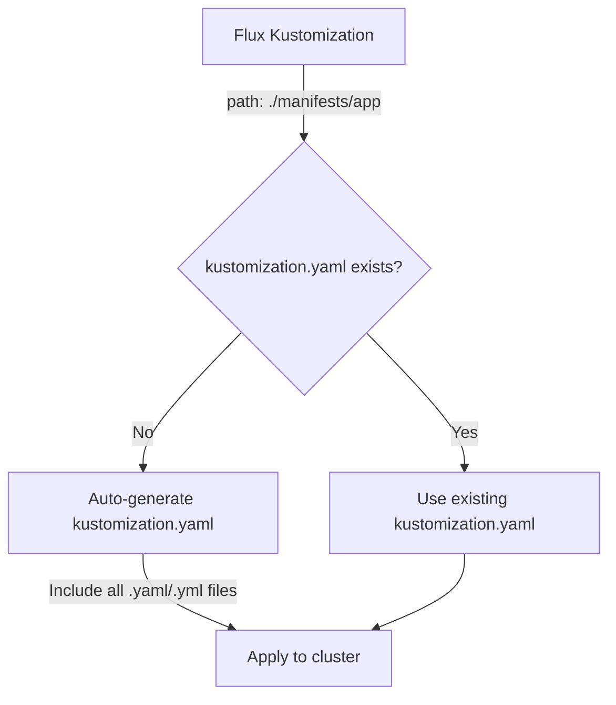

# How to Deploy Plain YAML Manifests with Flux Kustomization

Author: [nawazdhandala](https://github.com/nawazdhandala)

Tags: Flux CD, GitOps, Kubernetes, Kustomize, YAML, Plain Manifests

Description: Learn how Flux CD automatically generates a kustomization.yaml for directories containing plain YAML manifests, enabling GitOps without writing any Kustomize configuration.

---

## Introduction

One of the most convenient features of Flux CD is its ability to deploy plain Kubernetes YAML manifests without requiring you to write a `kustomization.yaml` file. When Flux's kustomize-controller encounters a directory that does not contain a `kustomization.yaml`, it automatically generates one that includes all YAML files in the directory.

This makes Flux an excellent choice for teams that want to start with GitOps without learning Kustomize first. You can simply put your Kubernetes manifests in a directory, point a Flux Kustomization at it, and Flux handles the rest.

## How Auto-Generation Works

When Flux reconciles a Kustomization resource and the specified `path` does not contain a `kustomization.yaml` (or `Kustomization` file), the kustomize-controller automatically generates one at runtime. The generated `kustomization.yaml` includes all files with `.yaml` and `.yml` extensions found in that directory.

This behavior is equivalent to Flux running the following internally:

```bash
# Flux essentially does this behind the scenes
cd /path/to/your/manifests
kustomize create --autodetect
kustomize build .
```

The `kustomize create --autodetect` command generates a `kustomization.yaml` that lists all YAML files in the current directory as resources.

## Repository Structure

Here is a minimal repository structure for deploying plain YAML manifests.

```text
manifests/
  app/
    namespace.yaml
    deployment.yaml
    service.yaml
    configmap.yaml
    ingress.yaml
clusters/
  my-cluster/
    app.yaml              # Flux Kustomization pointing to manifests/app/
```

Note the absence of any `kustomization.yaml` in the `manifests/app/` directory.

## Step 1: Create Plain YAML Manifests

Write standard Kubernetes manifests without any Kustomize configuration.

```yaml
# manifests/app/namespace.yaml
apiVersion: v1
kind: Namespace
metadata:
  name: demo-app
```

```yaml
# manifests/app/deployment.yaml
apiVersion: apps/v1
kind: Deployment
metadata:
  name: demo-app
  namespace: demo-app
spec:
  replicas: 2
  selector:
    matchLabels:
      app: demo-app
  template:
    metadata:
      labels:
        app: demo-app
    spec:
      containers:
        - name: demo-app
          image: nginx:1.25
          ports:
            - containerPort: 80
          resources:
            requests:
              cpu: 100m
              memory: 128Mi
            limits:
              cpu: 250m
              memory: 256Mi
```

```yaml
# manifests/app/service.yaml
apiVersion: v1
kind: Service
metadata:
  name: demo-app
  namespace: demo-app
spec:
  selector:
    app: demo-app
  ports:
    - port: 80
      targetPort: 80
      protocol: TCP
```

```yaml
# manifests/app/configmap.yaml
apiVersion: v1
kind: ConfigMap
metadata:
  name: demo-app-config
  namespace: demo-app
data:
  APP_ENV: "production"
  LOG_LEVEL: "info"
  MAX_CONNECTIONS: "100"
```

```yaml
# manifests/app/ingress.yaml
apiVersion: networking.k8s.io/v1
kind: Ingress
metadata:
  name: demo-app
  namespace: demo-app
  annotations:
    nginx.ingress.kubernetes.io/rewrite-target: /
spec:
  rules:
    - host: demo.example.com
      http:
        paths:
          - path: /
            pathType: Prefix
            backend:
              service:
                name: demo-app
                port:
                  number: 80
```

## Step 2: Create the Flux Kustomization

Create a Flux Kustomization resource that points to the directory containing the plain YAML files.

```yaml
# clusters/my-cluster/app.yaml
apiVersion: kustomize.toolkit.fluxcd.io/v1
kind: Kustomization
metadata:
  name: demo-app
  namespace: flux-system
spec:
  interval: 10m
  # Point to the directory with plain YAML files
  # Flux will auto-generate a kustomization.yaml
  path: ./manifests/app
  prune: true
  sourceRef:
    kind: GitRepository
    name: flux-system
```

That is all you need. Flux will discover all YAML files in the `manifests/app/` directory and apply them.

## Step 3: Apply and Verify

```bash
# Push the manifests to your Git repository, then reconcile
flux reconcile kustomization demo-app --with-source

# Check the status
flux get kustomizations demo-app

# Verify the resources were created
kubectl get all -n demo-app
kubectl get ingress -n demo-app
kubectl get configmap -n demo-app
```

## Using Flux Kustomization Features with Plain YAML

Even without a `kustomization.yaml` file, you can still use several Flux Kustomization features.

### Target Namespace Override

Force all resources into a specific namespace, regardless of what is defined in the manifests.

```yaml
apiVersion: kustomize.toolkit.fluxcd.io/v1
kind: Kustomization
metadata:
  name: demo-app
  namespace: flux-system
spec:
  interval: 10m
  path: ./manifests/app
  prune: true
  sourceRef:
    kind: GitRepository
    name: flux-system
  # Override the namespace for all resources
  targetNamespace: my-custom-namespace
```

### Patches via Flux Kustomization

Apply patches directly in the Flux Kustomization spec without needing a `kustomization.yaml`.

```yaml
apiVersion: kustomize.toolkit.fluxcd.io/v1
kind: Kustomization
metadata:
  name: demo-app
  namespace: flux-system
spec:
  interval: 10m
  path: ./manifests/app
  prune: true
  sourceRef:
    kind: GitRepository
    name: flux-system
  # Apply patches at the Flux level
  patches:
    - patch: |
        apiVersion: apps/v1
        kind: Deployment
        metadata:
          name: demo-app
        spec:
          replicas: 5
      target:
        kind: Deployment
        name: demo-app
```

### Post-Build Variable Substitution

Use variable substitution to inject values into your plain YAML manifests.

First, add variable placeholders to your manifests.

```yaml
# manifests/app/deployment.yaml (with variable placeholders)
apiVersion: apps/v1
kind: Deployment
metadata:
  name: demo-app
  namespace: demo-app
spec:
  replicas: ${REPLICAS}
  selector:
    matchLabels:
      app: demo-app
  template:
    metadata:
      labels:
        app: demo-app
    spec:
      containers:
        - name: demo-app
          image: nginx:${NGINX_VERSION}
          ports:
            - containerPort: 80
```

Then configure substitution in the Flux Kustomization.

```yaml
apiVersion: kustomize.toolkit.fluxcd.io/v1
kind: Kustomization
metadata:
  name: demo-app
  namespace: flux-system
spec:
  interval: 10m
  path: ./manifests/app
  prune: true
  sourceRef:
    kind: GitRepository
    name: flux-system
  # Substitute variables into the manifests
  postBuild:
    substitute:
      REPLICAS: "3"
      NGINX_VERSION: "1.25.3"
```

## When to Add a kustomization.yaml

While Flux's auto-generation is convenient, there are situations where you should create an explicit `kustomization.yaml`:

1. **Ordering matters.** The auto-generated file includes resources in alphabetical order. If you need a specific application order (for example, namespace before deployment), write a `kustomization.yaml` with resources listed in the correct order.

2. **You need Kustomize transformers.** Features like `commonLabels`, `commonAnnotations`, `namePrefix`, `images`, and `replicas` require a `kustomization.yaml`.

3. **You want to exclude files.** If the directory contains YAML files that should not be applied (such as example files or documentation), the auto-generated `kustomization.yaml` will include them. An explicit `kustomization.yaml` lets you list only the files you want.

4. **You use subdirectories.** Auto-generation only includes files in the specified directory, not subdirectories. If you organize manifests into subdirectories, you need a `kustomization.yaml` to reference them.

## Migrating from Plain YAML to Kustomize

When you outgrow plain YAML, the migration path is straightforward.

```bash
# Step 1: Generate a kustomization.yaml from existing files
cd manifests/app
kustomize create --autodetect

# Step 2: The generated file will look like this
cat kustomization.yaml
```

The generated file will contain:

```yaml
apiVersion: kustomize.config.k8s.io/v1beta1
kind: Kustomization
resources:
  - configmap.yaml
  - deployment.yaml
  - ingress.yaml
  - namespace.yaml
  - service.yaml
```

From here, you can add any Kustomize features you need. The Flux Kustomization resource does not need to change -- it will detect the explicit `kustomization.yaml` and use it instead of auto-generating one.

## File Discovery Details

Here is exactly what Flux includes when auto-generating a `kustomization.yaml`:

- Files ending in `.yaml` or `.yml` in the specified directory
- Only files in the top-level directory (not subdirectories)
- All matching files are included -- there is no exclusion mechanism



## Conclusion

Flux's ability to deploy plain YAML manifests without a `kustomization.yaml` lowers the barrier to entry for GitOps adoption. Teams can start by simply committing Kubernetes manifests to a Git repository and pointing Flux at the directory. As needs grow, adding a `kustomization.yaml` is a seamless transition that requires no changes to the Flux Kustomization resource. This makes Flux a practical choice for both simple deployments and complex multi-environment setups.
