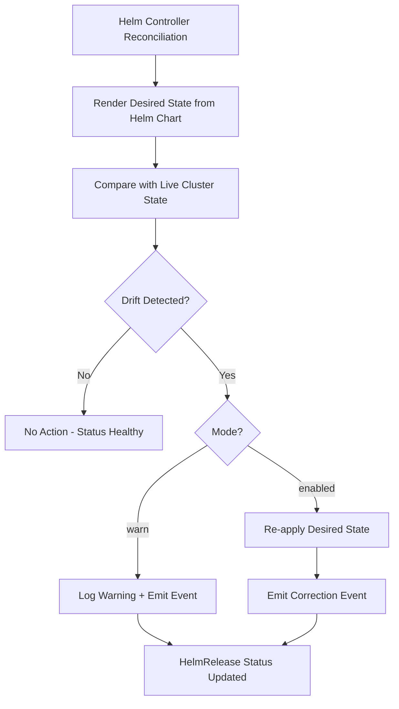

# How to Detect Helm Drift with Flux CD

Author: [nawazdhandala](https://github.com/nawazdhandala)

Tags: Flux CD, GitOps, Kubernetes, Helm, Drift Detection, Monitoring

Description: Learn how to enable and configure Helm drift detection in Flux CD to automatically identify and correct out-of-band changes to Helm releases.

---

## What Is Helm Drift?

Helm drift occurs when the actual state of resources managed by a Helm release diverges from the desired state defined in the Helm chart values. This typically happens when someone manually edits a resource using `kubectl edit`, `kubectl patch`, or applies a manifest directly, bypassing the GitOps workflow.

Drift is a serious problem because it means your cluster state no longer matches what is defined in Git. This undermines the core promise of GitOps: that Git is the single source of truth.

## How Flux CD Detects Helm Drift

Flux CD introduced `spec.driftDetection` in the HelmRelease API (v2beta2 and later). When enabled, the helm-controller periodically compares the live state of Kubernetes resources owned by a Helm release against the desired state from the last successful Helm release. If differences are found, Flux reports the drift and can optionally correct it.

## Prerequisites

- A Kubernetes cluster (v1.20+)
- Flux CD v2.1+ installed (drift detection requires helm-controller v0.36+)
- `flux` CLI installed
- A working HelmRelease managed by Flux

## Enabling Drift Detection

Drift detection is configured per HelmRelease using the `spec.driftDetection` field. Here is a complete example:

```yaml
# HelmRelease with drift detection enabled
apiVersion: helm.toolkit.fluxcd.io/v2
kind: HelmRelease
metadata:
  name: my-app
  namespace: flux-system
spec:
  interval: 10m
  chart:
    spec:
      chart: my-app
      version: "1.2.3"
      sourceRef:
        kind: HelmRepository
        name: my-repo
  values:
    replicaCount: 3
    image:
      repository: my-app
      tag: "v1.0.0"
  # Enable drift detection
  driftDetection:
    # "enabled" mode detects drift and reports it
    # "warn" mode only logs warnings without correcting
    mode: enabled
```

The `mode` field accepts two values:

- **`enabled`**: Detects drift and corrects it by re-applying the desired state.
- **`warn`**: Detects drift and logs a warning, but does not correct it.

## Drift Detection Modes in Detail

### Warn Mode

Use `warn` mode to monitor for drift without automatically correcting it. This is useful during an initial rollout to understand what kind of manual changes are being made:

```yaml
# HelmRelease with drift detection in warn mode
apiVersion: helm.toolkit.fluxcd.io/v2
kind: HelmRelease
metadata:
  name: monitoring-stack
  namespace: flux-system
spec:
  interval: 15m
  chart:
    spec:
      chart: kube-prometheus-stack
      version: "55.0.0"
      sourceRef:
        kind: HelmRepository
        name: prometheus-community
  driftDetection:
    # Warn mode: detect and report drift without correcting it
    mode: warn
```

When drift is detected in warn mode, the HelmRelease status will include a condition showing the drifted resources, and the helm-controller will emit events.

### Enabled Mode

Use `enabled` mode to both detect and automatically correct drift:

```yaml
# HelmRelease with drift detection that auto-corrects
apiVersion: helm.toolkit.fluxcd.io/v2
kind: HelmRelease
metadata:
  name: critical-app
  namespace: flux-system
spec:
  interval: 10m
  chart:
    spec:
      chart: critical-app
      version: "2.1.0"
      sourceRef:
        kind: HelmRepository
        name: my-repo
  driftDetection:
    # Enabled mode: detect drift and correct it automatically
    mode: enabled
```

## Ignoring Specific Fields

Some resources are legitimately modified by controllers or operators (e.g., HPA modifying replica counts, cert-manager updating TLS secrets). You can exclude specific fields from drift detection using `ignore` rules:

```yaml
# HelmRelease with drift detection ignoring specific fields
apiVersion: helm.toolkit.fluxcd.io/v2
kind: HelmRelease
metadata:
  name: my-app
  namespace: flux-system
spec:
  interval: 10m
  chart:
    spec:
      chart: my-app
      version: "1.2.3"
      sourceRef:
        kind: HelmRepository
        name: my-repo
  driftDetection:
    mode: enabled
    ignore:
      # Ignore replica count changes (managed by HPA)
      - paths: ["/spec/replicas"]
        target:
          kind: Deployment
      # Ignore annotation changes on services (managed by cloud provider)
      - paths: ["/metadata/annotations"]
        target:
          kind: Service
          name: my-app-lb
      # Ignore data changes in a specific ConfigMap (updated by external process)
      - paths: ["/data"]
        target:
          kind: ConfigMap
          name: dynamic-config
```

Each ignore rule specifies:
- **`paths`**: JSON pointer paths to ignore (RFC 6901 format).
- **`target`**: Optional selector to limit the rule to specific resource types or names.

## Monitoring Drift Detection

### Check HelmRelease Status

View drift detection status using the flux CLI:

```bash
# Check HelmRelease status including drift information
flux get helmreleases --all-namespaces

# Get detailed status for a specific HelmRelease
kubectl describe helmrelease my-app -n flux-system
```

### View Drift Events

Flux emits Kubernetes events when drift is detected:

```bash
# View events related to drift detection
kubectl events -n flux-system --for helmrelease/my-app

# Filter helm-controller logs for drift-related messages
kubectl logs -n flux-system deployment/helm-controller | grep -i "drift"
```

### Set Up Alerts for Drift Detection

Configure Flux alerts to send notifications when drift is detected:

```yaml
# Alert provider for sending drift notifications to Slack
apiVersion: notification.toolkit.fluxcd.io/v1beta3
kind: Provider
metadata:
  name: slack
  namespace: flux-system
spec:
  type: slack
  channel: gitops-alerts
  secretRef:
    name: slack-webhook-url
---
# Alert that triggers on drift detection events
apiVersion: notification.toolkit.fluxcd.io/v1beta3
kind: Alert
metadata:
  name: helm-drift-alert
  namespace: flux-system
spec:
  providerRef:
    name: slack
  eventSeverity: info
  eventSources:
    - kind: HelmRelease
      name: "*"
      namespace: flux-system
  # Match events that include drift-related information
  eventMetadata:
    summary: "*drift*"
```

## Simulating Drift for Testing

To test your drift detection setup, manually modify a resource managed by a HelmRelease:

```bash
# Manually scale a deployment to simulate drift
kubectl scale deployment my-app --replicas=1 -n default

# Watch for drift detection (check HelmRelease status)
kubectl get helmrelease my-app -n flux-system -w

# Check events for drift correction
kubectl events -n flux-system --for helmrelease/my-app --watch
```

If drift detection is in `enabled` mode, Flux will detect the change and restore the replica count to the value specified in the Helm values.

## Drift Detection Flow



## Performance Considerations

Drift detection adds overhead because the helm-controller must compare live resources against desired state during each reconciliation. Consider these guidelines:

- **Increase the interval** for HelmReleases with many resources to reduce API server load.
- **Use ignore rules** to skip frequently-changing fields and reduce false positives.
- **Start with warn mode** to assess the volume of drift before enabling auto-correction.
- **Monitor helm-controller resource usage** after enabling drift detection across many releases.

```bash
# Check helm-controller resource consumption
kubectl top pod -n flux-system -l app=helm-controller
```

## Summary

Flux CD's `spec.driftDetection` in HelmRelease provides a built-in mechanism to detect and correct out-of-band changes to Helm-managed resources. Use `warn` mode to observe drift patterns without disruption, then switch to `enabled` mode for automatic correction. Combine drift detection with ignore rules for fields managed by other controllers (like HPA), and set up alerts to notify your team when drift occurs. This ensures your cluster state stays consistent with your Git-defined desired state.
