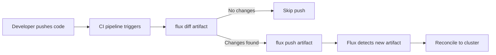

# How to Diff OCI Artifacts with Flux CLI

Author: [nawazdhandala](https://github.com/nawazdhandala)

Tags: Flux CD, GitOps, Kubernetes, OCI, Artifact, CLI

Description: Learn how to use the Flux CLI to diff OCI artifacts and compare changes between artifact versions before deploying to your Kubernetes cluster.

---

## Introduction

When managing Kubernetes deployments through OCI artifacts in Flux CD, understanding whether content changed between artifact versions is critical. The `flux diff artifact` command lets you compare the contents of an OCI artifact against local files, giving you visibility into whether the local content matches the published artifact before you apply updates. This is especially useful in CI/CD pipelines, code reviews, and pre-deployment validations.

In this guide, you will learn how to use `flux diff artifact` effectively, integrate it into your workflow, and automate artifact comparisons in CI/CD pipelines.

## Prerequisites

Before you begin, make sure you have the following:

- Flux CLI v2.0.0 or later installed
- Access to an OCI-compatible container registry (e.g., GitHub Container Registry, Docker Hub, AWS ECR)
- An existing OCI artifact pushed to your registry

Verify your Flux CLI version supports OCI artifact diffing.

```bash
# Check Flux CLI version

flux version --client
```

## Understanding flux diff artifact

The `flux diff artifact` command compares the contents of a remote OCI artifact against a local directory or path. It builds the local path using the same artifact packaging logic and checks whether it matches the remote artifact content. This command does not apply any changes to your cluster -- it is purely informational.

## Basic Diff Against Local Files

The most common use case is comparing a remote OCI artifact against your local source directory. This tells you what has changed since the artifact was last pushed.

```bash
# Diff a remote OCI artifact against a local directory
flux diff artifact oci://ghcr.io/my-org/my-app-manifests:latest \
  --path ./manifests
```

The `--path` flag specifies the local directory to compare against. The command exits successfully when the remote artifact and your local files match, and returns an error when the contents differ.

## Diffing Specific Tags and Versions

You can compare your local files against artifacts at specific tags or digests to check whether they differ from a known version.

```bash
# Diff against a specific tagged version
flux diff artifact oci://ghcr.io/my-org/my-app-manifests:v1.2.0 \
  --path ./manifests

# Diff against a specific digest for immutable references
flux diff artifact oci://ghcr.io/my-org/my-app-manifests@sha256:0000000000000000000000000000000000000000000000000000000000000000 \
  --path ./manifests
```

## Using Diff with Registry Authentication

If your registry requires authentication, you can provide credentials directly to the diff command.

```bash
# Diff with explicit credentials
flux diff artifact oci://ghcr.io/my-org/my-app-manifests:latest \
  --path ./manifests \
  --creds flux:${GITHUB_TOKEN}

# Diff using a specific provider for cloud registries
flux diff artifact oci://123456789.dkr.ecr.us-east-1.amazonaws.com/my-app:latest \
  --path ./manifests \
  --provider aws
```

## Interpreting the Diff Output

The command reports whether the local content matches the remote artifact. It does not print a file-by-file unified diff. Here is an example of the command output when the content differs:

```bash
# Example output from flux diff artifact
# ✗ the remote artifact contents differs from the local one
```

## Integrating Diff into CI/CD Pipelines

One of the most powerful applications of `flux diff artifact` is as a validation step in your CI/CD pipeline. You can use it to report whether pull request changes differ from the last published artifact.

The following GitHub Actions workflow compares the current manifests against the last pushed artifact and posts the result as a PR comment.

```yaml
# .github/workflows/flux-diff.yaml
name: Flux Artifact Diff
on:
  pull_request:
    paths:
      - 'manifests/**'

jobs:
  diff:
    runs-on: ubuntu-latest
    permissions:
      contents: read
      packages: read
      issues: write
    steps:
      - name: Checkout
        uses: actions/checkout@v4

      - name: Setup Flux CLI
        uses: fluxcd/flux2/action@main

      - name: Login to GHCR
        run: |
          echo "${{ secrets.GITHUB_TOKEN }}" | docker login ghcr.io --username flux --password-stdin

      - name: Diff artifact
        id: diff
        run: |
          # Capture the comparison result
          DIFF_OUTPUT=$(flux diff artifact \
            oci://ghcr.io/${{ github.repository }}/manifests:latest \
            --path ./manifests 2>&1) || true
          echo "diff<<EOF" >> $GITHUB_OUTPUT
          echo "${DIFF_OUTPUT}" >> $GITHUB_OUTPUT
          echo "EOF" >> $GITHUB_OUTPUT

      - name: Post comparison result as PR comment
        if: steps.diff.outputs.diff != ''
        uses: actions/github-script@v7
        env:
          DIFF_OUTPUT: ${{ steps.diff.outputs.diff }}
        with:
          script: |
            const diff = process.env.DIFF_OUTPUT || '';
            github.rest.issues.createComment({
              issue_number: context.issue.number,
              owner: context.repo.owner,
              repo: context.repo.repo,
              body: '### Flux Artifact Comparison\n```\n' + diff + '\n```'
            })
```

## Using Diff as a Gating Mechanism

You can use the exit code of `flux diff artifact` to gate deployments. The command exits with code 0 when the local content matches the remote artifact and a non-zero code when the contents differ or the command fails.

```bash
# Use diff as a gate -- only push if there are changes
if ! flux diff artifact oci://ghcr.io/my-org/my-app-manifests:latest \
  --path ./manifests > /dev/null 2>&1; then
  echo "Changes detected, pushing new artifact..."
  flux push artifact oci://ghcr.io/my-org/my-app-manifests:latest \
    --path ./manifests \
    --source="$(git config --get remote.origin.url)" \
    --revision="$(git branch --show-current)@sha1:$(git rev-parse HEAD)"
else
  echo "No changes detected, skipping push."
fi
```

## Workflow Diagram

The following diagram shows how `flux diff artifact` fits into a typical CI/CD workflow.


```mermaid
flowchart LR
    A[Developer pushes code] --> B[CI pipeline triggers]
    B --> C[flux diff artifact]
    C -->|No changes| D[Skip push]
    C -->|Changes found| E[flux push artifact]
    E --> F[Flux detects new artifact]
    F --> G[Reconcile to cluster]
```

## Best Practices

1. **Always diff before pushing.** Run `flux diff artifact` before `flux push artifact` to avoid pushing identical artifacts and triggering unnecessary reconciliations.

2. **Use digests for immutable comparisons.** Tags can be overwritten. When you need to compare against a specific known version, use the artifact digest instead.

3. **Automate artifact comparisons in pull requests.** Adding the comparison result to PR comments helps reviewers see whether the proposed manifests differ from the latest published artifact.

4. **Use exit codes in scripts.** The exit code is useful for scripting conditional logic around whether artifact contents differ, but handle command errors separately in production scripts if registry access can fail.

5. **Scope your diffs carefully.** Always point `--path` at the specific directory that corresponds to the artifact contents to avoid misleading results.

## Conclusion

The `flux diff artifact` command is a valuable tool for checking OCI artifact changes within your Flux CD workflow. By integrating it into your CI/CD pipelines and using it as a gating mechanism before pushes, you can prevent unnecessary reconciliations, improve code review quality, and maintain confidence in what gets deployed to your clusters. Combined with `flux push artifact` and `flux pull artifact`, it forms a complete toolkit for managing OCI-based GitOps workflows.
