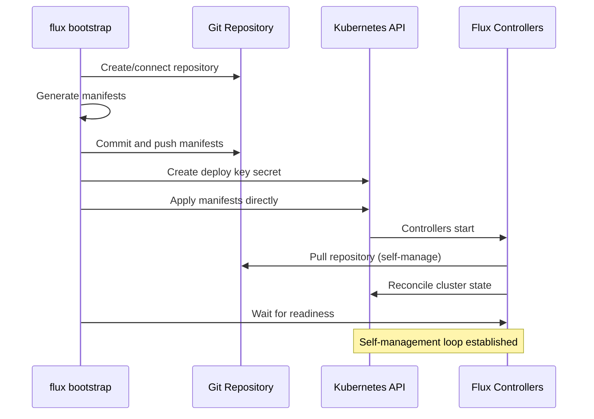

# How to Understand the Flux CD Bootstrap Process Internals

Author: [nawazdhandala](https://github.com/nawazdhandala)

Tags: Flux CD, GitOps, Kubernetes, Bootstrap, Installation, Architecture

Description: A deep dive into what happens internally when you run flux bootstrap, covering each step from repository setup to controller deployment and self-management.

---

The `flux bootstrap` command is the entry point for most Flux CD installations. It performs a remarkable amount of work in a single command: it creates or connects to a Git repository, generates Flux component manifests, commits them to the repository, installs the controllers on the cluster, and configures Flux to manage itself from that repository. Understanding what happens at each step helps you troubleshoot installation issues and customize the bootstrap process.

## The Bootstrap Command

A typical bootstrap command for GitHub looks like this.

```bash
# Bootstrap Flux CD with a GitHub repository
flux bootstrap github \
  --owner=myorg \
  --repository=fleet-infra \
  --path=clusters/production \
  --personal \
  --branch=main
```

This single command triggers a multi-step process that establishes the entire GitOps foundation for your cluster.

## Step-by-Step Internals

### Step 1: Repository Connection

The first thing bootstrap does is connect to the Git provider. For GitHub, it uses the `GITHUB_TOKEN` environment variable. It checks whether the specified repository exists. If not, it creates it. If the repository already exists, bootstrap reuses it.

The `--path` flag determines where in the repository Flux will store the cluster's configuration. This allows multiple clusters to share a single repository by using different paths like `clusters/staging` and `clusters/production`.

### Step 2: Manifest Generation

Bootstrap generates the Kubernetes manifests for the Flux controllers. These are the same manifests you would get from running `flux install --export`. The generated manifests include:

- Namespace (`flux-system`)
- Custom Resource Definitions (CRDs) for all Flux types
- Service accounts and RBAC roles
- Deployments for each controller (source-controller, kustomize-controller, helm-controller, notification-controller)
- Network policies

The manifests are written to a `flux-system` directory inside the specified path.

```text
clusters/production/
  flux-system/
    gotk-components.yaml    # All controller manifests
    gotk-sync.yaml          # Self-management resources
    kustomization.yaml      # Kustomize overlay for the above
```

### Step 3: Self-Management Resources

This is where bootstrap gets interesting. It creates two resources in `gotk-sync.yaml` that make Flux manage itself.

```yaml
# GitRepository that points Flux at its own configuration repository
apiVersion: source.toolkit.fluxcd.io/v1
kind: GitRepository
metadata:
  name: flux-system
  namespace: flux-system
spec:
  interval: 1m
  url: ssh://git@github.com/myorg/fleet-infra
  ref:
    branch: main
  secretRef:
    name: flux-system
---
# Kustomization that applies everything under the cluster path
apiVersion: kustomize.toolkit.fluxcd.io/v1
kind: Kustomization
metadata:
  name: flux-system
  namespace: flux-system
spec:
  interval: 10m
  path: ./clusters/production
  prune: true
  sourceRef:
    kind: GitRepository
    name: flux-system
```

The GitRepository resource points at the same repository that was just configured. The Kustomization resource watches the cluster path and applies everything it finds there. This creates a self-management loop: Flux applies the manifests that define Flux itself.

### Step 4: Git Commit and Push

Bootstrap commits the generated manifests to the repository and pushes them. The commit message typically reads "Add Flux sync manifests."

### Step 5: Deploy Key or Token Setup

For Flux to pull from the repository at runtime, it needs credentials. Bootstrap creates a Kubernetes secret containing either a deploy key (SSH) or a token (HTTPS).

For SSH-based authentication, bootstrap generates an SSH key pair, registers the public key as a deploy key on the repository, and stores the private key in a Kubernetes secret named `flux-system` in the `flux-system` namespace.

```bash
# You can inspect the deploy key secret (keys are base64 encoded)
kubectl get secret flux-system -n flux-system -o yaml
```

### Step 6: Apply to Cluster

Bootstrap applies the generated manifests directly to the cluster using the Kubernetes API. This is a one-time direct application. After this point, Flux manages itself through the GitOps loop.

### Step 7: Wait for Readiness

Bootstrap waits for all Flux controllers to become ready. It checks that each deployment has its desired number of replicas running and that the pods are healthy.



## The Self-Management Loop

After bootstrap completes, the self-management loop is active. This means:

1. The `flux-system` GitRepository source polls the Git repository every minute.
2. The `flux-system` Kustomization reconciles every 10 minutes, applying everything under the cluster path.
3. If you add new manifests to the cluster path in Git, Flux picks them up and applies them.
4. If you modify the Flux component manifests in Git (for example, to upgrade Flux), the controllers update themselves.

This is why `flux bootstrap` is idempotent. Running it again on an existing installation updates the manifests in Git and lets the self-management loop apply the changes.

## Customizing the Bootstrap

### Adding Components

You can include additional components during bootstrap.

```bash
# Bootstrap with image automation controllers included
flux bootstrap github \
  --owner=myorg \
  --repository=fleet-infra \
  --path=clusters/production \
  --components-extra=image-reflector-controller,image-automation-controller
```

### Customizing with Patches

The `kustomization.yaml` file generated by bootstrap can be extended with patches. For example, to increase resource limits on the source controller.

```yaml
# clusters/production/flux-system/kustomization.yaml
apiVersion: kustomize.config.k8s.io/v1beta1
kind: Kustomization
resources:
  - gotk-components.yaml
  - gotk-sync.yaml
patches:
  # Increase memory limit for source-controller
  - target:
      kind: Deployment
      name: source-controller
    patch: |
      - op: replace
        path: /spec/template/spec/containers/0/resources/limits/memory
        value: 1Gi
```

After committing this change, Flux's self-management loop applies the patch to its own deployment.

## Re-running Bootstrap for Upgrades

Upgrading Flux is done by re-running the bootstrap command with a newer version of the Flux CLI.

```bash
# Upgrade Flux by re-running bootstrap with a newer CLI version
flux bootstrap github \
  --owner=myorg \
  --repository=fleet-infra \
  --path=clusters/production
```

The newer CLI generates updated manifests (with newer controller images), commits them to Git, and the self-management loop rolls out the update. This is why you should always use `flux bootstrap` for upgrades rather than `flux install`, which would bypass Git.

## Troubleshooting Bootstrap Failures

Common issues and how to diagnose them.

```bash
# Check if all Flux controllers are running
flux check

# Inspect the source controller logs for Git connectivity issues
kubectl logs -n flux-system deploy/source-controller

# Verify the deploy key secret exists
kubectl get secret flux-system -n flux-system

# Check the GitRepository source status
flux get sources git
```

If bootstrap fails midway, it is safe to re-run. The command is designed to be idempotent. It will skip steps that have already completed and retry steps that failed.

## Conclusion

The `flux bootstrap` command orchestrates repository creation, manifest generation, credential setup, cluster installation, and self-management configuration in a single operation. The key insight is the self-management loop: after bootstrap, Flux watches the same repository that contains its own manifests, creating a closed GitOps loop. Understanding these internals helps you customize the installation, troubleshoot failures, and perform upgrades with confidence.
