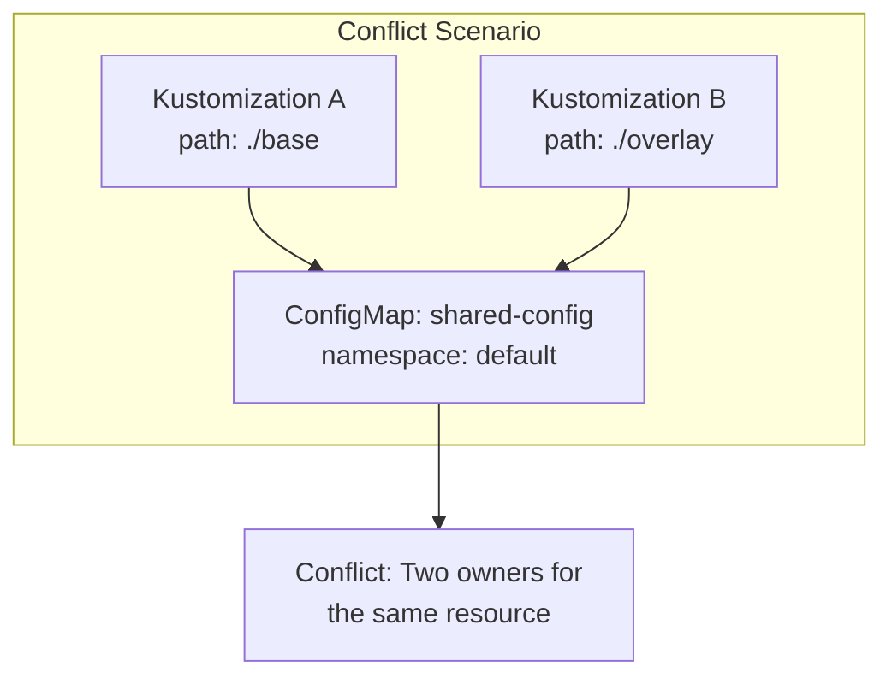
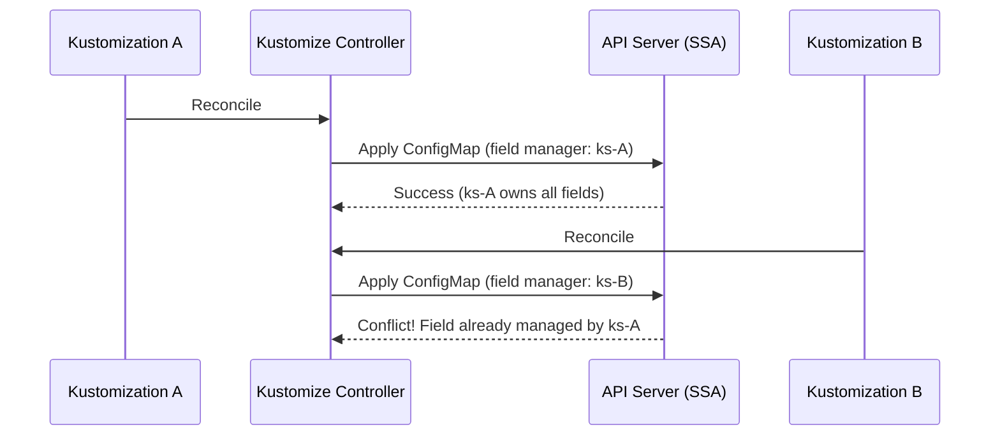

# How Flux CD Handles Conflicting Resources Across Kustomizations

Author: [nawazdhandala](https://github.com/nawazdhandala)

Tags: Flux CD, GitOps, Kubernetes, Resource Conflicts, Kustomization, Ownership

Description: Learn how Flux CD detects and handles resource conflicts when multiple Kustomizations attempt to manage the same Kubernetes resource.

---

In complex Kubernetes environments, it is possible for multiple Kustomizations to manage resources with overlapping scopes. When two or more Kustomizations try to apply the same resource, a conflict occurs. Flux CD has built-in mechanisms for detecting and handling these conflicts. In this post, we will examine how conflicts arise, how Flux resolves them, and how to design your GitOps structure to avoid them.

## How Conflicts Arise

Resource conflicts occur when two or more Kustomizations include manifests that define the same Kubernetes resource (same kind, name, namespace, and API group). This can happen due to:

- Overlapping directory paths in different Kustomizations
- Shared base configurations referenced by multiple Kustomizations
- Resources accidentally duplicated across Git directories
- Migration from one Kustomization structure to another



## Flux CD's Server-Side Apply and Ownership

Flux CD uses Kubernetes server-side apply (SSA) to manage resources. With SSA, each field in a resource has a field manager that tracks ownership. When a Kustomization applies a resource, the kustomize-controller becomes the field manager for the fields it sets.

When two Kustomizations try to manage the same fields on the same resource, a conflict is detected by the Kubernetes API server.



## The spec.force Field

When a conflict is detected, Flux's default behavior is to fail the reconciliation. However, you can configure the Kustomization to force the apply, taking ownership of conflicting fields.

```yaml
# Kustomization that forces ownership of conflicting fields
apiVersion: kustomize.toolkit.fluxcd.io/v1
kind: Kustomization
metadata:
  name: override-app
  namespace: flux-system
spec:
  interval: 10m
  path: ./deploy
  prune: true
  sourceRef:
    kind: GitRepository
    name: my-repo
  # Force will take over field ownership from other managers
  force: true
```

When `spec.force` is set to `true`, the Kustomization will take ownership of all conflicting fields, overriding whatever the other field manager had set. This should be used with caution, as it means the last Kustomization to reconcile wins.

## Conflict Error Messages

When a conflict occurs without `spec.force: true`, Flux reports the error in the Kustomization status:

```yaml
# Status showing a field ownership conflict
status:
  conditions:
    - type: Ready
      status: "False"
      reason: ReconciliationFailed
      message: "Apply failed: conflict with \"ks-team-a-app\"
        using apps/v1: .spec.replicas is already managed"
```

You can also check the Flux logs for conflict details:

```bash
# Check controller logs for conflict errors
flux logs --kind=Kustomization --name=my-app --level=error

# Get detailed status of the conflicting Kustomization
kubectl get kustomization my-app -n flux-system -o yaml
```

## Common Conflict Scenarios

### Scenario 1: Overlapping Paths

Two Kustomizations pointing to directories with shared files:

```yaml
# Kustomization A - manages base and app-specific resources
apiVersion: kustomize.toolkit.fluxcd.io/v1
kind: Kustomization
metadata:
  name: infra-base
  namespace: flux-system
spec:
  interval: 10m
  path: ./infrastructure/base  # Contains namespace.yaml
  prune: true
  sourceRef:
    kind: GitRepository
    name: my-repo
---
# Kustomization B - also includes the same namespace resource
apiVersion: kustomize.toolkit.fluxcd.io/v1
kind: Kustomization
metadata:
  name: infra-monitoring
  namespace: flux-system
spec:
  interval: 10m
  path: ./infrastructure/monitoring  # Also contains namespace.yaml
  prune: true
  sourceRef:
    kind: GitRepository
    name: my-repo
```

### Scenario 2: Shared Kustomize Bases

When multiple Kustomize overlays reference the same base:

```bash
# Directory structure causing conflicts
infrastructure/
  base/
    namespace.yaml     # Namespace: monitoring
    service-account.yaml
  prometheus/
    kustomization.yaml # References ../base
    prometheus.yaml
  grafana/
    kustomization.yaml # References ../base
    grafana.yaml
```

If `infrastructure/prometheus/` and `infrastructure/grafana/` are managed by different Flux Kustomizations but both include the base, the Namespace and ServiceAccount will conflict.

## Strategies for Avoiding Conflicts

### Strategy 1: Non-Overlapping Resource Ownership

Design your directory structure so that each resource is managed by exactly one Kustomization:

```yaml
# Clear ownership boundaries
# Kustomization 1: Manages shared infrastructure only
apiVersion: kustomize.toolkit.fluxcd.io/v1
kind: Kustomization
metadata:
  name: shared-infra
  namespace: flux-system
spec:
  interval: 10m
  path: ./infrastructure/shared  # Only shared resources here
  prune: true
  sourceRef:
    kind: GitRepository
    name: my-repo
---
# Kustomization 2: Manages prometheus-specific resources only
apiVersion: kustomize.toolkit.fluxcd.io/v1
kind: Kustomization
metadata:
  name: prometheus
  namespace: flux-system
spec:
  interval: 10m
  path: ./infrastructure/prometheus  # Only prometheus resources here
  prune: true
  sourceRef:
    kind: GitRepository
    name: my-repo
  # Depends on shared infrastructure being ready
  dependsOn:
    - name: shared-infra
```

### Strategy 2: Use dependsOn for Ordering

When resources must be created in a specific order, use `spec.dependsOn` instead of duplicating resources:

```yaml
# Infrastructure Kustomization creates namespaces and CRDs
apiVersion: kustomize.toolkit.fluxcd.io/v1
kind: Kustomization
metadata:
  name: infrastructure
  namespace: flux-system
spec:
  interval: 10m
  path: ./infrastructure
  prune: true
  sourceRef:
    kind: GitRepository
    name: my-repo
---
# Application Kustomization depends on infrastructure
apiVersion: kustomize.toolkit.fluxcd.io/v1
kind: Kustomization
metadata:
  name: applications
  namespace: flux-system
spec:
  interval: 10m
  path: ./applications
  prune: true
  sourceRef:
    kind: GitRepository
    name: my-repo
  dependsOn:
    - name: infrastructure
```

### Strategy 3: Single Kustomization with Multiple Paths

If resources are tightly coupled, manage them with a single Kustomization using a Kustomize overlay:

```yaml
# Single Kustomization managing all monitoring resources
apiVersion: kustomize.toolkit.fluxcd.io/v1
kind: Kustomization
metadata:
  name: monitoring-stack
  namespace: flux-system
spec:
  interval: 10m
  # Point to a kustomization.yaml that includes all monitoring components
  path: ./infrastructure/monitoring
  prune: true
  sourceRef:
    kind: GitRepository
    name: my-repo
```

With the Kustomize overlay file:

```yaml
# infrastructure/monitoring/kustomization.yaml
# Single kustomization.yaml that includes all monitoring components
apiVersion: kustomize.config.k8s.io/v1beta1
kind: Kustomization
resources:
  - ../base          # Shared namespace and RBAC
  - ../prometheus     # Prometheus-specific resources
  - ../grafana        # Grafana-specific resources
```

## Detecting Conflicts Proactively

You can detect potential conflicts before they occur by analyzing your Kustomization inventory entries.

```bash
# Extract all resource IDs from all Kustomization inventories
for ks in $(kubectl get kustomizations -A -o jsonpath='{range .items[*]}{.metadata.namespace}/{.metadata.name}{"\n"}{end}'); do
  ns=$(echo $ks | cut -d/ -f1)
  name=$(echo $ks | cut -d/ -f2)
  echo "=== $ks ==="
  kubectl get kustomization $name -n $ns \
    -o jsonpath='{.status.inventory.entries[*].id}' | tr ' ' '\n'
done | sort | uniq -d
# Duplicate entries indicate conflicts
```

## Resolving Existing Conflicts

If you already have conflicting Kustomizations, follow these steps to resolve them:

1. Identify which Kustomization should own each conflicting resource
2. Remove the resource from the non-owning Kustomization's path in Git
3. Add the `kustomize.toolkit.fluxcd.io/prune: disabled` annotation temporarily to prevent the non-owning Kustomization from deleting the resource
4. Wait for reconciliation to complete
5. Remove the temporary annotation

## Best Practices

1. **Design for single ownership**: Each Kubernetes resource should be managed by exactly one Kustomization. Document the ownership boundaries clearly.

2. **Avoid using spec.force in production**: The `force` flag masks underlying design issues. Fix the root cause instead.

3. **Use Kustomize overlays carefully**: When using shared bases, ensure the Flux Kustomization boundary encompasses the entire overlay, not individual components.

4. **Audit for conflicts regularly**: Periodically check Kustomization inventories for overlapping resource IDs.

5. **Use dependsOn instead of duplication**: If two Kustomizations need the same prerequisite resource, create a third Kustomization for that resource and use `dependsOn`.

## Conclusion

Resource conflicts across Kustomizations are a common challenge in complex Flux CD setups. Understanding how server-side apply field ownership works and designing your GitOps repository structure for clear, non-overlapping resource ownership is the key to avoiding conflicts. When conflicts do occur, Flux provides clear error messages and the `spec.force` option as a last resort. Invest time in your directory and Kustomization structure upfront to prevent conflicts and maintain a healthy GitOps pipeline.
