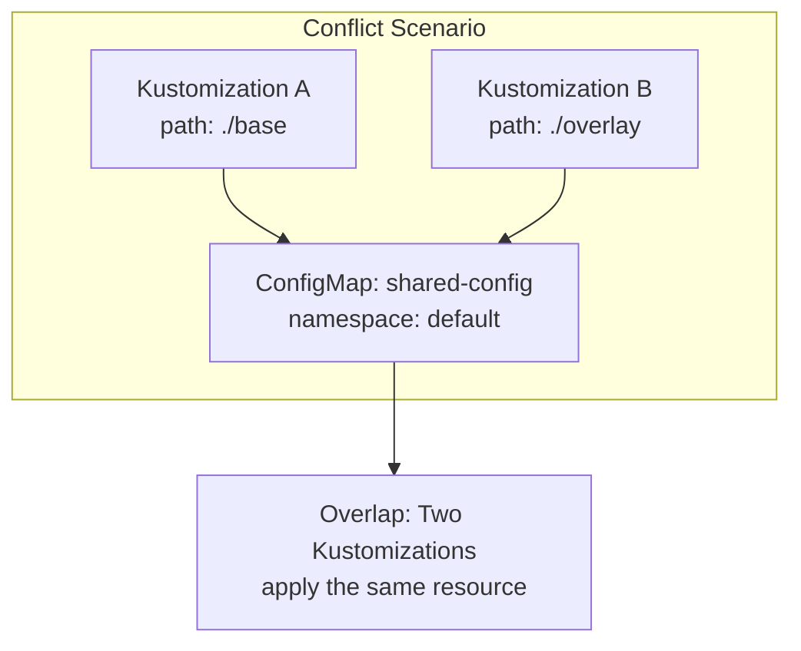
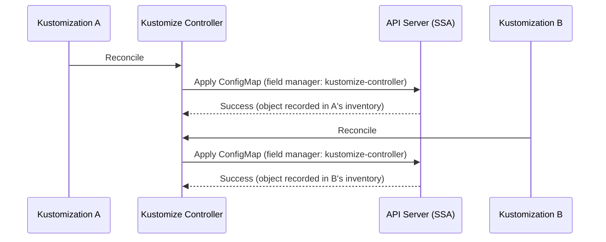

# How Flux CD Handles Conflicting Resources Across Kustomizations

Author: [nawazdhandala](https://github.com/nawazdhandala)

Tags: Flux CD, GitOps, Kubernetes, Resource Conflicts, Kustomization, Ownership

Description: Learn how Flux CD detects and handles resource conflicts when multiple Kustomizations attempt to manage the same Kubernetes resource.

---

In complex Kubernetes environments, it is possible for multiple Kustomizations to manage resources with overlapping scopes. When two or more Kustomizations try to apply the same resource, they can start competing over the same object. Flux CD uses Kubernetes server-side apply and records the resources applied by each Kustomization in its inventory, but it does not treat every duplicate resource across Kustomizations as a separate hard ownership error. In this post, we will examine how overlaps arise, how Flux applies resources, and how to design your GitOps structure to avoid competing reconciliation.

## How Conflicts Arise

Resource overlaps occur when two or more Kustomizations include manifests that define the same Kubernetes resource (same kind, name, namespace, and API group). This can happen due to:

- Overlapping directory paths in different Kustomizations
- Shared base configurations referenced by multiple Kustomizations
- Resources accidentally duplicated across Git directories
- Migration from one Kustomization structure to another


```mermaid
flowchart TD
    subgraph "Conflict Scenario"
        A[Kustomization A<br/>path: ./base] --> C[ConfigMap: shared-config<br/>namespace: default]
        B[Kustomization B<br/>path: ./overlay] --> C
    end
    C --> D[Overlap: Two Kustomizations<br/>apply the same resource]
```

## Flux CD's Server-Side Apply and Ownership

Flux CD uses Kubernetes server-side apply (SSA) to manage resources. With SSA, each field in a resource has a field manager that tracks ownership. When a Kustomization applies a resource, the kustomize-controller applies the fields using its controller field manager.

Kubernetes SSA conflicts happen when an apply operation tries to change a field owned by another field manager and the request is not forced. Flux's kustomize-controller normally applies objects with its controller field manager and uses forced ownership for SSA apply operations, so two Flux Kustomizations applying the same object are not best understood as two independent SSA managers named after each Kustomization. The practical problem is that both Kustomizations reconcile the same object and update the same Flux ownership labels and inventory state.


```mermaid
sequenceDiagram
    participant KA as Kustomization A
    participant KC as Kustomize Controller
    participant API as API Server (SSA)
    participant KB as Kustomization B

    KA->>KC: Reconcile
    KC->>API: Apply ConfigMap (field manager: kustomize-controller)
    API-->>KC: Success (object recorded in A's inventory)

    KB->>KC: Reconcile
    KC->>API: Apply ConfigMap (field manager: kustomize-controller)
    API-->>KC: Success (object recorded in B's inventory)
```

## The spec.force Field

The `spec.force` field is sometimes confused with Kubernetes SSA conflict forcing. In Flux Kustomizations, `spec.force` tells the controller to recreate in-cluster resources when patching fails because of immutable field changes, such as changing a selector that Kubernetes does not allow to be patched in place.

```yaml
# Kustomization that allows replacement for immutable field changes

apiVersion: kustomize.toolkit.fluxcd.io/v1
kind: Kustomization
metadata:
  name: override-app
  namespace: flux-system
spec:
  interval: 10m
  path: ./deploy
  prune: true
  sourceRef:
    kind: GitRepository
    name: my-repo
  # Force will recreate resources if patching fails due to immutable field changes
  force: true
```

When `spec.force` is set to `true`, the Kustomization can delete and recreate resources whose immutable fields changed. This should be used with caution and usually only temporarily, because force-replacing resources may cause downtime. It is not the right mechanism for resolving overlapping ownership between Flux Kustomizations.

## Conflict Error Messages

When an apply or build failure occurs, Flux reports the error in the Kustomization status:

```yaml
# Status showing a reconciliation failure
status:
  conditions:
    - type: Ready
      status: "False"
      reason: ReconciliationFailed
      message: "Deployment/default/webapp apply failed:
        field is immutable"
```

You can also check the Flux logs for reconciliation details:

```bash
# Check controller logs for Kustomization errors
flux logs --kind=Kustomization --name=my-app --level=error

# Get detailed status of the Kustomization
kubectl get kustomization my-app -n flux-system -o yaml
```

## Common Conflict Scenarios

### Scenario 1: Overlapping Paths

Two Kustomizations pointing to directories with shared files:

```yaml
# Kustomization A - manages base and app-specific resources
apiVersion: kustomize.toolkit.fluxcd.io/v1
kind: Kustomization
metadata:
  name: infra-base
  namespace: flux-system
spec:
  interval: 10m
  path: ./infrastructure/base  # Contains namespace.yaml
  prune: true
  sourceRef:
    kind: GitRepository
    name: my-repo
---
# Kustomization B - also includes the same namespace resource
apiVersion: kustomize.toolkit.fluxcd.io/v1
kind: Kustomization
metadata:
  name: infra-monitoring
  namespace: flux-system
spec:
  interval: 10m
  path: ./infrastructure/monitoring  # Also contains namespace.yaml
  prune: true
  sourceRef:
    kind: GitRepository
    name: my-repo
```

### Scenario 2: Shared Kustomize Bases

When multiple Kustomize overlays reference the same base:

```bash
# Directory structure causing overlapping resources
infrastructure/
  base/
    namespace.yaml     # Namespace: monitoring
    service-account.yaml
  prometheus/
    kustomization.yaml # References ../base
    prometheus.yaml
  grafana/
    kustomization.yaml # References ../base
    grafana.yaml
```

If `infrastructure/prometheus/` and `infrastructure/grafana/` are managed by different Flux Kustomizations but both include the base, both Kustomizations will try to manage the Namespace and ServiceAccount.

## Strategies for Avoiding Conflicts

### Strategy 1: Non-Overlapping Resource Ownership

Design your directory structure so that each resource is managed by exactly one Kustomization:

```yaml
# Clear ownership boundaries
# Kustomization 1: Manages shared infrastructure only
apiVersion: kustomize.toolkit.fluxcd.io/v1
kind: Kustomization
metadata:
  name: shared-infra
  namespace: flux-system
spec:
  interval: 10m
  path: ./infrastructure/shared  # Only shared resources here
  prune: true
  sourceRef:
    kind: GitRepository
    name: my-repo
---
# Kustomization 2: Manages prometheus-specific resources only
apiVersion: kustomize.toolkit.fluxcd.io/v1
kind: Kustomization
metadata:
  name: prometheus
  namespace: flux-system
spec:
  interval: 10m
  path: ./infrastructure/prometheus  # Only prometheus resources here
  prune: true
  sourceRef:
    kind: GitRepository
    name: my-repo
  # Depends on shared infrastructure being ready
  dependsOn:
    - name: shared-infra
```

### Strategy 2: Use dependsOn for Ordering

When resources must be created in a specific order, use `spec.dependsOn` instead of duplicating resources:

```yaml
# Infrastructure Kustomization creates namespaces and CRDs
apiVersion: kustomize.toolkit.fluxcd.io/v1
kind: Kustomization
metadata:
  name: infrastructure
  namespace: flux-system
spec:
  interval: 10m
  path: ./infrastructure
  prune: true
  sourceRef:
    kind: GitRepository
    name: my-repo
---
# Application Kustomization depends on infrastructure
apiVersion: kustomize.toolkit.fluxcd.io/v1
kind: Kustomization
metadata:
  name: applications
  namespace: flux-system
spec:
  interval: 10m
  path: ./applications
  prune: true
  sourceRef:
    kind: GitRepository
    name: my-repo
  dependsOn:
    - name: infrastructure
```

### Strategy 3: Single Kustomization with Multiple Paths

If resources are tightly coupled, manage them with a single Kustomization using a Kustomize overlay:

```yaml
# Single Kustomization managing all monitoring resources
apiVersion: kustomize.toolkit.fluxcd.io/v1
kind: Kustomization
metadata:
  name: monitoring-stack
  namespace: flux-system
spec:
  interval: 10m
  # Point to a kustomization.yaml that includes all monitoring components
  path: ./infrastructure/monitoring
  prune: true
  sourceRef:
    kind: GitRepository
    name: my-repo
```

With the Kustomize overlay file:

```yaml
# infrastructure/monitoring/kustomization.yaml
# Single kustomization.yaml that includes all monitoring components
apiVersion: kustomize.config.k8s.io/v1beta1
kind: Kustomization
resources:
  - ../base          # Shared namespace and RBAC
  - ../prometheus     # Prometheus-specific resources
  - ../grafana        # Grafana-specific resources
```

## Detecting Conflicts Proactively

You can detect potential overlaps before they cause problems by analyzing your Kustomization inventory entries.

```bash
# Extract all resource IDs from all Kustomization inventories
for ks in $(kubectl get kustomizations -A -o jsonpath='{range .items[*]}{.metadata.namespace}/{.metadata.name}{"\n"}{end}'); do
  ns=$(echo $ks | cut -d/ -f1)
  name=$(echo $ks | cut -d/ -f2)
  echo "=== $ks ==="
  kubectl get kustomization $name -n $ns \
    -o jsonpath='{.status.inventory.entries[*].id}' | tr ' ' '\n'
done | sort | uniq -d
# Duplicate entries indicate resources recorded by more than one Kustomization
```

## Resolving Existing Conflicts

If you already have overlapping Kustomizations, follow these steps to resolve them:

1. Identify which Kustomization should own each overlapping resource
2. Remove the resource from the non-owning Kustomization's path in Git
3. Add the `kustomize.toolkit.fluxcd.io/prune: disabled` annotation or label temporarily to the resource manifest if you need to prevent the non-owning Kustomization from deleting the resource during the transition
4. Wait for reconciliation to complete
5. Remove the temporary annotation

## Best Practices

1. **Design for single ownership**: Each Kubernetes resource should be managed by exactly one Kustomization. Document the ownership boundaries clearly.

2. **Avoid using spec.force as an ownership fix**: The `force` flag is for immutable field replacement, not for solving overlapping Kustomization boundaries. Fix the root cause instead.

3. **Use Kustomize overlays carefully**: When using shared bases, ensure the Flux Kustomization boundary encompasses the entire overlay, not individual components.

4. **Audit for overlaps regularly**: Periodically check Kustomization inventories for overlapping resource IDs.

5. **Use dependsOn instead of duplication**: If two Kustomizations need the same prerequisite resource, create a third Kustomization for that resource and use `dependsOn`.

## Conclusion

Resource overlaps across Kustomizations are a common challenge in complex Flux CD setups. Understanding how server-side apply field ownership works and designing your GitOps repository structure for clear, non-overlapping resource ownership is the key to avoiding competing reconciliation. When apply or build failures occur, Flux provides clear error messages, and `spec.force` is available for immutable field replacement as a last resort. Invest time in your directory and Kustomization structure upfront to prevent overlaps and maintain a healthy GitOps pipeline.
