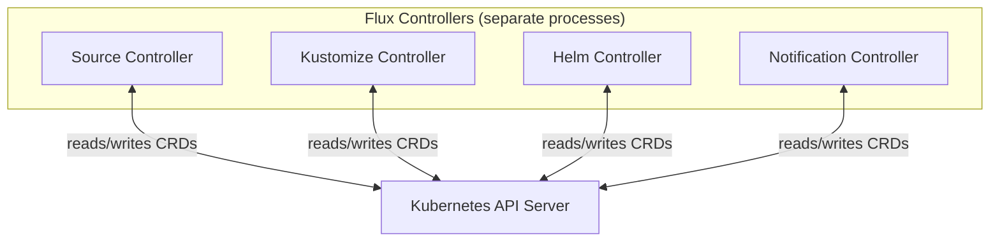
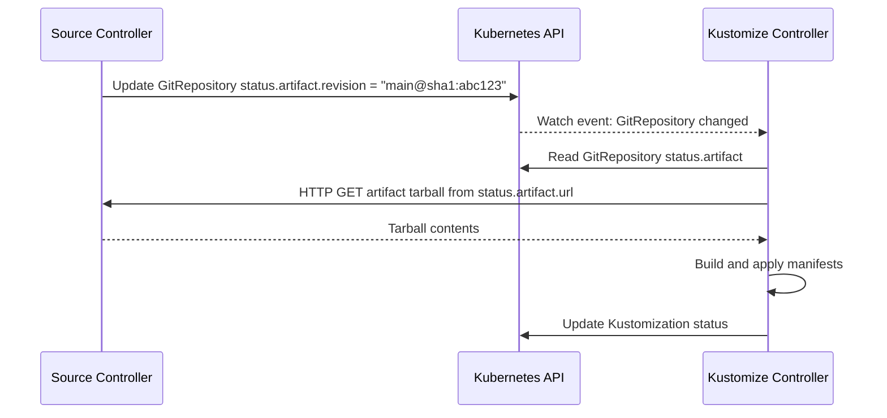
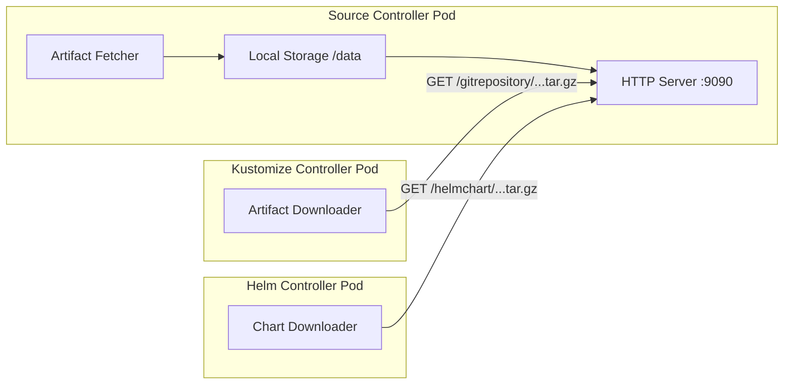
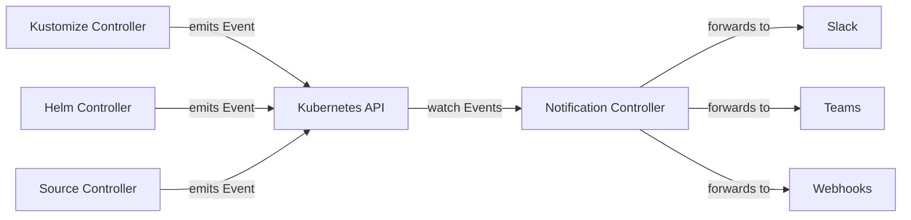
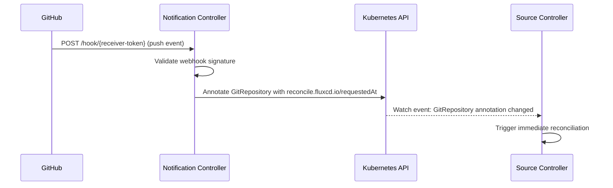
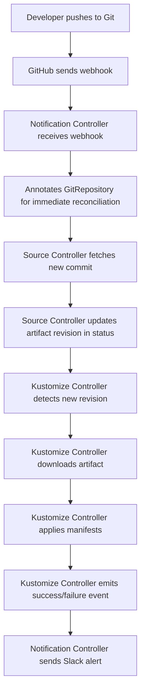

# How Flux CD Controllers Communicate with Each Other

Author: [nawazdhandala](https://github.com/nawazdhandala)

Tags: Flux CD, GitOps, Kubernetes, Controllers, Architecture, Custom Resources

Description: An in-depth look at how Flux CD's independent controllers communicate through the Kubernetes API using custom resource status fields, artifact references, and event-driven coordination.

---

## Controllers Are Independent Processes

Each Flux CD controller runs as a separate Kubernetes Deployment with its own binary, its own set of watched custom resources, and its own reconciliation loops. There is no shared message bus, no direct RPC between controllers, and no shared database. Instead, all communication flows through the Kubernetes API server.

This design is intentional. By using Kubernetes itself as the communication layer, Flux CD inherits the reliability, scalability, and access control mechanisms that Kubernetes provides.



## Communication Mechanism 1: Custom Resource Status Fields

The primary communication mechanism between Flux controllers is the **status subresource** of custom resources. When a controller finishes processing a resource, it writes results into the resource's `.status` field. Other controllers watch for changes to these status fields and react accordingly.

### The Source-to-Consumer Pattern

The most important communication pattern in Flux is between the source-controller and the consuming controllers (kustomize-controller and helm-controller).



Here is what the source-controller writes when it fetches a new revision:

```yaml
# GitRepository status after successful reconciliation
apiVersion: source.toolkit.fluxcd.io/v1
kind: GitRepository
metadata:
  name: fleet-infra
  namespace: flux-system
status:
  observedGeneration: 3
  conditions:
    - type: Ready
      status: "True"
      reason: Succeeded
      message: "stored artifact for revision 'main@sha1:abc123def'"
  artifact:
    revision: "main@sha1:abc123def"
    digest: "sha256:9f86d081884c7d659a2feaa..."
    url: "http://source-controller.flux-system.svc.cluster.local./gitrepository/flux-system/fleet-infra/latest.tar.gz"
    lastUpdateTime: "2026-03-05T10:00:00Z"
    size: 45678
```

The kustomize-controller has a watch on all `GitRepository` resources. When it detects that `status.artifact.revision` has changed, it triggers a reconciliation of every `Kustomization` that references that `GitRepository` through `spec.sourceRef`.

### The Cross-Reference Pattern

A Flux Kustomization references a source through `spec.sourceRef`:

```yaml
# The sourceRef field creates a cross-reference between controllers
apiVersion: kustomize.toolkit.fluxcd.io/v1
kind: Kustomization
metadata:
  name: apps
  namespace: flux-system
spec:
  sourceRef:
    kind: GitRepository     # Source type
    name: fleet-infra       # Source name
    namespace: flux-system  # Source namespace (defaults to same namespace)
  path: ./apps/production
  interval: 10m
```

The kustomize-controller resolves this reference by reading the named `GitRepository` from the Kubernetes API. It checks the `.status.artifact` field to find the download URL and revision. If the source is not ready (its `Ready` condition is `False`), the kustomize-controller waits and retries.

## Communication Mechanism 2: Artifact HTTP Server

While status fields coordinate the what and when, the actual artifact content is transferred through the source-controller's built-in HTTP server. This server runs on port 9090 inside the source-controller pod and serves tarball files from its local storage.



The URL for each artifact follows a predictable pattern:

```
http://source-controller.flux-system.svc.cluster.local./
  {source-kind}/{namespace}/{name}/latest.tar.gz
```

This is an in-cluster HTTP call — it never leaves the cluster network. The consuming controller downloads the tarball, extracts it to a temporary directory, and processes the contents.

## Communication Mechanism 3: Kubernetes Events

Flux controllers emit Kubernetes events when significant actions occur. The notification-controller watches for these events and forwards them to external systems.



Events carry metadata that the notification-controller uses for filtering and routing:

```yaml
# Example Kubernetes Event emitted by the kustomize-controller
apiVersion: v1
kind: Event
metadata:
  namespace: flux-system
involvedObject:
  apiVersion: kustomize.toolkit.fluxcd.io/v1
  kind: Kustomization
  name: apps
  namespace: flux-system
reason: ReconciliationSucceeded
message: "Applied revision: main@sha1:abc123def"
type: Normal
source:
  component: kustomize-controller
```

The notification-controller matches events against `Alert` resources to determine what to forward:

```yaml
# Alert configuration that filters events by source and severity
apiVersion: notification.toolkit.fluxcd.io/v1beta3
kind: Alert
metadata:
  name: production-alerts
  namespace: flux-system
spec:
  providerRef:
    name: slack-provider
  eventSeverity: info           # Forward info and error events
  eventSources:
    - kind: Kustomization
      name: apps                # Only from the "apps" Kustomization
      namespace: flux-system
  exclusionList:
    - ".*no change.*"           # Exclude no-op reconciliations
```

## Communication Mechanism 4: Inbound Webhooks

The notification-controller also handles inbound communication. It exposes webhook endpoints that external systems (like GitHub or GitLab) can call to trigger immediate reconciliation.



The `Receiver` resource configures these webhook endpoints:

```yaml
# A Receiver that triggers GitRepository reconciliation on GitHub push
apiVersion: notification.toolkit.fluxcd.io/v1
kind: Receiver
metadata:
  name: github-push
  namespace: flux-system
spec:
  type: github
  events:
    - "push"
  secretRef:
    name: github-webhook-secret   # Shared secret for HMAC validation
  resources:
    - apiVersion: source.toolkit.fluxcd.io/v1
      kind: GitRepository
      name: fleet-infra
      namespace: flux-system
```

When the notification-controller receives a valid webhook, it annotates the referenced resources with `reconcile.fluxcd.io/requestedAt`. The owning controller (source-controller in this case) watches for this annotation and triggers an immediate reconciliation, bypassing the normal interval wait.

## Communication Mechanism 5: Owner References and Finalizers

Flux also uses standard Kubernetes ownership mechanisms. For example, the helm-controller creates `HelmChart` resources that are owned by `HelmRelease` resources. This creates an automatic lifecycle link.

```yaml
# The helm-controller creates HelmCharts with an owner reference to the HelmRelease
apiVersion: source.toolkit.fluxcd.io/v1
kind: HelmChart
metadata:
  name: flux-system-ingress-nginx
  namespace: flux-system
  ownerReferences:
    - apiVersion: helm.toolkit.fluxcd.io/v2
      kind: HelmRelease
      name: ingress-nginx
      uid: "abc-123-def"
```

When a `HelmRelease` is deleted, Kubernetes garbage collection automatically deletes the associated `HelmChart`. The source-controller then cleans up the stored artifact.

## The Complete Communication Flow

Here is the full picture of how a Git push flows through all controllers:



Every arrow in this diagram goes through the Kubernetes API server. No controller communicates directly with another controller's process. This is what makes the architecture resilient — if one controller restarts, the others continue operating, and reconciliation resumes from the last known state stored in the custom resources.

## Summary

Flux CD controllers communicate through five mechanisms, all mediated by the Kubernetes API: custom resource status fields for state propagation, an internal HTTP server for artifact transfer, Kubernetes events for observability, inbound webhooks for external triggers, and owner references for lifecycle management. This design eliminates direct coupling between controllers while maintaining a coherent delivery pipeline. Each controller can be independently scaled, restarted, or upgraded without disrupting the others.
