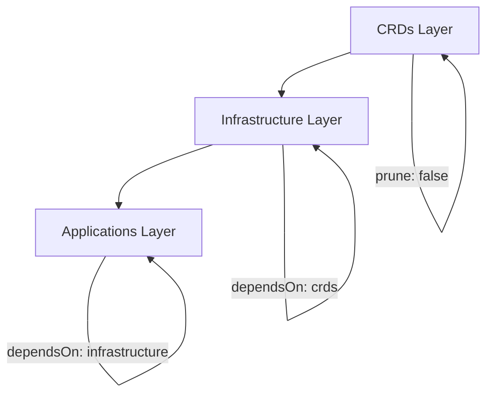

# How Flux CD Handles CRD Installation and Upgrades

Author: [nawazdhandala](https://github.com/nawazdhandala)

Tags: Flux CD, GitOps, Kubernetes, CRD, Custom Resource Definitions, Dependencies

Description: A guide to managing Custom Resource Definition lifecycle with Flux CD, covering installation ordering, dependency management with dependsOn, and safe upgrade strategies.

---

Custom Resource Definitions (CRDs) present a classic chicken-and-egg problem in Kubernetes: you cannot create custom resources until their CRD is installed, but in a GitOps workflow, both the CRD and the custom resources might be declared in the same repository. Flux CD provides several mechanisms to handle CRD installation and upgrades correctly, with `spec.dependsOn` being the primary tool for ensuring proper ordering.

## The CRD Ordering Problem

When you apply a Kubernetes manifest that references a custom resource type, the API server must already know about that type via its CRD. If the CRD has not been installed yet, the apply fails with an error like:

```json
error: unable to recognize "resource.yaml": no matches for kind "MyCustomResource" in version "example.com/v1"
```

In a manual workflow, you apply CRDs first, wait for them to register, then apply custom resources. In Flux, you need to encode this ordering declaratively.

## Using dependsOn for CRD Ordering

The `spec.dependsOn` field on Kustomization and HelmRelease resources tells Flux to wait for one resource to become ready before reconciling another. This is the primary mechanism for CRD ordering.

Here is a typical pattern where CRDs are installed by one Kustomization, and the resources that depend on those CRDs are installed by another.

```yaml
# First Kustomization: installs the CRDs
apiVersion: kustomize.toolkit.fluxcd.io/v1
kind: Kustomization
metadata:
  name: cert-manager-crds
  namespace: flux-system
spec:
  interval: 10m
  path: ./infrastructure/cert-manager/crds
  prune: false  # Never prune CRDs - they contain data
  sourceRef:
    kind: GitRepository
    name: flux-system
---
# Second Kustomization: installs cert-manager controller (depends on CRDs)
apiVersion: kustomize.toolkit.fluxcd.io/v1
kind: Kustomization
metadata:
  name: cert-manager
  namespace: flux-system
spec:
  interval: 10m
  dependsOn:
    - name: cert-manager-crds
  path: ./infrastructure/cert-manager/controller
  prune: true
  sourceRef:
    kind: GitRepository
    name: flux-system
---
# Third Kustomization: creates Certificate resources (depends on controller)
apiVersion: kustomize.toolkit.fluxcd.io/v1
kind: Kustomization
metadata:
  name: certificates
  namespace: flux-system
spec:
  interval: 10m
  dependsOn:
    - name: cert-manager
  path: ./infrastructure/cert-manager/certificates
  prune: true
  sourceRef:
    kind: GitRepository
    name: flux-system
```

The dependency chain ensures that CRDs are installed first, then the controller that processes those CRDs, and finally the custom resources themselves. Flux will not start reconciling a Kustomization until all resources in its `dependsOn` list report a Ready status.

## CRDs in Helm Charts

Helm has its own CRD management mechanism. By convention, CRDs placed in a chart's `crds/` directory are installed before the chart's templates. However, Helm does not upgrade or delete CRDs by default. This creates complications in a GitOps workflow.

Flux's HelmRelease resource provides the `spec.install.crds` and `spec.upgrade.crds` fields to control CRD behavior.

```yaml
# HelmRelease with explicit CRD management policy
apiVersion: helm.toolkit.fluxcd.io/v2
kind: HelmRelease
metadata:
  name: cert-manager
  namespace: flux-system
spec:
  interval: 1h
  chart:
    spec:
      chart: cert-manager
      version: "1.x"
      sourceRef:
        kind: HelmRepository
        name: jetstack
  install:
    # Create CRDs during initial install
    crds: Create
  upgrade:
    # Update CRDs during upgrades
    crds: CreateReplace
```

The CRD policy options are:

- `Skip` - Do not install or update CRDs. Use this when you manage CRDs separately.
- `Create` - Install CRDs if they do not exist, but do not update them.
- `CreateReplace` - Install CRDs if they do not exist, and replace them if they do. This is needed for CRD upgrades.

## Separating CRDs from Helm Charts

Many teams prefer to manage CRDs separately from Helm charts for greater control. This pattern extracts CRDs into their own Kustomization.

```yaml
# Extract and manage CRDs separately from the Helm chart
apiVersion: kustomize.toolkit.fluxcd.io/v1
kind: Kustomization
metadata:
  name: prometheus-crds
  namespace: flux-system
spec:
  interval: 10m
  path: ./infrastructure/prometheus/crds
  prune: false
  sourceRef:
    kind: GitRepository
    name: flux-system
---
# Helm chart with CRDs skipped since they are managed above
apiVersion: helm.toolkit.fluxcd.io/v2
kind: HelmRelease
metadata:
  name: kube-prometheus-stack
  namespace: flux-system
spec:
  interval: 1h
  dependsOn:
    - name: prometheus-crds
  chart:
    spec:
      chart: kube-prometheus-stack
      version: "50.x"
      sourceRef:
        kind: HelmRepository
        name: prometheus-community
  install:
    crds: Skip
  upgrade:
    crds: Skip
```

This approach has several advantages. CRDs have a different lifecycle than the application. You may want to upgrade CRDs independently, or you may want to ensure CRDs are never pruned (since deleting a CRD deletes all its instances).

## Why prune: false Matters for CRDs

Setting `prune: false` on CRD Kustomizations is critical. If pruning is enabled and the CRD manifests are removed from Git (even accidentally), Flux would delete the CRDs from the cluster. Deleting a CRD causes Kubernetes to garbage-collect all custom resources of that type, which can result in catastrophic data loss.

```yaml
# Always disable pruning for CRD Kustomizations
apiVersion: kustomize.toolkit.fluxcd.io/v1
kind: Kustomization
metadata:
  name: my-crds
  namespace: flux-system
spec:
  interval: 10m
  path: ./crds
  prune: false  # CRITICAL: prevents accidental CRD deletion
  sourceRef:
    kind: GitRepository
    name: flux-system
```

## Multi-Layer Dependency Chains

Real-world clusters often have complex dependency chains. Here is an example of a layered infrastructure setup.

```yaml
# Layer 1: CRDs and cluster-wide resources
apiVersion: kustomize.toolkit.fluxcd.io/v1
kind: Kustomization
metadata:
  name: crds
  namespace: flux-system
spec:
  interval: 10m
  path: ./infrastructure/crds
  prune: false
  sourceRef:
    kind: GitRepository
    name: flux-system
---
# Layer 2: Infrastructure controllers (depend on CRDs)
apiVersion: kustomize.toolkit.fluxcd.io/v1
kind: Kustomization
metadata:
  name: infrastructure
  namespace: flux-system
spec:
  interval: 10m
  dependsOn:
    - name: crds
  path: ./infrastructure/controllers
  prune: true
  sourceRef:
    kind: GitRepository
    name: flux-system
---
# Layer 3: Application resources (depend on infrastructure)
apiVersion: kustomize.toolkit.fluxcd.io/v1
kind: Kustomization
metadata:
  name: apps
  namespace: flux-system
spec:
  interval: 10m
  dependsOn:
    - name: infrastructure
  path: ./apps
  prune: true
  sourceRef:
    kind: GitRepository
    name: flux-system
```



## Handling CRD Version Upgrades

When upgrading CRDs, new fields may be added and old fields deprecated. Flux handles this by applying the updated CRD manifest, which updates the stored version in etcd. However, there are important considerations:

1. CRD upgrades that remove fields can break existing resources. Always review CRD changelogs before upgrading.
2. If a CRD introduces a new storage version, existing resources need to be migrated. This is usually handled by the operator that owns the CRD.
3. Apply CRD upgrades before upgrading the controller that uses them. The `dependsOn` chain naturally enforces this ordering.

```bash
# Check current CRD versions installed on the cluster
kubectl get crd certificates.cert-manager.io -o jsonpath='{.spec.versions[*].name}'

# Verify that custom resources are valid after a CRD upgrade
kubectl get certificates -A
```

## Conclusion

Flux CD handles CRD installation and upgrades through a combination of `spec.dependsOn` for ordering, `spec.install.crds` and `spec.upgrade.crds` for Helm chart CRD policies, and `prune: false` for safety. The recommended pattern is to separate CRDs into their own Kustomization with pruning disabled, use dependency chains to ensure correct ordering, and carefully manage CRD version upgrades by reviewing breaking changes before applying them.
