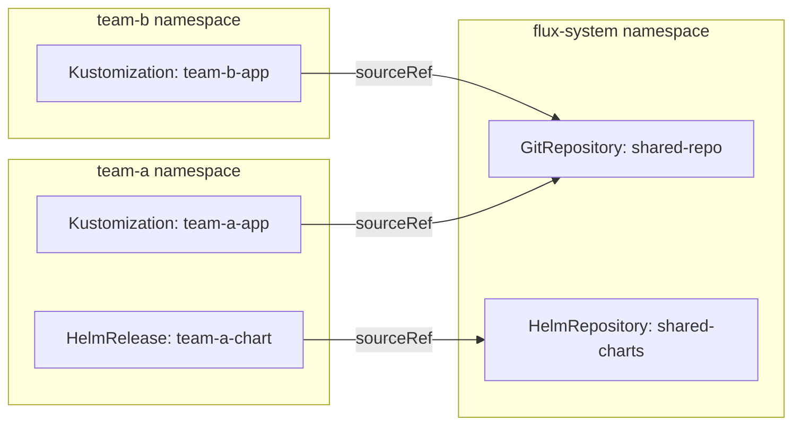
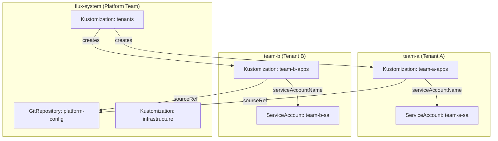

# How to Understand Flux CD Cross-Namespace References

Author: [nawazdhandala](https://github.com/nawazdhandala)

Tags: Flux CD, GitOps, Kubernetes, Cross-Namespace, Multi-Tenancy, RBAC

Description: Learn how Flux CD handles cross-namespace references, enabling you to share sources and configurations across namespaces while maintaining security boundaries.

---

In multi-tenant Kubernetes environments, resources are often organized across multiple namespaces. Flux CD supports cross-namespace references, allowing Kustomizations and HelmReleases in one namespace to reference sources, secrets, and other Flux resources in another namespace. In this post, we will explore how cross-namespace references work, how to configure them, and the security considerations involved.

## What Are Cross-Namespace References

A cross-namespace reference occurs when a Flux resource in one namespace refers to a Flux resource in a different namespace. The most common scenario is a Kustomization in a tenant namespace referencing a GitRepository source in the `flux-system` namespace.



## Basic Cross-Namespace Source Reference

To reference a source in another namespace, you specify the `namespace` field in the `sourceRef`.

```yaml
# Kustomization in team-a namespace referencing a GitRepository in flux-system
apiVersion: kustomize.toolkit.fluxcd.io/v1
kind: Kustomization
metadata:
  name: team-a-app
  namespace: team-a
spec:
  interval: 10m
  path: ./apps/team-a
  prune: true
  sourceRef:
    kind: GitRepository
    name: shared-repo
    # Reference a source in a different namespace
    namespace: flux-system
  targetNamespace: team-a
```

The GitRepository in `flux-system` must exist and be reconciled for this reference to work:

```yaml
# Shared GitRepository in flux-system namespace
apiVersion: source.toolkit.fluxcd.io/v1
kind: GitRepository
metadata:
  name: shared-repo
  namespace: flux-system
spec:
  interval: 5m
  url: https://github.com/my-org/platform-config
  ref:
    branch: main
```

## Controlling Cross-Namespace Access

By default, Flux allows cross-namespace references. However, you can restrict this behavior using the `--no-cross-namespace-refs` flag on the Flux controllers. When this flag is set, all references must be within the same namespace.

To enable this restriction, modify the controller deployment:

```yaml
# Kustomize controller deployment with cross-namespace refs disabled
apiVersion: apps/v1
kind: Deployment
metadata:
  name: kustomize-controller
  namespace: flux-system
spec:
  template:
    spec:
      containers:
        - name: manager
          args:
            - --watch-all-namespaces
            # Disable cross-namespace references for security
            - --no-cross-namespace-refs=true
```

When cross-namespace references are disabled and a Kustomization tries to reference a source in another namespace, the reconciliation will fail with an error:

```yaml
# Error status when cross-namespace refs are disabled
status:
  conditions:
    - type: Ready
      status: "False"
      reason: ACLError
      message: "cross-namespace references are not allowed"
```

## Cross-Namespace HelmRelease References

HelmReleases can also reference HelmRepositories and HelmCharts in other namespaces:

```yaml
# HelmRelease referencing a chart source in another namespace
apiVersion: helm.toolkit.fluxcd.io/v2
kind: HelmRelease
metadata:
  name: nginx
  namespace: team-a
spec:
  interval: 10m
  chart:
    spec:
      chart: nginx
      version: "1.0.0"
      sourceRef:
        kind: HelmRepository
        name: bitnami
        # Reference the shared Helm repository in flux-system
        namespace: flux-system
  values:
    replicaCount: 2
```

## Cross-Namespace Secret References

Kustomizations and HelmReleases sometimes need to reference Secrets in other namespaces, for example for decryption keys or Helm values.

```yaml
# HelmRelease using a values secret from another namespace
apiVersion: helm.toolkit.fluxcd.io/v2
kind: HelmRelease
metadata:
  name: my-app
  namespace: team-a
spec:
  interval: 10m
  chart:
    spec:
      chart: my-chart
      version: "1.0.0"
      sourceRef:
        kind: HelmRepository
        name: my-repo
        namespace: flux-system
  valuesFrom:
    - kind: Secret
      name: shared-values
      # Reference a secret in another namespace
      # Note: This requires the controller to have read access to that namespace
      targetPath: global.secrets
```

## Kustomization Dependencies Across Namespaces

Kustomizations can depend on other Kustomizations in different namespaces using `spec.dependsOn`:

```yaml
# Kustomization that depends on infrastructure in another namespace
apiVersion: kustomize.toolkit.fluxcd.io/v1
kind: Kustomization
metadata:
  name: team-a-app
  namespace: team-a
spec:
  interval: 10m
  path: ./apps/team-a
  prune: true
  sourceRef:
    kind: GitRepository
    name: shared-repo
    namespace: flux-system
  # Wait for infrastructure to be ready before applying
  dependsOn:
    - name: infrastructure
      namespace: flux-system
    - name: cert-manager
      namespace: flux-system
```

## Multi-Tenancy Pattern

A common multi-tenancy pattern uses a central `flux-system` namespace for shared sources and tenant-specific namespaces for Kustomizations.



Here is the tenant Kustomization created by the platform team:

```yaml
# Platform team creates this Kustomization to bootstrap tenant-a
apiVersion: kustomize.toolkit.fluxcd.io/v1
kind: Kustomization
metadata:
  name: team-a-apps
  namespace: team-a
spec:
  interval: 10m
  path: ./tenants/team-a
  prune: true
  sourceRef:
    kind: GitRepository
    name: platform-config
    namespace: flux-system
  # Use a tenant-specific service account for RBAC isolation
  serviceAccountName: team-a-sa
  targetNamespace: team-a
```

## Security Considerations

Cross-namespace references introduce security considerations that you should carefully evaluate.

### Source Access

When a Kustomization references a GitRepository in another namespace, it gains access to all files in that repository. Ensure that the repository does not contain secrets or configurations that the referencing namespace should not have access to.

### RBAC Isolation

Use `spec.serviceAccountName` to limit what a cross-namespace Kustomization can do in the target cluster. The service account's RBAC permissions determine which resources the Kustomization can create, update, and delete.

```yaml
# Restricted service account for tenant Kustomizations
apiVersion: v1
kind: ServiceAccount
metadata:
  name: team-a-sa
  namespace: team-a
---
# Role that limits what the tenant can deploy
apiVersion: rbac.authorization.k8s.io/v1
kind: Role
metadata:
  name: team-a-reconciler
  namespace: team-a
rules:
  - apiGroups: ["apps"]
    resources: ["deployments"]
    verbs: ["*"]
  - apiGroups: [""]
    resources: ["services", "configmaps", "secrets"]
    verbs: ["*"]
  # Explicitly deny namespace-level operations
---
apiVersion: rbac.authorization.k8s.io/v1
kind: RoleBinding
metadata:
  name: team-a-reconciler
  namespace: team-a
roleRef:
  apiGroup: rbac.authorization.k8s.io
  kind: Role
  name: team-a-reconciler
subjects:
  - kind: ServiceAccount
    name: team-a-sa
    namespace: team-a
```

### Disabling Cross-Namespace Refs in Production

For high-security environments, consider disabling cross-namespace references entirely and requiring each namespace to maintain its own sources:

```bash
# During Flux bootstrap, disable cross-namespace references
flux bootstrap github \
  --owner=my-org \
  --repository=fleet-config \
  --path=clusters/production \
  --components-extra=image-reflector-controller,image-automation-controller \
  --no-cross-namespace-refs
```

## Troubleshooting Cross-Namespace References

Common issues and how to resolve them:

```bash
# Check if a Kustomization can access its cross-namespace source
flux get sources git -n flux-system

# Verify the source exists and is ready
kubectl get gitrepository shared-repo -n flux-system -o yaml

# Check for ACL errors in the Kustomization status
kubectl get kustomization team-a-app -n team-a -o yaml | grep -A 5 conditions

# Verify RBAC permissions for the service account
kubectl auth can-i create deployments --as=system:serviceaccount:team-a:team-a-sa -n team-a
```

## Best Practices

1. **Centralize sources in flux-system**: Keep shared GitRepositories and HelmRepositories in the `flux-system` namespace to provide a single point of source management.

2. **Use service accounts for isolation**: Always pair cross-namespace references with `spec.serviceAccountName` to enforce RBAC boundaries.

3. **Consider disabling cross-namespace refs for strict multi-tenancy**: If tenants should not share sources, disable cross-namespace references at the controller level.

4. **Document reference relationships**: Maintain a clear map of which namespaces reference which sources to simplify debugging and access auditing.

5. **Use dependsOn for ordering**: When cross-namespace Kustomizations depend on shared infrastructure, use `spec.dependsOn` to ensure proper ordering.

## Conclusion

Cross-namespace references in Flux CD enable powerful multi-tenancy patterns by allowing shared sources and configuration across namespace boundaries. By understanding how these references work and combining them with RBAC controls and service account impersonation, you can build secure, scalable GitOps platforms that serve multiple teams while maintaining appropriate isolation.
