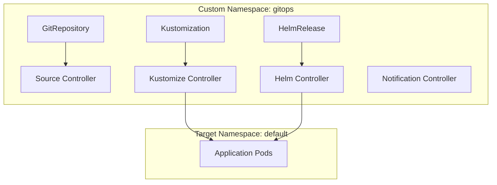

# How to Run Flux CD in a Namespace Other Than flux-system

Author: [nawazdhandala](https://github.com/nawazdhandala)

Tags: Flux CD, GitOps, Kubernetes, Namespace, Configuration

Description: Learn how to install and run Flux CD controllers in a custom namespace instead of the default flux-system namespace.

---

## Why Use a Custom Namespace for Flux CD?

By default, Flux CD installs all its controllers into the `flux-system` namespace. While this works for most setups, there are situations where you might want to use a different namespace:

- **Naming conventions**: Your organization enforces specific namespace naming patterns.
- **Multi-tenancy**: You run multiple Flux installations on the same cluster.
- **Security policies**: Your cluster policies restrict what can run in certain namespaces.
- **Organizational clarity**: You want Flux to live alongside other platform tools in a shared namespace.

Flux CD fully supports running in a custom namespace. This guide covers both the bootstrap approach and the manual installation approach.

## Prerequisites

- A Kubernetes cluster (v1.20+)
- `flux` CLI installed (v2.0+)
- `kubectl` configured to access your cluster
- A GitHub or GitLab personal access token (for bootstrap)

## Method 1: Bootstrap with a Custom Namespace

The simplest approach is to specify the namespace during bootstrap using the `--namespace` flag:

```bash
# Bootstrap Flux CD into a custom namespace called "gitops"
flux bootstrap github \
  --owner=my-org \
  --repository=fleet-infra \
  --branch=main \
  --path=clusters/my-cluster \
  --namespace=gitops
```

This command creates the `gitops` namespace, installs all Flux controllers into it, and configures the GitRepository and Kustomization resources in that namespace.

## Method 2: Install Flux with flux install

If you prefer not to use bootstrap, you can install Flux directly with a custom namespace:

```bash
# Install Flux controllers into the "gitops" namespace
flux install --namespace=gitops
```

Or generate the manifests for review before applying:

```bash
# Export Flux install manifests for a custom namespace
flux install --namespace=gitops --export > flux-install.yaml

# Review and apply
kubectl apply -f flux-install.yaml
```

## Method 3: Using Kustomize Overlays

For full control, generate the base manifests and use a Kustomize overlay to change the namespace:

```bash
# Generate base Flux manifests
flux install --export > base/flux-install.yaml
```

Create a Kustomize overlay that changes the namespace:

```yaml
# kustomization.yaml - Overlay to set a custom namespace for all Flux resources
apiVersion: kustomize.config.k8s.io/v1beta1
kind: Kustomization
namespace: gitops
resources:
  - base/flux-install.yaml
```

Apply with kustomize:

```bash
# Apply the kustomized Flux installation
kubectl apply -k .
```

## Verifying the Installation

After installing Flux in a custom namespace, verify all controllers are running:

```bash
# Check Flux components in the custom namespace
flux check --namespace=gitops

# List all pods in the custom namespace
kubectl get pods -n gitops
```

Expected output:

```text
NAME                                       READY   STATUS    RESTARTS   AGE
helm-controller-6f8bdc7f9c-xyz12          1/1     Running   0          2m
kustomize-controller-7b8c5f9d4f-abc34     1/1     Running   0          2m
notification-controller-5c4d8f7b6e-def56  1/1     Running   0          2m
source-controller-7d6e9f8c5a-ghi78        1/1     Running   0          2m
```

## Important Considerations for Custom Namespaces

### All Flux Resources Must Reference the Custom Namespace

When using a custom namespace, all Flux custom resources (GitRepository, Kustomization, HelmRelease, etc.) that interact with Flux controllers must be created in or reference the correct namespace. The controllers only watch resources in their own namespace by default.

Here is an example GitRepository and Kustomization in the custom namespace:

```yaml
# GitRepository source in the custom namespace
apiVersion: source.toolkit.fluxcd.io/v1
kind: GitRepository
metadata:
  name: my-app
  namespace: gitops
spec:
  interval: 5m
  url: https://github.com/my-org/my-app
  ref:
    branch: main
  secretRef:
    name: git-credentials
---
# Kustomization that deploys resources from the GitRepository
apiVersion: kustomize.toolkit.fluxcd.io/v1
kind: Kustomization
metadata:
  name: my-app
  namespace: gitops
spec:
  interval: 10m
  sourceRef:
    kind: GitRepository
    name: my-app
  path: ./deploy
  prune: true
  targetNamespace: default
```

### Cross-Namespace References

Flux controllers can deploy resources into any namespace, but the Flux custom resources themselves need to be in the controller's namespace. The `targetNamespace` field in Kustomization and `spec.targetNamespace` in HelmRelease allow you to specify where the workloads are deployed.

### Using the --namespace Flag Consistently

When using the `flux` CLI to interact with a non-default namespace, always pass the `--namespace` flag:

```bash
# Always specify the custom namespace when using flux CLI
flux get sources git --namespace=gitops
flux get kustomizations --namespace=gitops
flux get helmreleases --namespace=gitops

# Reconcile resources in the custom namespace
flux reconcile source git my-app --namespace=gitops
flux reconcile kustomization my-app --namespace=gitops
```

You can set a shell alias to avoid repeating the flag:

```bash
# Shell alias to default flux commands to the custom namespace
alias flux='flux --namespace=gitops'
```

### RBAC Considerations

Flux controllers create and manage resources across namespaces. The ClusterRoleBindings created during installation reference the service accounts in the custom namespace. Verify that RBAC is configured correctly:

```bash
# Check ClusterRoleBindings referencing the custom namespace
kubectl get clusterrolebindings -o json | \
  jq '.items[] | select(.subjects[]?.namespace == "gitops") | .metadata.name'
```

### Secrets and ConfigMaps

Secrets referenced by Flux resources (e.g., Git credentials, Helm repository credentials) must be in the same namespace as the Flux controllers:

```bash
# Create a Git credentials secret in the custom namespace
kubectl create secret generic git-credentials \
  --namespace=gitops \
  --from-literal=username=git \
  --from-literal=password="${GITHUB_TOKEN}"
```

## Migrating from flux-system to a Custom Namespace

If you have an existing Flux installation in `flux-system` and want to move it to a custom namespace:

1. Export your existing Flux sources and kustomizations.
2. Uninstall Flux from the default namespace.
3. Reinstall in the new namespace.
4. Reapply your resources.

```bash
# Step 1: Export existing Flux resources
flux export source git --all > sources.yaml
flux export kustomization --all > kustomizations.yaml
flux export helmrelease --all --all-namespaces > helmreleases.yaml

# Step 2: Uninstall Flux from the default namespace
flux uninstall

# Step 3: Reinstall in the custom namespace
flux install --namespace=gitops

# Step 4: Update namespace references in exported files and reapply
sed -i 's/namespace: flux-system/namespace: gitops/g' sources.yaml kustomizations.yaml
kubectl apply -f sources.yaml
kubectl apply -f kustomizations.yaml
```

Note that this approach causes brief downtime in reconciliation. For production clusters, consider running both namespaces temporarily during migration.

## Architecture Overview



## Summary

Running Flux CD in a custom namespace is fully supported and straightforward. The key is to consistently use the `--namespace` flag during bootstrap or install, and to ensure all Flux custom resources and secrets are created in the same custom namespace. The controllers can still manage resources across all namespaces in the cluster, so the custom namespace only affects where Flux itself runs, not what it can manage.
