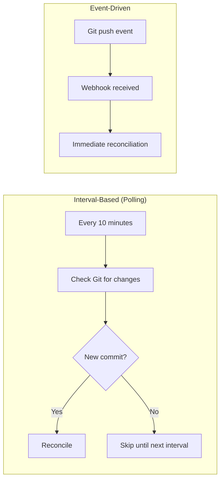
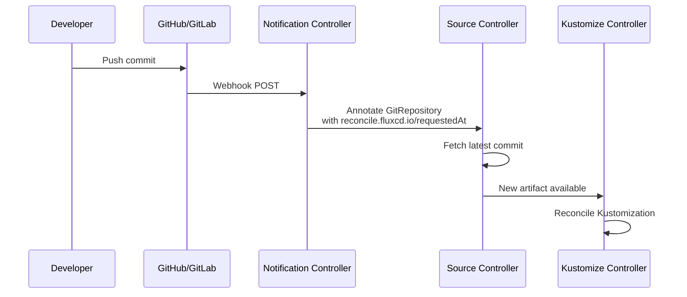
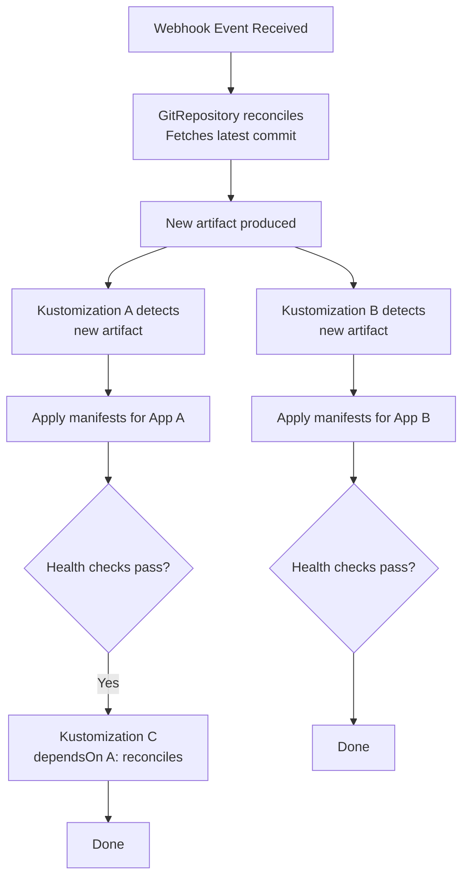

# How to Understand Flux CD Event-Driven Reconciliation

Author: [nawazdhandala](https://github.com/nawazdhandala)

Tags: Flux CD, GitOps, Kubernetes, Event-Driven, Reconciliation, Webhook, Notifications

Description: Learn how Flux CD combines interval-based polling with event-driven reconciliation to respond to changes in your Git repositories and cluster state.

---

Flux CD reconciles your cluster state on a configurable interval, but it also supports event-driven reconciliation that triggers immediately when changes are detected. This combination of polling and event-driven approaches ensures that your cluster stays in sync with your Git repository while also responding quickly to new commits. In this post, we will explore how event-driven reconciliation works in Flux CD and how to configure it.

## Interval-Based vs. Event-Driven Reconciliation

By default, Flux reconciles on a fixed interval defined by `spec.interval`. This means Flux checks for changes every N minutes regardless of whether anything has changed.

Event-driven reconciliation triggers an immediate reconciliation when a specific event occurs, such as a Git push or a webhook notification. This reduces the delay between a Git commit and the cluster being updated.



## How Flux Receives Events

Flux CD uses its notification controller to receive external events via webhooks. When a webhook is received, the notification controller annotates the relevant Flux resource, which triggers an immediate reconciliation.

The event flow looks like this:



## Setting Up Webhook Receivers

To enable event-driven reconciliation, you need to create a Receiver resource that listens for webhooks from your Git provider.

### GitHub Webhook Receiver

```yaml
# Secret containing the webhook token for validation
apiVersion: v1
kind: Secret
metadata:
  name: github-webhook-token
  namespace: flux-system
type: Opaque
stringData:
  token: your-webhook-secret-here
---
# Receiver that listens for GitHub push events
apiVersion: notification.toolkit.fluxcd.io/v1
kind: Receiver
metadata:
  name: github-receiver
  namespace: flux-system
spec:
  # Type of webhook sender
  type: github
  # Events to listen for
  events:
    - "ping"
    - "push"
  # Secret used to validate the webhook payload
  secretRef:
    name: github-webhook-token
  # Resources to trigger reconciliation for when an event is received
  resources:
    - kind: GitRepository
      name: my-repo
```

### GitLab Webhook Receiver

```yaml
# Receiver for GitLab push events
apiVersion: notification.toolkit.fluxcd.io/v1
kind: Receiver
metadata:
  name: gitlab-receiver
  namespace: flux-system
spec:
  type: gitlab
  events:
    - "Push Hook"
    - "Tag Push Hook"
  secretRef:
    name: gitlab-webhook-token
  resources:
    - kind: GitRepository
      name: my-repo
```

### Generic Webhook Receiver

For other systems or custom integrations:

```yaml
# Generic receiver that accepts any POST request with the correct token
apiVersion: notification.toolkit.fluxcd.io/v1
kind: Receiver
metadata:
  name: generic-receiver
  namespace: flux-system
spec:
  type: generic
  secretRef:
    name: webhook-token
  resources:
    - kind: GitRepository
      name: my-repo
    - kind: HelmRepository
      name: my-charts
```

## Getting the Webhook URL

After creating a Receiver, Flux generates a unique webhook URL. You need to configure this URL in your Git provider.

```bash
# Get the webhook URL for the receiver
flux get receivers

# Or get it from the resource status
kubectl get receiver github-receiver -n flux-system \
  -o jsonpath='{.status.webhookPath}'

# The full URL is: http(s)://<your-flux-webhook-domain><webhookPath>
```

The webhook URL follows this pattern: `https://<load-balancer-address>/hook/<random-token>`

You must expose the notification controller's webhook endpoint via a Kubernetes Service, Ingress, or LoadBalancer so your Git provider can reach it.

```yaml
# Ingress to expose the webhook receiver endpoint
apiVersion: networking.k8s.io/v1
kind: Ingress
metadata:
  name: flux-webhook
  namespace: flux-system
spec:
  rules:
    - host: flux-webhook.example.com
      http:
        paths:
          - path: /
            pathType: Prefix
            backend:
              service:
                # The notification-controller webhook service
                name: webhook-receiver
                port:
                  number: 80
```

## Manual Reconciliation Triggers

You can also trigger event-driven reconciliation manually using the Flux CLI or by annotating resources directly.

```bash
# Trigger immediate reconciliation of a GitRepository
flux reconcile source git my-repo

# Trigger immediate reconciliation of a Kustomization
flux reconcile kustomization my-app

# Trigger reconciliation with source update
flux reconcile kustomization my-app --with-source

# Using kubectl to annotate and trigger reconciliation
kubectl annotate --overwrite gitrepository/my-repo -n flux-system \
  reconcile.fluxcd.io/requestedAt="$(date +%s)"
```

## Event-Driven Reconciliation Chain

When a source is updated via an event, it triggers a chain of reconciliations through dependent resources:



This chain happens because:

1. The webhook triggers a GitRepository reconciliation
2. The source controller produces a new artifact
3. All Kustomizations referencing that GitRepository detect the new artifact
4. Kustomizations with `dependsOn` wait for their dependencies to become ready

## Configuring Reconciliation Behavior

You can fine-tune how Flux responds to events with several spec fields:

```yaml
# GitRepository with optimized reconciliation settings
apiVersion: source.toolkit.fluxcd.io/v1
kind: GitRepository
metadata:
  name: my-repo
  namespace: flux-system
spec:
  # Polling interval - used as fallback if webhooks miss an event
  interval: 30m
  url: https://github.com/my-org/my-repo
  ref:
    branch: main
---
# Kustomization with reconciliation settings
apiVersion: kustomize.toolkit.fluxcd.io/v1
kind: Kustomization
metadata:
  name: my-app
  namespace: flux-system
spec:
  # How often to check for drift even without source changes
  interval: 10m
  # Retry interval when reconciliation fails
  retryInterval: 2m
  path: ./deploy
  prune: true
  sourceRef:
    kind: GitRepository
    name: my-repo
```

With webhook receivers in place, you can increase the polling interval on sources since webhooks handle immediate notifications. The interval then serves as a safety net to catch any missed events.

## Flux Events and Notifications

Flux emits Kubernetes events during reconciliation. You can forward these events to external systems using the notification controller.

```yaml
# Provider for sending notifications to Slack
apiVersion: notification.toolkit.fluxcd.io/v1beta3
kind: Provider
metadata:
  name: slack
  namespace: flux-system
spec:
  type: slack
  channel: flux-notifications
  secretRef:
    name: slack-webhook-url
---
# Alert that sends notifications for reconciliation events
apiVersion: notification.toolkit.fluxcd.io/v1beta3
kind: Alert
metadata:
  name: reconciliation-alerts
  namespace: flux-system
spec:
  providerRef:
    name: slack
  eventSeverity: info
  eventSources:
    - kind: GitRepository
      name: "*"
    - kind: Kustomization
      name: "*"
    - kind: HelmRelease
      name: "*"
```

## Monitoring Event-Driven Reconciliation

Track how event-driven reconciliation is performing:

```bash
# View recent Flux events
flux events

# Check the receiver status
flux get receivers

# View notification controller logs for webhook activity
kubectl logs -n flux-system deployment/notification-controller

# Check source controller logs for reconciliation triggers
kubectl logs -n flux-system deployment/source-controller | grep "reconciling"

# Monitor reconciliation frequency with Prometheus metrics
# The source_controller_reconcile_duration_seconds metric
# tracks how often and how long reconciliations take
```

## Best Practices

1. **Use webhooks with polling as a fallback**: Configure webhook receivers for immediate responsiveness, but keep a reasonable polling interval as a safety net.

2. **Increase polling intervals when using webhooks**: If webhooks are reliably delivering events, you can safely increase `spec.interval` to reduce unnecessary API calls.

3. **Secure your webhook endpoints**: Always use HTTPS and strong webhook secrets. Validate the payload signature to prevent unauthorized reconciliation triggers.

4. **Monitor webhook delivery**: Set up alerts for webhook delivery failures in your Git provider so you know if events are not reaching Flux.

5. **Use retryInterval for failed reconciliations**: Set `spec.retryInterval` to a shorter duration than `spec.interval` so that failed reconciliations are retried quickly without waiting for the full interval.

## Conclusion

Flux CD's event-driven reconciliation combines the reliability of interval-based polling with the responsiveness of webhook-triggered updates. By setting up Receiver resources and configuring your Git provider to send webhooks, you can reduce the time between pushing a commit and seeing it deployed in your cluster from minutes to seconds. This approach, combined with Flux's notification system for outbound events, creates a fully event-driven GitOps pipeline.
