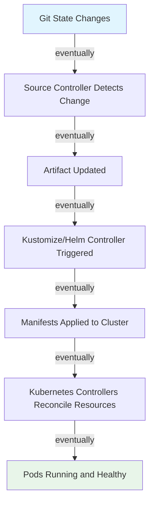
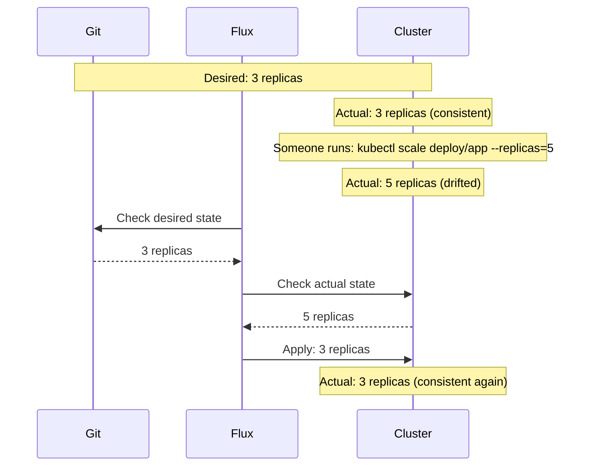
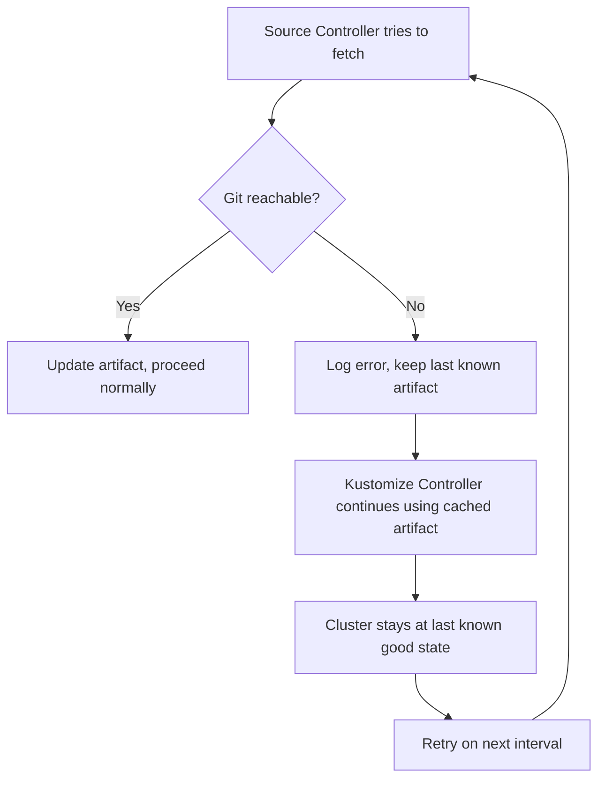

# How Flux CD Handles Eventual Consistency in Kubernetes

Author: [nawazdhandala](https://github.com/nawazdhandala)

Tags: Flux CD, GitOps, Kubernetes, Eventual Consistency, Reconciliation, Drift Detection

Description: An explanation of how Flux CD embraces the eventual consistency model of Kubernetes to continuously converge cluster state toward the desired state defined in Git, handling drift, failures, and partial updates gracefully.

---

## What Is Eventual Consistency?

Eventual consistency is a model where a system does not guarantee that all components are in sync at any given moment, but guarantees that they will converge to a consistent state given enough time and no new changes. This is the fundamental model that Kubernetes operates on, and Flux CD is built to work within it.

In a Kubernetes cluster, when you create a Deployment, the following happens asynchronously:

1. The Deployment controller creates a ReplicaSet.
2. The ReplicaSet controller creates Pods.
3. The scheduler assigns Pods to nodes.
4. The kubelet pulls images and starts containers.
5. Readiness probes pass and the Pods are marked as ready.

None of this happens atomically. The system is temporarily inconsistent after every change, and controllers work independently to converge it toward the desired state. Flux CD adds another layer to this model by making Git the ultimate source of truth.

## Flux CD's Consistency Model

Flux CD does not attempt to make the cluster immediately consistent with Git. Instead, it operates on a reconciliation schedule, checking and correcting drift at regular intervals. The cluster is always converging toward the desired state, but it may be temporarily inconsistent.



Each "eventually" in this chain represents a bounded delay:

- Source polling interval (e.g., 1-5 minutes)
- Controller processing time (seconds)
- Kubernetes reconciliation time (seconds to minutes)
- Container startup time (varies)

## Types of Inconsistency Flux Handles

### 1. Git-to-Cluster Drift

This occurs when the cluster state differs from what Git defines. It can happen through manual `kubectl` edits, other controllers modifying resources, or failed previous reconciliations.



Flux corrects this drift on every reconciliation cycle. With `spec.force: false` (the default), Flux uses server-side apply, which respects field ownership. Only fields that Flux manages are corrected.

### 2. Partial Application Failures

When Flux applies a set of manifests, some resources may succeed while others fail. Flux does not roll back successful applies — it reports the failure and retries on the next reconciliation.

```yaml
# Flux reports partial failures in the status conditions
status:
  conditions:
    - type: Ready
      status: "False"
      reason: BuildError
      message: "Service/my-app dry-run failed: admission webhook denied the request"
  inventory:
    entries:
      - id: default_my-app_apps_Deployment
        v: v1
      - id: default_my-app__Service
        v: v1
```

This is the correct behavior for an eventually consistent system. The resources that were applied successfully are now in their desired state. The failed resource will be retried, and eventually the entire set will be consistent.

### 3. Source Unavailability

When Git is temporarily unreachable, the source-controller cannot fetch new artifacts. Flux handles this gracefully:



The cluster does not degrade when Git is unavailable. It simply stops receiving updates until the source becomes reachable again. This is eventual consistency in action — the system is temporarily stale but not broken.

### 4. Ordering and Timing Issues

Kubernetes resources often have implicit ordering requirements. A Pod cannot reference a ConfigMap that does not exist yet. A custom resource cannot be created before its CRD is installed.

Flux handles this through multiple mechanisms:

```yaml
# Explicit dependency ordering between Kustomizations
apiVersion: kustomize.toolkit.fluxcd.io/v1
kind: Kustomization
metadata:
  name: apps
  namespace: flux-system
spec:
  interval: 10m
  dependsOn:
    - name: crds               # Ensure CRDs exist before creating CRs
    - name: namespaces         # Ensure namespaces exist before deploying into them
  sourceRef:
    kind: GitRepository
    name: fleet-infra
  path: ./apps/production
  prune: true
  wait: true
  retryInterval: 2m           # Retry faster on failure
```

Even without explicit dependencies, Flux's retry mechanism provides eventual consistency. If a resource fails because a dependency does not exist yet, Flux will retry on the next reconciliation. If the dependency is created in the meantime (by another Kustomization or controller), the retry succeeds.

## How Flux Detects Drift

Flux uses server-side apply dry-run to compare the desired state with the live cluster state. This comparison happens on every reconciliation, not just when new commits are detected.

```yaml
# Even without new commits, Flux checks for drift at each interval
apiVersion: kustomize.toolkit.fluxcd.io/v1
kind: Kustomization
metadata:
  name: critical-app
  namespace: flux-system
spec:
  interval: 5m               # Check every 5 minutes for drift
  sourceRef:
    kind: GitRepository
    name: fleet-infra
  path: ./apps/critical
  prune: true
  wait: true
  force: false                # Use server-side apply (respects field ownership)
```

The drift detection respects field ownership. If an HPA (Horizontal Pod Autoscaler) changes the replica count on a Deployment, and Flux does not manage the `replicas` field, Flux will not revert the HPA's changes. Only fields that Flux has set through server-side apply are tracked and corrected.

```yaml
# If your Deployment does not set replicas, Flux will not manage that field
apiVersion: apps/v1
kind: Deployment
metadata:
  name: my-app
spec:
  # replicas is intentionally omitted so HPA can manage it
  selector:
    matchLabels:
      app: my-app
  template:
    metadata:
      labels:
        app: my-app
    spec:
      containers:
        - name: app
          image: my-app:1.0.0
```

## Convergence Time

The total time for a change in Git to be fully reflected in the cluster is the sum of several intervals:


You can reduce convergence time by:

1. **Using webhooks** — The notification-controller's Receiver resource eliminates the source polling delay.
2. **Reducing intervals** — Shorter intervals mean faster detection, but more API server load.
3. **Triggering manual reconciliation** — `flux reconcile` forces immediate processing.

```bash
# Trigger immediate reconciliation of the entire chain
flux reconcile source git fleet-infra
flux reconcile kustomization apps
```

## Handling Conflicts with Other Controllers

In a Kubernetes cluster, multiple controllers may want to modify the same resources. Flux handles this through server-side apply's field ownership model.

```yaml
# Flux manages these fields; other controllers manage other fields
apiVersion: apps/v1
kind: Deployment
metadata:
  name: my-app
  managedFields:
    - manager: kustomize-controller   # Flux owns these fields
      operation: Apply
      fieldsV1:
        f:spec:
          f:template:
            f:spec:
              f:containers:
                k:{"name":"app"}:
                  f:image: {}
    - manager: kubectl-client-side-apply  # Someone else set annotations
      operation: Update
      fieldsV1:
        f:metadata:
          f:annotations:
            f:custom-annotation: {}
```

Flux will only correct fields it owns. Custom annotations added by other tools remain untouched unless Flux explicitly sets the same field.

## Eventual Consistency Is a Feature

The eventual consistency model might seem like a limitation, but it is actually a strength:

- **Resilience** — Temporary failures do not cause permanent damage. The system self-heals.
- **Simplicity** — No need for distributed transactions or two-phase commits.
- **Scalability** — Controllers work independently without coordination overhead.
- **Safety** — Partial failures leave the system in a known state, not a corrupted one.

Flux CD leverages this model to provide a deployment system that is robust against network partitions, API server outages, and transient errors. The guarantee is not that the cluster is always in sync with Git, but that it will get there eventually.

## Summary

Flux CD operates on an eventual consistency model where the cluster continuously converges toward the state defined in Git. Drift is detected and corrected on every reconciliation cycle using server-side apply. Source unavailability, partial application failures, and ordering issues are all handled gracefully through retries and the natural convergence of the reconciliation loop. Field ownership through server-side apply prevents conflicts with other controllers. The result is a deployment system that is resilient, self-healing, and reliable — even when individual components experience temporary failures.
