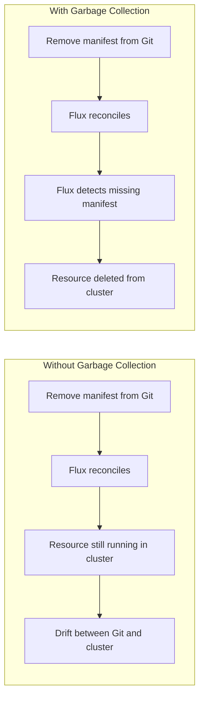
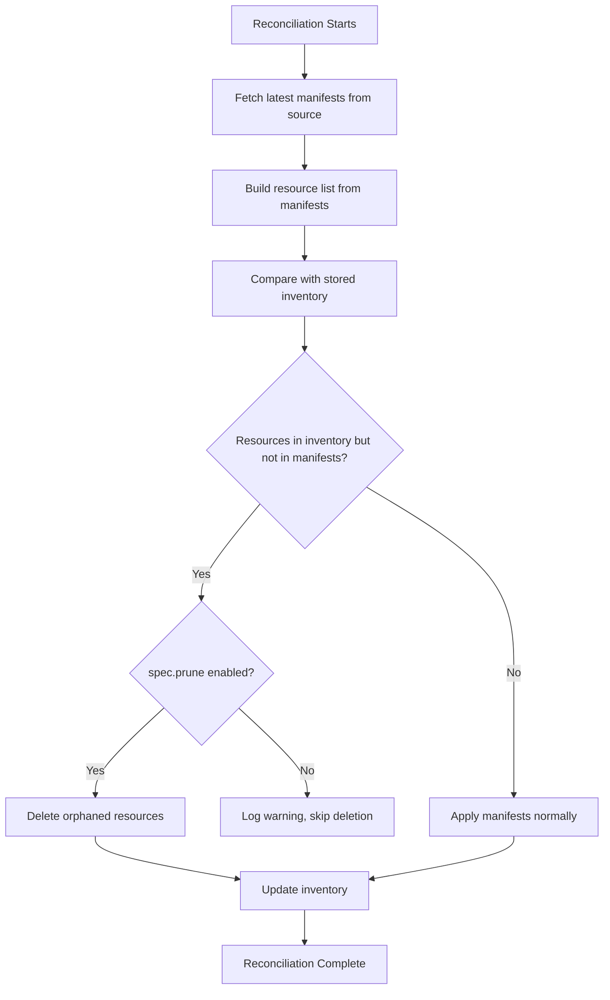

# How Flux CD Garbage Collection Works for Deleted Resources

Author: [nawazdhandala](https://github.com/nawazdhandala)

Tags: Flux CD, GitOps, Kubernetes, Garbage Collection, Resource Management

Description: Learn how Flux CD garbage collection automatically removes Kubernetes resources that have been deleted from your Git repository.

---

One of the core principles of GitOps is that your Git repository is the single source of truth for your infrastructure. When you remove a resource definition from Git, the corresponding resource should also be removed from your cluster. Flux CD handles this through its garbage collection mechanism, controlled by the `spec.prune` field. In this post, we will explore how garbage collection works, how to configure it, and what safeguards exist.

## The Problem Garbage Collection Solves

Without garbage collection, removing a manifest from your Git repository would leave the corresponding Kubernetes resource running in the cluster. Over time, this leads to drift between your declared state and your actual cluster state, creating orphaned resources that consume cluster resources and potentially cause conflicts.

The following diagram illustrates the problem:



## Enabling Garbage Collection

Garbage collection is controlled by the `spec.prune` field on a Kustomization resource. When set to `true`, Flux will delete any resources it previously applied that are no longer present in the source.

```yaml
# Kustomization with garbage collection enabled
apiVersion: kustomize.toolkit.fluxcd.io/v1
kind: Kustomization
metadata:
  name: my-app
  namespace: flux-system
spec:
  interval: 10m
  path: ./deploy
  # Enable garbage collection - deleted manifests will be removed from cluster
  prune: true
  sourceRef:
    kind: GitRepository
    name: my-repo
```

When `spec.prune` is set to `false` (the default), Flux will not remove resources that are no longer present in the source. This is the safer option for initial setup and testing.

## How Flux Tracks Managed Resources

Flux uses labels and an inventory to track which resources it manages. When Flux applies a resource, it adds a set of labels and annotations to mark ownership:

```yaml
# Labels Flux adds to managed resources
metadata:
  labels:
    # Identifies which Kustomization manages this resource
    kustomize.toolkit.fluxcd.io/name: my-app
    kustomize.toolkit.fluxcd.io/namespace: flux-system
```

Flux also maintains an inventory in the Kustomization status that records all resources it has applied:

```yaml
# Inventory stored in the Kustomization status
status:
  inventory:
    entries:
      - id: my-app_default_apps_Deployment
        v: v1
      - id: my-app-svc_default__Service
        v: v1
      - id: my-app-config_default__ConfigMap
        v: v1
```

During each reconciliation, Flux compares the current set of manifests from the source with the inventory. Any resource in the inventory that is no longer present in the source is a candidate for garbage collection.

## The Garbage Collection Process

Here is the step-by-step flow of how garbage collection works during reconciliation:



## Controlling Garbage Collection with Labels

You can prevent specific resources from being garbage collected by using the `kustomize.toolkit.fluxcd.io/prune: disabled` annotation. This is useful for resources that should persist even if they are removed from the source.

```yaml
# Resource that will not be garbage collected even if removed from Git
apiVersion: v1
kind: Namespace
metadata:
  name: critical-namespace
  annotations:
    # Prevent Flux from deleting this resource during garbage collection
    kustomize.toolkit.fluxcd.io/prune: disabled
```

## Garbage Collection Order

Flux deletes resources in reverse order of their apply order. This means that resources that depend on other resources are deleted first, reducing the likelihood of errors during cleanup.

For example, if Flux manages a Namespace and a Deployment within it, the Deployment is deleted before the Namespace when both are removed from Git.

## Safe Garbage Collection Practices

Here are some patterns for safely managing garbage collection in production environments.

### Start with Prune Disabled

When first setting up a Kustomization, keep `prune: false` until you are confident that your manifests are correct:

```yaml
# Initial setup - prune disabled for safety
apiVersion: kustomize.toolkit.fluxcd.io/v1
kind: Kustomization
metadata:
  name: my-app
  namespace: flux-system
spec:
  interval: 10m
  path: ./deploy
  # Keep disabled until confident in the manifest set
  prune: false
  sourceRef:
    kind: GitRepository
    name: my-repo
```

### Use Force for Stuck Resources

Sometimes garbage collection can fail if a resource has a finalizer that is stuck. You can use `spec.force` to handle this:

```yaml
# Force apply can help with stuck resources
apiVersion: kustomize.toolkit.fluxcd.io/v1
kind: Kustomization
metadata:
  name: my-app
  namespace: flux-system
spec:
  interval: 10m
  path: ./deploy
  prune: true
  # Force apply - use with caution
  force: true
  sourceRef:
    kind: GitRepository
    name: my-repo
```

### Protect Critical Resources

For resources like Namespaces, PersistentVolumeClaims, or CustomResourceDefinitions, consider adding the prune-disabled annotation:

```yaml
# Protect PVCs from accidental garbage collection
apiVersion: v1
kind: PersistentVolumeClaim
metadata:
  name: database-storage
  namespace: production
  annotations:
    # This PVC will never be pruned by Flux
    kustomize.toolkit.fluxcd.io/prune: disabled
spec:
  accessModes:
    - ReadWriteOnce
  resources:
    requests:
      storage: 100Gi
```

## Garbage Collection with HelmRelease

For HelmRelease resources, garbage collection works differently. When a HelmRelease is deleted, Helm's built-in uninstall mechanism handles the cleanup of chart resources. You do not need to configure `spec.prune` on HelmRelease objects directly, but the Kustomization that manages the HelmRelease should have `spec.prune: true` to clean up the HelmRelease custom resource itself.

```yaml
# Kustomization managing HelmRelease objects with prune enabled
apiVersion: kustomize.toolkit.fluxcd.io/v1
kind: Kustomization
metadata:
  name: helm-releases
  namespace: flux-system
spec:
  interval: 10m
  path: ./helm-releases
  prune: true
  sourceRef:
    kind: GitRepository
    name: my-repo
```

When this Kustomization prunes a HelmRelease, Flux first deletes the HelmRelease custom resource, which triggers the Helm controller to uninstall the chart and clean up the associated resources.

## Verifying Garbage Collection

You can verify which resources Flux would prune by inspecting the Kustomization's inventory:

```bash
# View the current inventory of managed resources
kubectl get kustomization my-app -n flux-system -o jsonpath='{.status.inventory.entries}' | jq .

# Check Flux events for garbage collection actions
kubectl events -n flux-system --for kustomization/my-app

# Use the Flux CLI to see reconciliation details
flux get kustomization my-app
```

## Common Pitfalls

1. **Moving resources between Kustomizations**: If you move a resource from one Kustomization to another, the original Kustomization will try to prune it. Apply the resource with the new Kustomization first, then remove it from the old one.

2. **Renaming resources**: Renaming a resource in Git is equivalent to deleting the old one and creating a new one. The old resource will be garbage collected if prune is enabled.

3. **Shared resources**: If multiple Kustomizations manage the same resource, pruning from one may delete a resource that another Kustomization expects to exist. Avoid overlapping resource ownership.

## Conclusion

Flux CD's garbage collection mechanism is essential for maintaining consistency between your Git repository and your Kubernetes cluster. By enabling `spec.prune: true`, you ensure that deleted manifests result in deleted cluster resources. Use annotations to protect critical resources, start with prune disabled during initial setup, and be mindful of resource ownership boundaries between Kustomizations. This approach keeps your cluster clean and aligned with your declared state in Git.
