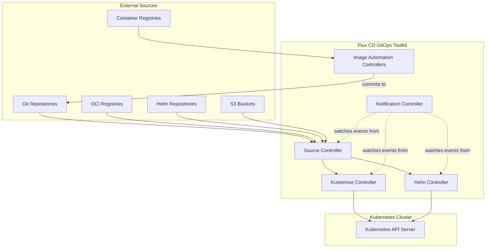
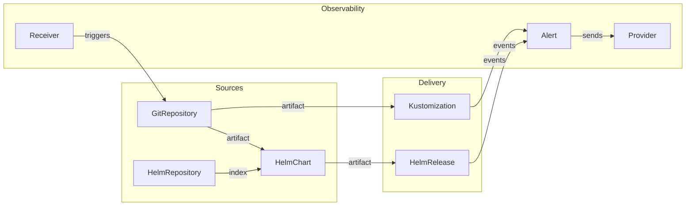

# How the Flux CD GitOps Toolkit Architecture Works

Author: [nawazdhandala](https://github.com/nawazdhandala)

Tags: Flux CD, GitOps, Kubernetes, GitOps Toolkit, Architecture, Controller

Description: An architectural overview of the Flux CD GitOps Toolkit, explaining how its modular controller-based design enables flexible and extensible continuous delivery for Kubernetes.

---

## What Is the GitOps Toolkit?

The GitOps Toolkit (GOTK) is the set of composable APIs and specialized controllers that make up Flux CD. Rather than being a single monolithic application, Flux CD is built as a collection of independent controllers, each responsible for a specific part of the delivery pipeline. This modular architecture allows each component to be developed, tested, and scaled independently.

The GitOps Toolkit was designed with these principles:

- **Composable** - Each controller can be used independently or together with others.
- **Extensible** - Custom controllers can be built using the same APIs.
- **Kubernetes-native** - Everything is a custom resource, managed through the Kubernetes API.

## The Controllers

Flux CD consists of four core controllers and one optional controller:



### Source Controller

The source-controller is the foundation of the toolkit. It is responsible for acquiring artifacts from external sources and making them available to other controllers.

**Custom Resources it manages:**
- `GitRepository` - Clones Git repositories
- `OCIRepository` - Pulls OCI artifacts from container registries
- `HelmRepository` - Indexes Helm chart repositories
- `HelmChart` - Fetches specific Helm charts
- `Bucket` - Downloads from S3-compatible storage

```yaml
# The source-controller is deployed as a Kubernetes Deployment
apiVersion: apps/v1
kind: Deployment
metadata:
  name: source-controller
  namespace: flux-system
spec:
  replicas: 1
  selector:
    matchLabels:
      app: source-controller
  template:
    spec:
      containers:
        - name: manager
          image: ghcr.io/fluxcd/source-controller
          args:
            - --storage-path=/data      # Where artifacts are stored
            - --storage-adv-addr=source-controller.flux-system.svc.cluster.local.
          ports:
            - containerPort: 9090       # HTTP server for artifact downloads
            - containerPort: 8080       # Health and metrics
```

The source-controller runs an internal HTTP server that serves artifact tarballs to other controllers. This is how the kustomize-controller and helm-controller access the fetched content without needing their own Git or Helm clients.

### Kustomize Controller

The kustomize-controller watches for `Kustomization` resources and applies manifests to the cluster. It downloads artifacts from the source-controller, optionally runs `kustomize build`, performs variable substitution, and uses server-side apply to manage resources.

**Custom Resources it manages:**
- `Kustomization` - Defines what to deploy and how to reconcile

```yaml
# A Kustomization with all key features demonstrated
apiVersion: kustomize.toolkit.fluxcd.io/v1
kind: Kustomization
metadata:
  name: platform-components
  namespace: flux-system
spec:
  interval: 15m
  sourceRef:
    kind: GitRepository
    name: fleet-infra
  path: ./infrastructure/production
  prune: true
  wait: true
  timeout: 5m
  decryption:
    provider: sops            # Decrypt SOPS-encrypted secrets
    secretRef:
      name: sops-age-key
  patches:                     # Inline patches applied after kustomize build
    - target:
        kind: Deployment
        labelSelector: "app.kubernetes.io/part-of=platform"
      patch: |
        - op: add
          path: /spec/template/spec/tolerations
          value:
            - key: dedicated
              operator: Equal
              value: platform
              effect: NoSchedule
```

Key capabilities of the kustomize-controller:
- Server-side apply with field ownership tracking
- SOPS and Age decryption for secrets
- Post-build variable substitution from ConfigMaps and Secrets
- Garbage collection (pruning) of removed resources
- Health assessment of applied resources
- Dependency ordering between Kustomizations

### Helm Controller

The helm-controller manages Helm chart releases. It watches `HelmRelease` resources and coordinates with the source-controller to fetch charts, then installs or upgrades them using the Helm SDK (not the Helm CLI).

**Custom Resources it manages:**
- `HelmRelease` - Defines a Helm chart release and its values

```yaml
# A HelmRelease demonstrating the helm-controller's capabilities
apiVersion: helm.toolkit.fluxcd.io/v2
kind: HelmRelease
metadata:
  name: ingress-nginx
  namespace: flux-system
spec:
  interval: 30m
  chart:
    spec:
      chart: ingress-nginx
      version: "4.x"            # Semver constraint
      sourceRef:
        kind: HelmRepository
        name: ingress-nginx
  install:
    crds: CreateReplace          # Install CRDs on first install
    remediation:
      retries: 3
  upgrade:
    crds: CreateReplace
    remediation:
      retries: 3
      remediateLastFailure: true
  values:
    controller:
      replicaCount: 2
      service:
        type: LoadBalancer
  valuesFrom:
    - kind: ConfigMap
      name: ingress-shared-values  # Merge values from a ConfigMap
```

The helm-controller also handles:
- Automatic rollback on failed upgrades
- CRD lifecycle management
- Drift detection and correction for Helm releases
- Value overrides from ConfigMaps and Secrets
- Test execution after installs and upgrades

### Notification Controller

The notification-controller handles both inbound and outbound events. It watches events from other Flux controllers and forwards them to external systems. It also receives webhooks from external systems and triggers reconciliation.

**Custom Resources it manages:**
- `Provider` - Defines an external notification destination
- `Alert` - Defines which events to forward and where
- `Receiver` - Defines a webhook endpoint that triggers reconciliation

```yaml
# Provider for Slack notifications
apiVersion: notification.toolkit.fluxcd.io/v1beta3
kind: Provider
metadata:
  name: slack
  namespace: flux-system
spec:
  type: slack
  channel: deployments
  secretRef:
    name: slack-webhook-url
---
# Alert that sends failure events to Slack
apiVersion: notification.toolkit.fluxcd.io/v1beta3
kind: Alert
metadata:
  name: deployment-failures
  namespace: flux-system
spec:
  providerRef:
    name: slack
  eventSeverity: error
  eventSources:
    - kind: Kustomization
      name: '*'
    - kind: HelmRelease
      name: '*'
---
# Receiver that triggers reconciliation on GitHub webhook
apiVersion: notification.toolkit.fluxcd.io/v1
kind: Receiver
metadata:
  name: github-webhook
  namespace: flux-system
spec:
  type: github
  events:
    - "ping"
    - "push"
  secretRef:
    name: github-webhook-token
  resources:
    - apiVersion: source.toolkit.fluxcd.io/v1
      kind: GitRepository
      name: fleet-infra
```

### Image Automation Controllers (Optional)

These are two controllers that automate image updates:

- **image-reflector-controller** - Scans container registries for new image tags.
- **image-automation-controller** - Updates Git repositories with new image references.

```yaml
# Scan a container registry for new tags
apiVersion: image.toolkit.fluxcd.io/v1
kind: ImageRepository
metadata:
  name: my-app
  namespace: flux-system
spec:
  interval: 5m
  image: ghcr.io/my-org/my-app
---
# Define a policy for which tags to track
apiVersion: image.toolkit.fluxcd.io/v1
kind: ImagePolicy
metadata:
  name: my-app
  namespace: flux-system
spec:
  imageRepositoryRef:
    name: my-app
  policy:
    semver:
      range: ">=1.0.0"       # Track semver tags >= 1.0.0
---
# Automatically update the Git repo when a new image is found
apiVersion: image.toolkit.fluxcd.io/v1
kind: ImageUpdateAutomation
metadata:
  name: my-app
  namespace: flux-system
spec:
  interval: 30m
  sourceRef:
    kind: GitRepository
    name: fleet-infra
  git:
    checkout:
      ref:
        branch: main
    commit:
      author:
        name: fluxcdbot
        email: flux@my-org.com
      messageTemplate: "Update image to {{.NewImage}}"
    push:
      branch: main
  update:
    path: ./apps
    strategy: Setters         # Uses marker comments in YAML to find update targets
```

## How the Toolkit Fits Together

The following diagram shows the complete data flow through the GitOps Toolkit:



Each controller operates independently, communicating through the Kubernetes API. The source-controller produces artifacts, the kustomize-controller and helm-controller consume them, and the notification-controller observes the whole process and bridges it to external systems.

## Deployment Topology

All Flux controllers run in the `flux-system` namespace by default. They are standard Kubernetes Deployments with leader election enabled for high availability.

```bash
# View all Flux controllers running in the cluster
kubectl get deployments -n flux-system

# Typical output:
# NAME                          READY   AGE
# source-controller             1/1     30d
# kustomize-controller          1/1     30d
# helm-controller               1/1     30d
# notification-controller       1/1     30d
```

## Summary

The Flux CD GitOps Toolkit is a modular architecture of specialized Kubernetes controllers. The source-controller acquires artifacts from external sources, the kustomize-controller and helm-controller apply them to the cluster, and the notification-controller handles event routing. Each controller manages its own set of custom resources and communicates with others through the Kubernetes API. This composable design means you can use only the controllers you need and extend the system with custom controllers that follow the same patterns.
