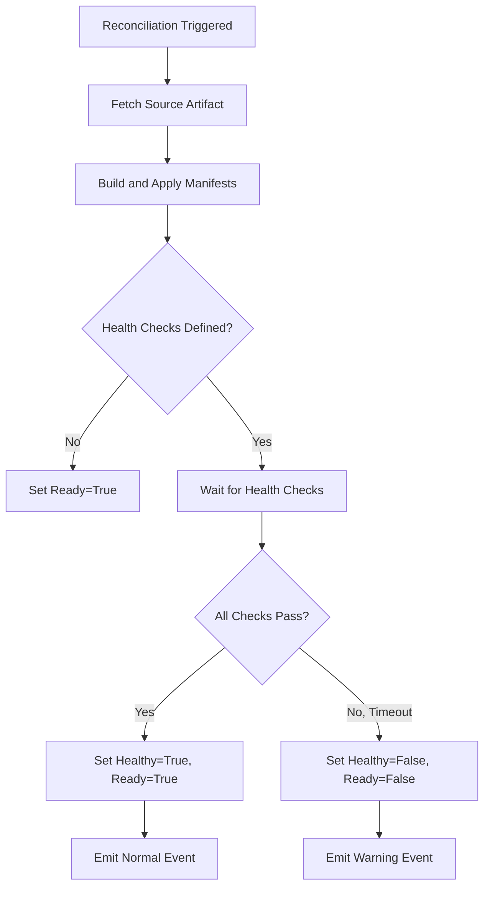

# How to Understand Flux CD Health Checks and Status Conditions

Author: [nawazdhandala](https://github.com/nawazdhandala)

Tags: Flux CD, GitOps, Kubernetes, Health Check, Status Conditions, Monitoring

Description: Learn how Flux CD health checks and status conditions work to provide visibility into the state of your GitOps reconciliation pipeline.

---

Flux CD provides a robust health checking mechanism that allows you to monitor the status of your deployed resources and understand whether reconciliation has succeeded, failed, or is still in progress. In this post, we will explore how Flux CD health checks work, what status conditions mean, and how to configure them effectively.

## What Are Flux CD Status Conditions

Every Flux CD custom resource (such as Kustomization, HelmRelease, GitRepository, etc.) includes a `.status.conditions` field that follows the Kubernetes conditions convention. These conditions provide structured information about the current state of the resource.

Each condition has the following fields:

- **type**: The category of the condition (e.g., `Ready`, `Healthy`, `Reconciling`)
- **status**: Either `True`, `False`, or `Unknown`
- **reason**: A machine-readable reason for the condition
- **message**: A human-readable description
- **lastTransitionTime**: When the condition last changed

Here is what a typical status block looks like on a Kustomization resource:

```yaml
# Example status conditions on a Kustomization resource
apiVersion: kustomize.toolkit.fluxcd.io/v1
kind: Kustomization
metadata:
  name: my-app
  namespace: flux-system
status:
  conditions:
    - type: Ready
      status: "True"
      reason: ReconciliationSucceeded
      message: "Applied revision: main@sha1:abc123"
      lastTransitionTime: "2026-03-05T10:00:00Z"
    - type: Reconciling
      status: "False"
      reason: ReconciliationSucceeded
      lastTransitionTime: "2026-03-05T10:00:00Z"
    - type: Healthy
      status: "True"
      reason: HealthCheckSucceeded
      message: "All health checks passed"
      lastTransitionTime: "2026-03-05T10:00:05Z"
```

## How Health Checks Work

Flux CD can perform health checks on the resources it manages. When you define health checks in a Kustomization, Flux waits after applying resources and then verifies that they have reached a healthy state before marking the reconciliation as successful.

The following diagram shows the reconciliation and health check flow:



## Configuring Health Checks

You can configure health checks in a Kustomization using the `spec.healthChecks` field. This field accepts a list of resource references that Flux should monitor after applying manifests.

Here is an example Kustomization with health checks configured:

```yaml
# Kustomization with explicit health checks for a Deployment and StatefulSet
apiVersion: kustomize.toolkit.fluxcd.io/v1
kind: Kustomization
metadata:
  name: my-app
  namespace: flux-system
spec:
  interval: 10m
  path: ./deploy
  prune: true
  sourceRef:
    kind: GitRepository
    name: my-repo
  # Health checks wait for these resources to become ready
  healthChecks:
    - apiVersion: apps/v1
      kind: Deployment
      name: frontend
      namespace: my-app
    - apiVersion: apps/v1
      kind: StatefulSet
      name: database
      namespace: my-app
  # Maximum time to wait for health checks to pass
  timeout: 5m
```

The `spec.timeout` field determines how long Flux waits for all health checks to pass. If the timeout expires before all resources are healthy, the Kustomization is marked as unhealthy.

## Built-in Health Assessment

Starting with Flux v2, Kustomizations also support a `spec.wait` field. When set to `true`, Flux will wait for all applied resources to become ready, without needing to list each resource individually in `spec.healthChecks`.

```yaml
# Use spec.wait to automatically wait for all applied resources
apiVersion: kustomize.toolkit.fluxcd.io/v1
kind: Kustomization
metadata:
  name: my-app
  namespace: flux-system
spec:
  interval: 10m
  path: ./deploy
  prune: true
  sourceRef:
    kind: GitRepository
    name: my-repo
  # Wait for all applied resources to be ready
  wait: true
  timeout: 5m
```

This is often more convenient than listing every resource explicitly, as it automatically covers all resources applied by the Kustomization.

## Checking Status with kubectl

You can inspect the status conditions of any Flux resource using kubectl. Here are some useful commands:

```bash
# Get the status conditions of a Kustomization
kubectl get kustomization my-app -n flux-system -o yaml | grep -A 20 "conditions:"

# Use the Flux CLI to check status in a human-readable format
flux get kustomizations

# Get detailed status including health check results
flux get kustomization my-app --verbose

# Watch for status changes in real time
flux get kustomizations --watch
```

## Understanding Common Status Conditions

Here is a reference for the most common condition types and what they indicate:

| Condition Type | Status | Reason | Meaning |
|---------------|--------|--------|---------|
| Ready | True | ReconciliationSucceeded | Reconciliation completed successfully |
| Ready | False | ReconciliationFailed | Reconciliation encountered an error |
| Ready | False | HealthCheckFailed | Applied resources did not become healthy |
| Ready | False | ArtifactFailed | Source artifact could not be fetched |
| Reconciling | True | Progressing | Reconciliation is currently in progress |
| Healthy | True | HealthCheckSucceeded | All health checks passed |
| Healthy | False | HealthCheckFailed | One or more health checks failed |
| Stalled | True | HealthCheckFailed | Resource is stuck and not making progress |

## HelmRelease Health Checks

HelmRelease resources have their own health assessment mechanism. By default, Helm tracks the health of resources created by the chart. You can customize this behavior:

```yaml
# HelmRelease with custom health check configuration
apiVersion: helm.toolkit.fluxcd.io/v2
kind: HelmRelease
metadata:
  name: my-helm-app
  namespace: flux-system
spec:
  interval: 10m
  chart:
    spec:
      chart: my-chart
      version: "1.0.0"
      sourceRef:
        kind: HelmRepository
        name: my-repo
  # Configure how long to wait for the release to become ready
  timeout: 10m
  # Install configuration
  install:
    # Remediate if install fails
    remediation:
      retries: 3
  # Upgrade configuration
  upgrade:
    # Remediate if upgrade fails
    remediation:
      retries: 3
```

## Setting Up Alerts Based on Status

You can use Flux's notification controller to send alerts when health checks fail. This is useful for integrating with monitoring systems.

```yaml
# Alert configuration to notify on health check failures
apiVersion: notification.toolkit.fluxcd.io/v1
kind: Alert
metadata:
  name: health-check-alerts
  namespace: flux-system
spec:
  providerRef:
    name: slack-provider
  eventSeverity: error
  eventSources:
    - kind: Kustomization
      name: "*"
    - kind: HelmRelease
      name: "*"
  # Only alert on specific event reasons
  exclusionList:
    - ".*Progressing.*"
```

## Best Practices

1. **Always set a timeout**: Without a timeout, health checks could wait indefinitely. Set a reasonable timeout based on how long your application takes to start.

2. **Use spec.wait for simplicity**: Instead of listing every resource in `spec.healthChecks`, use `spec.wait: true` to automatically track all applied resources.

3. **Configure alerts**: Set up notifications so your team is informed when health checks fail, rather than relying on manual inspection.

4. **Monitor Ready conditions**: The `Ready` condition is the primary indicator of whether a Flux resource is functioning correctly. Build your monitoring dashboards around this condition.

5. **Check for Stalled conditions**: A `Stalled` condition indicates that a resource is not making progress and may require manual intervention.

## Conclusion

Flux CD's health check and status condition system provides a comprehensive way to monitor the state of your GitOps pipeline. By understanding how conditions work, configuring appropriate health checks, and setting up alerts, you can ensure that your deployments are reliable and that issues are caught early. The combination of `spec.healthChecks`, `spec.wait`, and `spec.timeout` gives you fine-grained control over how Flux validates your deployments.
