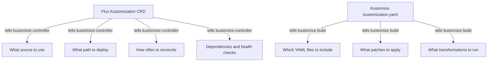
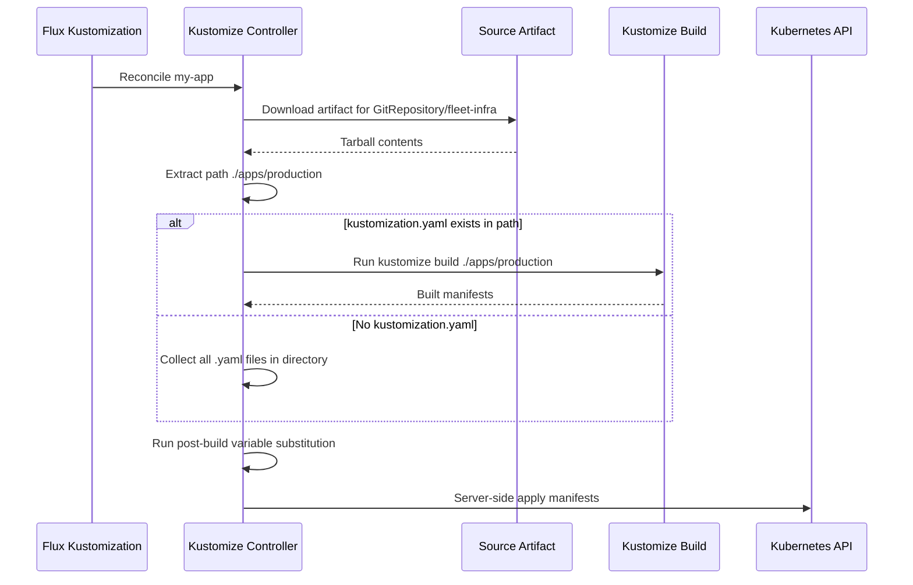

# How to Understand Flux CD Kustomization vs Kustomize Kustomization

Author: [nawazdhandala](https://github.com/nawazdhandala)

Tags: Flux CD, GitOps, Kubernetes, Kustomize, Kustomization

Description: A clear explanation of the difference between a Flux CD Kustomization resource and a Kustomize kustomization.yaml file, two similarly named but distinct concepts that often cause confusion.

---

## The Naming Confusion

One of the most common sources of confusion for people new to Flux CD is the word "Kustomization." It refers to two different things:

1. **Kustomize kustomization.yaml** - A file used by the `kustomize` tool (built into `kubectl`) to define how Kubernetes manifests should be composed and transformed.
2. **Flux CD Kustomization** - A custom Kubernetes resource (`kustomize.toolkit.fluxcd.io/v1`) that tells the Flux kustomize-controller what to deploy and how to reconcile it.

These are not the same thing. They work together, but they serve different purposes and operate at different levels.



## Kustomize kustomization.yaml Explained

Kustomize is a standalone tool for customizing Kubernetes manifests without using templates. Its configuration file is called `kustomization.yaml`. This file lists the resources to include and the transformations to apply.

```yaml
# kustomization.yaml - a Kustomize file that composes manifests
apiVersion: kustomize.config.k8s.io/v1beta1
kind: Kustomization

# List the base resources to include
resources:
  - deployment.yaml
  - service.yaml
  - configmap.yaml

# Apply a common label to all resources
commonLabels:
  app.kubernetes.io/part-of: my-app

# Set the namespace for all resources
namespace: production

# Apply patches to customize specific resources
patches:
  - target:
      kind: Deployment
      name: my-app
    patch: |
      - op: replace
        path: /spec/replicas
        value: 3

# Reference other kustomizations as bases
# resources:
#   - ../../base
```

You use this file with `kustomize build` or `kubectl apply -k`:

```bash
# Build the final manifests using kustomize
kustomize build ./deploy/production

# Apply directly with kubectl
kubectl apply -k ./deploy/production
```

Kustomize operates purely on files. It reads YAML, transforms it, and outputs YAML. It has no concept of Git, reconciliation intervals, or health checks.

## Flux CD Kustomization Explained

A Flux CD Kustomization is a Kubernetes custom resource. It lives in the cluster and instructs the kustomize-controller to fetch manifests from a source, optionally run `kustomize build`, and apply the result to the cluster.

```yaml
# Flux Kustomization CRD - a cluster resource that drives reconciliation
apiVersion: kustomize.toolkit.fluxcd.io/v1
kind: Kustomization
metadata:
  name: my-app
  namespace: flux-system
spec:
  interval: 10m              # Reconcile every 10 minutes
  retryInterval: 2m          # Retry failed reconciliations every 2 minutes
  timeout: 5m                # Timeout for apply and health checks
  sourceRef:
    kind: GitRepository       # Reference to a Flux source
    name: fleet-infra
  path: ./apps/production     # Path within the source artifact
  prune: true                 # Remove resources deleted from Git
  wait: true                  # Wait for resources to be ready
  force: false                # Do not force apply (avoid overwriting conflicts)
  targetNamespace: production # Override namespace for all resources
  dependsOn:
    - name: infrastructure    # Wait for infrastructure to be ready first
  healthChecks:
    - apiVersion: apps/v1
      kind: Deployment
      name: my-app
      namespace: production
  postBuild:
    substituteFrom:
      - kind: ConfigMap
        name: cluster-vars    # Inject variables after kustomize build
```

This resource has capabilities far beyond what a `kustomization.yaml` file provides:

- **Source binding** - It knows which Git repository, OCI registry, or bucket to pull from.
- **Reconciliation** - It continuously checks and reapplies the desired state.
- **Pruning** - It can delete resources that no longer exist in Git.
- **Dependencies** - It can wait for other Kustomizations to succeed first.
- **Health checks** - It verifies that deployed resources are healthy.
- **Variable substitution** - It can inject values after building manifests.

## How They Work Together

When the kustomize-controller processes a Flux Kustomization, it looks at the `spec.path` within the source artifact. If that path contains a `kustomization.yaml` file, the controller runs `kustomize build` on it. If there is no `kustomization.yaml`, it simply collects all YAML files in that directory.



## Side-by-Side Comparison

Here is a direct comparison to make the distinction clear:

| Feature | Kustomize kustomization.yaml | Flux CD Kustomization |
|---------|-----------------------------|-----------------------|
| Type | File on disk | Kubernetes custom resource |
| API Group | kustomize.config.k8s.io | kustomize.toolkit.fluxcd.io |
| Purpose | Compose and transform YAML | Drive continuous reconciliation |
| Runs where | Locally or in CI | Inside the cluster |
| Knows about Git | No | Yes (via sourceRef) |
| Reconciliation | None (one-shot) | Continuous at spec.interval |
| Pruning | No | Yes (spec.prune) |
| Dependencies | No | Yes (spec.dependsOn) |
| Health checks | No | Yes (spec.healthChecks) |
| Variable substitution | No | Yes (spec.postBuild) |

## A Complete Example Using Both

Here is a repository layout that uses both a Kustomize `kustomization.yaml` and a Flux Kustomization:

```bash
# Repository structure
fleet-infra/
├── apps/
│   ├── base/
│   │   ├── deployment.yaml
│   │   ├── service.yaml
│   │   └── kustomization.yaml    # <-- Kustomize file
│   └── production/
│       ├── kustomization.yaml    # <-- Kustomize file (references base)
│       └── replica-patch.yaml
└── clusters/
    └── production/
        └── apps.yaml             # <-- Flux Kustomization resource
```

The Kustomize file in `apps/base/`:

```yaml
# apps/base/kustomization.yaml - Kustomize file listing base resources
apiVersion: kustomize.config.k8s.io/v1beta1
kind: Kustomization
resources:
  - deployment.yaml
  - service.yaml
```

The Kustomize file in `apps/production/`:

```yaml
# apps/production/kustomization.yaml - Kustomize overlay for production
apiVersion: kustomize.config.k8s.io/v1beta1
kind: Kustomization
resources:
  - ../base
namespace: production
patches:
  - path: replica-patch.yaml
```

The Flux Kustomization in `clusters/production/apps.yaml`:

```yaml
# clusters/production/apps.yaml - Flux Kustomization that reconciles the above
apiVersion: kustomize.toolkit.fluxcd.io/v1
kind: Kustomization
metadata:
  name: apps
  namespace: flux-system
spec:
  interval: 10m
  sourceRef:
    kind: GitRepository
    name: fleet-infra
  path: ./apps/production    # Points to the directory with the Kustomize overlay
  prune: true
  wait: true
```

When the kustomize-controller reconciles the Flux Kustomization named `apps`, it downloads the source artifact, navigates to `./apps/production`, finds the `kustomization.yaml` there, runs `kustomize build`, and applies the resulting manifests to the cluster.

## Common Mistakes

**Mistake 1: Confusing the API versions.** If you put a Flux Kustomization spec inside a `kustomization.yaml` file or vice versa, the tools will not understand it. They are different APIs.

**Mistake 2: Thinking you need a kustomization.yaml file.** You do not. If the path in your Flux Kustomization contains plain YAML files without a `kustomization.yaml`, the controller will still apply them. The Kustomize file is optional.

**Mistake 3: Assuming the Flux Kustomization replaces Kustomize.** It does not. The Flux Kustomization orchestrates deployment. The Kustomize `kustomization.yaml` handles manifest composition. They are complementary.

## Summary

The Flux CD Kustomization is a Kubernetes custom resource that drives continuous reconciliation. The Kustomize `kustomization.yaml` is a file that composes and transforms Kubernetes manifests. The Flux kustomize-controller uses the Kustomize tool internally when it finds a `kustomization.yaml` in the specified path, but the Flux Kustomization itself controls the reconciliation lifecycle - the source, the schedule, pruning, dependencies, and health checks. Understanding this distinction is fundamental to working effectively with Flux CD.
