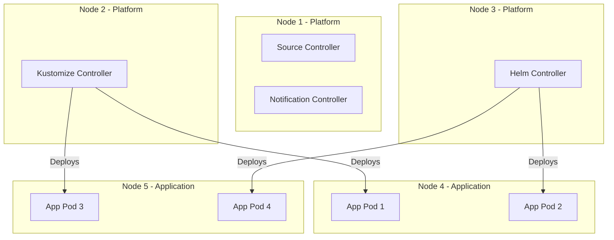

# How to Set Up Flux CD on a Multi-Node Cluster

Author: [nawazdhandala](https://github.com/nawazdhandala)

Tags: Flux CD, GitOps, Kubernetes, Multi-Node, High Availability, Scheduling

Description: Learn how to deploy and configure Flux CD on a multi-node Kubernetes cluster with proper scheduling, high availability, and resource distribution.

---

## Why Multi-Node Configuration Matters for Flux CD

Flux CD works on any Kubernetes cluster, whether single-node or multi-node. However, on multi-node clusters, you need to consider:

- **Pod scheduling**: Ensure Flux controllers are spread across nodes for resilience.
- **High availability**: Prevent a single node failure from taking down all Flux controllers.
- **Resource contention**: Avoid scheduling Flux on nodes that are already resource-constrained.
- **Node affinity**: Place Flux controllers on appropriate node types (e.g., system nodes vs. application nodes).

This guide covers best practices for running Flux CD on multi-node clusters.

## Prerequisites

- A multi-node Kubernetes cluster (v1.20+, minimum 3 nodes recommended)
- `flux` CLI installed (v2.0+)
- `kubectl` configured to access your cluster
- Nodes labeled appropriately for workload scheduling

## Step 1: Bootstrap Flux CD

Start with a standard Flux CD bootstrap:

```bash
# Bootstrap Flux CD
flux bootstrap github \
  --owner=my-org \
  --repository=fleet-infra \
  --branch=main \
  --path=clusters/production
```

After bootstrap, all Flux controllers run in the `flux-system` namespace with default scheduling behavior. The following steps customize this for multi-node resilience.

## Step 2: Label Nodes for Flux Controllers

Designate specific nodes for platform/system workloads. This keeps Flux controllers on nodes reserved for infrastructure:

```bash
# Label nodes designated for system workloads
kubectl label node node-1 node-role.kubernetes.io/platform=true
kubectl label node node-2 node-role.kubernetes.io/platform=true
kubectl label node node-3 node-role.kubernetes.io/platform=true

# Verify labels
kubectl get nodes --show-labels | grep platform
```

## Step 3: Configure Pod Anti-Affinity

Spread Flux controller replicas across different nodes to survive node failures. While Flux controllers run as single replicas by default, you can still ensure that the different controllers do not all land on the same node:

```yaml
# kustomization.yaml
# Spread Flux controllers across nodes using pod anti-affinity
apiVersion: kustomize.config.k8s.io/v1beta1
kind: Kustomization
resources:
  - gotk-components.yaml
  - gotk-sync.yaml
patches:
  # Spread source-controller away from other Flux controllers
  - target:
      kind: Deployment
      name: source-controller
      namespace: flux-system
    patch: |
      apiVersion: apps/v1
      kind: Deployment
      metadata:
        name: source-controller
      spec:
        template:
          spec:
            affinity:
              # Schedule on platform nodes
              nodeAffinity:
                requiredDuringSchedulingIgnoredDuringExecution:
                  nodeSelectorTerms:
                    - matchExpressions:
                        - key: node-role.kubernetes.io/platform
                          operator: In
                          values: ["true"]
              # Try to spread Flux controllers across different nodes
              podAntiAffinity:
                preferredDuringSchedulingIgnoredDuringExecution:
                  - weight: 100
                    podAffinityTerm:
                      labelSelector:
                        matchExpressions:
                          - key: app.kubernetes.io/part-of
                            operator: In
                            values: ["flux"]
                      topologyKey: kubernetes.io/hostname
  # Apply similar affinity to helm-controller
  - target:
      kind: Deployment
      name: helm-controller
      namespace: flux-system
    patch: |
      apiVersion: apps/v1
      kind: Deployment
      metadata:
        name: helm-controller
      spec:
        template:
          spec:
            affinity:
              nodeAffinity:
                requiredDuringSchedulingIgnoredDuringExecution:
                  nodeSelectorTerms:
                    - matchExpressions:
                        - key: node-role.kubernetes.io/platform
                          operator: In
                          values: ["true"]
              podAntiAffinity:
                preferredDuringSchedulingIgnoredDuringExecution:
                  - weight: 100
                    podAffinityTerm:
                      labelSelector:
                        matchExpressions:
                          - key: app.kubernetes.io/part-of
                            operator: In
                            values: ["flux"]
                      topologyKey: kubernetes.io/hostname
  # Apply to kustomize-controller
  - target:
      kind: Deployment
      name: kustomize-controller
      namespace: flux-system
    patch: |
      apiVersion: apps/v1
      kind: Deployment
      metadata:
        name: kustomize-controller
      spec:
        template:
          spec:
            affinity:
              nodeAffinity:
                requiredDuringSchedulingIgnoredDuringExecution:
                  nodeSelectorTerms:
                    - matchExpressions:
                        - key: node-role.kubernetes.io/platform
                          operator: In
                          values: ["true"]
              podAntiAffinity:
                preferredDuringSchedulingIgnoredDuringExecution:
                  - weight: 100
                    podAffinityTerm:
                      labelSelector:
                        matchExpressions:
                          - key: app.kubernetes.io/part-of
                            operator: In
                            values: ["flux"]
                      topologyKey: kubernetes.io/hostname
  # Apply to notification-controller
  - target:
      kind: Deployment
      name: notification-controller
      namespace: flux-system
    patch: |
      apiVersion: apps/v1
      kind: Deployment
      metadata:
        name: notification-controller
      spec:
        template:
          spec:
            affinity:
              nodeAffinity:
                requiredDuringSchedulingIgnoredDuringExecution:
                  nodeSelectorTerms:
                    - matchExpressions:
                        - key: node-role.kubernetes.io/platform
                          operator: In
                          values: ["true"]
              podAntiAffinity:
                preferredDuringSchedulingIgnoredDuringExecution:
                  - weight: 100
                    podAffinityTerm:
                      labelSelector:
                        matchExpressions:
                          - key: app.kubernetes.io/part-of
                            operator: In
                            values: ["flux"]
                      topologyKey: kubernetes.io/hostname
```

## Step 4: Configure Tolerations

If your platform nodes have taints to prevent application workloads from running on them, add tolerations to Flux controllers:

```yaml
# Patch to add tolerations for platform node taints
patches:
  - target:
      kind: Deployment
      name: source-controller
      namespace: flux-system
    patch: |
      apiVersion: apps/v1
      kind: Deployment
      metadata:
        name: source-controller
      spec:
        template:
          spec:
            tolerations:
              # Tolerate the platform node taint
              - key: "node-role.kubernetes.io/platform"
                operator: "Exists"
                effect: "NoSchedule"
              # Tolerate control-plane taint if running on control plane nodes
              - key: "node-role.kubernetes.io/control-plane"
                operator: "Exists"
                effect: "NoSchedule"
```

## Step 5: Set Resource Requests for Proper Scheduling

Ensure Flux controllers have appropriate resource requests so the scheduler can make informed placement decisions:

```yaml
# Resource configuration for multi-node scheduling
patches:
  - target:
      kind: Deployment
      name: source-controller
      namespace: flux-system
    patch: |
      apiVersion: apps/v1
      kind: Deployment
      metadata:
        name: source-controller
      spec:
        template:
          spec:
            containers:
              - name: manager
                resources:
                  requests:
                    cpu: 100m
                    memory: 256Mi
                  limits:
                    cpu: 500m
                    memory: 1Gi
  - target:
      kind: Deployment
      name: helm-controller
      namespace: flux-system
    patch: |
      apiVersion: apps/v1
      kind: Deployment
      metadata:
        name: helm-controller
      spec:
        template:
          spec:
            containers:
              - name: manager
                resources:
                  requests:
                    cpu: 200m
                    memory: 512Mi
                  limits:
                    cpu: 1000m
                    memory: 2Gi
```

## Step 6: Configure Topology Spread Constraints

For clusters with multiple availability zones, use topology spread constraints to distribute Flux controllers across zones:

```yaml
# Spread Flux controllers across availability zones
patches:
  - target:
      kind: Deployment
      name: source-controller
      namespace: flux-system
    patch: |
      apiVersion: apps/v1
      kind: Deployment
      metadata:
        name: source-controller
      spec:
        template:
          spec:
            topologySpreadConstraints:
              # Spread across availability zones
              - maxSkew: 1
                topologyKey: topology.kubernetes.io/zone
                whenUnsatisfiable: ScheduleAnyway
                labelSelector:
                  matchLabels:
                    app: source-controller
              # Spread across nodes within a zone
              - maxSkew: 1
                topologyKey: kubernetes.io/hostname
                whenUnsatisfiable: ScheduleAnyway
                labelSelector:
                  matchLabels:
                    app: source-controller
```

## Step 7: Verify Pod Distribution

After applying the scheduling configuration, verify that controllers are spread across nodes:

```bash
# Check which node each Flux controller is running on
kubectl get pods -n flux-system -o wide

# Verify pod anti-affinity is working
kubectl get pods -n flux-system -o custom-columns=\
'POD:metadata.name,NODE:spec.nodeName,STATUS:status.phase'
```

Expected output shows controllers distributed across different nodes:

```
POD                                        NODE     STATUS
source-controller-6f8bdc7f9c-xyz12         node-1   Running
kustomize-controller-7b8c5f9d4f-abc34      node-2   Running
helm-controller-5d7e8f6c4b-def56           node-3   Running
notification-controller-8c9d7e5f3a-ghi78   node-1   Running
```

## Architecture Diagram



## Step 8: Set Priority Classes

Ensure Flux controllers get scheduling priority over less critical workloads:

```yaml
# PriorityClass for Flux controllers
apiVersion: scheduling.k8s.io/v1
kind: PriorityClass
metadata:
  name: flux-system-critical
value: 1000000
globalDefault: false
description: "Priority class for Flux CD system controllers"
---
# Patch to apply priority class to all Flux controllers
# (apply similar patch to each controller deployment)
apiVersion: apps/v1
kind: Deployment
metadata:
  name: source-controller
  namespace: flux-system
spec:
  template:
    spec:
      priorityClassName: flux-system-critical
```

## Summary

Running Flux CD on a multi-node cluster requires thoughtful scheduling configuration to ensure resilience and performance. Use node affinity to place controllers on designated platform nodes, pod anti-affinity to spread them across nodes, tolerations to work with node taints, and topology spread constraints for multi-zone distribution. Set appropriate resource requests and priority classes to ensure the Kubernetes scheduler makes good placement decisions. These configurations should be managed as Kustomize patches in your Flux bootstrap repository so they persist across upgrades.
