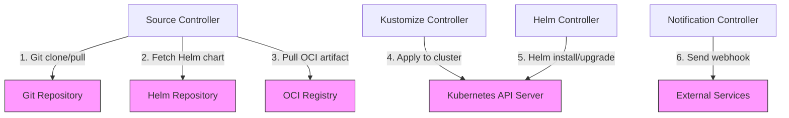
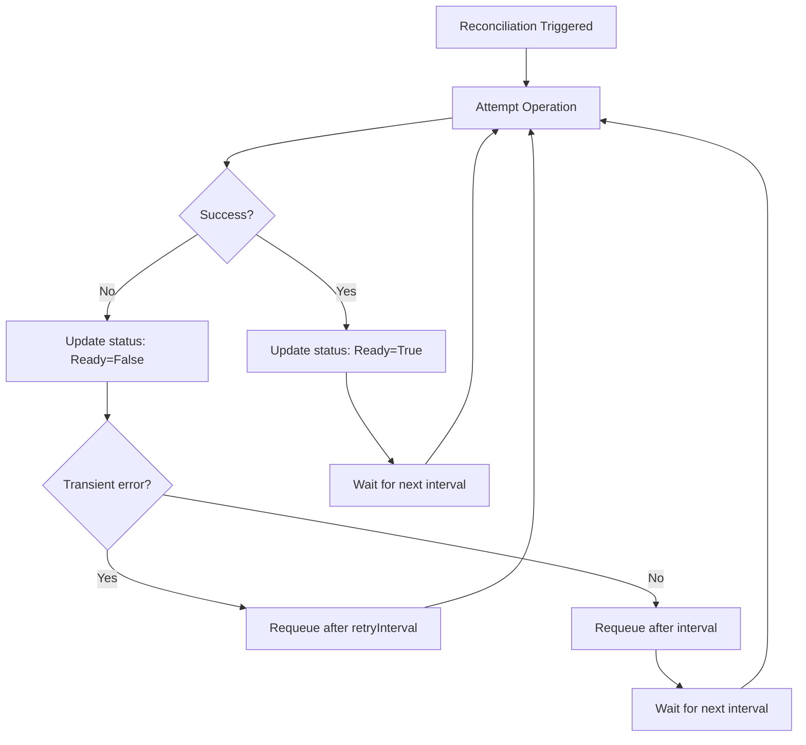
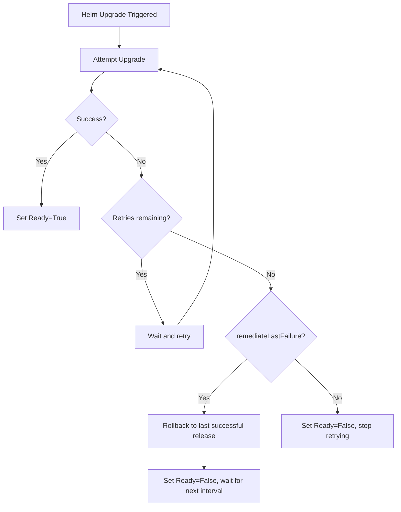

# How Flux CD Handles Network Failures and Retries

Author: [nawazdhandala](https://github.com/nawazdhandala)

Tags: Flux CD, GitOps, Kubernetes, Network Failures, Retries, Resilience, Error Handling

Description: Learn how Flux CD handles network failures during source fetching and reconciliation, including its retry mechanisms and resilience patterns.

---

Network failures are inevitable in distributed systems. Git repositories may be temporarily unreachable, Helm chart registries may experience downtime, and OCI registries may throttle requests. Flux CD is designed to handle these transient failures gracefully through retry mechanisms, exponential backoff, and clear status reporting. In this post, we will explore how Flux CD responds to network failures and how to configure retry behavior.

## Where Network Failures Occur

Flux CD communicates over the network at several points during reconciliation. Each of these is a potential failure point:



## How Flux Retries Failed Source Fetches

When the source controller fails to fetch a Git repository, Helm chart, or OCI artifact, it retries on the next reconciliation interval. The source's status is updated to reflect the failure.

```yaml
# GitRepository status after a network failure
status:
  conditions:
    - type: Ready
      status: "False"
      reason: GitOperationFailed
      message: "failed to checkout and determine revision:
        unable to clone 'https://github.com/my-org/my-repo':
        dial tcp: lookup github.com: no such host"
      lastTransitionTime: "2026-03-05T10:00:00Z"
    - type: FetchFailed
      status: "True"
      reason: GitOperationFailed
      message: "network is unreachable"
      lastTransitionTime: "2026-03-05T10:00:00Z"
  # The last successfully fetched artifact is preserved
  artifact:
    revision: "main@sha1:abc123"
    lastUpdateTime: "2026-03-05T09:50:00Z"
```

Key behavior: Even when a fetch fails, Flux preserves the last successfully fetched artifact. Kustomizations and HelmReleases continue to use this artifact until a new one is available.

## The Reconciliation Retry Loop

Flux controllers follow a retry loop for all operations:



## Configuring Retry Intervals

Flux provides two interval-related fields that control retry behavior:

```yaml
# Kustomization with retry configuration
apiVersion: kustomize.toolkit.fluxcd.io/v1
kind: Kustomization
metadata:
  name: my-app
  namespace: flux-system
spec:
  # Normal reconciliation interval
  interval: 10m
  # Shorter interval used when the last reconciliation failed
  retryInterval: 2m
  path: ./deploy
  prune: true
  sourceRef:
    kind: GitRepository
    name: my-repo
```

- **spec.interval**: The regular reconciliation interval. Used when the last reconciliation succeeded.
- **spec.retryInterval**: The interval used when the last reconciliation failed. Typically set shorter than `spec.interval` to recover faster from transient errors.

The same fields are available on source resources:

```yaml
# GitRepository with retry configuration
apiVersion: source.toolkit.fluxcd.io/v1
kind: GitRepository
metadata:
  name: my-repo
  namespace: flux-system
spec:
  # Normal fetch interval
  interval: 5m
  # Retry more frequently after a fetch failure
  retryInterval: 1m
  url: https://github.com/my-org/my-repo
  ref:
    branch: main
```

## HelmRelease Retry and Remediation

HelmReleases have additional retry configuration for install and upgrade failures, which may be caused by network issues or transient cluster problems:

```yaml
# HelmRelease with comprehensive retry and remediation settings
apiVersion: helm.toolkit.fluxcd.io/v2
kind: HelmRelease
metadata:
  name: my-app
  namespace: flux-system
spec:
  interval: 10m
  retryInterval: 2m
  chart:
    spec:
      chart: my-chart
      version: "1.0.0"
      sourceRef:
        kind: HelmRepository
        name: my-repo
  # Install remediation - what to do when install fails
  install:
    remediation:
      # Number of times to retry a failed install
      retries: 3
  # Upgrade remediation - what to do when upgrade fails
  upgrade:
    remediation:
      # Number of times to retry a failed upgrade
      retries: 3
      # Rollback to the last successful release on failure
      remediateLastFailure: true
    # Clean up failed upgrade attempts
    cleanupOnFail: true
```

The remediation flow for HelmReleases:



## Timeout Configuration

Timeouts prevent Flux from waiting indefinitely for network operations to complete:

```yaml
# Kustomization with timeout for apply operations
apiVersion: kustomize.toolkit.fluxcd.io/v1
kind: Kustomization
metadata:
  name: my-app
  namespace: flux-system
spec:
  interval: 10m
  retryInterval: 2m
  # Maximum time to wait for apply and health checks
  timeout: 5m
  path: ./deploy
  prune: true
  sourceRef:
    kind: GitRepository
    name: my-repo
```

```yaml
# GitRepository with timeout for git operations
apiVersion: source.toolkit.fluxcd.io/v1
kind: GitRepository
metadata:
  name: my-repo
  namespace: flux-system
spec:
  interval: 5m
  # Maximum time to wait for git clone/fetch operations
  timeout: 60s
  url: https://github.com/my-org/my-repo
  ref:
    branch: main
```

## Monitoring Network-Related Failures

Use these commands to identify and monitor network failures:

```bash
# Check source status for fetch failures
flux get sources git
flux get sources helm
flux get sources oci

# Get detailed error messages
kubectl get gitrepository my-repo -n flux-system -o yaml | grep -A 10 "conditions:"

# Watch for network-related events
kubectl events -n flux-system --watch | grep -i "fail\|error\|timeout"

# Check controller logs for connection errors
flux logs --kind=GitRepository --name=my-repo --level=error

# View metrics for reconciliation failures (if Prometheus is configured)
# source_controller_reconcile_condition{type="Ready",status="False"}
```

## Handling Specific Network Scenarios

### DNS Resolution Failures

If the Git server hostname cannot be resolved, Flux reports the DNS error and retries:

```bash
# Typical DNS failure message in status
# "dial tcp: lookup github.com: no such host"

# Verify DNS from within the cluster
kubectl run dns-test --rm -it --image=busybox --restart=Never -- \
  nslookup github.com
```

### TLS Certificate Errors

For self-signed certificates or certificate authority issues:

```yaml
# GitRepository with custom CA certificate
apiVersion: source.toolkit.fluxcd.io/v1
kind: GitRepository
metadata:
  name: private-repo
  namespace: flux-system
spec:
  interval: 5m
  url: https://git.internal.example.com/my-repo
  ref:
    branch: main
  # Reference a secret containing the CA certificate
  secretRef:
    name: git-credentials
  certSecretRef:
    name: ca-cert
---
# Secret containing the CA certificate
apiVersion: v1
kind: Secret
metadata:
  name: ca-cert
  namespace: flux-system
type: Opaque
data:
  ca.crt: <base64-encoded-ca-certificate>
```

### Rate Limiting

Git providers and container registries may rate-limit API calls. Flux handles this by respecting HTTP 429 responses and backing off:

```yaml
# Increase the interval to reduce API calls if you are being rate-limited
apiVersion: source.toolkit.fluxcd.io/v1
kind: GitRepository
metadata:
  name: my-repo
  namespace: flux-system
spec:
  # Increase interval to reduce API calls
  interval: 30m
  url: https://github.com/my-org/my-repo
  ref:
    branch: main
```

### Proxy Configuration

If Flux controllers need to access external resources through an HTTP proxy:

```yaml
# Set proxy environment variables on the source-controller deployment
apiVersion: apps/v1
kind: Deployment
metadata:
  name: source-controller
  namespace: flux-system
spec:
  template:
    spec:
      containers:
        - name: manager
          env:
            - name: HTTPS_PROXY
              value: "http://proxy.internal:3128"
            - name: HTTP_PROXY
              value: "http://proxy.internal:3128"
            - name: NO_PROXY
              value: ".cluster.local,.svc,10.0.0.0/8"
```

## Best Practices

1. **Set retryInterval shorter than interval**: Use `retryInterval: 1m` or `retryInterval: 2m` to recover quickly from transient network failures while keeping the regular interval longer.

2. **Configure appropriate timeouts**: Set timeouts based on your network conditions. Longer timeouts for slow networks, shorter for fast local networks.

3. **Use HelmRelease remediation**: Always configure `install.remediation.retries` and `upgrade.remediation.retries` for HelmReleases to handle transient failures during Helm operations.

4. **Monitor failure rates**: Set up alerts on Flux controller metrics and events to detect persistent network issues early.

5. **Cache Helm charts with OCI**: Consider using an in-cluster OCI registry as a Helm chart cache to reduce dependency on external registries.

6. **Test network connectivity**: Before configuring Flux sources, verify that the controllers can reach the target endpoints from within the cluster.

## Conclusion

Flux CD is designed to be resilient against network failures. Through configurable retry intervals, timeouts, and HelmRelease remediation, Flux automatically recovers from transient network issues without manual intervention. By understanding these mechanisms and configuring them appropriately for your environment, you can build a GitOps pipeline that gracefully handles the network instabilities inherent in distributed systems.
