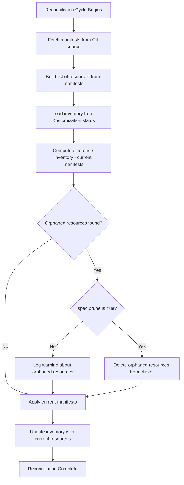
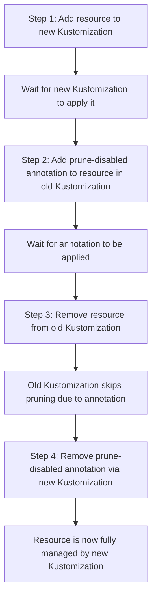

# How Flux CD Prunes Resources When Removed from Git

Author: [nawazdhandala](https://github.com/nawazdhandala)

Tags: Flux CD, GitOps, Kubernetes, Pruning, Resource Lifecycle, Drift Detection

Description: Learn the detailed mechanics of how Flux CD detects and prunes Kubernetes resources that have been removed from your Git repository.

---

When you adopt GitOps with Flux CD, your Git repository becomes the authoritative source for what should exist in your cluster. Removing a resource definition from Git should result in that resource being removed from the cluster. This process is called pruning, and Flux CD implements it through its inventory tracking and reconciliation loop. In this post, we will walk through exactly how pruning works, from detection to deletion.

## Pruning vs. Garbage Collection

Pruning and garbage collection are closely related terms in the Flux CD context. Pruning refers specifically to the act of deleting cluster resources that no longer have corresponding manifests in Git. Garbage collection is the broader mechanism that includes pruning. The key configuration field is `spec.prune` on the Kustomization resource.

## How Flux Detects Removed Resources

Flux maintains an inventory of every resource it has applied. This inventory is stored in the `.status.inventory` field of the Kustomization resource. During each reconciliation cycle, Flux compares the current set of manifests from the Git source against this inventory.



## Enabling Pruning

Pruning is not enabled by default. You must explicitly set `spec.prune: true` on your Kustomization.

```yaml
# Kustomization with pruning enabled
apiVersion: kustomize.toolkit.fluxcd.io/v1
kind: Kustomization
metadata:
  name: my-app
  namespace: flux-system
spec:
  interval: 10m
  path: ./deploy/my-app
  prune: true  # Resources removed from Git will be deleted from cluster
  sourceRef:
    kind: GitRepository
    name: my-repo
  targetNamespace: my-app
```

## A Practical Example

Let us walk through a concrete example to see pruning in action.

Suppose your Git repository contains the following directory structure:

```bash
# Initial state of deploy/my-app/ in Git
deploy/my-app/
  deployment.yaml    # Deployment: frontend
  service.yaml       # Service: frontend-svc
  configmap.yaml     # ConfigMap: frontend-config
  ingress.yaml       # Ingress: frontend-ingress
```

After Flux applies these, the Kustomization inventory contains all four resources:

```yaml
# Kustomization status after initial apply
status:
  inventory:
    entries:
      - id: my-app_frontend_apps_Deployment
        v: v1
      - id: my-app_frontend-svc__Service
        v: v1
      - id: my-app_frontend-config__ConfigMap
        v: v1
      - id: my-app_frontend-ingress_networking.k8s.io_Ingress
        v: v1
```

Now, you decide to remove the Ingress and switch to a different traffic routing approach. You delete `ingress.yaml` from Git and push.

```bash
# Updated state of deploy/my-app/ in Git
deploy/my-app/
  deployment.yaml    # Deployment: frontend
  service.yaml       # Service: frontend-svc
  configmap.yaml     # ConfigMap: frontend-config
  # ingress.yaml has been removed
```

On the next reconciliation, Flux detects that the Ingress resource is in the inventory but not in the current manifests. With `spec.prune: true`, Flux deletes the Ingress from the cluster and updates the inventory.

## Controlling Prune Order

Flux prunes resources in reverse dependency order. This means that dependent resources are deleted before the resources they depend on. For example, if you remove both a Namespace and resources within it, Flux deletes the namespaced resources first.

The general prune order (from first to last deleted) is:

1. Custom Resources
2. Workloads (Deployments, StatefulSets, DaemonSets)
3. Services, Ingresses
4. ConfigMaps, Secrets
5. RBAC resources
6. Namespaces, CRDs

## Preventing Pruning of Specific Resources

There are cases where you want pruning enabled globally but need to exclude certain resources. Flux supports a per-resource annotation to disable pruning.

```yaml
# This ConfigMap will not be pruned even if removed from Git
apiVersion: v1
kind: ConfigMap
metadata:
  name: important-config
  namespace: my-app
  annotations:
    # Opt this resource out of pruning
    kustomize.toolkit.fluxcd.io/prune: disabled
data:
  key: value
```

This is particularly useful for:

- Persistent Volume Claims that contain data you cannot recreate
- Namespaces that contain resources managed by other systems
- Custom Resource Definitions that other controllers depend on

## Dry-Run Pruning

Before enabling pruning on an existing Kustomization, you may want to see what would be pruned. While Flux does not have a built-in dry-run mode for pruning, you can compare the inventory with your current manifests.

```bash
# Get the current inventory
kubectl get kustomization my-app -n flux-system \
  -o jsonpath='{.status.inventory.entries[*].id}' | tr ' ' '\n' | sort

# List the resources in your current manifests
# (You would need to build these locally and compare)
kustomize build ./deploy/my-app | \
  grep -E "^kind:|^  name:|^  namespace:" | paste - - -
```

You can also temporarily set `spec.prune: false`, reconcile, and check the Flux logs for warnings about orphaned resources:

```bash
# Watch Flux logs for prune-related messages
kubectl logs -n flux-system deployment/kustomize-controller | grep -i prune
```

## Pruning and Resource Moves

A common pitfall occurs when moving resources between Kustomizations. If you move a Deployment definition from one Kustomization to another, the original Kustomization sees it as removed and will prune it.

To safely move resources between Kustomizations:



Here is the annotation to add during the transition:

```yaml
# Temporarily add this annotation before moving the resource
metadata:
  annotations:
    kustomize.toolkit.fluxcd.io/prune: disabled
```

## Pruning and Namespace Deletion

When pruning removes all resources from a namespace, the namespace itself is not automatically deleted unless it was also managed by the same Kustomization. If the namespace was created by Flux and is in the inventory, it will be pruned after the namespaced resources are removed.

```yaml
# If you manage namespaces in your Kustomization, they will be pruned too
apiVersion: v1
kind: Namespace
metadata:
  name: my-app
  labels:
    kustomize.toolkit.fluxcd.io/name: my-app
    kustomize.toolkit.fluxcd.io/namespace: flux-system
```

## Monitoring Prune Events

Flux emits Kubernetes events when resources are pruned. You can monitor these events to track what has been removed.

```bash
# Watch for prune events from the kustomize-controller
kubectl events -n flux-system --for kustomization/my-app --watch

# Use the Flux CLI to check recent reconciliation activity
flux get kustomization my-app

# Check the Flux logs for detailed prune information
flux logs --kind=Kustomization --name=my-app
```

## Best Practices

1. **Enable pruning from the start**: It is easier to enable pruning when setting up a new Kustomization than to enable it later on an existing one with many managed resources.

2. **Protect stateful resources**: Always add the `kustomize.toolkit.fluxcd.io/prune: disabled` annotation to PersistentVolumeClaims and other stateful resources.

3. **Use separate Kustomizations for different lifecycles**: Keep resources with different pruning requirements in separate Kustomizations. For example, infrastructure resources (namespaces, CRDs) in one Kustomization and application workloads in another.

4. **Review inventory before enabling prune**: Check the current inventory to understand what Flux considers managed before enabling pruning on an existing Kustomization.

5. **Set up notifications**: Configure Flux alerts for prune events so your team is aware when resources are automatically removed from the cluster.

## Conclusion

Flux CD's pruning mechanism is fundamental to maintaining true GitOps consistency. By tracking an inventory of managed resources and comparing it against the current state of your Git manifests, Flux can automatically clean up resources that are no longer needed. Enable pruning with `spec.prune: true`, protect critical resources with annotations, and monitor prune events to maintain confidence in your automated resource lifecycle management.
