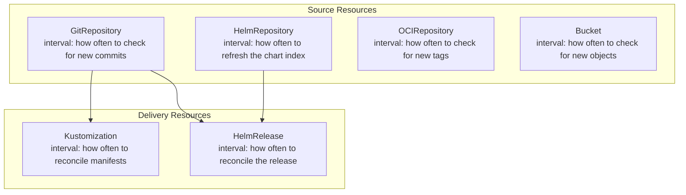
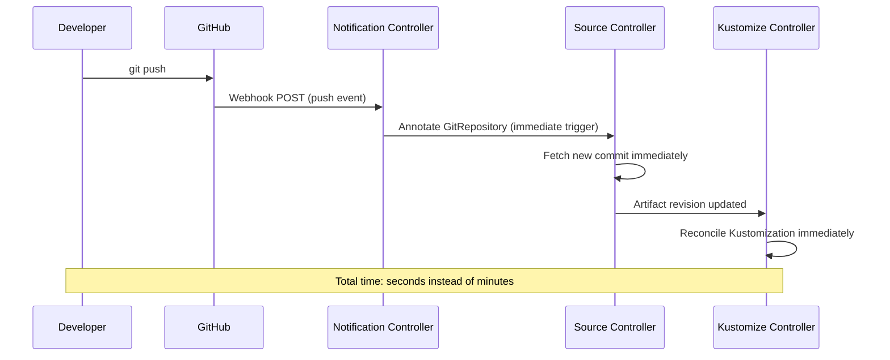

# How to Understand the Flux CD Reconciliation Interval

Author: [nawazdhandala](https://github.com/nawazdhandala)

Tags: Flux CD, GitOps, Kubernetes, Reconciliation, Configuration, Performance

Description: A detailed guide to understanding, configuring, and optimizing the reconciliation interval in Flux CD, including how it affects drift detection, resource consumption, and convergence time.

---

## What Is the Reconciliation Interval?

Every Flux CD resource has a `spec.interval` field that controls how frequently the resource is reconciled. This is the heartbeat of the GitOps loop. When the interval elapses, the owning controller picks up the resource and runs through its full reconciliation cycle: fetch, compare, apply, and verify.

```yaml
# The interval field is present on every Flux resource
apiVersion: source.toolkit.fluxcd.io/v1
kind: GitRepository
metadata:
  name: fleet-infra
  namespace: flux-system
spec:
  interval: 5m   # Reconcile every 5 minutes
  url: https://github.com/my-org/fleet-infra
  ref:
    branch: main
```

The interval is not a delay between the end of one reconciliation and the start of the next. It is the period between the start of consecutive reconciliations. If a reconciliation takes 30 seconds and the interval is 5 minutes, the next reconciliation begins 5 minutes after the previous one started (effectively 4 minutes and 30 seconds of idle time).

## Where Intervals Apply

Different Flux resource types use intervals for different purposes:



Each resource type has its own interval, and they operate independently. The source interval controls how often Flux checks for new content. The delivery interval controls how often Flux ensures the cluster matches the desired state.

## Choosing the Right Interval

The interval you choose depends on the tradeoff between convergence speed and resource consumption.

### Source Intervals

For source resources, the interval determines how quickly Flux detects new commits, tags, or chart versions.

```yaml
# Fast detection for frequently updated repositories
apiVersion: source.toolkit.fluxcd.io/v1
kind: GitRepository
metadata:
  name: app-repo
  namespace: flux-system
spec:
  interval: 1m    # Check every minute for fast feedback
  url: https://github.com/my-org/app-repo
  ref:
    branch: main
---
# Slower polling for stable infrastructure definitions
apiVersion: source.toolkit.fluxcd.io/v1
kind: GitRepository
metadata:
  name: infra-repo
  namespace: flux-system
spec:
  interval: 10m   # Infrastructure changes are less frequent
  url: https://github.com/my-org/infra-repo
  ref:
    branch: main
---
# Infrequent polling for Helm chart repositories
apiVersion: source.toolkit.fluxcd.io/v1
kind: HelmRepository
metadata:
  name: bitnami
  namespace: flux-system
spec:
  interval: 1h    # Chart repos change rarely
  url: https://charts.bitnami.com/bitnami
```

### Delivery Intervals

For Kustomization and HelmRelease resources, the interval determines how often Flux checks for and corrects drift, even when no new source artifacts are available.

```yaml
# Frequent drift correction for critical applications
apiVersion: kustomize.toolkit.fluxcd.io/v1
kind: Kustomization
metadata:
  name: critical-app
  namespace: flux-system
spec:
  interval: 5m    # Correct drift within 5 minutes
  sourceRef:
    kind: GitRepository
    name: app-repo
  path: ./deploy/production
  prune: true
---
# Less frequent reconciliation for stable infrastructure
apiVersion: kustomize.toolkit.fluxcd.io/v1
kind: Kustomization
metadata:
  name: infrastructure
  namespace: flux-system
spec:
  interval: 30m   # Infrastructure is rarely manually modified
  sourceRef:
    kind: GitRepository
    name: infra-repo
  path: ./infrastructure
  prune: true
```

## The Retry Interval

When a reconciliation fails, the controller uses `spec.retryInterval` (if set) instead of the regular interval for the next attempt. This allows faster retries on transient errors without increasing the normal reconciliation frequency.

```yaml
# Retry failed reconciliations more frequently than normal ones
apiVersion: kustomize.toolkit.fluxcd.io/v1
kind: Kustomization
metadata:
  name: my-app
  namespace: flux-system
spec:
  interval: 10m          # Normal reconciliation every 10 minutes
  retryInterval: 2m      # Retry failures every 2 minutes
  sourceRef:
    kind: GitRepository
    name: fleet-infra
  path: ./apps/production
  prune: true
```

The reconciliation timeline with retries looks like this:

```mermaid
gantt
    title Reconciliation Timeline with Retries
    dateFormat X
    axisFormat %s

    section Normal
    Reconcile (success)    :done, 0, 1
    Wait (10m interval)    :active, 1, 11
    Reconcile (success)    :done, 11, 12

    section With Failure
    Reconcile (fails)      :crit, 0, 1
    Wait (2m retry)        :active, 1, 3
    Reconcile (fails)      :crit, 3, 4
    Wait (2m retry)        :active, 4, 6
    Reconcile (success)    :done, 6, 7
    Wait (10m interval)    :active, 7, 17
```



## The Timeout Field

The `spec.timeout` field sets a maximum duration for a single reconciliation attempt. This prevents a slow health check or a large apply from blocking the controller indefinitely.

```yaml
# Set a timeout to prevent stuck reconciliations
apiVersion: kustomize.toolkit.fluxcd.io/v1
kind: Kustomization
metadata:
  name: large-deployment
  namespace: flux-system
spec:
  interval: 15m
  timeout: 10m            # Give up if reconciliation takes more than 10 minutes
  retryInterval: 3m
  sourceRef:
    kind: GitRepository
    name: fleet-infra
  path: ./large-app
  wait: true              # Timeout applies to health checks too
```

## Triggering Immediate Reconciliation

You do not have to wait for the interval to elapse. There are two ways to trigger immediate reconciliation:

### Using the Flux CLI

```bash
# Force immediate reconciliation of a source
flux reconcile source git fleet-infra

# Force immediate reconciliation of a Kustomization
flux reconcile kustomization my-app

# Force immediate reconciliation of a HelmRelease
flux reconcile helmrelease ingress-nginx
```

### Using Webhooks

Configure a Receiver to accept webhooks from your Git provider. When a push event arrives, the notification-controller annotates the relevant source, triggering immediate reconciliation.

```yaml
# Receiver that triggers on GitHub push events
apiVersion: notification.toolkit.fluxcd.io/v1
kind: Receiver
metadata:
  name: github-push
  namespace: flux-system
spec:
  type: github
  events:
    - "push"
  secretRef:
    name: github-webhook-secret
  resources:
    - apiVersion: source.toolkit.fluxcd.io/v1
      kind: GitRepository
      name: fleet-infra
```

With webhooks configured, the typical convergence path becomes:



## Impact on API Server Load

Each reconciliation involves API calls to the Kubernetes API server. The source-controller makes calls to update source status. The kustomize-controller reads source status, downloads artifacts, performs server-side apply dry-runs, applies changes, and runs health checks.

The relationship between interval and API load is inversely proportional:

| Interval | API Calls per Hour (per resource) | Use Case |
|----------|-----------------------------------|----------|
| 1m       | 60                                | Critical apps needing fast convergence |
| 5m       | 12                                | Standard applications |
| 10m      | 6                                 | Default for most workloads |
| 30m      | 2                                 | Stable infrastructure |
| 1h       | 1                                 | Rarely changing chart repos |

For clusters managing hundreds of Flux resources, using aggressive intervals (1m) on every resource can generate significant API server load. Use short intervals selectively for resources that need fast convergence and longer intervals for stable components.

## Recommended Interval Strategy

```yaml
# Recommended intervals by resource type and criticality
#
# Source resources:
#   GitRepository (active development):  1m - 5m
#   GitRepository (stable/infra):        5m - 15m
#   HelmRepository:                      30m - 1h
#   OCIRepository:                       5m - 15m
#
# Delivery resources:
#   Kustomization (critical apps):       5m
#   Kustomization (standard apps):       10m
#   Kustomization (infrastructure):      15m - 30m
#   HelmRelease (critical):              10m
#   HelmRelease (standard):              30m
```

Combine longer intervals with webhooks for the best of both worlds — fast convergence on push events, and regular drift correction at a sustainable pace.

## Suspended Resources

You can temporarily stop reconciliation by setting `spec.suspend: true`. This is useful during maintenance windows or debugging sessions.

```bash
# Suspend reconciliation
flux suspend kustomization my-app

# Resume reconciliation
flux resume kustomization my-app
```

```yaml
# A suspended resource will not reconcile regardless of interval
apiVersion: kustomize.toolkit.fluxcd.io/v1
kind: Kustomization
metadata:
  name: my-app
  namespace: flux-system
spec:
  interval: 10m
  suspend: true              # Reconciliation is paused
  sourceRef:
    kind: GitRepository
    name: fleet-infra
  path: ./apps/production
```

## Summary

The reconciliation interval is the fundamental timing mechanism in Flux CD. It controls how often each resource is checked and reconciled, directly affecting convergence speed, drift detection latency, and API server load. Use short intervals for critical applications and longer intervals for stable infrastructure. Combine intervals with webhooks to get immediate reactions to Git pushes while maintaining periodic drift correction. Use `retryInterval` for faster failure recovery and `timeout` to prevent stuck reconciliations. The interval is not a polling delay — it is the period between reconciliation starts, and it can be bypassed at any time with manual triggers or webhook events.
