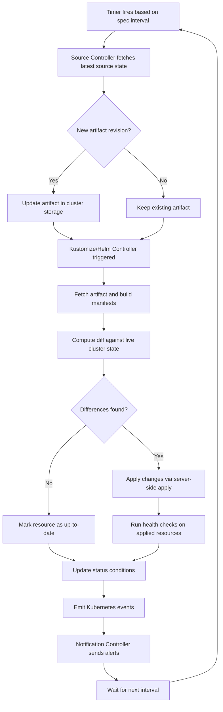
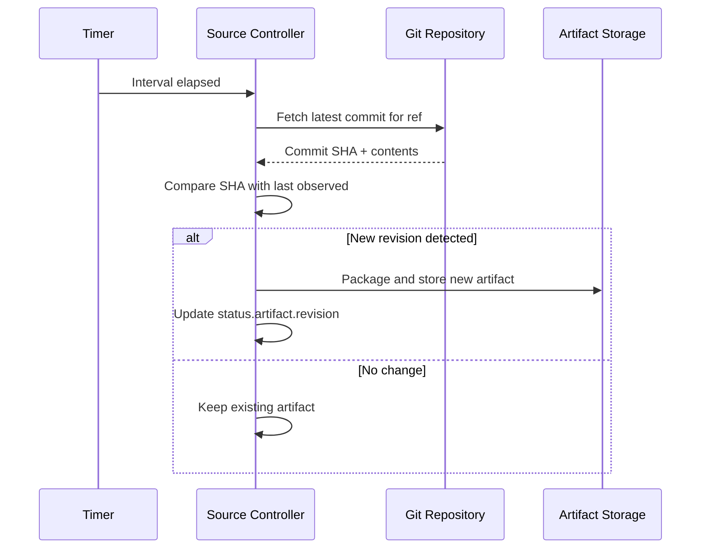
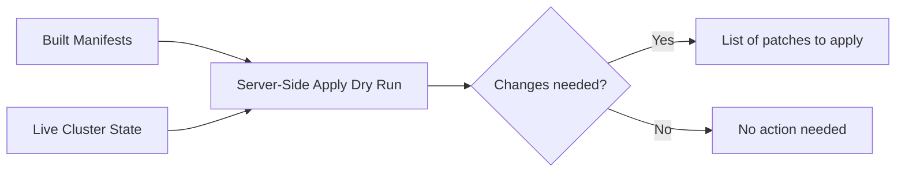

# How Flux CD Reconciliation Loop Works Step by Step

Author: [nawazdhandala](https://github.com/nawazdhandala)

Tags: Flux CD, GitOps, Kubernetes, Reconciliation, Controller

Description: A step-by-step breakdown of how Flux CD's reconciliation loop continuously synchronizes your Git-defined desired state with the actual state of your Kubernetes cluster.

---

## What Is Reconciliation?

Reconciliation is the core mechanism that makes GitOps work. In Flux CD, reconciliation is the process by which controllers compare the desired state (defined in Git, Helm repositories, or OCI registries) with the actual state in the Kubernetes cluster, and then take action to eliminate any differences.

Every Flux CD controller follows the same fundamental pattern: observe, compare, act, report. This loop runs continuously, ensuring the cluster converges toward the desired state.

## The Reconciliation Loop Visualized

Here is the complete reconciliation loop as it flows through the Flux CD controllers:


```mermaid
graph TD
    A[Timer fires based on spec.interval] --> B[Source Controller fetches latest source state]
    B --> C{New artifact revision?}
    C -->|Yes| D[Update artifact in cluster storage]
    C -->|No| E[Keep existing artifact]
    D --> F[Kustomize/Helm Controller triggered]
    E --> F
    F --> G[Fetch artifact and build manifests]
    G --> H[Compute diff against live cluster state]
    H --> I{Differences found?}
    I -->|Yes| J[Apply changes via server-side apply]
    I -->|No| K[Mark resource as up-to-date]
    J --> L[Run health checks on applied resources]
    K --> M[Update status conditions]
    L --> M
    M --> N[Emit Kubernetes events]
    N --> O[Notification Controller sends alerts]
    O --> P[Wait for next interval]
    P --> A
```

## Step 1: The Timer Fires

Most Flux resources that reconcile external or cluster state, such as `GitRepository`, `Kustomization`, and `HelmRelease`, have a `spec.interval` field that determines how often the reconciliation loop runs. When the object is queued, the controller picks up the resource and begins processing it.

```yaml
# The interval field controls how often reconciliation occurs

apiVersion: source.toolkit.fluxcd.io/v1
kind: GitRepository
metadata:
  name: my-app
  namespace: flux-system
spec:
  interval: 5m  # This resource reconciles every 5 minutes
  url: https://github.com/my-org/my-app
  ref:
    branch: main
```

After a successful reconciliation, the controller requeues the object for inspection after the configured interval. Controllers may also apply jitter to the interval to distribute load, and changes to the resource spec or to a referenced source revision can be handled outside the interval window.

## Step 2: Source Controller Fetches the Latest State

The source-controller is responsible for fetching artifacts from external sources. When reconciling a `GitRepository`, it fetches the configured Git reference and resolves the latest revision for the configured branch, tag, commit, or semantic version range.


```mermaid
sequenceDiagram
    participant Timer
    participant SourceCtrl as Source Controller
    participant Git as Git Repository
    participant Storage as Artifact Storage

    Timer->>SourceCtrl: Interval elapsed
    SourceCtrl->>Git: Fetch latest commit for ref
    Git-->>SourceCtrl: Commit SHA + contents
    SourceCtrl->>SourceCtrl: Compare SHA with last observed
    alt New revision detected
        SourceCtrl->>Storage: Package and store new artifact
        SourceCtrl->>SourceCtrl: Update status.artifact.revision
    else No change
        SourceCtrl->>SourceCtrl: Keep existing artifact
    end
```

The source-controller packages the repository contents into a gzip-compressed tarball artifact and stores it in the controller's artifact storage. It updates the `status.artifact.revision` field with the resolved revision, such as `main@sha1:<commit>`. Other controllers watch Source objects for new artifacts.

## Step 3: Dependent Controllers Are Triggered

When the source-controller updates an artifact, dependent controllers (kustomize-controller or helm-controller) can detect the change and begin their own reconciliation. This happens through Kubernetes watch mechanisms - the controllers watch for changes to Source objects.

```yaml
# A Kustomization references a GitRepository source
apiVersion: kustomize.toolkit.fluxcd.io/v1
kind: Kustomization
metadata:
  name: my-app
  namespace: flux-system
spec:
  interval: 10m
  sourceRef:
    kind: GitRepository
    name: my-app          # Watches this source for new artifacts
  path: ./deploy
  prune: true
  wait: true
  timeout: 5m
```

The kustomize-controller reconciles in two scenarios:
1. The source artifact revision changes (a new commit was pushed).
2. The reconciliation interval elapses (to catch drift even without new commits).

## Step 4: Manifests Are Built

The kustomize-controller downloads the artifact from the source-controller's artifact storage, extracts the contents, and builds the final Kubernetes manifests. If the path contains a `kustomization.yaml` file, it runs `kustomize build`. Otherwise, it generates a `kustomization.yaml` for the plain YAML files in the path.

Variable substitution can also occur at this stage:

```yaml
# Post-build variable substitution allows injecting values
apiVersion: kustomize.toolkit.fluxcd.io/v1
kind: Kustomization
metadata:
  name: my-app
  namespace: flux-system
spec:
  interval: 10m
  sourceRef:
    kind: GitRepository
    name: my-app
  path: ./deploy
  postBuild:
    substituteFrom:
      - kind: ConfigMap
        name: cluster-settings  # Inject values from a ConfigMap
```

## Step 5: Diff Against the Live Cluster

The controller detects drift between the built manifests and the current state of those resources in the cluster. Flux uses Kubernetes **server-side apply dry-run** during this stage. Server-side apply tracks field ownership, and Flux's field-management behavior can be tuned with SSA policies such as `Override` and `Merge`.


```mermaid
graph LR
    A[Built Manifests] --> C[Server-Side Apply Dry Run]
    B[Live Cluster State] --> C
    C --> D{Changes needed?}
    D -->|Yes| E[List of patches to apply]
    D -->|No| F[No action needed]
```

## Step 6: Apply Changes

If differences are detected, Flux applies the changes using server-side apply. Resources are applied individually, and reconciliation reports a failure if an apply operation cannot be completed.

When `spec.prune` is enabled, Flux also deletes resources that exist in the cluster but are no longer present in Git. This is how Flux handles resource removal - you delete the manifest from Git, and Flux removes it from the cluster.

## Step 7: Health Checks

After applying changes, the controller runs health checks when `spec.wait` is enabled or `spec.healthChecks` is configured. The health assessment waits for resources to become ready according to their type-specific readiness criteria:

- **Deployments** - All replicas are available and updated.
- **StatefulSets** - All replicas are ready with current revision.
- **HelmReleases** - The Helm release reports success.
- **Custom resources** - Built-in kstatus rules or configured CEL health check expressions report the resource as ready.

```yaml
# Health checks are configured via wait and timeout
apiVersion: kustomize.toolkit.fluxcd.io/v1
kind: Kustomization
metadata:
  name: my-app
  namespace: flux-system
spec:
  interval: 10m
  sourceRef:
    kind: GitRepository
    name: my-app
  path: ./deploy
  wait: true       # Wait for all resources to become ready
  timeout: 5m      # Fail if resources are not ready within 5 minutes
```

## Step 8: Status Update and Events

The controller updates the resource's status conditions to reflect the outcome of reconciliation. It also emits Kubernetes events that the notification-controller can forward to external systems.

```bash
# View the status conditions of a Kustomization
kubectl get kustomization my-app -n flux-system -o yaml

# Example status output:
# status:
#   conditions:
#     - type: Ready
#       status: "True"
#       reason: ReconciliationSucceeded
#       message: "Applied revision: main@sha1:abc123"
#   lastAppliedRevision: main@sha1:abc123
#   lastAttemptedRevision: main@sha1:abc123
```

## Step 9: Notifications

The notification-controller watches for events from other Flux controllers and forwards them to external systems like Slack, Microsoft Teams, or webhook endpoints.

```yaml
# Configure alerts to be notified about reconciliation outcomes
apiVersion: notification.toolkit.fluxcd.io/v1
kind: Alert
metadata:
  name: on-call-alerts
  namespace: flux-system
spec:
  providerRef:
    name: slack
  eventSeverity: error    # Only alert on failures
  eventSources:
    - kind: Kustomization
      name: '*'           # Watch all Kustomizations
    - kind: HelmRelease
      name: '*'           # Watch all HelmReleases
```

## Forced Reconciliation

You do not have to wait for the interval to elapse. You can trigger an immediate reconciliation by annotating the resource:

```bash
# Force an immediate reconciliation
flux reconcile kustomization my-app

# This queues a reconciliation request without waiting for completion:
kubectl annotate --field-manager=flux-client-side-apply --overwrite kustomization/my-app \
  reconcile.fluxcd.io/requestedAt="$(date +%s)" \
  -n flux-system
```

## Summary

The Flux CD reconciliation loop is a continuous cycle of fetch, compare, apply, and verify. The source-controller fetches the latest desired state from external sources, the kustomize-controller and helm-controller compare it against the live cluster, apply any differences, and run health checks. Status conditions and events provide observability, and the notification-controller bridges Flux to external alerting systems. This loop runs at the configured interval, ensuring the cluster continuously converges toward the state defined in Git.
