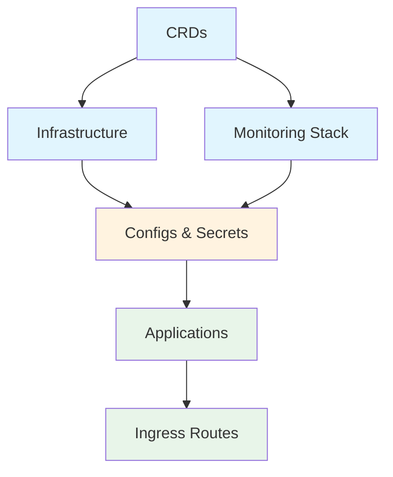
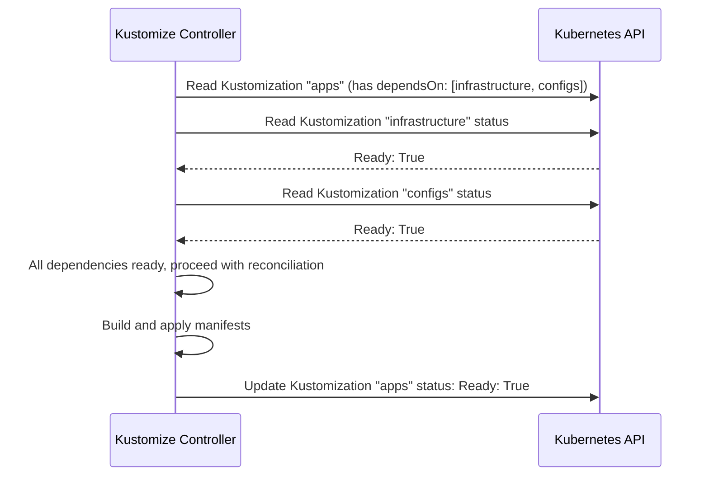
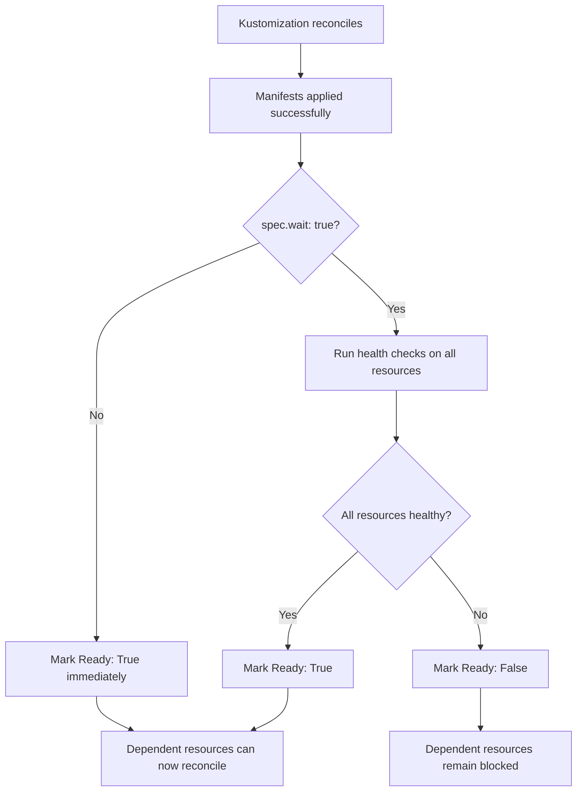

# How to Understand Flux CD Resource Dependencies

Author: [nawazdhandala](https://github.com/nawazdhandala)

Tags: Flux CD, GitOps, Kubernetes, Dependencies, Deployment Order

Description: A practical guide to understanding and configuring resource dependencies in Flux CD to control deployment order, ensure prerequisites are met, and build reliable multi-component delivery pipelines.

---

## Why Dependencies Matter

In real-world Kubernetes deployments, resources often depend on each other. A web application needs its database to be running. Applications need their namespaces and RBAC policies to exist first. Helm charts that install CRDs must complete before workloads that use those CRDs can be deployed.

Flux CD provides a dependency mechanism through the `spec.dependsOn` field on Kustomization and HelmRelease resources. This field lets you define explicit ordering between deployment units, ensuring prerequisites are healthy before dependent resources are reconciled.

## The dependsOn Field

The `spec.dependsOn` field accepts a list of references to other Kustomization or HelmRelease resources in the same namespace. A resource with dependencies will not reconcile until all its dependencies report a `Ready: True` condition.

```yaml
# Infrastructure must be ready before apps are deployed
apiVersion: kustomize.toolkit.fluxcd.io/v1
kind: Kustomization
metadata:
  name: apps
  namespace: flux-system
spec:
  interval: 10m
  dependsOn:
    - name: infrastructure    # Wait for infrastructure Kustomization
    - name: configs           # Wait for configs Kustomization
  sourceRef:
    kind: GitRepository
    name: fleet-infra
  path: ./apps/production
  prune: true
```

## Building a Dependency Graph

A typical production deployment has multiple layers that must be applied in order. Here is a common pattern:



Here is the complete YAML for this dependency chain:

```yaml
# Layer 1: Custom Resource Definitions (no dependencies)
apiVersion: kustomize.toolkit.fluxcd.io/v1
kind: Kustomization
metadata:
  name: crds
  namespace: flux-system
spec:
  interval: 15m
  sourceRef:
    kind: GitRepository
    name: fleet-infra
  path: ./infrastructure/crds
  prune: false              # Never prune CRDs automatically
  wait: true                # Wait for CRDs to be established
---
# Layer 2a: Infrastructure components (depends on CRDs)
apiVersion: kustomize.toolkit.fluxcd.io/v1
kind: Kustomization
metadata:
  name: infrastructure
  namespace: flux-system
spec:
  interval: 15m
  dependsOn:
    - name: crds            # CRDs must be ready first
  sourceRef:
    kind: GitRepository
    name: fleet-infra
  path: ./infrastructure/controllers
  prune: true
  wait: true
---
# Layer 2b: Monitoring stack (depends on CRDs)
apiVersion: kustomize.toolkit.fluxcd.io/v1
kind: Kustomization
metadata:
  name: monitoring
  namespace: flux-system
spec:
  interval: 15m
  dependsOn:
    - name: crds            # CRDs must be ready first
  sourceRef:
    kind: GitRepository
    name: fleet-infra
  path: ./infrastructure/monitoring
  prune: true
  wait: true
---
# Layer 3: Configs and secrets (depends on infrastructure and monitoring)
apiVersion: kustomize.toolkit.fluxcd.io/v1
kind: Kustomization
metadata:
  name: configs
  namespace: flux-system
spec:
  interval: 10m
  dependsOn:
    - name: infrastructure  # Infrastructure must be ready
    - name: monitoring      # Monitoring must be ready
  sourceRef:
    kind: GitRepository
    name: fleet-infra
  path: ./configs/production
  prune: true
  wait: true
  decryption:
    provider: sops
    secretRef:
      name: sops-age-key
---
# Layer 4: Applications (depends on configs)
apiVersion: kustomize.toolkit.fluxcd.io/v1
kind: Kustomization
metadata:
  name: apps
  namespace: flux-system
spec:
  interval: 10m
  dependsOn:
    - name: configs         # Configs must be ready
  sourceRef:
    kind: GitRepository
    name: fleet-infra
  path: ./apps/production
  prune: true
  wait: true
---
# Layer 5: Ingress routes (depends on apps)
apiVersion: kustomize.toolkit.fluxcd.io/v1
kind: Kustomization
metadata:
  name: ingress-routes
  namespace: flux-system
spec:
  interval: 10m
  dependsOn:
    - name: apps            # Apps must be running before routing traffic
  sourceRef:
    kind: GitRepository
    name: fleet-infra
  path: ./ingress/production
  prune: true
```

## How Dependency Resolution Works

When the kustomize-controller picks up a Kustomization for reconciliation, it checks the `dependsOn` list before doing any work. For each dependency, it reads the referenced resource from the Kubernetes API and checks its status conditions.



If any dependency is not ready, the controller skips the reconciliation and sets the status to reflect the blocked state:

```yaml
# Status when a dependency is not ready
status:
  conditions:
    - type: Ready
      status: "False"
      reason: DependencyNotReady
      message: "dependency 'flux-system/infrastructure' is not ready"
```

## HelmRelease Dependencies

HelmRelease resources support the same `dependsOn` mechanism. You can create dependencies between HelmReleases, or mix Kustomization and HelmRelease dependencies within the same namespace.

```yaml
# A HelmRelease that depends on another HelmRelease
apiVersion: helm.toolkit.fluxcd.io/v2
kind: HelmRelease
metadata:
  name: my-app
  namespace: flux-system
spec:
  interval: 30m
  dependsOn:
    - name: postgresql        # Wait for PostgreSQL to be deployed
    - name: redis             # Wait for Redis to be deployed
  chart:
    spec:
      chart: my-app
      version: "2.x"
      sourceRef:
        kind: HelmRepository
        name: my-charts
  values:
    database:
      host: postgresql.default.svc.cluster.local
    cache:
      host: redis-master.default.svc.cluster.local
```

## Cross-Namespace Dependencies

Dependencies must be in the same namespace as the dependent resource. This is a deliberate constraint that keeps the RBAC model simple. If you need to coordinate across namespaces, you can use a shared namespace (like `flux-system`) for all your Kustomization resources, even if the resources they deploy target different namespaces.

```yaml
# Both Kustomizations live in flux-system but deploy to different namespaces
apiVersion: kustomize.toolkit.fluxcd.io/v1
kind: Kustomization
metadata:
  name: database
  namespace: flux-system        # Lives in flux-system
spec:
  interval: 10m
  sourceRef:
    kind: GitRepository
    name: fleet-infra
  path: ./database
  targetNamespace: database-ns  # Deploys to database-ns
  wait: true
---
apiVersion: kustomize.toolkit.fluxcd.io/v1
kind: Kustomization
metadata:
  name: webapp
  namespace: flux-system        # Lives in flux-system (same as database)
spec:
  interval: 10m
  dependsOn:
    - name: database            # Can reference database because same namespace
  sourceRef:
    kind: GitRepository
    name: fleet-infra
  path: ./webapp
  targetNamespace: webapp-ns    # Deploys to webapp-ns
```

## The Role of Health Checks in Dependencies

Dependencies are based on the `Ready` condition, which includes health checks when `spec.wait: true` is set. This means a dependency is not considered ready until all its resources pass their health assessments.



Without `spec.wait: true`, a Kustomization is marked as `Ready` as soon as the manifests are successfully applied, regardless of whether the Deployments have rolled out or the Pods are running. For dependencies to be meaningful, you should enable `wait: true` on resources that others depend on.

## Handling Dependency Failures

When a dependency fails, all downstream resources are blocked. This prevents cascading failures where an application tries to start without its prerequisites.

```bash
# Check which resources are blocked by dependency failures
flux get kustomizations

# Example output:
# NAME             REVISION        SUSPENDED  READY  MESSAGE
# crds             main@sha1:abc   False      True   Applied revision: main@sha1:abc
# infrastructure   main@sha1:abc   False      False  health check failed: Deployment/cert-manager
# configs          main@sha1:abc   False      False  dependency 'flux-system/infrastructure' is not ready
# apps             main@sha1:abc   False      False  dependency 'flux-system/configs' is not ready
```

In this example, `infrastructure` failed its health check, which blocked `configs`, which in turn blocked `apps`. Fixing the infrastructure issue will unblock the entire chain on the next reconciliation cycle.

## Avoiding Circular Dependencies

Flux CD does not perform circular dependency detection at creation time. If you create a circular dependency (A depends on B, B depends on A), both resources will be stuck in a `DependencyNotReady` state indefinitely. Always ensure your dependency graph is a directed acyclic graph (DAG).

```bash
# Visualize your dependency graph to check for cycles
flux tree kustomization flux-system
```

## Summary

Flux CD resource dependencies give you explicit control over deployment ordering. The `dependsOn` field on Kustomization and HelmRelease resources blocks reconciliation until all listed dependencies report a `Ready` condition. Combined with health checks (`wait: true`), this ensures that infrastructure is running before applications start, databases are available before services connect, and CRDs are established before custom resources are created. Dependencies must be within the same namespace, and the dependency graph must be acyclic to avoid deadlocks.
