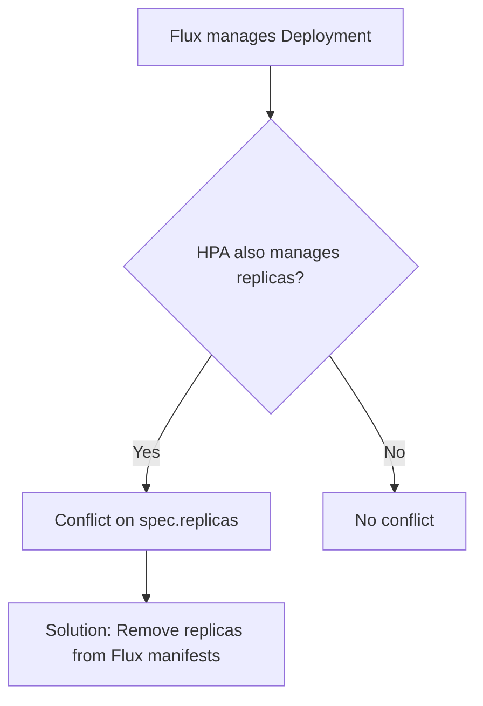

# How Flux CD Manages Kubernetes Resource Ownership

Author: [nawazdhandala](https://github.com/nawazdhandala)

Tags: Flux CD, GitOps, Kubernetes, Resource Ownership, Server-Side Apply, Field Management

Description: An explanation of how Flux CD tracks and manages ownership of Kubernetes resources, including server-side apply field management, conflict resolution, and drift detection.

---

When Flux CD applies resources to a Kubernetes cluster, it needs to track which resources it owns, detect when resources drift from the desired state, and resolve conflicts when multiple actors modify the same resource. Flux handles this through a combination of Kubernetes server-side apply, field management metadata, labels, and its own inventory tracking system. Understanding these mechanisms is essential for operating Flux alongside other tools and manual kubectl operations.

## Server-Side Apply

Flux CD uses Kubernetes server-side apply (SSA) as its default apply strategy. Server-side apply is a Kubernetes feature that tracks which actor (called a "field manager") owns each field in a resource. This is a fundamental shift from client-side apply, which uses the `kubectl.kubernetes.io/last-applied-configuration` annotation.

With server-side apply, the Kubernetes API server maintains a list of field managers for each field of every resource. When Flux applies a resource, it registers as a field manager with the name `kustomize-controller`.

```bash
# View the field managers for a resource
kubectl get deployment my-app -n production -o yaml | grep -A 20 managedFields
```

The output shows which fields are managed by which actor.

```yaml
# Example managedFields output showing Flux's ownership
managedFields:
  - apiVersion: apps/v1
    fieldsType: FieldsV1
    fieldsV1:
      f:spec:
        f:replicas: {}
        f:template:
          f:spec:
            f:containers:
              k:{"name":"app"}:
                f:image: {}
    manager: kustomize-controller
    operation: Apply
  - apiVersion: apps/v1
    fieldsType: FieldsV1
    fieldsV1:
      f:metadata:
        f:annotations:
          f:deployment.kubernetes.io/revision: {}
    manager: kube-controller-manager
    operation: Update
```

In this example, Flux owns the `replicas`, `template`, and `image` fields. The Kubernetes controller manager owns the deployment revision annotation. Each manager can modify only the fields it owns without conflicting with other managers.

## How Flux Detects Drift

Flux detects drift by comparing the desired state in Git against the live state in the cluster during each reconciliation cycle. With server-side apply, Flux only compares the fields it manages. If another actor changes a field that Flux does not manage, Flux ignores it.

If someone manually changes a field that Flux manages, Flux will revert it on the next reconciliation.

```bash
# Manually scale a deployment (this will be reverted by Flux)
kubectl scale deployment my-app -n production --replicas=5

# Flux will detect the drift and revert to the desired replica count
# on its next reconciliation cycle
flux reconcile kustomization app --with-source
```

## The Inventory System

Flux maintains an inventory of all resources it has applied. This inventory is stored as an annotation on the Kustomization resource itself. It tracks every resource by its group, version, kind, namespace, and name.

```bash
# View the inventory of resources managed by a Kustomization
kubectl get kustomization app -n flux-system \
  -o jsonpath='{.status.inventory.entries}' | jq .
```

The inventory serves several purposes:

1. **Pruning:** When a resource is removed from Git, Flux uses the inventory to identify and delete it from the cluster.
2. **Ownership tracking:** Flux knows exactly which resources belong to which Kustomization.
3. **Status reporting:** Flux can report the health of all resources in its inventory.

## Pruning and Garbage Collection

When `spec.prune` is enabled on a Kustomization, Flux deletes resources from the cluster that are no longer present in the source. It uses the inventory to determine which resources to delete.

```yaml
# Kustomization with pruning enabled
apiVersion: kustomize.toolkit.fluxcd.io/v1
kind: Kustomization
metadata:
  name: app
  namespace: flux-system
spec:
  interval: 10m
  path: ./deploy
  prune: true  # Resources removed from Git will be deleted from cluster
  sourceRef:
    kind: GitRepository
    name: flux-system
```

The pruning process works as follows:

1. Flux reconciles and builds the list of resources from the current source.
2. Flux compares this list against the stored inventory.
3. Resources in the inventory but not in the current source are deleted.
4. The inventory is updated to reflect the current set of resources.

## Preventing Pruning with Annotations

You can prevent Flux from pruning specific resources by annotating them.

```yaml
# This resource will not be deleted even if removed from Git
apiVersion: v1
kind: ConfigMap
metadata:
  name: important-config
  namespace: production
  annotations:
    # Tell Flux not to prune this resource
    kustomize.toolkit.fluxcd.io/prune: disabled
```

## Force and Field Ownership Conflicts

When two managers try to own the same field, a conflict occurs. Flux can be configured to force-apply, which takes ownership of conflicting fields.

```yaml
# Kustomization with force enabled to resolve conflicts
apiVersion: kustomize.toolkit.fluxcd.io/v1
kind: Kustomization
metadata:
  name: app
  namespace: flux-system
spec:
  interval: 10m
  path: ./deploy
  prune: true
  force: true  # Force ownership of conflicting fields
  sourceRef:
    kind: GitRepository
    name: flux-system
```

With `force: true`, Flux takes ownership of any field it applies, even if another manager currently owns it. This is useful when migrating resources to Flux management but should be used carefully since it overrides any changes made by other tools.

## Coexisting with Other Tools

A common challenge is running Flux alongside tools like HPA (Horizontal Pod Autoscaler) or KEDA, which need to modify the `replicas` field.



The solution is to remove the `replicas` field from the Deployment manifest in Git. Since Flux uses server-side apply, it only manages fields that are present in the manifest. If `replicas` is omitted, Flux does not claim ownership of it, and HPA can freely adjust the replica count.

```yaml
# Deployment manifest without replicas - lets HPA manage scaling
apiVersion: apps/v1
kind: Deployment
metadata:
  name: my-app
  namespace: production
spec:
  # replicas field intentionally omitted - managed by HPA
  selector:
    matchLabels:
      app: my-app
  template:
    metadata:
      labels:
        app: my-app
    spec:
      containers:
        - name: app
          image: myapp:1.0.0
```

## Labels and Annotations for Ownership

Flux uses specific labels and annotations on managed resources.

```yaml
# Labels applied by Flux to managed resources
metadata:
  labels:
    # Identifies the Kustomization that manages this resource
    kustomize.toolkit.fluxcd.io/name: app
    kustomize.toolkit.fluxcd.io/namespace: flux-system
```

These labels help identify which Kustomization owns a resource and are used for garbage collection during pruning.

## Transferring Ownership Between Kustomizations

If you need to move a resource from one Kustomization to another, you must remove it from the old Kustomization first (with pruning disabled for that resource or by suspending the old Kustomization), then add it to the new one.

```bash
# Step 1: Suspend the old Kustomization to prevent it from deleting the resource
flux suspend kustomization old-app

# Step 2: Add the resource to the new Kustomization in Git
# Step 3: Reconcile the new Kustomization
flux reconcile kustomization new-app --with-source

# Step 4: Remove the resource from the old Kustomization in Git
# Step 5: Resume the old Kustomization
flux resume kustomization old-app
```

## Conclusion

Flux CD's resource ownership model is built on Kubernetes server-side apply, an inventory tracking system, and label-based identification. Server-side apply provides field-level ownership, preventing conflicts with other tools that manage different fields on the same resource. The inventory system enables accurate pruning of removed resources. Understanding these mechanisms is critical when running Flux alongside autoscalers, manual kubectl operations, or other GitOps tools, since ownership conflicts are the most common source of unexpected behavior in multi-actor cluster management.
