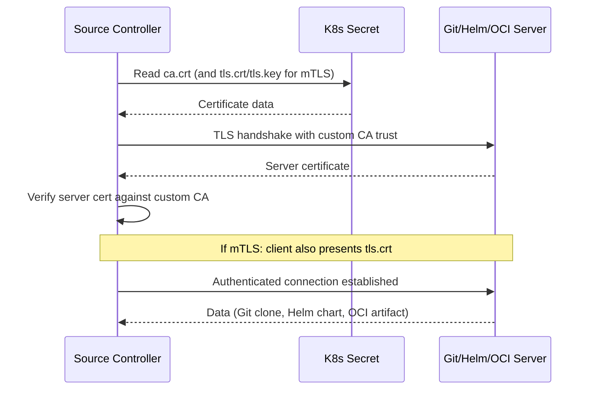

# How to Set Up Flux CD with Self-Signed Certificates

Author: [nawazdhandala](https://github.com/nawazdhandala)

Tags: Flux CD, GitOps, Kubernetes, TLS, Certificates, Security

Description: Learn how to configure Flux CD to work with Git repositories, Helm registries, and OCI registries that use self-signed or custom CA certificates.

---

## Why Self-Signed Certificates?

Many enterprise environments use internal certificate authorities (CAs) for their Git servers, Helm registries, and container registries. These CAs issue certificates that are not trusted by default system certificate stores. Without proper configuration, Flux CD controllers will reject TLS connections to these services with errors like:

- `x509: certificate signed by unknown authority`
- `tls: failed to verify certificate`

This guide covers how to configure Flux CD to trust self-signed certificates and custom CAs for all source types.

## Prerequisites

- A Kubernetes cluster (v1.20+)
- Flux CD installed (v2.0+)
- `flux` CLI installed
- Your CA certificate file (PEM format)
- `openssl` for certificate verification

## Step 1: Prepare the CA Certificate

First, obtain the CA certificate that signed your internal server's TLS certificate. The certificate must be in PEM format:

```bash
# Download the CA certificate from a server (if you don't have it)
openssl s_client -showcerts -connect git.internal.company.com:443 </dev/null 2>/dev/null | \
  openssl x509 -outform PEM > ca-cert.pem

# Verify the certificate
openssl x509 -in ca-cert.pem -text -noout | head -20

# If there's a certificate chain, extract all certificates
openssl s_client -showcerts -connect git.internal.company.com:443 </dev/null 2>/dev/null | \
  awk '/BEGIN CERTIFICATE/,/END CERTIFICATE/{ print }' > ca-chain.pem
```

## Step 2: Configure GitRepository with CA Certificate

### Create a Secret with the CA Certificate

Store the CA certificate in a Kubernetes secret:

```bash
# Create a secret containing the CA certificate
kubectl create secret generic git-ca-cert \
  --namespace=flux-system \
  --from-file=ca.crt=ca-cert.pem
```

### Reference the Secret in GitRepository

Configure the GitRepository to use the CA certificate for TLS verification:

```yaml
# GitRepository with custom CA certificate for self-signed TLS
apiVersion: source.toolkit.fluxcd.io/v1
kind: GitRepository
metadata:
  name: my-app
  namespace: flux-system
spec:
  interval: 5m
  url: https://git.internal.company.com/my-org/my-app.git
  ref:
    branch: main
  # Reference the secret containing the CA certificate
  # The key in the secret must be "ca.crt"
  certSecretRef:
    name: git-ca-cert
  secretRef:
    name: git-credentials
```

The `certSecretRef` field tells the source-controller to use the CA certificate from the referenced secret when connecting to the Git server. The secret must contain a key named `ca.crt`.

### Combining CA Certificate with Git Credentials

You can include both the CA certificate and Git credentials in a single secret:

```bash
# Create a combined secret with CA cert and Git credentials
kubectl create secret generic git-internal \
  --namespace=flux-system \
  --from-file=ca.crt=ca-cert.pem \
  --from-literal=username=git-user \
  --from-literal=password="${GIT_PASSWORD}"
```

```yaml
# GitRepository referencing a single secret for both CA and credentials
apiVersion: source.toolkit.fluxcd.io/v1
kind: GitRepository
metadata:
  name: my-app
  namespace: flux-system
spec:
  interval: 5m
  url: https://git.internal.company.com/my-org/my-app.git
  ref:
    branch: main
  certSecretRef:
    name: git-internal
  secretRef:
    name: git-internal
```

## Step 3: Configure HelmRepository with CA Certificate

For Helm repositories served over HTTPS with self-signed certificates:

```bash
# Create a secret with the CA certificate for the Helm registry
kubectl create secret generic helm-ca-cert \
  --namespace=flux-system \
  --from-file=ca.crt=ca-cert.pem
```

```yaml
# HelmRepository with custom CA certificate
apiVersion: source.toolkit.fluxcd.io/v1
kind: HelmRepository
metadata:
  name: internal-charts
  namespace: flux-system
spec:
  interval: 30m
  url: https://helm.internal.company.com/charts
  # Reference the CA certificate secret
  certSecretRef:
    name: helm-ca-cert
  secretRef:
    name: helm-credentials
```

## Step 4: Configure OCI Repository with CA Certificate

For OCI registries (container registries used for Helm charts or Flux artifacts):

```bash
# Create a secret with the CA cert for OCI registry
kubectl create secret generic oci-ca-cert \
  --namespace=flux-system \
  --from-file=ca.crt=ca-cert.pem
```

```yaml
# OCIRepository with custom CA certificate
apiVersion: source.toolkit.fluxcd.io/v1beta2
kind: OCIRepository
metadata:
  name: internal-manifests
  namespace: flux-system
spec:
  interval: 10m
  url: oci://registry.internal.company.com/manifests
  ref:
    tag: latest
  certSecretRef:
    name: oci-ca-cert
```

## Step 5: Configure HelmRelease with CA Certificate for OCI Charts

When a HelmRelease references a chart from an OCI registry with a self-signed certificate, configure the HelmRepository source:

```yaml
# HelmRepository for OCI-based chart registry with self-signed cert
apiVersion: source.toolkit.fluxcd.io/v1
kind: HelmRepository
metadata:
  name: internal-oci
  namespace: flux-system
spec:
  interval: 30m
  type: oci
  url: oci://registry.internal.company.com/charts
  certSecretRef:
    name: oci-ca-cert
---
# HelmRelease referencing the OCI HelmRepository
apiVersion: helm.toolkit.fluxcd.io/v2
kind: HelmRelease
metadata:
  name: my-app
  namespace: flux-system
spec:
  interval: 10m
  chart:
    spec:
      chart: my-app
      version: "1.0.0"
      sourceRef:
        kind: HelmRepository
        name: internal-oci
```

## Step 6: Using Client Certificates (mTLS)

Some servers require mutual TLS (mTLS), where the client also presents a certificate. Flux supports this through the same secret:

```bash
# Create a secret with CA cert, client cert, and client key for mTLS
kubectl create secret generic git-mtls \
  --namespace=flux-system \
  --from-file=ca.crt=ca-cert.pem \
  --from-file=tls.crt=client-cert.pem \
  --from-file=tls.key=client-key.pem
```

```yaml
# GitRepository with mTLS authentication
apiVersion: source.toolkit.fluxcd.io/v1
kind: GitRepository
metadata:
  name: secure-repo
  namespace: flux-system
spec:
  interval: 5m
  url: https://git.secure.company.com/my-org/secure-app.git
  ref:
    branch: main
  certSecretRef:
    name: git-mtls
```

The secret keys must follow this naming convention:
- `ca.crt` - CA certificate (PEM format)
- `tls.crt` - Client certificate (PEM format)
- `tls.key` - Client private key (PEM format)

## Step 7: Mount CA Certificates at the Controller Level

If all your internal services use the same CA, you can mount the CA certificate directly into the Flux controller pods. This avoids configuring `certSecretRef` on every source:

```yaml
# kustomization.yaml
# Mount CA certificate into all Flux controllers
apiVersion: kustomize.config.k8s.io/v1beta1
kind: Kustomization
resources:
  - gotk-components.yaml
  - gotk-sync.yaml
patches:
  - target:
      kind: Deployment
      name: source-controller
      namespace: flux-system
    patch: |
      apiVersion: apps/v1
      kind: Deployment
      metadata:
        name: source-controller
      spec:
        template:
          spec:
            containers:
              - name: manager
                volumeMounts:
                  # Mount custom CA certificates
                  - name: custom-ca
                    mountPath: /etc/ssl/certs/custom-ca.crt
                    subPath: ca.crt
                    readOnly: true
            volumes:
              - name: custom-ca
                secret:
                  secretName: custom-ca-cert
```

## Verifying TLS Configuration

After configuring the certificates, verify that Flux can connect:

```bash
# Trigger a reconciliation to test the connection
flux reconcile source git my-app --namespace=flux-system

# Check the GitRepository status for TLS errors
flux get sources git my-app --namespace=flux-system

# Check source-controller logs for certificate-related messages
kubectl logs -n flux-system deployment/source-controller | grep -i "tls\|cert\|x509"
```

## TLS Connection Flow



## Troubleshooting Certificate Issues

Common errors and solutions:

### "x509: certificate signed by unknown authority"

The CA certificate is not being loaded or does not match the server's certificate chain:

```bash
# Verify the CA cert matches the server's certificate
openssl verify -CAfile ca-cert.pem <(openssl s_client -connect git.internal.company.com:443 </dev/null 2>/dev/null | openssl x509)

# Check the secret contains the correct certificate
kubectl get secret git-ca-cert -n flux-system -o jsonpath='{.data.ca\.crt}' | base64 -d | openssl x509 -text -noout
```

### "tls: bad certificate" (mTLS)

The client certificate or key is invalid:

```bash
# Verify the client cert matches the key
openssl x509 -in client-cert.pem -noout -modulus | md5sum
openssl rsa -in client-key.pem -noout -modulus | md5sum
# Both md5sums should match
```

### Secret Key Names

Ensure the secret keys follow the expected naming. The source-controller specifically looks for `ca.crt`, `tls.crt`, and `tls.key`:

```bash
# Verify secret key names
kubectl get secret git-ca-cert -n flux-system -o jsonpath='{.data}' | jq 'keys'
# Expected: ["ca.crt"]
```

## Summary

Configuring Flux CD to work with self-signed certificates is straightforward using the `certSecretRef` field available on GitRepository, HelmRepository, and OCIRepository resources. Store your CA certificate in a Kubernetes secret with the key `ca.crt`, and reference it from your source definitions. For mTLS, include `tls.crt` and `tls.key` in the same secret. For cluster-wide CA trust, mount the certificate directly into the controller pods using Kustomize patches. Always verify the certificate chain with `openssl` before configuring Flux to save debugging time.
