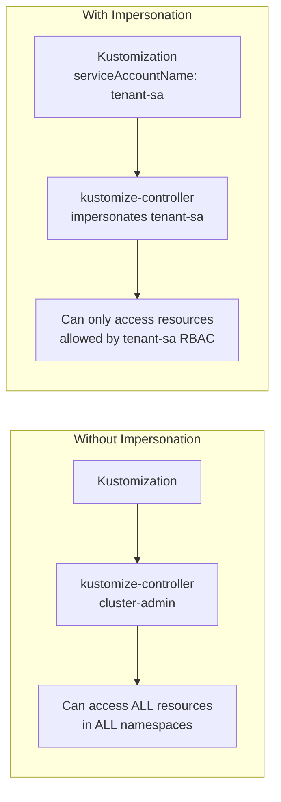
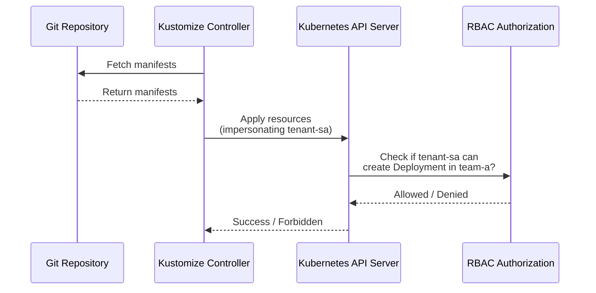

# How to Understand Flux CD Service Account Impersonation

Author: [nawazdhandala](https://github.com/nawazdhandala)

Tags: Flux CD, GitOps, Kubernetes, Service Accounts, RBAC, Multi-Tenancy, Security

Description: Learn how Flux CD uses service account impersonation to enforce RBAC boundaries and enable secure multi-tenancy in your GitOps deployments.

---

Flux CD runs its controllers with cluster-admin privileges by default, which means any Kustomization or HelmRelease can create, modify, or delete any resource in the cluster. In production multi-tenant environments, this is often too permissive. Flux CD solves this through service account impersonation, where individual Kustomizations and HelmReleases execute their reconciliation using a specific Kubernetes service account with limited permissions. In this post, we will explore how service account impersonation works and how to set it up.

## Why Service Account Impersonation Matters

Without service account impersonation, every Kustomization runs with the permissions of the kustomize-controller, which typically has cluster-admin access. This means a tenant could deploy manifests that create ClusterRoles, modify other namespaces, or access cluster-wide resources.



## How Impersonation Works

When a Kustomization specifies `spec.serviceAccountName`, the kustomize-controller impersonates that service account when applying resources to the cluster. The Kubernetes API server then enforces the RBAC rules associated with that service account, restricting what the Kustomization can do.

The impersonation flow:



## Setting Up Service Account Impersonation

### Step 1: Create a Service Account

Create a service account in the tenant namespace:

```yaml
# Service account for tenant reconciliation
apiVersion: v1
kind: ServiceAccount
metadata:
  name: team-a-reconciler
  namespace: team-a
```

### Step 2: Define RBAC Rules

Create a Role (or ClusterRole) and RoleBinding that grants the service account the minimum permissions needed:

```yaml
# Role granting permissions to manage application resources
apiVersion: rbac.authorization.k8s.io/v1
kind: Role
metadata:
  name: team-a-reconciler
  namespace: team-a
rules:
  # Allow managing common workload resources
  - apiGroups: ["apps"]
    resources: ["deployments", "replicasets", "statefulsets", "daemonsets"]
    verbs: ["get", "list", "watch", "create", "update", "patch", "delete"]
  # Allow managing core resources
  - apiGroups: [""]
    resources: ["services", "configmaps", "secrets", "serviceaccounts"]
    verbs: ["get", "list", "watch", "create", "update", "patch", "delete"]
  # Allow managing networking resources
  - apiGroups: ["networking.k8s.io"]
    resources: ["ingresses"]
    verbs: ["get", "list", "watch", "create", "update", "patch", "delete"]
  # Allow managing autoscaling
  - apiGroups: ["autoscaling"]
    resources: ["horizontalpodautoscalers"]
    verbs: ["get", "list", "watch", "create", "update", "patch", "delete"]
---
# Bind the role to the service account
apiVersion: rbac.authorization.k8s.io/v1
kind: RoleBinding
metadata:
  name: team-a-reconciler
  namespace: team-a
roleRef:
  apiGroup: rbac.authorization.k8s.io
  kind: Role
  name: team-a-reconciler
subjects:
  - kind: ServiceAccount
    name: team-a-reconciler
    namespace: team-a
```

### Step 3: Reference the Service Account in the Kustomization

Set the `spec.serviceAccountName` field on the Kustomization:

```yaml
# Kustomization using service account impersonation
apiVersion: kustomize.toolkit.fluxcd.io/v1
kind: Kustomization
metadata:
  name: team-a-app
  namespace: team-a
spec:
  interval: 10m
  path: ./apps/team-a
  prune: true
  sourceRef:
    kind: GitRepository
    name: platform-config
    namespace: flux-system
  # Impersonate this service account during reconciliation
  serviceAccountName: team-a-reconciler
  targetNamespace: team-a
```

## Controller Permissions for Impersonation

The kustomize-controller itself needs permission to impersonate service accounts. This is typically configured during Flux bootstrap. The controller's ClusterRole must include impersonation rules:

```yaml
# ClusterRole allowing the kustomize-controller to impersonate service accounts
apiVersion: rbac.authorization.k8s.io/v1
kind: ClusterRole
metadata:
  name: kustomize-controller
rules:
  # Standard controller permissions (abbreviated)
  - apiGroups: ["kustomize.toolkit.fluxcd.io"]
    resources: ["kustomizations"]
    verbs: ["get", "list", "watch"]
  - apiGroups: ["kustomize.toolkit.fluxcd.io"]
    resources: ["kustomizations/status"]
    verbs: ["get", "patch", "update"]
  # Impersonation permissions - required for serviceAccountName to work
  - apiGroups: [""]
    resources: ["serviceaccounts"]
    verbs: ["impersonate"]
```

## HelmRelease Service Account Impersonation

HelmReleases support the same impersonation mechanism:

```yaml
# HelmRelease with service account impersonation
apiVersion: helm.toolkit.fluxcd.io/v2
kind: HelmRelease
metadata:
  name: team-a-chart
  namespace: team-a
spec:
  interval: 10m
  chart:
    spec:
      chart: my-app
      version: "1.0.0"
      sourceRef:
        kind: HelmRepository
        name: shared-charts
        namespace: flux-system
  # Impersonate this service account for Helm operations
  serviceAccountName: team-a-reconciler
```

## Multi-Tenant Setup Example

Here is a complete example of setting up two tenants with isolated permissions:

```yaml
# Tenant namespaces and service accounts
apiVersion: v1
kind: Namespace
metadata:
  name: team-a
---
apiVersion: v1
kind: Namespace
metadata:
  name: team-b
---
apiVersion: v1
kind: ServiceAccount
metadata:
  name: reconciler
  namespace: team-a
---
apiVersion: v1
kind: ServiceAccount
metadata:
  name: reconciler
  namespace: team-b
---
# Team A can only manage resources in team-a namespace
apiVersion: rbac.authorization.k8s.io/v1
kind: RoleBinding
metadata:
  name: reconciler
  namespace: team-a
roleRef:
  apiGroup: rbac.authorization.k8s.io
  kind: ClusterRole
  name: admin  # Built-in admin role, scoped to team-a namespace
subjects:
  - kind: ServiceAccount
    name: reconciler
    namespace: team-a
---
# Team B can only manage resources in team-b namespace
apiVersion: rbac.authorization.k8s.io/v1
kind: RoleBinding
metadata:
  name: reconciler
  namespace: team-b
roleRef:
  apiGroup: rbac.authorization.k8s.io
  kind: ClusterRole
  name: admin  # Built-in admin role, scoped to team-b namespace
subjects:
  - kind: ServiceAccount
    name: reconciler
    namespace: team-b
```

Then the Kustomizations for each tenant:

```yaml
# Team A Kustomization - can only deploy to team-a namespace
apiVersion: kustomize.toolkit.fluxcd.io/v1
kind: Kustomization
metadata:
  name: team-a-apps
  namespace: team-a
spec:
  interval: 10m
  path: ./tenants/team-a
  prune: true
  sourceRef:
    kind: GitRepository
    name: platform-config
    namespace: flux-system
  serviceAccountName: reconciler
---
# Team B Kustomization - can only deploy to team-b namespace
apiVersion: kustomize.toolkit.fluxcd.io/v1
kind: Kustomization
metadata:
  name: team-b-apps
  namespace: team-b
spec:
  interval: 10m
  path: ./tenants/team-b
  prune: true
  sourceRef:
    kind: GitRepository
    name: platform-config
    namespace: flux-system
  serviceAccountName: reconciler
```

## Handling Permission Errors

When a Kustomization tries to create a resource that its service account does not have permission for, the reconciliation fails with a clear error:

```yaml
# Status when service account lacks permissions
status:
  conditions:
    - type: Ready
      status: "False"
      reason: ReconciliationFailed
      message: "Deployment/team-a/frontend dry-run failed:
        deployments.apps is forbidden: User
        \"system:serviceaccount:team-a:reconciler\" cannot create
        resource \"deployments\" in API group \"apps\" in the
        namespace \"team-a\""
```

You can debug permission issues with:

```bash
# Check if the service account can perform specific actions
kubectl auth can-i create deployments \
  --as=system:serviceaccount:team-a:reconciler \
  -n team-a

# Check all permissions for the service account in a namespace
kubectl auth can-i --list \
  --as=system:serviceaccount:team-a:reconciler \
  -n team-a

# Verify the Kustomization is using the correct service account
kubectl get kustomization team-a-apps -n team-a \
  -o jsonpath='{.spec.serviceAccountName}'
```

## Default Service Account Behavior

When no `spec.serviceAccountName` is specified, the Kustomization runs with the controller's own permissions (typically cluster-admin). You can enforce that all Kustomizations must specify a service account by using the `--default-service-account` flag on the controller:

```yaml
# Controller configured with a default service account
apiVersion: apps/v1
kind: Deployment
metadata:
  name: kustomize-controller
  namespace: flux-system
spec:
  template:
    spec:
      containers:
        - name: manager
          args:
            - --watch-all-namespaces
            # All Kustomizations without serviceAccountName
            # will use this default service account
            - --default-service-account=default-reconciler
```

## Best Practices

1. **Always use service account impersonation in production**: Never allow tenant Kustomizations to run with controller-level permissions.

2. **Follow the principle of least privilege**: Grant only the minimum RBAC permissions needed for each tenant's workloads.

3. **Use namespace-scoped Roles, not ClusterRoles**: Unless a tenant genuinely needs cluster-wide access, use namespace-scoped Role and RoleBinding resources.

4. **Audit service account permissions regularly**: Review RBAC rules periodically to ensure they remain appropriate as workloads evolve.

5. **Test RBAC rules before deploying**: Use `kubectl auth can-i` to verify permissions before assigning a service account to a Kustomization.

## Conclusion

Service account impersonation is a critical security feature in Flux CD that enables safe multi-tenancy. By assigning specific service accounts with limited RBAC permissions to each Kustomization and HelmRelease, you ensure that tenants can only deploy and manage resources within their authorized scope. This approach combines the automation benefits of GitOps with the security guarantees of Kubernetes RBAC.
