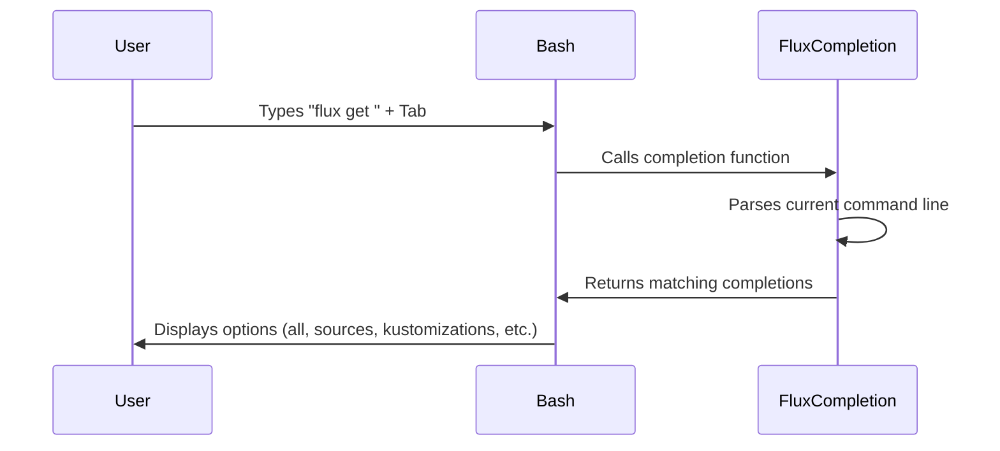

# How to Configure Flux CD Shell Autocompletion for Bash

Author: [nawazdhandala](https://github.com/nawazdhandala)

Tags: Flux CD, GitOps, Kubernetes, Bash, Shell, Autocompletion, Productivity

Description: Learn how to set up Flux CD CLI autocompletion in Bash for faster command entry and improved productivity.

---

Shell autocompletion dramatically speeds up your workflow with the Flux CD CLI. Instead of remembering every subcommand, flag, and resource name, you can press Tab to get context-aware suggestions. This guide walks through configuring Bash autocompletion for the Flux CLI on both Linux and macOS systems.

## Prerequisites

Before setting up autocompletion, ensure you have:

- The Flux CLI installed (verify with `flux --version`)
- Bash shell (version 4.1 or later recommended)
- The `bash-completion` package installed

## Understanding How Bash Completion Works

Bash autocompletion relies on the `bash-completion` framework. When you press Tab after typing a partial command, Bash checks for registered completion functions and returns matching suggestions. The Flux CLI can generate its own completion script, which integrates with this framework.

## Step 1: Install bash-completion

The `bash-completion` package provides the infrastructure that autocompletion scripts hook into.

### On Ubuntu / Debian

```bash
# Install bash-completion on Debian-based systems
sudo apt-get update && sudo apt-get install -y bash-completion
```

### On Fedora / RHEL / CentOS

```bash
# Install bash-completion on Red Hat-based systems
sudo dnf install -y bash-completion
```

### On macOS

```bash
# Install bash-completion via Homebrew
brew install bash-completion@2
```

Note: macOS ships with Bash 3.2 by default, which is outdated. For the best experience, install a newer version of Bash via Homebrew.

```bash
# Install a modern version of Bash on macOS
brew install bash

# Add the new Bash to allowed shells
echo "$(brew --prefix)/bin/bash" | sudo tee -a /etc/shells

# Optionally set it as your default shell
chsh -s "$(brew --prefix)/bin/bash"
```

## Step 2: Verify bash-completion Is Loaded

Check that bash-completion is being sourced in your shell startup file.

```bash
# Check if bash-completion is loaded
type _init_completion 2>/dev/null && echo "bash-completion is loaded" || echo "bash-completion is NOT loaded"
```

If it is not loaded, add it to your `.bashrc` file.

```bash
# Source bash-completion in your .bashrc
# For Linux:
echo '[[ -r /usr/share/bash-completion/bash_completion ]] && . /usr/share/bash-completion/bash_completion' >> ~/.bashrc

# For macOS with Homebrew:
echo '[[ -r "$(brew --prefix)/etc/profile.d/bash_completion.sh" ]] && . "$(brew --prefix)/etc/profile.d/bash_completion.sh"' >> ~/.bashrc
```

## Step 3: Generate and Install the Flux Completion Script

The Flux CLI has a built-in command to generate the Bash completion script. You have two options for installing it.

### Option A: User-Level Installation (Recommended)

Add the completion script to your `.bashrc` file so it loads automatically for your user.

```bash
# Add Flux autocompletion to .bashrc
echo 'command -v flux >/dev/null && . <(flux completion bash)' >> ~/.bashrc
```

This approach uses process substitution to generate and source the completion script each time you open a new shell. The `command -v flux` check ensures it only runs if the Flux CLI is installed.

### Option B: System-Wide Installation

Install the completion script system-wide so all users on the machine can benefit from it.

```bash
# Generate and install the completion script system-wide
sudo flux completion bash > /etc/bash_completion.d/flux
```

This writes the completion script to the standard bash-completion directory, where it is automatically loaded by the bash-completion framework.

## Step 4: Reload Your Shell

Apply the changes by reloading your shell configuration.

```bash
# Reload your .bashrc
source ~/.bashrc
```

Alternatively, close and reopen your terminal.

## Step 5: Test the Autocompletion

Now test that autocompletion is working. Type `flux` followed by a space and press Tab twice.

```bash
# Type this and press Tab twice to see all subcommands
flux <Tab><Tab>
```

You should see a list of available commands like `bootstrap`, `check`, `create`, `delete`, `export`, `get`, `logs`, `reconcile`, `resume`, `suspend`, and others.

Test subcommand completion.

```bash
# Type this and press Tab to complete the subcommand
flux cre<Tab>
# Completes to: flux create

# Continue with deeper completion
flux create source <Tab><Tab>
# Shows: git  helm  bucket  oci
```

Test flag completion.

```bash
# Type this and press Tab twice to see available flags
flux bootstrap github --<Tab><Tab>
# Shows: --owner  --repository  --branch  --path  --personal  etc.
```

## How the Completion Script Works

The Flux completion script registers completion functions for every Flux CLI command. Here is what happens when you press Tab.



The script handles several types of completions:

- **Subcommands:** `flux <Tab>` shows top-level commands
- **Nested subcommands:** `flux create source <Tab>` shows source types
- **Flags:** `flux bootstrap --<Tab>` shows available flags
- **Flag values:** Some flags offer value completion (like namespaces)

## Customizing Completion Behavior

You can combine Flux completion with Bash aliases. If you use an alias for the flux command, register the completion for the alias as well.

```bash
# Create an alias for flux
alias f='flux'

# Register completion for the alias
complete -o default -F __start_flux f
```

Add both lines to your `.bashrc` to persist them.

```bash
# Add flux alias with completion to .bashrc
cat >> ~/.bashrc << 'EOF'
alias f='flux'
command -v flux >/dev/null && . <(flux completion bash) && complete -o default -F __start_flux f
EOF
```

## Troubleshooting

**Completion does not work at all:** Verify that bash-completion is installed and loaded. Run `type _init_completion` to check. If the function is not found, install the bash-completion package and source it in your `.bashrc`.

**Completion works for some commands but not others:** You may have an outdated completion script. Regenerate it by rerunning `flux completion bash > /etc/bash_completion.d/flux` or removing the line from `.bashrc` and re-adding it.

**Slow completion:** Process substitution (`. <(flux completion bash)`) adds a small delay to shell startup because it runs `flux completion bash` each time. For faster startup, write the output to a file and source the file instead.

```bash
# Generate the completion script once to a file
flux completion bash > ~/.flux-completion.bash

# Source the file in .bashrc instead of running the command each time
echo 'source ~/.flux-completion.bash' >> ~/.bashrc
```

Remember to regenerate the file after updating the Flux CLI.

**Tab shows file names instead of commands:** This indicates the completion script is not loaded. Double-check that your `.bashrc` sources the completion script and that you have reloaded the shell.

## Conclusion

You now have Flux CD autocompletion configured for Bash. This small setup pays off significantly over time by reducing typos, speeding up command entry, and helping you discover Flux CLI features you might not have known about. With Tab completion available, you can efficiently navigate the full range of Flux commands without constantly referring to documentation.
