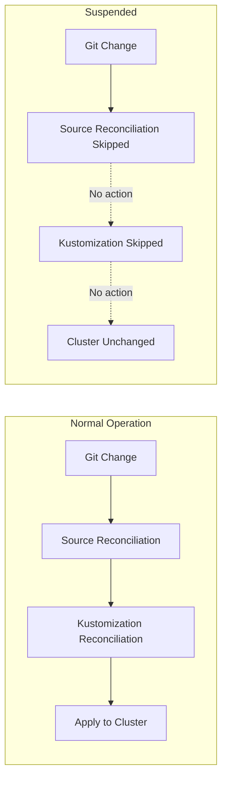
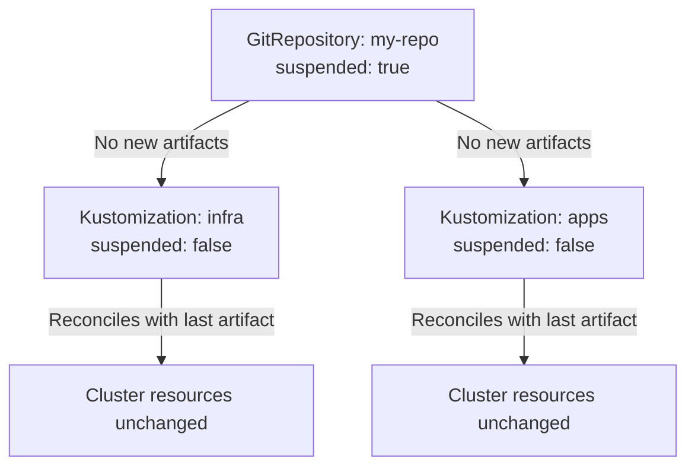

# How to Understand Flux CD Suspend and Resume Functionality

Author: [nawazdhandala](https://github.com/nawazdhandala)

Tags: Flux CD, GitOps, Kubernetes, Suspend, Resume, Reconciliation Control

Description: Learn how to use Flux CD's suspend and resume functionality to temporarily pause reconciliation for maintenance, debugging, or emergency situations.

---

Flux CD continuously reconciles your cluster state with the desired state defined in Git. However, there are situations where you need to temporarily pause this reconciliation, such as during maintenance windows, debugging sessions, or emergency fixes. Flux provides a suspend and resume mechanism that gives you fine-grained control over which resources are actively reconciled. In this post, we will explore how this functionality works and when to use it.

## What Does Suspending a Flux Resource Mean

When you suspend a Flux resource, you tell Flux to stop reconciling that specific resource. The resource remains in the cluster, but Flux will not fetch new source artifacts, apply changes, or perform health checks for it until it is resumed.



## The spec.suspend Field

Every Flux resource supports the `spec.suspend` field. When set to `true`, reconciliation is paused for that resource.

Here is how it looks on different Flux resource types:

```yaml
# Suspending a GitRepository stops fetching new commits
apiVersion: source.toolkit.fluxcd.io/v1
kind: GitRepository
metadata:
  name: my-repo
  namespace: flux-system
spec:
  interval: 5m
  url: https://github.com/my-org/my-repo
  ref:
    branch: main
  # Pause source fetching
  suspend: true
```

```yaml
# Suspending a Kustomization stops applying manifests
apiVersion: kustomize.toolkit.fluxcd.io/v1
kind: Kustomization
metadata:
  name: my-app
  namespace: flux-system
spec:
  interval: 10m
  path: ./deploy
  prune: true
  sourceRef:
    kind: GitRepository
    name: my-repo
  # Pause reconciliation of this Kustomization
  suspend: true
```

```yaml
# Suspending a HelmRelease stops chart upgrades
apiVersion: helm.toolkit.fluxcd.io/v2
kind: HelmRelease
metadata:
  name: my-helm-app
  namespace: flux-system
spec:
  interval: 10m
  chart:
    spec:
      chart: my-chart
      version: "1.0.0"
      sourceRef:
        kind: HelmRepository
        name: my-repo
  # Pause Helm release reconciliation
  suspend: true
```

## Using the Flux CLI to Suspend and Resume

The Flux CLI provides convenient commands for suspending and resuming resources without editing YAML.

```bash
# Suspend a Kustomization
flux suspend kustomization my-app

# Suspend a GitRepository source
flux suspend source git my-repo

# Suspend a HelmRelease
flux suspend helmrelease my-helm-app

# Suspend a HelmRepository source
flux suspend source helm my-repo

# Resume a Kustomization (triggers immediate reconciliation)
flux resume kustomization my-app

# Resume a GitRepository source
flux resume source git my-repo

# Resume a HelmRelease
flux resume helmrelease my-helm-app

# Check which resources are currently suspended
flux get kustomizations
flux get sources git
flux get helmreleases
```

When you resume a resource, Flux immediately triggers a reconciliation rather than waiting for the next interval.

## When to Use Suspend

### Maintenance Windows

During planned maintenance, you may want to prevent Flux from applying changes while you perform manual operations on the cluster.

```bash
# Suspend all Kustomizations before maintenance
flux suspend kustomization --all

# Perform maintenance tasks
# ...

# Resume all Kustomizations after maintenance
flux resume kustomization --all
```

### Emergency Hotfixes

If a deployment is causing issues and you need to apply a manual fix immediately, suspend the relevant Kustomization first to prevent Flux from reverting your changes.

```bash
# Suspend to prevent Flux from overwriting your manual fix
flux suspend kustomization my-app

# Apply emergency fix manually
kubectl set image deployment/frontend frontend=my-image:hotfix-v1 -n my-app

# Later, update Git with the fix and resume
flux resume kustomization my-app
```

### Debugging Reconciliation Issues

When troubleshooting why a resource is not reconciling correctly, suspending it prevents further changes while you investigate.

```bash
# Suspend the problematic resource
flux suspend kustomization my-app

# Investigate the issue
kubectl describe kustomization my-app -n flux-system
kubectl get events -n flux-system --field-selector involvedObject.name=my-app

# Fix the issue in Git, then resume
flux resume kustomization my-app
```

## Suspend Cascade Behavior

It is important to understand that suspending a source does not automatically suspend the Kustomizations or HelmReleases that reference it. However, those downstream resources will effectively stop receiving updates since no new artifacts are produced.



If you want to completely stop reconciliation, suspend both the source and the downstream resources:

```bash
# Suspend the source and all dependent Kustomizations
flux suspend source git my-repo
flux suspend kustomization infra
flux suspend kustomization apps
```

## Status During Suspension

When a resource is suspended, its status conditions reflect this state:

```yaml
# Status of a suspended Kustomization
status:
  conditions:
    - type: Ready
      status: "True"
      reason: ReconciliationSucceeded
      message: "Applied revision: main@sha1:abc123"
    - type: Reconciling
      status: "False"
      reason: Suspended
      message: "Reconciliation is suspended"
```

You can check for suspended resources across your cluster:

```bash
# Find all suspended Kustomizations
kubectl get kustomizations -A -o json | \
  jq -r '.items[] | select(.spec.suspend==true) | "\(.metadata.namespace)/\(.metadata.name)"'

# Find all suspended HelmReleases
kubectl get helmreleases -A -o json | \
  jq -r '.items[] | select(.spec.suspend==true) | "\(.metadata.namespace)/\(.metadata.name)"'
```

## Automating Suspend and Resume

You can integrate suspend and resume into your CI/CD pipelines or maintenance scripts. Here is an example of a script that suspends all Flux resources before maintenance:

```bash
#!/bin/bash
# maintenance-start.sh - Suspend all Flux reconciliation

echo "Suspending all Flux sources..."
flux suspend source git --all
flux suspend source helm --all

echo "Suspending all Kustomizations..."
flux suspend kustomization --all

echo "Suspending all HelmReleases..."
flux suspend helmrelease --all

echo "All Flux reconciliation suspended. Maintenance mode active."
```

```bash
#!/bin/bash
# maintenance-end.sh - Resume all Flux reconciliation

echo "Resuming all Flux sources..."
flux resume source git --all
flux resume source helm --all

echo "Resuming all Kustomizations..."
flux resume kustomization --all

echo "Resuming all HelmReleases..."
flux resume helmrelease --all

echo "All Flux reconciliation resumed. Normal operation restored."
```

## Best Practices

1. **Keep suspension periods short**: Suspended resources accumulate drift. The longer a resource is suspended, the larger the diff will be when reconciliation resumes.

2. **Document suspensions**: Use annotations or external tracking to record why a resource was suspended and when it should be resumed.

3. **Set reminders**: Create alerts or calendar reminders to resume suspended resources so they are not forgotten.

4. **Prefer targeted suspension**: Suspend only the specific resources that need it rather than all resources. This minimizes the scope of paused reconciliation.

5. **Update Git before resuming**: If you made manual changes while suspended, update Git to match before resuming to avoid Flux reverting your changes.

## Conclusion

Flux CD's suspend and resume functionality provides essential operational control over your GitOps pipeline. Whether you need to perform maintenance, apply emergency fixes, or debug reconciliation issues, the ability to pause and resume specific resources gives you the flexibility to handle real-world operational scenarios while maintaining the benefits of GitOps.
