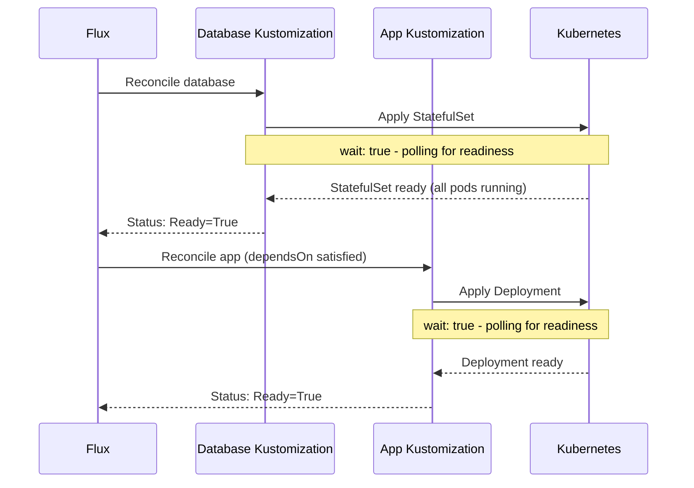

# How to Understand Flux CD Wait and Health Assessment

Author: [nawazdhandala](https://github.com/nawazdhandala)

Tags: Flux CD, GitOps, Kubernetes, Health Checks, Readiness, Wait, Reconciliation

Description: A detailed explanation of how Flux CD's wait and health assessment mechanisms work, including how Flux determines resource readiness and how to configure health checks.

---

After Flux CD applies resources to a Kubernetes cluster, it needs to determine whether those resources are actually healthy and functioning correctly. This is where Flux's wait and health assessment system comes in. Rather than simply confirming that manifests were accepted by the API server, Flux can wait for resources to reach a ready state and report their health. This mechanism drives dependency chains, status reporting, and automated rollback decisions.

## The Wait Mechanism

By default, Flux Kustomizations apply resources and immediately report success if the API server accepts them. Enabling `spec.wait` tells Flux to monitor each applied resource until it reaches a ready state.

```yaml
# Kustomization with wait enabled
apiVersion: kustomize.toolkit.fluxcd.io/v1
kind: Kustomization
metadata:
  name: app
  namespace: flux-system
spec:
  interval: 10m
  path: ./deploy
  prune: true
  wait: true  # Wait for all resources to become ready
  timeout: 5m  # Maximum time to wait for readiness
  sourceRef:
    kind: GitRepository
    name: flux-system
```

When `wait: true` is set, Flux applies the resources and then polls their status until either all resources report ready or the timeout is reached. If the timeout expires before all resources are ready, the Kustomization is marked as failed.

## How Flux Determines Readiness

Flux understands the readiness semantics of common Kubernetes resource types. For each type, it checks different conditions.

| Resource Type | Readiness Criteria |
|--------------|-------------------|
| Deployment | All replicas available, updated, and ready |
| StatefulSet | All replicas ready, updated to current revision |
| DaemonSet | Desired number of pods scheduled and ready |
| Service | Exists (Services are considered ready when created) |
| Pod | All containers ready, not in CrashLoopBackOff |
| Job | Completed successfully |
| HelmRelease | Release reconciled and ready |
| Kustomization | All resources reconciled and healthy |
| Custom Resources | Status condition `Ready` is `True` |

For custom resources, Flux follows the Kubernetes convention of checking the `status.conditions` array for a condition of type `Ready` with status `True`.

## The Health Assessment System

Health assessment is a more comprehensive check that runs after resources are applied and waited on. Flux can perform health checks on specific resources referenced in `spec.healthChecks`.

```yaml
# Kustomization with explicit health checks
apiVersion: kustomize.toolkit.fluxcd.io/v1
kind: Kustomization
metadata:
  name: app
  namespace: flux-system
spec:
  interval: 10m
  path: ./deploy
  prune: true
  wait: true
  timeout: 5m
  healthChecks:
    # Check that the deployment is healthy
    - apiVersion: apps/v1
      kind: Deployment
      name: my-app
      namespace: production
    # Check that an Ingress has been assigned an address
    - apiVersion: networking.k8s.io/v1
      kind: Ingress
      name: my-app
      namespace: production
  sourceRef:
    kind: GitRepository
    name: flux-system
```

When both `wait` and `healthChecks` are configured, Flux first waits for all applied resources, then additionally checks the health of the explicitly listed resources. The `healthChecks` field is useful for checking resources that are created indirectly (for example, a Service created by a Helm chart).

## Timeout Configuration

The `spec.timeout` field determines how long Flux waits for resources to become healthy. Choosing the right timeout depends on your application's startup characteristics.

```yaml
# Different timeout strategies
---
# Fast-starting application
apiVersion: kustomize.toolkit.fluxcd.io/v1
kind: Kustomization
metadata:
  name: fast-app
  namespace: flux-system
spec:
  interval: 10m
  path: ./deploy/fast-app
  wait: true
  timeout: 2m
  sourceRef:
    kind: GitRepository
    name: flux-system
---
# Slow-starting application (database migration, large model loading)
apiVersion: kustomize.toolkit.fluxcd.io/v1
kind: Kustomization
metadata:
  name: slow-app
  namespace: flux-system
spec:
  interval: 10m
  path: ./deploy/slow-app
  wait: true
  timeout: 15m
  sourceRef:
    kind: GitRepository
    name: flux-system
```

## How Wait Affects Dependency Chains

The `spec.dependsOn` mechanism relies on the wait and health assessment system. A dependent Kustomization will not start reconciling until the Kustomization it depends on reports a Ready status. This means the upstream Kustomization must have `wait: true` or `healthChecks` configured for the dependency chain to work as expected.

```yaml
# Database must be healthy before the application starts
apiVersion: kustomize.toolkit.fluxcd.io/v1
kind: Kustomization
metadata:
  name: database
  namespace: flux-system
spec:
  interval: 10m
  path: ./deploy/database
  wait: true  # Required for dependsOn to work correctly
  timeout: 10m
  sourceRef:
    kind: GitRepository
    name: flux-system
---
apiVersion: kustomize.toolkit.fluxcd.io/v1
kind: Kustomization
metadata:
  name: app
  namespace: flux-system
spec:
  interval: 10m
  dependsOn:
    - name: database  # Will not reconcile until database is Ready
  path: ./deploy/app
  wait: true
  timeout: 5m
  sourceRef:
    kind: GitRepository
    name: flux-system
```

If the database Kustomization did not have `wait: true`, it would report Ready as soon as manifests are accepted by the API server, not when the database is actually running. The app Kustomization would then start before the database is ready, potentially causing connection failures.



## HelmRelease Wait and Remediation

HelmRelease resources have their own wait and remediation settings that work in conjunction with the broader health assessment system.

```yaml
# HelmRelease with wait and automated remediation
apiVersion: helm.toolkit.fluxcd.io/v2
kind: HelmRelease
metadata:
  name: my-app
  namespace: flux-system
spec:
  interval: 1h
  chart:
    spec:
      chart: my-app
      version: "1.x"
      sourceRef:
        kind: HelmRepository
        name: my-repo
  install:
    # Wait for all resources created by the chart to become ready
    remediation:
      retries: 3
  upgrade:
    # Wait for all resources to become ready after upgrade
    remediation:
      retries: 3
      # Automatically rollback if the upgrade fails health checks
      remediateLastFailure: true
  # Timeout for Helm operations including health checks
  timeout: 10m
```

When `remediation.remediateLastFailure` is set to `true`, Flux automatically rolls back a failed Helm upgrade to the previous working release. This provides an automated safety net for deployments that fail health checks.

## Debugging Health Assessment Failures

When a Kustomization or HelmRelease reports unhealthy, you can investigate using the Flux CLI and kubectl.

```bash
# Check the status of a Kustomization, including health check results
flux get kustomization app -o wide

# View detailed events for a Kustomization
kubectl describe kustomization app -n flux-system

# Check which specific resources are not ready
kubectl get kustomization app -n flux-system \
  -o jsonpath='{.status.conditions}' | jq .

# Inspect the health of individual resources
kubectl get deployment my-app -n production -o wide
kubectl describe deployment my-app -n production

# Check pod-level issues
kubectl get pods -n production -l app=my-app
kubectl describe pod <pod-name> -n production
```

Common causes of health assessment failures:

- Image pull errors (wrong image tag, missing credentials)
- Insufficient resources (CPU/memory limits, node capacity)
- Readiness probe failures (application not starting correctly)
- Missing ConfigMaps or Secrets referenced by the pod
- PersistentVolumeClaim binding failures

## Disabling Wait for Specific Use Cases

Sometimes you do not want Flux to wait for readiness. For example, a CronJob only runs on a schedule, so waiting for it to complete does not make sense.

```yaml
# Kustomization without wait - suitable for CronJobs or fire-and-forget resources
apiVersion: kustomize.toolkit.fluxcd.io/v1
kind: Kustomization
metadata:
  name: cronjobs
  namespace: flux-system
spec:
  interval: 10m
  path: ./deploy/cronjobs
  wait: false  # Do not wait for CronJob resources
  prune: true
  sourceRef:
    kind: GitRepository
    name: flux-system
```

## Conclusion

Flux CD's wait and health assessment system provides the foundation for reliable deployments and dependency ordering. Enabling `wait: true` ensures that Flux reports accurate readiness status, which is essential for `dependsOn` chains to work correctly. The timeout configuration must match your application's startup characteristics. For Helm releases, the remediation settings add automatic rollback capabilities. When health checks fail, the Flux CLI and kubectl provide the diagnostic tools needed to identify the root cause and resolve the issue.
