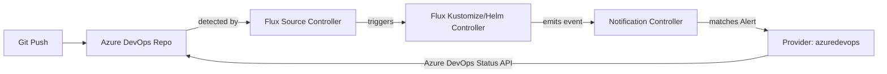

# How to Configure Flux Notification Provider for Azure DevOps Commit Status

Author: [nawazdhandala](https://github.com/nawazdhandala)

Tags: Flux CD, GitOps, Kubernetes, Notifications, Azure DevOps, Commit Status, CI/CD

Description: Learn how to configure Flux CD's notification controller to update Azure DevOps commit statuses based on Flux reconciliation results using the Provider resource.

---

Azure DevOps is a comprehensive development platform from Microsoft that includes Git repositories, CI/CD pipelines, and project management tools. Flux CD supports updating Azure DevOps commit statuses, allowing you to see deployment outcomes directly on commits and pull requests within Azure DevOps.

This guide walks through configuring the Azure DevOps commit status provider from token creation to verification.

## Prerequisites

- A Kubernetes cluster with Flux CD installed (including the notification controller)
- `kubectl` access to the cluster
- An Azure DevOps project with a Git repository managed by Flux
- An Azure DevOps personal access token (PAT) with Code (Status) permissions
- The `flux` CLI installed (optional but helpful)

## Step 1: Create an Azure DevOps Personal Access Token

In Azure DevOps, click your profile icon and select **Personal access tokens**. Create a new token with the following scope:

- **Code**: Status (Read & write)

Copy the generated token.

## Step 2: Create a Kubernetes Secret

Store the Azure DevOps token in a Kubernetes secret.

```bash
# Create a secret containing the Azure DevOps PAT
kubectl create secret generic azuredevops-token \
  --namespace=flux-system \
  --from-literal=token=YOUR_AZURE_DEVOPS_PAT
```

## Step 3: Create the Flux Notification Provider

Define a Provider resource for Azure DevOps commit status updates.

```yaml
# provider-azure-devops-commit-status.yaml
# Configures Flux to update Azure DevOps commit statuses
apiVersion: notification.toolkit.fluxcd.io/v1
kind: Provider
metadata:
  name: azuredevops-status-provider
  namespace: flux-system
spec:
  # Use "azuredevops" as the provider type
  type: azuredevops
  # The Azure DevOps repository address
  # Format: https://dev.azure.com/{organization}/{project}/_git/{repository}
  address: https://dev.azure.com/YOUR_ORG/YOUR_PROJECT/_git/YOUR_REPO
  # Reference to the secret containing the PAT
  secretRef:
    name: azuredevops-token
```

Apply the Provider:

```bash
# Apply the Azure DevOps commit status provider configuration
kubectl apply -f provider-azure-devops-commit-status.yaml
```

## Step 4: Create an Alert Resource

Create an Alert that triggers commit status updates.

```yaml
# alert-azure-devops-commit-status.yaml
# Updates Azure DevOps commit statuses based on Flux events
apiVersion: notification.toolkit.fluxcd.io/v1
kind: Alert
metadata:
  name: azuredevops-status-alert
  namespace: flux-system
spec:
  providerRef:
    name: azuredevops-status-provider
  # Send both info and error events
  eventSeverity: info
  eventSources:
    - kind: Kustomization
      name: "*"
    - kind: HelmRelease
      name: "*"
```

Apply the Alert:

```bash
# Apply the alert configuration
kubectl apply -f alert-azure-devops-commit-status.yaml
```

## Step 5: Verify the Configuration

Check that both resources are ready.

```bash
# Verify provider and alert status
kubectl get providers.notification.toolkit.fluxcd.io -n flux-system
kubectl get alerts.notification.toolkit.fluxcd.io -n flux-system
```

## Step 6: Test the Notification

Trigger a reconciliation:

```bash
# Force reconciliation to update commit status
flux reconcile kustomization flux-system --with-source
```

Navigate to your Azure DevOps repository and check the latest commit for a status badge.

## How It Works



The notification controller uses the Azure DevOps Git Status API to post commit statuses. These statuses appear on commits and are visible in pull requests as policy checks.

## Commit Status in Pull Requests

Azure DevOps displays commit statuses in pull requests. You can configure branch policies to:

- Require a successful Flux deployment status before completing a pull request
- Display deployment status alongside CI pipeline results
- Track deployment history for each commit

## Using Branch Policies

In Azure DevOps, go to **Project Settings** then **Repositories** then **Policies**. Under the branch policies for your target branch, add a **Status Check** policy that requires the Flux deployment status to be successful.

## Multiple Repositories

Create separate providers for each Azure DevOps repository:

```yaml
# Provider for the infrastructure repository
apiVersion: notification.toolkit.fluxcd.io/v1
kind: Provider
metadata:
  name: azuredevops-infra
  namespace: flux-system
spec:
  type: azuredevops
  address: https://dev.azure.com/YOUR_ORG/YOUR_PROJECT/_git/infrastructure
  secretRef:
    name: azuredevops-token
---
# Provider for the application repository
apiVersion: notification.toolkit.fluxcd.io/v1
kind: Provider
metadata:
  name: azuredevops-apps
  namespace: flux-system
spec:
  type: azuredevops
  address: https://dev.azure.com/YOUR_ORG/YOUR_PROJECT/_git/applications
  secretRef:
    name: azuredevops-token
```

## Azure DevOps Server (On-Premises)

For on-premises Azure DevOps Server, update the address to your server URL:

```yaml
apiVersion: notification.toolkit.fluxcd.io/v1
kind: Provider
metadata:
  name: azuredevops-onprem
  namespace: flux-system
spec:
  type: azuredevops
  address: https://azuredevops.your-company.com/YOUR_COLLECTION/YOUR_PROJECT/_git/YOUR_REPO
  secretRef:
    name: azuredevops-onprem-token
```

## Troubleshooting

If commit statuses are not appearing in Azure DevOps:

1. **PAT scope**: The personal access token must have **Code (Status)** Read & write permissions.
2. **Repository URL format**: The address must follow the pattern `https://dev.azure.com/{org}/{project}/_git/{repo}`.
3. **Commit SHA**: The revision in the Flux event must match a valid commit in the repository.
4. **PAT expiration**: Azure DevOps PATs expire. Verify the token has not expired and rotate it if needed.
5. **Namespace alignment**: Provider, Alert, and Secret must be in the same namespace.
6. **Controller logs**: Check `kubectl logs -n flux-system deploy/notification-controller` for API errors.
7. **Network access**: The cluster must reach `dev.azure.com` (or your on-premises server) on port 443.
8. **Organization permissions**: Ensure the PAT was created for the correct Azure DevOps organization.

## Conclusion

Azure DevOps commit status integration with Flux CD provides deployment feedback directly within the Azure DevOps workflow. Teams can see deployment outcomes on commits and pull requests, enforce branch policies based on deployment status, and maintain a clear audit trail of what was deployed and when. For organizations using Azure DevOps as their primary development platform, this integration is a key component of a mature GitOps workflow.
