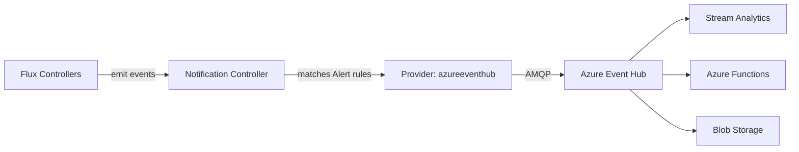

# How to Configure Flux Notification Provider for Azure Event Hub

Author: [nawazdhandala](https://github.com/nawazdhandala)

Tags: Flux CD, GitOps, Kubernetes, Notifications, Azure Event Hub, Azure, Event Streaming

Description: Learn how to configure Flux CD's notification controller to send deployment and reconciliation events to Azure Event Hub using the Provider resource.

---

Azure Event Hub is a fully managed event streaming platform from Microsoft Azure. By integrating Flux CD with Azure Event Hub, you can stream Kubernetes deployment events into your Azure data pipeline for real-time processing, analytics, and long-term storage.

This guide covers the complete setup from creating an Event Hub namespace to verifying that Flux events are flowing into your Event Hub.

## Prerequisites

- A Kubernetes cluster with Flux CD installed (including the notification controller)
- `kubectl` access to the cluster
- An Azure subscription with permission to create Event Hub resources
- Azure CLI (`az`) installed (optional but helpful)
- The `flux` CLI installed (optional but helpful)

## Step 1: Create an Azure Event Hub

If you do not already have an Event Hub, create one using the Azure CLI:

```bash
# Create a resource group
az group create --name flux-events-rg --location eastus

# Create an Event Hub namespace
az eventhubs namespace create \
  --name flux-events-ns \
  --resource-group flux-events-rg \
  --sku Standard

# Create an Event Hub within the namespace
az eventhubs eventhub create \
  --name flux-events \
  --namespace-name flux-events-ns \
  --resource-group flux-events-rg \
  --message-retention 1 \
  --partition-count 2
```

## Step 2: Get the Connection String

Retrieve the connection string for the Event Hub namespace with send permissions:

```bash
# Get the connection string with send permissions
az eventhubs namespace authorization-rule keys list \
  --name RootManageSharedAccessKey \
  --namespace-name flux-events-ns \
  --resource-group flux-events-rg \
  --query primaryConnectionString \
  --output tsv
```

The connection string will look like:

```text
Endpoint=sb://flux-events-ns.servicebus.windows.net/;SharedAccessKeyName=RootManageSharedAccessKey;SharedAccessKey=XXXXX
```

## Step 3: Create a Kubernetes Secret

Store the Event Hub connection string in a Kubernetes secret.

```bash
# Create a secret containing the Azure Event Hub connection string
kubectl create secret generic azure-eventhub-secret \
  --namespace=flux-system \
  --from-literal=address="Endpoint=sb://flux-events-ns.servicebus.windows.net/;SharedAccessKeyName=RootManageSharedAccessKey;SharedAccessKey=XXXXX"
```

## Step 4: Create the Flux Notification Provider

Define a Provider resource for Azure Event Hub.

```yaml
# provider-azure-eventhub.yaml
# Configures Flux to send notifications to Azure Event Hub
apiVersion: notification.toolkit.fluxcd.io/v1
kind: Provider
metadata:
  name: azure-eventhub-provider
  namespace: flux-system
spec:
  # Use "azureeventhub" as the provider type
  type: azureeventhub
  # The Event Hub name within the namespace
  channel: flux-events
  # Reference to the secret containing the connection string
  secretRef:
    name: azure-eventhub-secret
```

Apply the Provider:

```bash
# Apply the Azure Event Hub provider configuration
kubectl apply -f provider-azure-eventhub.yaml
```

## Step 5: Create an Alert Resource

Create an Alert that streams Flux events to Azure Event Hub.

```yaml
# alert-azure-eventhub.yaml
# Routes Flux events to Azure Event Hub
apiVersion: notification.toolkit.fluxcd.io/v1
kind: Alert
metadata:
  name: azure-eventhub-alert
  namespace: flux-system
spec:
  providerRef:
    name: azure-eventhub-provider
  # Send all events for comprehensive event streaming
  eventSeverity: info
  eventSources:
    - kind: Kustomization
      name: "*"
    - kind: HelmRelease
      name: "*"
    - kind: GitRepository
      name: "*"
```

Apply the Alert:

```bash
# Apply the alert configuration
kubectl apply -f alert-azure-eventhub.yaml
```

## Step 6: Verify the Configuration

Check that both resources are ready.

```bash
# Verify provider and alert status
kubectl get providers.notification.toolkit.fluxcd.io -n flux-system
kubectl get alerts.notification.toolkit.fluxcd.io -n flux-system
```

## Step 7: Test and Verify Events

Trigger a reconciliation and verify events arrive in Event Hub:

```bash
# Force reconciliation to generate events
flux reconcile kustomization flux-system --with-source

# Optionally, use Azure CLI to check Event Hub metrics
az eventhubs eventhub show \
  --name flux-events \
  --namespace-name flux-events-ns \
  --resource-group flux-events-rg \
  --query "messageRetentionInDays"
```

## How It Works



The notification controller sends Flux events to Azure Event Hub. From there, the events can be consumed by downstream Azure services such as Stream Analytics, Azure Functions, or stored in Blob Storage for audit purposes.

## Processing Events Downstream

Azure Event Hub integrates with many Azure services. Common patterns include:

- **Stream Analytics**: Process events in real time, aggregate deployment statistics, and output to Power BI dashboards.
- **Azure Functions**: Trigger serverless functions on deployment events (e.g., run smoke tests after a deployment).
- **Event Hub Capture**: Automatically capture events to Azure Blob Storage or Azure Data Lake for long-term retention and compliance.

## Using Shared Access Policies with Minimal Permissions

For production use, create a dedicated shared access policy with only Send permissions:

```bash
# Create a send-only authorization rule
az eventhubs namespace authorization-rule create \
  --name FluxSendOnly \
  --namespace-name flux-events-ns \
  --resource-group flux-events-rg \
  --rights Send

# Get the connection string for the send-only rule
az eventhubs namespace authorization-rule keys list \
  --name FluxSendOnly \
  --namespace-name flux-events-ns \
  --resource-group flux-events-rg \
  --query primaryConnectionString \
  --output tsv
```

## Troubleshooting

If events are not appearing in Azure Event Hub:

1. **Connection string format**: Verify the secret contains the full connection string with the `Endpoint`, `SharedAccessKeyName`, and `SharedAccessKey` components.
2. **Event Hub name**: The `channel` field must match the Event Hub name (not the namespace name).
3. **Permissions**: Ensure the shared access policy has Send permissions.
4. **Namespace alignment**: Provider, Alert, and Secret must be in the same namespace.
5. **Controller logs**: Check `kubectl logs -n flux-system deploy/notification-controller` for errors.
6. **Network access**: The cluster must be able to reach `*.servicebus.windows.net` on port 443 (or 5671 for AMQP).
7. **Firewall rules**: If the Event Hub namespace has firewall rules, add the cluster's egress IP addresses to the allowed list.

## Conclusion

Azure Event Hub integration with Flux CD enables enterprise-grade event streaming for Kubernetes deployment operations. By routing Flux events to Event Hub, you open up a wide range of downstream processing possibilities, from real-time analytics to long-term audit storage. This is particularly valuable for organizations that are already invested in the Azure ecosystem and want a centralized event pipeline for all operational data.
