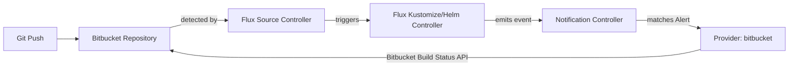

# How to Configure Flux Notification Provider for Bitbucket Commit Status

Author: [nawazdhandala](https://github.com/nawazdhandala)

Tags: Flux CD, GitOps, Kubernetes, Notifications, Bitbucket, Commit Status, CI/CD

Description: Learn how to configure Flux CD's notification controller to update Bitbucket commit statuses based on Flux reconciliation results using the Provider resource.

---

Bitbucket is a popular Git hosting platform, especially among teams using the Atlassian ecosystem. Flux CD supports updating Bitbucket commit statuses to reflect deployment outcomes, giving your team a clear view of whether changes have been successfully applied to the cluster.

This guide covers the full setup from creating a Bitbucket app password to verifying commit status updates appear in your repository.

## Prerequisites

- A Kubernetes cluster with Flux CD installed (including the notification controller)
- `kubectl` access to the cluster
- A Bitbucket Cloud repository managed by Flux
- A Bitbucket app password with appropriate permissions
- The `flux` CLI installed (optional but helpful)

## Step 1: Create a Bitbucket App Password

In Bitbucket, navigate to **Personal settings** then **App passwords**. Click **Create app password** and give it a label like "Flux CD". Grant the following permissions:

- **Repositories**: Read
- **Pull requests**: Read and write (for commit status)

Copy the generated app password.

## Step 2: Create a Kubernetes Secret

Store the Bitbucket credentials in a Kubernetes secret. The token should be in the format `username:app-password`.

```bash
# Create a secret containing the Bitbucket credentials
kubectl create secret generic bitbucket-token \
  --namespace=flux-system \
  --from-literal=token=YOUR_BITBUCKET_USERNAME:YOUR_APP_PASSWORD
```

## Step 3: Create the Flux Notification Provider

Define a Provider resource for Bitbucket commit status updates.

```yaml
# provider-bitbucket-commit-status.yaml
# Configures Flux to update Bitbucket commit statuses
apiVersion: notification.toolkit.fluxcd.io/v1beta3
kind: Provider
metadata:
  name: bitbucket-status-provider
  namespace: flux-system
spec:
  # Use "bitbucketserver" as the provider type
  type: bitbucketserver
  # The Bitbucket repository address
  address: https://bitbucket.org/YOUR_WORKSPACE/YOUR_REPO
  # Reference to the secret containing the Bitbucket credentials
  secretRef:
    name: bitbucket-token
```

Apply the Provider:

```bash
# Apply the Bitbucket commit status provider configuration
kubectl apply -f provider-bitbucket-commit-status.yaml
```

## Step 4: Create an Alert Resource

Create an Alert that triggers commit status updates.

```yaml
# alert-bitbucket-commit-status.yaml
# Updates Bitbucket commit statuses based on Flux events
apiVersion: notification.toolkit.fluxcd.io/v1beta3
kind: Alert
metadata:
  name: bitbucket-status-alert
  namespace: flux-system
spec:
  providerRef:
    name: bitbucket-status-provider
  # Send both info and error events
  eventSeverity: info
  eventSources:
    - kind: Kustomization
      name: "*"
    - kind: HelmRelease
      name: "*"
```

Apply the Alert:

```bash
# Apply the alert configuration
kubectl apply -f alert-bitbucket-commit-status.yaml
```

## Step 5: Verify the Configuration

Check that both resources are ready.

```bash
# Verify provider and alert status
kubectl get providers.notification.toolkit.fluxcd.io -n flux-system
kubectl get alerts.notification.toolkit.fluxcd.io -n flux-system
```

## Step 6: Test the Notification

Trigger a reconciliation:

```bash
# Force reconciliation to update commit status
flux reconcile kustomization flux-system --with-source
```

Navigate to your Bitbucket repository and check the latest commit. You should see a build status from Flux.

## How It Works



The notification controller uses the Bitbucket Build Status API to update the commit status. The status appears as a build result on the commit, with the following states:

- **SUCCESSFUL**: Reconciliation completed without errors
- **FAILED**: Reconciliation encountered an error
- **INPROGRESS**: Reconciliation is running

## Commit Status in Pull Requests

Bitbucket displays build statuses in pull requests. When configured:

- Pull request reviewers can see whether a commit has been successfully deployed
- You can configure branch restrictions to require successful Flux deployment status before merging
- The deployment history is visible on each commit

## Multiple Repositories

Create separate providers for each Bitbucket repository:

```yaml
# Provider for the platform repository
apiVersion: notification.toolkit.fluxcd.io/v1beta3
kind: Provider
metadata:
  name: bitbucket-platform
  namespace: flux-system
spec:
  type: bitbucketserver
  address: https://bitbucket.org/YOUR_WORKSPACE/platform
  secretRef:
    name: bitbucket-token
---
# Provider for the services repository
apiVersion: notification.toolkit.fluxcd.io/v1beta3
kind: Provider
metadata:
  name: bitbucket-services
  namespace: flux-system
spec:
  type: bitbucketserver
  address: https://bitbucket.org/YOUR_WORKSPACE/services
  secretRef:
    name: bitbucket-token
---
# Alert for platform repository resources
apiVersion: notification.toolkit.fluxcd.io/v1beta3
kind: Alert
metadata:
  name: bitbucket-platform-alert
  namespace: flux-system
spec:
  providerRef:
    name: bitbucket-platform
  eventSeverity: info
  eventSources:
    - kind: Kustomization
      name: platform
---
# Alert for services repository resources
apiVersion: notification.toolkit.fluxcd.io/v1beta3
kind: Alert
metadata:
  name: bitbucket-services-alert
  namespace: flux-system
spec:
  providerRef:
    name: bitbucket-services
  eventSeverity: info
  eventSources:
    - kind: Kustomization
      name: services
```

## Bitbucket Server (Self-Hosted)

For Bitbucket Server (self-hosted), update the address to your instance:

```yaml
apiVersion: notification.toolkit.fluxcd.io/v1beta3
kind: Provider
metadata:
  name: bitbucket-server-status
  namespace: flux-system
spec:
  type: bitbucketserver
  address: https://bitbucket.your-company.com/projects/PROJ/repos/REPO
  secretRef:
    name: bitbucket-server-token
```

## Troubleshooting

If commit statuses are not appearing in Bitbucket:

1. **Credentials format**: The token in the secret must be in the format `username:app-password`.
2. **App password permissions**: Ensure the app password has repository read and pull request write permissions.
3. **Repository URL**: The `address` must include the workspace and repository slug.
4. **Commit SHA**: The revision in the Flux event must match a valid commit in the repository.
5. **Namespace alignment**: Provider, Alert, and Secret must be in the same namespace.
6. **Controller logs**: Check `kubectl logs -n flux-system deploy/notification-controller` for API errors.
7. **Network access**: The cluster must be able to reach `api.bitbucket.org` (or your Bitbucket Server instance) on port 443.
8. **Rate limits**: Bitbucket Cloud enforces API rate limits. High-frequency updates may be throttled.

## Conclusion

Bitbucket commit status integration with Flux CD brings deployment feedback directly into the Atlassian workflow. By displaying deployment status on commits and pull requests, teams gain confidence that merged changes are live and working. This is particularly valuable for organizations that use Bitbucket alongside other Atlassian tools like Jira, creating a unified view of the development and deployment lifecycle.
