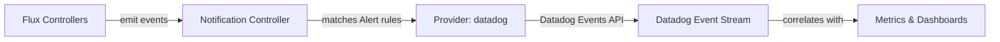

# How to Configure Flux Notification Provider for Datadog

Author: [nawazdhandala](https://github.com/nawazdhandala)

Tags: Flux CD, GitOps, Kubernetes, Notifications, Datadog, Observability, Monitoring

Description: Learn how to configure Flux CD's notification controller to send deployment and reconciliation events to Datadog using the Provider resource.

---

Datadog is a comprehensive monitoring and observability platform. Integrating Flux CD with Datadog allows you to send deployment events directly into your Datadog event stream, where they can be correlated with metrics, traces, and logs. This makes it easier to understand the impact of deployments on application performance.

This guide walks through configuring a Flux notification Provider for Datadog, from obtaining an API key to verifying that events appear in your Datadog dashboard.

## Prerequisites

- A Kubernetes cluster with Flux CD installed (including the notification controller)
- `kubectl` access to the cluster
- A Datadog account with API key access
- The `flux` CLI installed (optional but helpful)

## Step 1: Obtain a Datadog API Key

In Datadog, navigate to **Organization Settings** then **API Keys**. Create a new API key or copy an existing one. This key will be used by Flux to authenticate when sending events.

## Step 2: Create a Kubernetes Secret

Store the Datadog API key in a Kubernetes secret.

```bash
# Create a secret containing the Datadog API key
kubectl create secret generic datadog-api-key \
  --namespace=flux-system \
  --from-literal=token=YOUR_DATADOG_API_KEY
```

## Step 3: Create the Flux Notification Provider

Define a Provider resource for Datadog. The `address` field should point to your Datadog site's API endpoint.

```yaml
# provider-datadog.yaml
# Configures Flux to send notifications to Datadog
apiVersion: notification.toolkit.fluxcd.io/v1beta3
kind: Provider
metadata:
  name: datadog-provider
  namespace: flux-system
spec:
  # Use "datadog" as the provider type
  type: datadog
  # The Datadog API address (varies by region)
  # US1: https://api.datadoghq.com
  # US3: https://api.us3.datadoghq.com
  # US5: https://api.us5.datadoghq.com
  # EU: https://api.datadoghq.eu
  # AP1: https://api.ap1.datadoghq.com
  address: https://api.datadoghq.com
  # Reference to the secret containing the API key
  secretRef:
    name: datadog-api-key
```

Apply the Provider:

```bash
# Apply the Datadog provider configuration
kubectl apply -f provider-datadog.yaml
```

## Step 4: Create an Alert Resource

Create an Alert that sends Flux events to Datadog.

```yaml
# alert-datadog.yaml
# Routes Flux events to Datadog
apiVersion: notification.toolkit.fluxcd.io/v1beta3
kind: Alert
metadata:
  name: datadog-alert
  namespace: flux-system
spec:
  providerRef:
    name: datadog-provider
  # Send all events to Datadog for comprehensive monitoring
  eventSeverity: info
  eventSources:
    - kind: Kustomization
      name: "*"
    - kind: HelmRelease
      name: "*"
    - kind: GitRepository
      name: "*"
```

Apply the Alert:

```bash
# Apply the alert configuration
kubectl apply -f alert-datadog.yaml
```

## Step 5: Verify the Configuration

Check that both resources are ready.

```bash
# Verify provider and alert status
kubectl get providers.notification.toolkit.fluxcd.io -n flux-system
kubectl get alerts.notification.toolkit.fluxcd.io -n flux-system
```

## Step 6: Test the Notification

Trigger a reconciliation to generate an event.

```bash
# Force reconciliation to produce a test event
flux reconcile kustomization flux-system --with-source
```

Navigate to the Datadog **Events** page to see the Flux event.

## How It Works



The notification controller sends Flux events to the Datadog Events API. These events appear in the Datadog event stream and can be overlaid on dashboards, used in monitors, and correlated with application metrics.

## Overlaying Events on Dashboards

Once Flux events flow into Datadog, you can overlay them on metric dashboards. In any Datadog dashboard, add an **Event Overlay** widget and filter by the Flux event source. This allows you to visually correlate deployment events with metric changes such as error rates, latency, and resource utilization.

## Creating Datadog Monitors from Flux Events

You can create Datadog monitors that trigger on Flux events:

1. Go to **Monitors** in Datadog
2. Create a new **Event Monitor**
3. Filter by Flux event attributes
4. Configure notification preferences

This provides an additional layer of alerting on top of Flux's built-in notification system.

## Regional Configuration

Make sure to use the correct Datadog API endpoint for your region:

```yaml
# Example for EU region
apiVersion: notification.toolkit.fluxcd.io/v1beta3
kind: Provider
metadata:
  name: datadog-eu-provider
  namespace: flux-system
spec:
  type: datadog
  address: https://api.datadoghq.eu
  secretRef:
    name: datadog-api-key
```

## Error-Only Events

If you prefer to send only errors to Datadog:

```yaml
apiVersion: notification.toolkit.fluxcd.io/v1beta3
kind: Alert
metadata:
  name: datadog-errors
  namespace: flux-system
spec:
  providerRef:
    name: datadog-provider
  eventSeverity: error
  eventSources:
    - kind: Kustomization
      name: "*"
    - kind: HelmRelease
      name: "*"
```

## Troubleshooting

If events are not appearing in Datadog:

1. **API key**: Verify the secret contains a `token` key with a valid Datadog API key (not an application key).
2. **API endpoint**: Use the correct regional endpoint. Using the wrong region will result in authentication failures.
3. **Namespace alignment**: Provider, Alert, and Secret must be in the same namespace.
4. **Controller logs**: Check `kubectl logs -n flux-system deploy/notification-controller` for HTTP errors (look for 403 or 401 responses).
5. **Network access**: The cluster must be able to reach the Datadog API endpoint on port 443.
6. **Event stream**: Datadog events can take a few seconds to appear. Check the Events page with the correct time range.
7. **API key permissions**: Ensure the API key has permission to post events.

## Conclusion

Datadog integration with Flux CD provides powerful observability by connecting deployment events with your monitoring stack. By sending Flux events to Datadog, you can overlay deployments on dashboards, create monitors based on deployment activity, and quickly identify which deployments caused performance regressions. This integration is a natural fit for teams already using Datadog for infrastructure and application monitoring.
