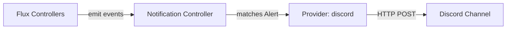

# How to Configure Flux Notification Provider for Discord

Author: [nawazdhandala](https://github.com/nawazdhandala)

Tags: Flux CD, GitOps, Kubernetes, Notifications, Discord, Monitoring

Description: Learn how to configure Flux CD's notification controller to send deployment and reconciliation alerts to Discord channels using the Provider resource.

---

Discord has become a popular communication platform not only for gaming communities but also for developer and DevOps teams. Flux CD's notification controller supports Discord as a first-class provider, allowing you to receive deployment updates and reconciliation alerts directly in a Discord channel.

This guide covers the full setup process from creating a Discord webhook to verifying that notifications arrive correctly.

## Prerequisites

- A Kubernetes cluster with Flux CD installed (including the notification controller)
- `kubectl` access to the cluster
- A Discord server where you have permission to manage webhooks
- The `flux` CLI installed (optional but helpful)

## Step 1: Create a Discord Webhook

In your Discord server, navigate to the channel where you want to receive Flux notifications. Click the gear icon to open **Channel Settings**, then go to **Integrations** and click **Webhooks**. Create a new webhook, give it a name like "Flux CD", and copy the webhook URL.

The URL will follow this pattern:

```text
https://discord.com/api/webhooks/CHANNEL_ID/WEBHOOK_TOKEN
```

## Step 2: Create a Kubernetes Secret

Store the Discord webhook URL in a Kubernetes secret.

```bash
# Create a secret containing the Discord webhook URL
kubectl create secret generic discord-webhook-url \
  --namespace=flux-system \
  --from-literal=address=https://discord.com/api/webhooks/CHANNEL_ID/WEBHOOK_TOKEN
```

## Step 3: Create the Flux Notification Provider

Define a Provider resource for Discord.

```yaml
# provider-discord.yaml
# Configures Flux to send notifications to a Discord channel
apiVersion: notification.toolkit.fluxcd.io/v1
kind: Provider
metadata:
  name: discord-provider
  namespace: flux-system
spec:
  # Use "discord" as the provider type
  type: discord
  # Channel is determined by the webhook URL, so no channel field is needed
  # Reference to the secret containing the webhook URL
  secretRef:
    name: discord-webhook-url
```

Apply the Provider:

```bash
# Apply the Discord provider configuration
kubectl apply -f provider-discord.yaml
```

## Step 4: Create an Alert Resource

Create an Alert to define which events are forwarded to Discord.

```yaml
# alert-discord.yaml
# Routes Flux events to the Discord provider
apiVersion: notification.toolkit.fluxcd.io/v1
kind: Alert
metadata:
  name: discord-alert
  namespace: flux-system
spec:
  providerRef:
    name: discord-provider
  eventSeverity: info
  eventSources:
    - kind: Kustomization
      name: "*"
    - kind: HelmRelease
      name: "*"
    - kind: GitRepository
      name: "*"
```

Apply the Alert:

```bash
# Apply the alert configuration
kubectl apply -f alert-discord.yaml
```

## Step 5: Verify the Configuration

Check the status of both resources.

```bash
# Check that the provider is ready
kubectl get providers.notification.toolkit.fluxcd.io -n flux-system

# Check that the alert is ready
kubectl get alerts.notification.toolkit.fluxcd.io -n flux-system
```

For detailed status information:

```bash
# Inspect the provider for any errors
kubectl describe provider discord-provider -n flux-system
```

## Step 6: Test the Notification

Generate an event by triggering a reconciliation.

```bash
# Trigger reconciliation to produce a test event
flux reconcile kustomization flux-system --with-source
```

A message should appear in your Discord channel within seconds.

## How It Works

The Flux notification controller receives events from all Flux controllers (source, kustomize, helm). When an event matches the criteria defined in an Alert, the controller formats the message and sends it to the Discord webhook endpoint via HTTP POST.



Discord renders the message as an embed with details such as the resource kind, name, namespace, revision, and a human-readable message.

## Customizing the Provider

You can set a custom username for the Discord bot:

```yaml
apiVersion: notification.toolkit.fluxcd.io/v1
kind: Provider
metadata:
  name: discord-provider-custom
  namespace: flux-system
spec:
  type: discord
  # Override the default bot username shown in Discord
  username: flux-cd-bot
  secretRef:
    name: discord-webhook-url
```

## Setting Up Multiple Discord Channels

You can create separate providers for different Discord channels and route different types of alerts to each:

```yaml
# Provider for the deployments channel
apiVersion: notification.toolkit.fluxcd.io/v1
kind: Provider
metadata:
  name: discord-deployments
  namespace: flux-system
spec:
  type: discord
  secretRef:
    name: discord-deployments-webhook
---
# Provider for the alerts channel
apiVersion: notification.toolkit.fluxcd.io/v1
kind: Provider
metadata:
  name: discord-alerts
  namespace: flux-system
spec:
  type: discord
  secretRef:
    name: discord-alerts-webhook
---
# Route errors to the alerts channel
apiVersion: notification.toolkit.fluxcd.io/v1
kind: Alert
metadata:
  name: discord-error-alert
  namespace: flux-system
spec:
  providerRef:
    name: discord-alerts
  eventSeverity: error
  eventSources:
    - kind: Kustomization
      name: "*"
    - kind: HelmRelease
      name: "*"
---
# Route all events to the deployments channel
apiVersion: notification.toolkit.fluxcd.io/v1
kind: Alert
metadata:
  name: discord-info-alert
  namespace: flux-system
spec:
  providerRef:
    name: discord-deployments
  eventSeverity: info
  eventSources:
    - kind: Kustomization
      name: "*"
    - kind: HelmRelease
      name: "*"
```

## Troubleshooting

If messages are not appearing in Discord:

1. **Secret key**: The secret must have an `address` key with the full webhook URL.
2. **Webhook URL format**: Ensure the URL includes both the channel ID and the token.
3. **Namespace**: Provider, Alert, and Secret must be in the same namespace.
4. **Controller logs**: Run `kubectl logs -n flux-system deploy/notification-controller` to check for errors.
5. **Discord rate limits**: Discord enforces rate limits on webhooks. If you have a high volume of events, some may be delayed or dropped.
6. **Network access**: Confirm the cluster can reach `discord.com` on port 443.

## Conclusion

Discord integration with Flux CD provides a lightweight and effective way to keep your team informed about Kubernetes cluster operations. The setup requires only a webhook, a secret, and two Flux custom resources. Whether you use Discord for development teams or community operations, this integration brings deployment visibility right into your conversation flow.
