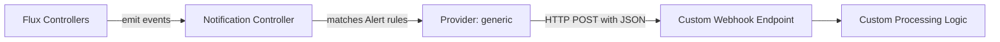

# How to Configure Flux Notification Provider for Generic Webhook

Author: [nawazdhandala](https://github.com/nawazdhandala)

Tags: Flux CD, GitOps, Kubernetes, Notifications, Webhooks, Custom Integration, Monitoring

Description: Learn how to configure Flux CD's notification controller to send deployment and reconciliation events to any HTTP endpoint using the generic webhook Provider.

---

The generic webhook provider in Flux CD is the most flexible notification option available. It sends Flux events as JSON payloads via HTTP POST to any endpoint you specify. This makes it possible to integrate Flux with custom applications, monitoring tools, CI/CD pipelines, or any service that can receive HTTP webhooks.

This guide covers configuring the generic webhook provider, customizing headers, and building integrations with custom endpoints.

## Prerequisites

- A Kubernetes cluster with Flux CD installed (including the notification controller)
- `kubectl` access to the cluster
- An HTTP endpoint that can receive POST requests
- The `flux` CLI installed (optional but helpful)

## Step 1: Prepare Your Webhook Endpoint

Ensure you have an HTTP endpoint ready to receive POST requests. This could be a custom API, a serverless function, a monitoring tool, or any service that accepts webhooks.

The notification controller will send JSON payloads to the endpoint with details about each Flux event.

## Step 2: Create a Kubernetes Secret

Store the webhook URL and any authentication headers in a Kubernetes secret.

```bash
# Create a secret containing the webhook URL and optional authentication headers
kubectl create secret generic generic-webhook-secret \
  --namespace=flux-system \
  --from-literal=address=https://your-endpoint.example.com/flux-events \
  --from-literal=headers="Authorization: Bearer YOUR_TOKEN"
```

If your endpoint does not require authentication, you can omit the headers:

```bash
# Create a secret with just the webhook URL
kubectl create secret generic generic-webhook-secret \
  --namespace=flux-system \
  --from-literal=address=https://your-endpoint.example.com/flux-events
```

## Step 3: Create the Flux Notification Provider

Define a Provider resource using the generic type.

```yaml
# provider-generic-webhook.yaml
# Configures Flux to send notifications via generic HTTP webhook
apiVersion: notification.toolkit.fluxcd.io/v1beta3
kind: Provider
metadata:
  name: generic-webhook-provider
  namespace: flux-system
spec:
  # Use "generic" as the provider type for custom webhooks
  type: generic
  # Reference to the secret containing the webhook URL and optional headers
  secretRef:
    name: generic-webhook-secret
```

Apply the Provider:

```bash
# Apply the generic webhook provider configuration
kubectl apply -f provider-generic-webhook.yaml
```

## Step 4: Create an Alert Resource

Create an Alert that defines which events are forwarded to the webhook.

```yaml
# alert-generic-webhook.yaml
# Routes Flux events to the generic webhook provider
apiVersion: notification.toolkit.fluxcd.io/v1beta3
kind: Alert
metadata:
  name: generic-webhook-alert
  namespace: flux-system
spec:
  providerRef:
    name: generic-webhook-provider
  eventSeverity: info
  eventSources:
    - kind: Kustomization
      name: "*"
    - kind: HelmRelease
      name: "*"
    - kind: GitRepository
      name: "*"
```

Apply the Alert:

```bash
# Apply the alert configuration
kubectl apply -f alert-generic-webhook.yaml
```

## Step 5: Verify the Configuration

Check that both resources are ready.

```bash
# Verify provider and alert status
kubectl get providers.notification.toolkit.fluxcd.io -n flux-system
kubectl get alerts.notification.toolkit.fluxcd.io -n flux-system
```

## Step 6: Test the Notification

Trigger a reconciliation to generate an event:

```bash
# Force reconciliation to produce a test event
flux reconcile kustomization flux-system --with-source
```

Check your endpoint to verify the JSON payload was received.

## Event Payload Structure

The generic webhook provider sends a JSON payload for each event. The payload includes the following fields:

```yaml
# Example JSON payload sent by the generic webhook provider
# {
#   "involvedObject": {
#     "apiVersion": "kustomize.toolkit.fluxcd.io/v1",
#     "kind": "Kustomization",
#     "name": "flux-system",
#     "namespace": "flux-system"
#   },
#   "severity": "info",
#   "timestamp": "2026-03-05T10:00:00Z",
#   "message": "Reconciliation finished in 5s...",
#   "reason": "ReconciliationSucceeded",
#   "metadata": {
#     "revision": "main@sha1:abc123..."
#   }
# }
```

## How It Works



## Adding Custom Headers

You can include custom headers for authentication or routing by adding them to the secret:

```bash
# Create a secret with multiple custom headers
kubectl create secret generic generic-webhook-auth \
  --namespace=flux-system \
  --from-literal=address=https://your-endpoint.example.com/flux-events \
  --from-literal=headers="Authorization: Bearer YOUR_TOKEN\nX-Custom-Header: custom-value"
```

## Example: Sending Events to a Custom API

Here is an example of a simple receiver application that processes Flux events:

```yaml
# provider for a custom deployment tracker
apiVersion: notification.toolkit.fluxcd.io/v1beta3
kind: Provider
metadata:
  name: deployment-tracker
  namespace: flux-system
spec:
  type: generic
  secretRef:
    name: deployment-tracker-secret
---
# Only track deployment-related events
apiVersion: notification.toolkit.fluxcd.io/v1beta3
kind: Alert
metadata:
  name: deployment-tracker-alert
  namespace: flux-system
spec:
  providerRef:
    name: deployment-tracker
  eventSeverity: info
  eventSources:
    - kind: Kustomization
      name: "*"
    - kind: HelmRelease
      name: "*"
```

## Using Generic Webhook with HMAC Verification

For security, you can configure the generic provider to include an HMAC signature in the request headers. The receiving endpoint can verify this signature to ensure the request came from Flux.

```bash
# Create a secret with an HMAC token for payload verification
kubectl create secret generic generic-webhook-hmac \
  --namespace=flux-system \
  --from-literal=address=https://your-endpoint.example.com/flux-events \
  --from-literal=token=YOUR_HMAC_SECRET
```

The notification controller will include a signature header that can be verified by the receiving endpoint.

## Multiple Endpoints

Create separate providers for different endpoints:

```yaml
apiVersion: notification.toolkit.fluxcd.io/v1beta3
kind: Provider
metadata:
  name: webhook-analytics
  namespace: flux-system
spec:
  type: generic
  secretRef:
    name: analytics-webhook-secret
---
apiVersion: notification.toolkit.fluxcd.io/v1beta3
kind: Provider
metadata:
  name: webhook-audit
  namespace: flux-system
spec:
  type: generic
  secretRef:
    name: audit-webhook-secret
```

## Troubleshooting

If events are not reaching your webhook endpoint:

1. **Endpoint availability**: Ensure your endpoint is reachable from the cluster and returns a 2xx status code.
2. **Secret format**: The secret must contain an `address` key with the full URL. Headers and tokens are optional.
3. **TLS**: If your endpoint uses HTTPS with a self-signed certificate, the notification controller may reject the connection.
4. **Namespace alignment**: Provider, Alert, and Secret must be in the same namespace.
5. **Controller logs**: Check `kubectl logs -n flux-system deploy/notification-controller` for HTTP errors.
6. **Firewall rules**: Ensure any firewalls or network policies allow outbound traffic from the cluster to your endpoint.
7. **Response timeout**: If your endpoint takes too long to respond, the notification controller may time out.

## Conclusion

The generic webhook provider is the most versatile notification option in Flux CD. It allows you to send deployment events to any HTTP endpoint, enabling custom integrations that are not possible with the built-in provider types. Whether you are building a custom deployment dashboard, feeding events into a data pipeline, or integrating with a tool that does not have native Flux support, the generic webhook provider makes it possible with minimal configuration.
