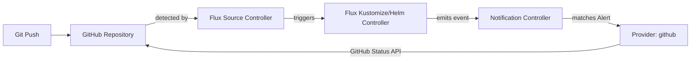

# How to Configure Flux Notification Provider for GitHub Commit Status

Author: [nawazdhandala](https://github.com/nawazdhandala)

Tags: Flux CD, GitOps, Kubernetes, Notifications, GitHub, Commit Status, CI/CD

Description: Learn how to configure Flux CD's notification controller to update GitHub commit statuses based on Flux reconciliation results using the Provider resource.

---

One of the most powerful features of Flux CD's notification system is the ability to update Git commit statuses. By configuring the GitHub commit status provider, Flux can report the reconciliation status of your deployments directly on the corresponding commits in GitHub. This provides a clear visual indicator in pull requests and commit histories showing whether a change has been successfully deployed.

This guide walks through the complete setup for the GitHub commit status provider.

## Prerequisites

- A Kubernetes cluster with Flux CD installed (including the notification controller)
- `kubectl` access to the cluster
- A GitHub repository managed by Flux
- A GitHub personal access token (PAT) or GitHub App with `repo:status` permissions
- The `flux` CLI installed (optional but helpful)

## Step 1: Create a GitHub Personal Access Token

Navigate to GitHub **Settings** then **Developer settings** then **Personal access tokens**. Create a new token with the `repo:status` scope (or `repo` scope for private repositories). Copy the token.

Alternatively, you can use a GitHub App with the **Commit statuses** permission set to **Read & write**.

## Step 2: Create a Kubernetes Secret

Store the GitHub token in a Kubernetes secret.

```bash
# Create a secret containing the GitHub token
kubectl create secret generic github-token \
  --namespace=flux-system \
  --from-literal=token=ghp_YOUR_GITHUB_PERSONAL_ACCESS_TOKEN
```

## Step 3: Create the Flux Notification Provider

Define a Provider resource for GitHub commit status updates.

```yaml
# provider-github-commit-status.yaml
# Configures Flux to update GitHub commit statuses
apiVersion: notification.toolkit.fluxcd.io/v1
kind: Provider
metadata:
  name: github-status-provider
  namespace: flux-system
spec:
  # Use "github" as the provider type for commit status updates
  type: github
  # The GitHub repository address (owner/repo format)
  address: https://github.com/YOUR_ORG/YOUR_REPO
  # Reference to the secret containing the GitHub token
  secretRef:
    name: github-token
```

Apply the Provider:

```bash
# Apply the GitHub commit status provider configuration
kubectl apply -f provider-github-commit-status.yaml
```

## Step 4: Create an Alert Resource

Create an Alert that triggers commit status updates for relevant Flux resources.

```yaml
# alert-github-commit-status.yaml
# Updates GitHub commit statuses based on Flux reconciliation events
apiVersion: notification.toolkit.fluxcd.io/v1
kind: Alert
metadata:
  name: github-status-alert
  namespace: flux-system
spec:
  providerRef:
    name: github-status-provider
  # Send both success and error events to update commit status accordingly
  eventSeverity: info
  eventSources:
    - kind: Kustomization
      name: "*"
    - kind: HelmRelease
      name: "*"
```

Apply the Alert:

```bash
# Apply the alert configuration
kubectl apply -f alert-github-commit-status.yaml
```

## Step 5: Verify the Configuration

Check that both resources are ready.

```bash
# Verify provider and alert status
kubectl get providers.notification.toolkit.fluxcd.io -n flux-system
kubectl get alerts.notification.toolkit.fluxcd.io -n flux-system
```

## Step 6: Test the Notification

Trigger a reconciliation to update the commit status:

```bash
# Force reconciliation to trigger a commit status update
flux reconcile kustomization flux-system --with-source
```

Navigate to your GitHub repository and check the latest commit. You should see a status check from Flux indicating the reconciliation result.

## How It Works



When Flux reconciles a resource, it emits an event. The notification controller matches the event against the Alert criteria and updates the commit status on the corresponding commit via the GitHub Status API. The commit status reflects the reconciliation outcome:

- **Success**: The deployment was applied successfully
- **Failure**: The reconciliation failed
- **Pending**: Reconciliation is in progress

## Commit Status in Pull Requests

When commit statuses are configured, they appear in GitHub pull requests as status checks. This means reviewers can see at a glance whether a change has been successfully deployed after merging.

## Multiple Repositories

If Flux manages resources from multiple repositories, create a provider for each:

```yaml
# Provider for the infrastructure repository
apiVersion: notification.toolkit.fluxcd.io/v1
kind: Provider
metadata:
  name: github-status-infra
  namespace: flux-system
spec:
  type: github
  address: https://github.com/YOUR_ORG/infrastructure
  secretRef:
    name: github-token
---
# Provider for the applications repository
apiVersion: notification.toolkit.fluxcd.io/v1
kind: Provider
metadata:
  name: github-status-apps
  namespace: flux-system
spec:
  type: github
  address: https://github.com/YOUR_ORG/applications
  secretRef:
    name: github-token
---
# Alert for infrastructure Kustomizations
apiVersion: notification.toolkit.fluxcd.io/v1
kind: Alert
metadata:
  name: github-status-infra-alert
  namespace: flux-system
spec:
  providerRef:
    name: github-status-infra
  eventSeverity: info
  eventSources:
    - kind: Kustomization
      name: infrastructure
---
# Alert for application Kustomizations
apiVersion: notification.toolkit.fluxcd.io/v1
kind: Alert
metadata:
  name: github-status-apps-alert
  namespace: flux-system
spec:
  providerRef:
    name: github-status-apps
  eventSeverity: info
  eventSources:
    - kind: Kustomization
      name: apps
```

## Using GitHub Apps Instead of PAT

For production environments, using a GitHub App is recommended over personal access tokens. Create a GitHub App with the **Commit statuses** permission, install it on your repository, and generate a private key. Store the App ID, installation ID, and private key in the secret.

## Troubleshooting

If commit statuses are not appearing on GitHub:

1. **Token permissions**: Ensure the GitHub token has `repo:status` permissions (or `repo` for private repos).
2. **Repository URL**: The `address` field must match the exact repository URL (including correct owner and repo name).
3. **Commit revision**: The notification controller uses the revision from the Flux event to identify the commit. If the revision does not match a valid commit SHA, the status update will fail.
4. **Namespace alignment**: Provider, Alert, and Secret must be in the same namespace.
5. **Controller logs**: Check `kubectl logs -n flux-system deploy/notification-controller` for GitHub API errors (e.g., 401, 404).
6. **Rate limits**: GitHub enforces API rate limits. If you have many resources reconciling frequently, you may hit rate limits.
7. **Network access**: The cluster must be able to reach `api.github.com` on port 443.

## Conclusion

GitHub commit status integration with Flux CD creates a feedback loop between your Git repository and your cluster. Commits that deploy successfully get a green check, and failures are immediately visible. This transforms GitHub pull requests into deployment dashboards, giving your team confidence that merged changes are live and healthy. It is one of the most impactful notification configurations for teams practicing GitOps.
