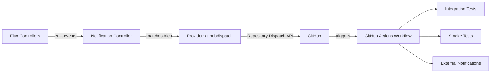

# How to Configure Flux Notification Provider for GitHub Dispatch

Author: [nawazdhandala](https://github.com/nawazdhandala)

Tags: Flux CD, GitOps, Kubernetes, Notifications, GitHub, GitHub Actions, Dispatch, CI/CD

Description: Learn how to configure Flux CD's notification controller to trigger GitHub Actions workflows via repository dispatch events using the Provider resource.

---

The GitHub dispatch provider in Flux CD enables you to trigger GitHub Actions workflows in response to Flux reconciliation events. This creates powerful automation chains where a successful deployment can automatically trigger downstream workflows such as integration tests, smoke tests, or notifications to external systems.

This guide covers setting up the GitHub dispatch provider to bridge Flux events with GitHub Actions.

## Prerequisites

- A Kubernetes cluster with Flux CD installed (including the notification controller)
- `kubectl` access to the cluster
- A GitHub repository with GitHub Actions workflows configured
- A GitHub personal access token (PAT) with `repo` scope
- The `flux` CLI installed (optional but helpful)

## Step 1: Create a GitHub Personal Access Token

Navigate to GitHub **Settings** then **Developer settings** then **Personal access tokens**. Create a new token with the `repo` scope (required for dispatching repository events). Copy the token.

## Step 2: Create a Kubernetes Secret

Store the GitHub token in a Kubernetes secret.

```bash
# Create a secret containing the GitHub token
kubectl create secret generic github-dispatch-token \
  --namespace=flux-system \
  --from-literal=token=ghp_YOUR_GITHUB_PERSONAL_ACCESS_TOKEN
```

## Step 3: Create the Flux Notification Provider

Define a Provider resource for GitHub dispatch.

```yaml
# provider-github-dispatch.yaml
# Configures Flux to trigger GitHub Actions via repository dispatch
apiVersion: notification.toolkit.fluxcd.io/v1
kind: Provider
metadata:
  name: github-dispatch-provider
  namespace: flux-system
spec:
  # Use "githubdispatch" as the provider type
  type: githubdispatch
  # The GitHub repository address
  address: https://github.com/YOUR_ORG/YOUR_REPO
  # Reference to the secret containing the GitHub token
  secretRef:
    name: github-dispatch-token
```

Apply the Provider:

```bash
# Apply the GitHub dispatch provider configuration
kubectl apply -f provider-github-dispatch.yaml
```

## Step 4: Create an Alert Resource

Create an Alert that triggers dispatch events for specific Flux resources.

```yaml
# alert-github-dispatch.yaml
# Triggers GitHub repository dispatch on Flux reconciliation events
apiVersion: notification.toolkit.fluxcd.io/v1
kind: Alert
metadata:
  name: github-dispatch-alert
  namespace: flux-system
spec:
  providerRef:
    name: github-dispatch-provider
  # Trigger on successful reconciliations
  eventSeverity: info
  eventSources:
    - kind: Kustomization
      name: "*"
    - kind: HelmRelease
      name: "*"
```

Apply the Alert:

```bash
# Apply the alert configuration
kubectl apply -f alert-github-dispatch.yaml
```

## Step 5: Create a GitHub Actions Workflow

In your GitHub repository, create a workflow that listens for repository dispatch events:

```yaml
# .github/workflows/on-flux-event.yaml
# Triggered by Flux CD via repository dispatch
name: On Flux Event
on:
  repository_dispatch:
    types:
      - Kustomization/*
      - HelmRelease/*

jobs:
  handle-event:
    runs-on: ubuntu-latest
    steps:
      - name: Print event details
        run: |
          echo "Event type: ${{ github.event.action }}"
          echo "Event payload: ${{ toJson(github.event.client_payload) }}"

      - name: Checkout code
        uses: actions/checkout@v4

      - name: Run integration tests
        run: |
          echo "Running integration tests after deployment..."
          # Add your test commands here
```

## Step 6: Verify the Configuration

Check that both Flux resources are ready.

```bash
# Verify provider and alert status
kubectl get providers.notification.toolkit.fluxcd.io -n flux-system
kubectl get alerts.notification.toolkit.fluxcd.io -n flux-system
```

## Step 7: Test the Integration

Trigger a reconciliation to fire a dispatch event:

```bash
# Force reconciliation to trigger GitHub dispatch
flux reconcile kustomization flux-system --with-source
```

Check the **Actions** tab in your GitHub repository to see if the workflow was triggered.

## How It Works



The notification controller sends a repository dispatch event to the GitHub API. The event type is derived from the Flux resource kind and name. GitHub Actions workflows that listen for matching `repository_dispatch` event types will be triggered automatically.

## Dispatch Event Payload

The dispatch event includes a `client_payload` with details about the Flux event:

- Resource kind and name
- Namespace
- Revision (git SHA or chart version)
- Severity
- Message
- Timestamp

You can use this payload in your GitHub Actions workflow to make decisions about which tests to run or which environments to target.

## Triggering Specific Workflows

You can scope the Alert to specific resources so that only certain deployments trigger the workflow:

```yaml
apiVersion: notification.toolkit.fluxcd.io/v1
kind: Alert
metadata:
  name: dispatch-production-only
  namespace: flux-system
spec:
  providerRef:
    name: github-dispatch-provider
  eventSeverity: info
  eventSources:
    # Only trigger dispatch for the production Kustomization
    - kind: Kustomization
      name: production-apps
```

## Multiple Repository Targets

Trigger workflows in different repositories based on different events:

```yaml
# Dispatch to the test repository
apiVersion: notification.toolkit.fluxcd.io/v1
kind: Provider
metadata:
  name: dispatch-tests
  namespace: flux-system
spec:
  type: githubdispatch
  address: https://github.com/YOUR_ORG/test-suite
  secretRef:
    name: github-dispatch-token
---
# Dispatch to the monitoring repository
apiVersion: notification.toolkit.fluxcd.io/v1
kind: Provider
metadata:
  name: dispatch-monitoring
  namespace: flux-system
spec:
  type: githubdispatch
  address: https://github.com/YOUR_ORG/monitoring-config
  secretRef:
    name: github-dispatch-token
```

## Troubleshooting

If GitHub Actions workflows are not being triggered:

1. **Token scope**: The GitHub token must have `repo` scope (not just `repo:status`).
2. **Repository URL**: The `address` must match the repository exactly.
3. **Workflow trigger**: Ensure the workflow has `repository_dispatch` in its `on` section with matching event types.
4. **Default branch**: The workflow file must exist on the repository's default branch for `repository_dispatch` to work.
5. **Namespace alignment**: Provider, Alert, and Secret must be in the same namespace.
6. **Controller logs**: Check `kubectl logs -n flux-system deploy/notification-controller` for GitHub API errors.
7. **Rate limits**: GitHub API rate limits apply. Check your token's remaining rate limit.

## Conclusion

The GitHub dispatch provider transforms Flux CD into a trigger for GitHub Actions workflows, enabling powerful automation chains. After a successful deployment, you can automatically run integration tests, update documentation, notify external systems, or perform any action that a GitHub Actions workflow supports. This creates a complete GitOps automation pipeline that extends well beyond deployment.
